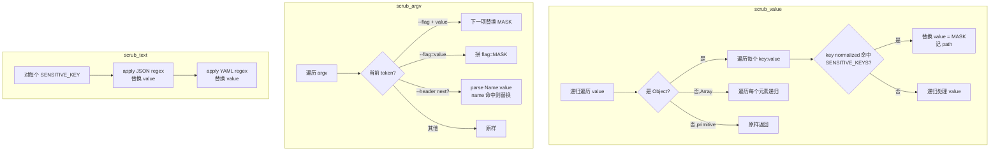

# core-redact design

## 0. 术语约定

| 术语 | 定义 | 防冲突结论 |
|---|---|---|
| Sensitive key | 包含 token / secret / password 等敏感语义的字段名。本 feature 维护 11 个默认 key（Python parity 7 个 + 业界常见扩展 4 个）| grep 全仓库无冲突 |
| MASK | 替换敏感值的占位字符串，固定为 `"***"`。**公开常量**，调用方可用它检测某字段是否已被脱敏 | grep 全仓库无冲突 |
| Audit path | 描述被脱敏字段位置的字符串。argv 用 `argv[N]`，结构化数据用 RFC 6901 JSON Pointer（如 `/headers/Authorization`、`/0/api_key`）| 跟 Python 的"argv[3]"格式兼容 |
| `scrub_*` | 模块对外三个公开函数：`scrub_value` / `scrub_argv` / `scrub_text` | 保留 Python `scrub_*` 命名风格 |
| Key normalization | 字段名归一化规则：lowercase + `-`→`_` + strip leading `_`。用于把 `--access-token` 匹配到 `access_token` | Python 内部 `_norm` 实现，Rust 私有 helper |
| Logging-boundary scrubber | 本 feature 的定位：**已 flow 到 logging 边界的数据**做脱敏，不是 in-memory 类型包装。跟 `redact::Secret<T>` / `secrecy::SecretString` 等 wrapper crate 是不同层职责 | 见 §0.1 生态调研 |

参考：`legacy/python/src/roostery/redact.py`（行为 reference，不约束 Rust 接口）。

### 0.1 生态调研（为什么自己写而不用现成 crate）

调研 Rust 主流 redaction crates 后确认本场景**生态空白**，自实现是合理选择：

| Crate | 模型 | 不适用原因 |
|---|---|---|
| `redact`（2.1M downloads）| `Secret<T>` 包装类型，改 Debug impl | 要求 typed value；Roostery journal `params: serde_json::Value` 是 untyped 流式数据 |
| `redactable`（11K，2026-02）| derive macro `#[derive(Sensitive)]` | 要求固定 struct schema；journal params 来源是 arbitrary hook payload + lark-cli output |
| `secrecy` | wrapper + Zeroize requirement | 同 `redact`，且 Zeroize 不适用 untyped Value |
| `redaction` | deprecated | — |

**本 feature 的差异化场景**：untyped `serde_json::Value` walk + key-name discovery + audit path 输出。主流 crate 都没覆盖这条路径。

**与 `redact` crate 的关系（未来）**：当 Rust 代码内部持有 secret 字段（如 `Config { api_key: ... }`），那种场景应单独引 `redact::Secret<String>` 包装——它管"in-memory struct 字段的 Debug 安全"。本 feature 的 scrubber 管"flowing JSON 数据在 journal 落盘前的脱敏"。两者各管一头，不冲突，本 feature 范围内不引 `redact` crate。

## 1. 决策与约束

### 范围

- 新文件 `crates/roostery/src/redact.rs` 实现脱敏功能
- 公开 API：3 个 `scrub_*` 函数 + `MASK` 常量 + `SENSITIVE_KEYS` 只读 slice
- `crates/roostery/src/lib.rs` 加 `pub mod redact;`
- `crates/roostery/Cargo.toml` 加 `[dependencies]`：`serde_json`、`regex`
- 单元测试 ≥ 5 条（planning Phase 1 成功标准），覆盖每个公开函数 + 边界 + 错误路径
- 纯函数、无 I/O、无 async

### 明确不做

- **不实现敏感 keys 的运行时配置**——本 feature 用编译期硬编码 11 个 keys。Config 驱动的扩展等用户实际场景需要时再起独立 feature
- **不接 bytes 输入**——Python 版做了 utf-8 容错解码，Rust 接 `&str`，调用方负责解码。理由：`String`/`&str` 是 utf-8 保证类型，混入 bytes 兜底等于把边界往下推
- **不深度理解 argv flag 语义**——只识别 §2.1 列出的三种 pattern（`--flag value` / `--flag=value` / `--header "Name: value"`），不做 POSIX getopt 兼容
- **不做内存加密 / secure erase**——`scrub_*` 返回新值，原值仍在调用方栈上。这不是 security boundary，是 logging hygiene
- **不写 `scrub_bytes` / `scrub_path` 等扩展函数**——三个 API 够用，新 API 等具体调用场景出现再加
- **不替 `journal-core` 决定何时调用** scrub——本 feature 提供能力，journal 写入逻辑归 `journal-core` feature
- **不修改 Python `redact.py`**——它在 `legacy/python/`，frozen
- **不引入 `redact` / `redactable` / `secrecy` crate**——见 §0.1 调研，本 feature 解决的场景跟它们正交

### 复杂度档位

走默认档位——纯库函数 + 标准 Rust 工程。无对外 SDK / 高并发 / 一次性工具的偏离信号。

### 关键决策

| # | 决策 | 内容 | 来源 |
|---|---|---|---|
| 1 | API 形态 | 三个函数 `scrub_value` / `scrub_argv` / `scrub_text`——分别对应"结构化数据 / argv 数组 / 原始文本"三种 input shape | Roadmap §4.2 给 params=serde_json::Value，需要 value-centric；同时保留 argv / text 处理（对应 Python 行为） |
| 2 | Sensitive keys 列表（11 个） | Python parity 7 个：`app_secret` / `access_token` / `refresh_token` / `user_access_token` / `tenant_access_token` / `authorization` / `api_key`；业界常见扩展 4 个：`password` / `secret` / `cookie` / `private_key` | per attention.md "代码-文档优先级"：docs 说"基础脱敏"应覆盖业界常见敏感字段，不是 Python 当时的局限。调研 `redactable` 的 Pii/Token/Email 分类也支持这种扩展思路 |
| 3 | Key normalization | 保留 Python 规则（lowercase + `-`→`_` + strip leading `_`），私有 helper | Python parity |
| 4 | Audit path 格式 | argv：`argv[N]`（与 Python 兼容）；结构化：RFC 6901 JSON Pointer（如 `/headers/Authorization`、`/0/secret`）| RFC 6901 是 JSON 操作通用标准；argv 因为是位置数组保留 Python 直观格式 |
| 5 | 依赖最小化 | 加 `serde_json` + `regex` 两个 crate；regex 用 stdlib `std::sync::LazyLock`（edition 2024 稳定）缓存编译，**不引** `once_cell`；**不引** `redact` / `redactable` / `secrecy`（见 §0.1） | edition 2024 LazyLock 已 stable，少一个依赖 |
| 6 | scrub_value 行为边界 | **仅做 key-based 脱敏**（递归走 Object/Array，按 normalized key 匹配 SENSITIVE_KEYS 替换值）；**不**对 string 叶子做 text-pattern 匹配——那是 `scrub_text` 的职责，调用方按需组合 | 关注点分离 |
| 7 | `scrub_text` 行为边界 | 保留 Python 的 JSON-string-form (`"key":"value"`) + YAML-form (`key: value`) 两类 regex 替换，不返回 audit path（regex 替换对位置精度低，价值有限）| Python parity；Python 版 scrub_text 也不返 path |
| 8 | 返回值所有权 | 全部返回 owned 值（`Vec<String>` / `String` / `serde_json::Value`），不接受借用避免生命周期复杂度 | 纯函数 + 体量小，性能不是瓶颈 |
| 9 | `MASK` 公开常量 | `pub const MASK: &str = "***";` —— 调用方可用它检测某值是否已脱敏 | 测试与下游模块都需要 |
| 10 | `SENSITIVE_KEYS` 公开只读 | `pub const SENSITIVE_KEYS: &[&str] = &[...];`——测试可直接断言、文档可直接引用 | 透明性 > 封装 |

## 2. 名词与编排

### 2.1 名词层

**现状**：模块不存在。`crates/roostery/src/` 目前只有 `main.rs` + `lib.rs`。

**变化**：新增 `crates/roostery/src/redact.rs`；`lib.rs` 加 `pub mod redact;` 暴露。

**公开 API 接口契约**：

```rust
// crates/roostery/src/redact.rs

/// 替换敏感值的占位字符串。
pub const MASK: &str = "***";

/// 默认敏感字段名列表（normalized 后比较）。
/// 11 个：Python parity 7 + 业界常见扩展 4。
pub const SENSITIVE_KEYS: &[&str] = &[
    // Python baseline (7)
    "app_secret",
    "access_token",
    "refresh_token",
    "user_access_token",
    "tenant_access_token",
    "authorization",
    "api_key",
    // 业界常见扩展 (4) - 防御性默认
    "password",
    "secret",
    "cookie",
    "private_key",
];

/// 递归脱敏 JSON 值。
///
/// 遍历所有 Object 字段，对 normalized key 命中 `SENSITIVE_KEYS` 的字段
/// 把 value 替换为 `MASK`。Array 元素继续递归。原始值不变（返回新值）。
///
/// # 返回
/// `(redacted_value, audit_paths)`，`audit_paths` 是 RFC 6901 JSON Pointer
/// 列表（如 `/headers/Authorization`、`/items/0/api_key`），有序，便于审计。
///
/// # 示例
/// ```ignore
/// let v = serde_json::json!({"user": "alice", "access_token": "xyz"});
/// let (redacted, paths) = scrub_value(&v);
/// assert_eq!(redacted["access_token"], "***");
/// assert_eq!(paths, vec!["/access_token".to_string()]);
/// ```
pub fn scrub_value(value: &serde_json::Value) -> (serde_json::Value, Vec<String>);

/// 脱敏 argv 数组。
///
/// 处理三种 pattern：
/// - `--flag value`：下一项替换为 MASK
/// - `--flag=value`：保留 flag 部分，value 替换为 MASK
/// - `--header "Name: value"` / `-H "Name: value"`：header 名匹配敏感 key 时，
///   value 替换为 MASK
///
/// # 返回
/// `(redacted_argv, audit_paths)`，`audit_paths` 形如 `argv[N]`（被脱敏的索引）。
///
/// # 示例
/// ```ignore
/// let argv = vec!["lark-cli".into(), "--access-token".into(), "abc".into()];
/// let (out, paths) = scrub_argv(&argv);
/// assert_eq!(out[2], "***");
/// assert_eq!(paths, vec!["argv[2]"]);
/// ```
pub fn scrub_argv(argv: &[String]) -> (Vec<String>, Vec<String>);

/// 脱敏原始文本中的敏感值（regex 替换）。
///
/// 识别两类 pattern：
/// - JSON 字符串：`"sensitive_key": "value"` → `"sensitive_key": "***"`
/// - YAML 行：`sensitive_key: value` → `sensitive_key: ***`
///
/// 用于无法走 `scrub_value` 的场景（stdout/stderr blob、log 行）。
/// 结构化数据应优先用 `scrub_value`。
///
/// 不返回 audit path——regex 替换对位置精度低，价值有限。
pub fn scrub_text(text: &str) -> String;
```

来源参考：`legacy/python/src/roostery/redact.py` 的 `scrub_argv` (L57-93) + `scrub_text` (L113-129) + `_norm` (L31-33) + `_is_sensitive_flag` (L36-38)。

`scrub_value` 是 Rust 期新增 API（per code-doc-authority 从 roadmap §4.2 推出），Python baseline 无对应函数。

### 2.2 编排层

**现状**：无下游 caller（journal-core 还没实现）。

**变化**：模块作为纯库被未来 caller 调用，无内部 workflow。三个函数互不依赖。

**主流程图**（每个函数内部的逻辑）：



**流程级约束**：

- **不变量 1**：三个函数都不修改入参（参数皆为 `&` 借用，返回 owned 新值）
- **不变量 2**：`MASK` 对自身脱敏是幂等的——`scrub_value` 处理已含 `"access_token": "***"` 的输入时仍把 `"***"` 替换为 `"***"`（结果等价）。不报错，不抛异常
- **不变量 3**：`SENSITIVE_KEYS` 编译期常量；运行时不可变；测试可直接 `assert_eq!`
- **不变量 4**：audit path 顺序 = 遍历顺序（structural，便于测试断言；不保证字典序）
- **错误语义**：纯函数无 panic / 无 Result 返回。空输入返回空输出。无效 utf-8 不存在（`&str` 类型保证）

### 2.3 挂载点清单

判据"删了它 feature 是否消失"：

1. **`crates/roostery/src/redact.rs` 存在** — 删 → 模块不存在 → feature 消失
2. **`crates/roostery/src/lib.rs` 含 `pub mod redact;`** — 删 → API 不可见 → feature 对外消失
3. **`crates/roostery/Cargo.toml` 含 `[dependencies] serde_json` + `regex`** — 删 → build 失败 → feature 消失

3 条 strong mount points，符合 3-5 条区间。

**不列**：`SENSITIVE_KEYS` 内容、`MASK` 常量值 —— 这些是模块内部的"调节参数"，不是 feature 挂载点（删一个 key 不消失 feature，只是 redaction 覆盖面变小）。

### 2.4 推进策略

按 paradigm 维度切片（编排骨架 → 计算节点逐个 → 测试覆盖）：

1. **模块骨架 + 依赖**：建 `redact.rs`，声明 `MASK` + `SENSITIVE_KEYS`（11 个），三个函数签名 `todo!()`；`Cargo.toml` 加 `serde_json` + `regex`；`lib.rs` 加 `pub mod redact;`
   - 退出信号：`cargo build` 成功；`cargo test` 0 passed
2. **`scrub_argv` 实现 + 单测**：实现三种 argv pattern + key normalization；测试覆盖正常 / 边界
   - 退出信号：`cargo test redact::tests::scrub_argv` 至少 3 个 case 通过
3. **`scrub_text` 实现 + 单测**：实现 JSON / YAML regex 替换
   - 退出信号：`cargo test redact::tests::scrub_text` 至少 2 个 case 通过
4. **`scrub_value` 实现 + 单测**：递归走 `serde_json::Value`，记 JSON Pointer path
   - 退出信号：`cargo test redact::tests::scrub_value` 至少 3 个 case 通过（含嵌套 / Array / primitive）
5. **集成验证**：`cargo test --all` + `cargo clippy -- -D warnings` + `cargo fmt --check` 全绿；推 CI
   - 退出信号：本地三命令全绿；推 commit 后远端 CI 全绿

### 2.5 结构健康度与微重构

**评估对象**：

- **要改的文件**：
  - `crates/roostery/src/lib.rs`（当前 2 行，加 `pub mod redact;` → 3 行）—— 无健康度问题
  - `crates/roostery/Cargo.toml`（当前 13 行，加 `[dependencies]` 段 ~3 行）—— 无健康度问题
- **要落新文件的目录**：`crates/roostery/src/`（当前仅 `main.rs` + `lib.rs`，加 `redact.rs` 后 3 个文件）—— 远未摊平

**先查 compound convention**——`compound/` 当前为空，无约定可对齐。

**结论**：**本次不做微重构**。

理由：`crates/roostery/src/` 现在文件 < 5，无组织决策需要。`lib.rs` 添加 `pub mod redact;` 是 Rust 标准模块声明，无可拆点。

**超出范围的观察**（给后续注意，不阻塞本 feature）：

- 等 `crates/roostery/src/` 内文件数到 5+ 时，需要决定模块组织约定（`mod.rs` vs inline `pub mod foo;` / 子目录拆分门槛 / 命名规则）——届时起 `cs-decide convention` 归档。预计 Phase 1 完成（journal-core + remoterefs 落地）时触发

## 3. 验收契约

### 3.1 关键场景清单（输入 / 触发 → 期望可观察结果）

#### scrub_value（结构化数据）

- **S1.1** 输入 `json!({"user": "alice", "access_token": "xyz"})` → 返回 `({"user": "alice", "access_token": "***"}, vec!["/access_token"])`
- **S1.2** 嵌套 Object：输入 `json!({"headers": {"Authorization": "Bearer abc"}})` → `headers.Authorization` 值变 `"***"`，path `/headers/Authorization`
- **S1.3** Array 元素：输入 `json!([{"api_key": "k1"}, {"api_key": "k2"}])` → 两个 key 都脱敏，paths `["/0/api_key", "/1/api_key"]`
- **S1.4** 无 sensitive key：输入 `json!({"foo": "bar"})` → 原样返回，paths 空
- **S1.5** 大小写 / 连字符变种：输入 `json!({"Access-Token": "x"})` → normalize 后命中，被脱敏
- **S1.6** Primitive 顶层值：输入 `json!("standalone string")` → 原样返回，paths 空
- **S1.7** 幂等：对已含 `MASK` 的输入再跑 `scrub_value`，结果等价（值不变 / paths 包含同样位置）
- **S1.8** 新增 keys 覆盖：输入 `json!({"password": "p", "cookie": "c", "private_key": "k", "secret": "s"})` → 4 个字段全部脱敏，paths 4 条

#### scrub_argv（argv 数组）

- **S2.1** `--flag value` 形：输入 `["lark-cli", "--access-token", "abc", "--other", "x"]` → `argv[2]` 变 `"***"`，paths `["argv[2]"]`
- **S2.2** `--flag=value` 形：输入 `["lark-cli", "--access-token=abc"]` → `argv[1]` 变 `"--access-token=***"`，paths `["argv[1]"]`
- **S2.3** `--header "Auth: x"` 形：输入 `["lark-cli", "--header", "Authorization: Bearer xyz"]` → `argv[2]` 变 `"Authorization: ***"`，paths `["argv[2]"]`
- **S2.4** `-H` 简写：输入 `["lark-cli", "-H", "Authorization: x"]` → 同 S2.3
- **S2.5** Non-sensitive flag：输入 `["lark-cli", "--user", "alice"]` → 原样，paths 空
- **S2.6** 边界——`--access-token` 是最后一项（无 value）：原样，paths 空（不 panic）
- **S2.7** 边界——空 argv：原样，paths 空

#### scrub_text（原始文本）

- **S3.1** JSON 字符串形：`"access_token": "abc123"` → `"access_token": "***"`
- **S3.2** YAML 行形：`api_key: secret123` → `api_key: ***`
- **S3.3** 大小写不敏感：`"Access-Token": "x"` → `"Access-Token": "***"`（保留原 key 大小写，仅替换 value）
- **S3.4** 无 sensitive：`{"user": "alice"}` → 原样
- **S3.5** 边界——空字符串：返回空字符串

#### 模块级

- **S4.1** `cargo test --all` 全绿，至少 5 个测试在 `redact` 模块（满足 Phase 1 success criteria）
- **S4.2** `cargo clippy --all-targets --all-features -- -D warnings` 通过
- **S4.3** `cargo fmt --all --check` 通过
- **S4.4** `SENSITIVE_KEYS.len()` == 11

### 3.2 反向核对项（明确不做的可 grep 验证）

- `grep -E "scrub_bytes|scrub_path|fn config" crates/roostery/src/redact.rs` → 无（不实现 bytes / 配置驱动）
- `grep "Config" crates/roostery/src/redact.rs` → 无（不引入 Config struct）
- `grep "tokio\|async" crates/roostery/src/redact.rs` → 无（同步纯函数）
- `grep "panic!\|\.unwrap()" crates/roostery/src/redact.rs` → 仅在测试代码中允许；非测试代码无 panic / unwrap
- `grep -E "once_cell|secrecy|redactable|^redact = " crates/roostery/Cargo.toml` → 无（用 stdlib LazyLock；不引第三方 redaction crate）
- `grep "fn scrub_" crates/roostery/src/redact.rs | wc -l` → ≥ 3（恰好 3 个公开 scrub 函数，可能有内部 helper）
- `wc -l crates/roostery/src/redact.rs` → < 500（calibration 修订：design 阶段预估 150-250 偏低；实际非测试代码 ~200 行 + inline 测试 ~260 行 ≈ 460 行。Rust idiom 接受 inline tests 同文件，file-size-limit.md 默认未列 Rust，参考 Go=400 / 加测试余量取 500）

## 4. 与项目级架构文档的关系

**本 feature 提炼回 architecture 的内容**：

- **名词**：`MASK` 常量 + `SENSITIVE_KEYS` slice（11 个） —— 是系统级"脱敏契约"的具体兑现。Acceptance 提炼到 ARCHITECTURE.md §2 术语表（加 `MASK` / `SENSITIVE_KEYS` 词条）
- **流程级约束**：journal 写入前必经 redact 这条 contract —— 已在 ARCHITECTURE.md §4 接口契约 §4.2 表中提及（"params 写入前必须过 redact 模块脱敏"）。本 feature 落地 redact 模块后，acceptance 在 ARCHITECTURE.md §3 Module A 节加一条具体说明 "redact 模块对外暴露 scrub_value / scrub_argv / scrub_text，下游 journal-core 必经"
- **动词骨架**：scrub_value 的递归遍历约束（不变量 1-4）—— 是跨 feature 稳定的约束，acceptance 提炼到 ARCHITECTURE.md §6 已知约束（加一条 "redact 函数返回新值不修改入参；幂等"）
- **定位区分**：本 feature 是 logging-boundary scrubber，**不是** `redact::Secret<T>` 那种 in-memory wrapper。Acceptance 在 ARCHITECTURE.md §3 Module A 节明示这层区分，避免未来混淆（特别当 Module D Config 模块引入 `Secret<String>` 字段时）

**关联的已有架构 doc**：

- `.codestable/architecture/ARCHITECTURE.md` —— acceptance 时按上述方式更新 §2 / §3 / §6
- `.codestable/attention.md` —— 不动（无新硬约束；scope expansion 到 11 keys 不构成"每次启动都要知道"级别的项目硬约束）
- `.codestable/requirements/portable-by-default.md` —— 本 feature 是 portable-by-default req 的具体兑现一部分（脱敏是 journal 敏感处理基础）。Acceptance 评估是否触发 cs-req update（倾向不触发——req 边界已涵盖"基础脱敏"，本 feature 是实现兑现不是 req 升级）

**架构总入口新增描述**：ARCHITECTURE.md §3 Module A 节增加 redact 子节描述。

### 4.1 后续观察（不阻塞本 feature）

- **audit path 携带 redaction reason 标签**：参考 `redactable` 的 Pii / Token / Email 分类，未来可让 audit path 不只是位置还携带"为什么脱敏"。属于扩展能力，非 baseline
- **未来 Rust 持有 secret 的 in-memory 字段**：当 Module D 的 `Config` struct 持有 `api_key: String` 等敏感字段时，应单独引 `redact::Secret<String>` 包装——届时跟本 feature 的 scrubber 各管一头（in-memory vs logging boundary）。建议在 `config-yaml` feature design 时再评估
