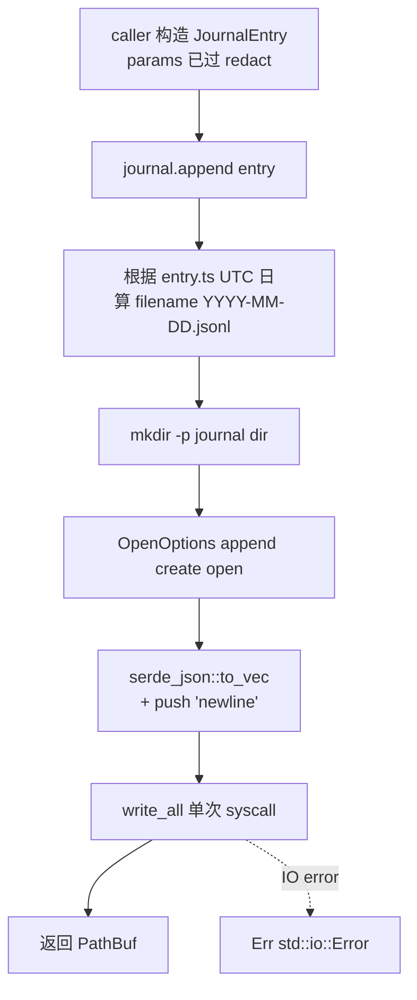

# journal-core design

## 0. 术语约定

| 术语 | 定义 | 防冲突结论 |
|---|---|---|
| `JournalEntry` | jsonl 单行结构，roadmap §4.2 定型；本 feature 落地后 `schema_version=1` 即对外承诺，破坏性改动必须 bump | grep 全仓库无冲突（Python 版叫 envelope，命名重新设计） |
| `JournalResult` | `JournalEntry.result` 的 tagged enum，`outcome: "ok" | "err"` 两态 | grep 全仓库无冲突 |
| `Journal` | 持有 journal 目录 + 提供 `append` 方法的 handle struct | grep 全仓库无冲突 |
| ULID | 26 字符 Crockford base32，时间序可比较，用作 `event_id` 生成器 | grep 全仓库无冲突 |
| `ROOSTERY_HOME` | 顶层环境变量，覆盖默认 `~/.roostery/` 路径；不存在时回退 `~/.roostery/` | 新增。Python 版用 `FEISHU_HUB_HOME`，本 feature 起换掉（vendor-neutral 落到环境变量层） |
| Journal dir | `${ROOSTERY_HOME:-~/.roostery}/journal/` | 替代 Python `~/.feishu_hub/journal/` |
| Daily rotation | 文件名 `YYYY-MM-DD.jsonl`，按 entry 的 `ts`（UTC）日切；Phase 1 唯一 rotation 策略 | — |
| Atomic append | POSIX `O_APPEND` + 单 `write(2)`，<PIPE_BUF（4 KiB）保证原子；超过时尽力 | Python 版同思路 |

参考：`legacy/python/src/roostery/journal.py`（行为 reference，schema 与 dir 命名都不沿用）。

### 0.1 生态调研（为什么自己写）

不引第三方 jsonl / structured-logging crate（`tracing-appender`、`slog-async` 等）。理由：

| 候选 | 为什么不用 |
|---|---|
| `tracing-appender` | 面向 log levels + filter，不是"业务结构化事件流"模型；强行用要把 JournalEntry 拍扁成 fields，丢类型 |
| `slog` / `slog-json` | 同上，且 slog 生态停滞 |
| 直接 `serde_json::to_writer` + `std::fs::OpenOptions().append(true)` | 18 行能写完。本 feature 走这条 |

ULID 也不引外部 crate——参考 Python 版做法（10 字节 time + 10 字节 random，Crockford base32 26 字符），约 30 行 Rust，避免给 schema 公开承诺多挂一个 dependency。

## 1. 决策与约束

### 范围

- 新文件 `crates/roostery/src/journal.rs`：`JournalEntry` / `JournalResult` / `Journal` / `new_event_id`
- 新文件 `crates/roostery/src/paths.rs`：`roostery_home()` / `journal_dir()` 两个 path helper（独立成文件因为后续 config / shim / dispatcher 都要用，不该塞在 journal 里）
- `crates/roostery/src/lib.rs` 加 `pub mod journal;` + `pub mod paths;`
- `crates/roostery/Cargo.toml` 加 `[dependencies]`：`serde`（derive feature）、`chrono`（serde + clock feature）；`serde_json` 已存在；不引 `ulid` / `uuid` crate
- 单元测试 ≥ 6 条（schema roundtrip / append 写文件 / daily rotation / env override / redact 集成 / 幂等/并发尽力）
- 同步 API（`fn append`），无 async / 无 tokio 依赖

### 明确不做

- **不实现读 / replay API**——`read_day` / `replay` 留给真正消费方出现时（roadmap 后续 phase）。本 feature 写入侧落地即足够。grep 反向核对：`grep -E "fn read_day|fn replay|fn read_entries" crates/roostery/src/journal.rs` → 无
- **不暴露 async API**——`append` 是同步函数。下游 async caller（dispatcher / bot_writer）自己用 `tokio::task::spawn_blocking` 包。grep 反向核对：`grep -E "async fn|tokio" crates/roostery/src/journal.rs` → 无
- **不实现 size:{MB} / never rotation**——Phase 1 硬编码 daily。Config 真起来后（config-yaml feature）再扩
- **不读 Config 文件**——Phase 1 没 Config 模块，`Journal::open` 只接 dir 路径，由 caller 决定（默认走 `paths::journal_dir()`）
- **不做文件锁 / flock**——POSIX `O_APPEND` 对 < PIPE_BUF 的 write 已经原子；多进程并发追加靠 OS 而非用户态锁。这条是 portable-by-default req 的 "纯文本，用户能直接 cat/grep/jq 翻" 兜底
- **不做自动 cleanup / rotation 压缩 / 跨设备同步**——per portable-by-default req 边界：归用户管
- **不读 / 不迁移 Python 版 `~/.feishu_hub/journal/`**——schema 不兼容（重新设计），迁移工具如有需要单独起 feature
- **不实现 `JournalEntry` 的 builder pattern**——结构体小，10 字段，直接 literal 构造；调用方常见模式由调用方封装
- **不替具体写者决定 `source` / `action` 字符串枚举**——roadmap §4.2 示例了几个（`"shim"` / `"dispatcher"` / `"lark-cli:im_messages_send"` 等），但本 feature 接 `String` 不约束；具体写者各自取值
- **不内置 redact 调用**——`params` 字段在 `JournalEntry` 构造时由 caller 自己过 `redact::scrub_value` 后传入。本 feature 提供集成测试证明"已脱敏 value 喂进来能正常落盘 + 反序列化保形"
- **不修改 `legacy/python/src/roostery/journal.py`**——frozen
- **不动 SCHEMA_VERSION 常量值**——`lib.rs` 里已是 `pub const SCHEMA_VERSION: u32 = 1`，与 roadmap §4.2 `schema_version: 1` 一致，直接引用

### 复杂度档位

走默认档位——纯库函数 + 标准 Rust 工程 + 文件 IO（同步 std::fs）。schema 公开承诺是关键性约束，但属于"设计严谨度"维度而非偏离信号。

### 关键决策

| # | 决策 | 内容 | 来源 |
|---|---|---|---|
| 1 | Schema 字段照搬 roadmap §4.2 | 不改字段名 / 不改顺序 / 不增字段 / 不删字段 | roadmap §4.2 是硬约束输入；改动要先回 cs-roadmap update |
| 2 | `event_id` 用 ULID | 26 字符 Crockford base32，时间排序；自实现（30 行）不引 crate | Python parity + roadmap §4.2 "ULID / UUID v4" 二选一 |
| 3 | `ts` 用 `chrono::DateTime<chrono::Utc>` | 序列化为 RFC 3339 字符串（chrono 默认），UTC 强制（避免时区混乱） | roadmap §4.2 "时间戳必须 UTC" |
| 4 | `JournalResult` 用 `#[serde(tag = "outcome")]` enum | 序列化为 `{"outcome": "ok", "value": ...}` / `{"outcome": "err", "kind": "...", "message": "..."}` | roadmap §4.2 enum 定义直接照写；tag 字段名 `outcome` 由 §4.2 钦定 |
| 5 | 目录命名迁 `~/.roostery/` | 顶层环境变量 `ROOSTERY_HOME`；不存在则回退 `~/.roostery/`。**不再读 `FEISHU_HUB_HOME`**（一次性切断，0.x 阶段未发版无存量用户）；attention.md / ARCHITECTURE.md / roadmap §4.6 Config schema 里的字面值在 acceptance 时同步回写 | 用户确认（vendor-neutral 落到环境变量层）+ 项目未发版便宜行事 |
| 6 | Daily rotation 按 entry `ts`（UTC）日 | 文件名 `YYYY-MM-DD.jsonl`；写入时根据 entry.ts 算文件名（不是 "now"），保证跨午夜 backfill 落到正确日 | jsonl 自然属性 + Python parity（Python 用 local time，本版改 UTC 与 ts 一致） |
| 7 | API 形态：`Journal::open(dir)` + `journal.append(entry)` | handle struct 持有 dir；`append(&self, entry: &JournalEntry) -> std::io::Result<PathBuf>` 同步返回写入文件路径 | 比 free function `append(dir, entry)` 调用方少传参；handle 也方便未来加 in-memory cache / flush 钩子 |
| 8 | 原子 append 实现 | `OpenOptions::new().append(true).create(true).open(path)` + 单次 `write_all`（先 serialize 到 `Vec<u8>` 含尾随 `\n`，再一次 syscall） | POSIX `O_APPEND` 语义 + 单 syscall 保证 < PIPE_BUF 原子 |
| 9 | 错误处理：返回 `std::io::Result<PathBuf>` | 不自定义 `JournalError`——本 feature 的失败模式都是 IO（mkdir / open / write / serialize）。serialize 失败是 programmer error（serde derive 不会 fail on `JournalEntry`），用 `expect("JournalEntry serializes")` 把它压到 io::Result 之外 | 最少新概念；下游 caller 拿到 io::Error 自然处理 |
| 10 | `event_id` 由 `JournalEntry::new` 关联函数预填，不强制 caller | 提供 `JournalEntry::new(source, action) -> JournalEntry` 关联函数填默认（event_id + ts + depth=0 + 其他 Option=None + params=Null + result=Ok(Null) + duration_ms=0），caller 用结构体 update syntax 覆盖；caller 也可以全部字段手填不走 new | 兼顾"少样板"与"全控制" |

## 2. 名词与编排

### 2.1 名词层

**现状**：模块不存在。`crates/roostery/src/` 仅 `main.rs` + `lib.rs` + `redact.rs`。无 path 抽象，无 journal 类型。

**变化**：

- 新增 `crates/roostery/src/journal.rs`：`JournalEntry` / `JournalResult` / `Journal` / `new_event_id` / 关联函数 `JournalEntry::new`
- 新增 `crates/roostery/src/paths.rs`：`roostery_home() -> PathBuf` / `journal_dir() -> PathBuf`
- `lib.rs` 加 `pub mod journal; pub mod paths;` 暴露
- `Cargo.toml` 加 `serde`（derive）+ `chrono`（serde + clock）依赖

**公开 API 接口契约**：

```rust
// crates/roostery/src/paths.rs

/// 解析 Roostery home 目录：
/// 1. `$ROOSTERY_HOME` 若设置则用之
/// 2. 否则 `dirs::home_dir()?.join(".roostery")`
/// 3. 都拿不到时回退到 CWD 下的 `.roostery/`（CI / 测试环境无 HOME）
pub fn roostery_home() -> std::path::PathBuf;

/// `roostery_home().join("journal")`
pub fn journal_dir() -> std::path::PathBuf;
```

```rust
// crates/roostery/src/journal.rs

use serde::{Deserialize, Serialize};
use std::path::PathBuf;

#[derive(Serialize, Deserialize, Debug, Clone, PartialEq)]
pub struct JournalEntry {
    pub schema_version: u32,
    pub event_id: String,
    pub trace_id: Option<String>,
    pub parent_event_id: Option<String>,
    pub depth: u32,
    pub ts: chrono::DateTime<chrono::Utc>,
    pub source: String,
    pub action: String,
    pub params: serde_json::Value,
    pub result: JournalResult,
    pub duration_ms: u64,
}

#[derive(Serialize, Deserialize, Debug, Clone, PartialEq)]
#[serde(tag = "outcome", rename_all = "lowercase")]
pub enum JournalResult {
    Ok { value: serde_json::Value },
    Err { kind: String, message: String },
}

impl JournalEntry {
    /// 构造带默认值的 entry：event_id 新生成、ts=now、depth=0、其余 Option=None、
    /// params=Value::Null、result=Ok(Null)、duration_ms=0。
    pub fn new(source: impl Into<String>, action: impl Into<String>) -> Self;
}

/// 生成新 ULID（26 字符 Crockford base32）。
pub fn new_event_id() -> String;

pub struct Journal {
    dir: PathBuf,
}

impl Journal {
    /// 持有 journal 目录的 handle。不实际创建目录（append 时再 mkdir -p）。
    pub fn open(dir: impl Into<PathBuf>) -> Self;

    /// 默认目录的便利构造：等价 `Journal::open(paths::journal_dir())`。
    pub fn default() -> Self;

    /// 单条 entry 追加到当日文件，返回写入的文件路径。
    /// - 序列化为单行 JSON + `\n`，UTF-8
    /// - 用 `OpenOptions::append(true).create(true)` + 单次 write_all 调用
    /// - 文件名由 entry.ts（UTC 日）决定，跨午夜 backfill 进正确日
    pub fn append(&self, entry: &JournalEntry) -> std::io::Result<PathBuf>;
}
```

**示例**（验收用得着的 happy path）：

```rust
let j = Journal::default();
let entry = JournalEntry {
    params: redact::scrub_value(&request_json).0,  // caller 自己脱敏
    ..JournalEntry::new("shim", "lark-cli:im_messages_send")
};
let path = j.append(&entry)?;  // ~/.roostery/journal/2026-05-15.jsonl
```

来源参考：

- 字段定义：`.codestable/roadmap/rust-rewrite/rust-rewrite-roadmap.md` §4.2（硬约束）
- ULID 算法：`legacy/python/src/roostery/journal.py:35-39`（行为 reference）
- 原子 append：`legacy/python/src/roostery/journal.py:115-120`

### 2.2 编排层

**现状**：无 caller，无写入路径。Phase 1 还没有任何模块写 journal。

**变化**：模块作为纯库被未来 caller 调用，无内部 workflow。本 feature 只完成"写入侧基础设施"。下游 caller 出现的 phase：

| Caller | Phase | 写入语义 |
|---|---|---|
| `lark-cli-shim`（`bin/shim`） | Phase 2 | 透传真 lark-cli 前后各写一条 entry |
| `lark_cli` wrapper | Phase 2 | LarkRunner trait 实现里在调用前后写 entry |
| `dispatcher::runners` | Phase 4 | runner 触发 / 完成时写 entry |
| `task_writer` | Phase 5 | bot bridge 操作写 entry |

**单 append 主流程图**：



**流程级约束**：

- **不变量 1**：`append` 是 idempotent 失败——失败不写半行，因为单 `write_all` syscall 要么完整要么 OS error；POSIX 保证 < PIPE_BUF 不撕裂
- **不变量 2**：同一 jsonl 文件多进程并发 append 不互相截断（`O_APPEND` 语义 + 单 syscall 原子）。**尽力，超 PIPE_BUF 不保证**——entry 含 `params` 可能很大，此处接受 best-effort，由 portable-by-default req "敏感性 / 完整性用户自负" 兜底
- **不变量 3**：`ts` UTC + 文件名 UTC 日 → 跨时区跨设备 journal 拼合时按 ts 排序得到正确时序
- **不变量 4**：schema_version=1 是公开承诺——本 feature 落地后任何字段名 / 类型 / 序列化形态变更都要 bump version + 兼容旧版 deserialize + cs-roadmap update 评估 portable-by-default 影响
- **不变量 5**：`new_event_id` 单进程内单调递增（ULID 时间分量同毫秒内按生成顺序 random 部分递增？——不强求；ULID 标准只承诺毫秒粒度排序，毫秒内顺序不保证）
- **错误语义**：`append` 仅返 `std::io::Result`；serialize 失败 panic（programmer error，不可能在合法 `JournalEntry` 上 fail）；caller 无 retry 责任（IO 失败由 caller 决定是否重试 / 降级到 stderr）

### 2.3 挂载点清单

判据"删了它 feature 是否消失"：

1. **`crates/roostery/src/journal.rs` 存在** — 删 → schema 类型 + Journal handle 全无 → feature 消失
2. **`crates/roostery/src/paths.rs` 存在** — 删 → 无标准 dir 解析 → caller 无法定位"应该写到哪"，feature 表面消失（虽然 Journal::open 接 PathBuf 仍能工作，但默认行为没了）
3. **`crates/roostery/src/lib.rs` 含 `pub mod journal;` + `pub mod paths;`** — 删 → API 对外不可见 → feature 消失
4. **`crates/roostery/Cargo.toml` 含 `serde` + `chrono` 依赖**（`serde_json` 已存在不算本 feature 引入） — 删 → build fail
5. **`SCHEMA_VERSION = 1` 在 `lib.rs`** — 已存在；本 feature 让它对外产生公开承诺含义（journal-core 落地后改它要 cs-roadmap update）

5 条 strong mount points，符合 3-5 条区间（第 5 条是"承诺成立"的语义挂载，不是新增代码）。

**不列**：ULID 实现内部 const、文件 mode、单测 fixture——这些是模块内部细节，删了不消失。

### 2.4 推进策略

按 paradigm 维度切片（schema → IO 骨架 → ULID → 集成）：

1. **依赖 + 模块骨架**：`Cargo.toml` 加 `serde`/`chrono`；建 `journal.rs` / `paths.rs`，声明所有类型 + 函数签名 `todo!()`；`lib.rs` 暴露
   - 退出信号：`cargo build` 成功；`cargo test` 0 passed
2. **paths 模块 + 单测**：实现 `roostery_home()` / `journal_dir()`，含 `ROOSTERY_HOME` 覆盖 + 默认 + 兜底三分支
   - 退出信号：`cargo test paths::tests` ≥ 2 case（env override / default）
3. **Schema 类型 + 序列化测试**：`JournalEntry` / `JournalResult` derive Serialize/Deserialize；写 schema roundtrip 测试 + JournalResult tag 形态 golden assertion（字段名 / outcome 值确认与 roadmap §4.2 一致）
   - 退出信号：`cargo test journal::tests::schema` 至少 2 case 通过；输出 JSON 形态匹配 §4.2 sample
4. **ULID 实现 + 单测**：`new_event_id()` 算法实现 + 输出格式断言（长度 26 / 字符集 Crockford / 同毫秒内不同 random）
   - 退出信号：`cargo test journal::tests::ulid` ≥ 2 case
5. **Journal::open + append 实现 + 单测**：原子 append 主路径；用 `tempfile` crate（dev-dep）跑文件 IO 测试
   - 退出信号：`cargo test journal::tests::append` ≥ 3 case（基本写入 / 跨日 / mkdir -p）
6. **集成验证**：
   - redact 集成测试：构造带 `params` = `json!({"access_token":"xyz"})` 的 entry，先过 `redact::scrub_value`，append 后读回文件断言 `"access_token":"***"`
   - 模块级 lint：`cargo test --all` + `cargo clippy -- -D warnings` + `cargo fmt --check`
   - 退出信号：本地三命令全绿；推 CI 全绿

### 2.5 结构健康度与微重构

**评估对象**：

- **要改的文件**：
  - `crates/roostery/src/lib.rs`（当前 4 行，加 2 行 `pub mod` 声明 → 6 行）—— 无健康度问题
  - `crates/roostery/Cargo.toml`（当前 22 行，加 2 行依赖 → 24 行）—— 无健康度问题
- **要落新文件的目录**：`crates/roostery/src/`（当前 `main.rs` + `lib.rs` + `redact.rs` 3 个文件，本 feature 加 `journal.rs` + `paths.rs` → 5 个文件）—— 仍摊平结构，无组织决策需要

**先查 compound convention**——`.codestable/compound/` 当前为空（core-redact design §2.5 也确认），无既有约定。

**结论**：**本次不做微重构**。

理由：

- `crates/roostery/src/` 文件数 5，仍在"摊平结构"区间（< 8）。Rust 通常 8-10 个文件后开始考虑子目录组织
- 本 feature 不动 `redact.rs` / `main.rs`，无文件级健康度问题
- 把 `paths` 抽出独立文件（而非塞 `journal.rs` 末尾或新建 `mod common`）是为了**避免后续 caller 都要 `use crate::journal::paths::*`**——`paths` 本身就跟 journal 没有 ownership 关系，是平级 utility。此判断属于"新建合适位置"而非"重组现有结构"，不算微重构

**超出范围的观察**（给后续注意，不阻塞本 feature）：

- Phase 1 走完（journal-core + core-remoterefs 落地）后 `crates/roostery/src/` 应有 6 个文件。届时开始接近 Rust 子目录组织门槛——core-redact design §2.5 也提到过这点。建议 Phase 1 acceptance 后起 `cs-decide convention` 归档 "Rust 模块组织约定"（inline `pub mod` vs `mod.rs` vs sub-dir）

## 3. 验收契约

### 3.1 关键场景清单（输入 / 触发 → 期望可观察结果）

#### Schema（roundtrip + 形态）

- **S1.1** 构造一个全字段填充的 `JournalEntry`（含 trace_id、parent_event_id、depth=2、Result::Err 变体），`serde_json::to_string` → `from_str` 回来，`==` 原值
- **S1.2** Serialize 后 JSON 含字段名 `schema_version` / `event_id` / `trace_id` / `parent_event_id` / `depth` / `ts` / `source` / `action` / `params` / `result` / `duration_ms`（11 个，roadmap §4.2 钦定）
- **S1.3** `JournalResult::Ok { value: json!({"x":1}) }` serialize → `{"outcome":"ok","value":{"x":1}}`（tag 字段名 `outcome`，rename_all=lowercase）
- **S1.4** `JournalResult::Err { kind: "Timeout".into(), message: "5s".into() }` serialize → `{"outcome":"err","kind":"Timeout","message":"5s"}`
- **S1.5** `ts` serialize 为 RFC 3339 字符串（chrono::Utc 默认），含 `Z` 后缀

#### ULID

- **S2.1** `new_event_id()` 长度恰好 26
- **S2.2** 字符全部来自 Crockford base32 字母表 `0-9A-HJKMNPQ R-V W-Z`（排除 I/L/O/U）
- **S2.3** 同一毫秒内连续调用 100 次，全部 unique
- **S2.4** 前 10 字符为时间分量，按毫秒递增——隔 5ms 调用两次，前者前 10 字符 ≤ 后者前 10 字符（字典序）

#### Paths

- **S3.1** `ROOSTERY_HOME=/tmp/foo` 时，`roostery_home() == PathBuf::from("/tmp/foo")`，`journal_dir() == "/tmp/foo/journal"`
- **S3.2** 未设 `ROOSTERY_HOME` 且 HOME 存在时，`roostery_home() == <home>/.roostery`
- **S3.3** **不读 `FEISHU_HUB_HOME`**——设 `FEISHU_HUB_HOME=/tmp/legacy` 不影响 `roostery_home()`（grep 反向核对：`grep -r "FEISHU_HUB_HOME" crates/` → 仅可能在注释里说"不再读"，不在运行时分支）

#### Journal::append

- **S4.1** 基本写入：`Journal::open(tmpdir)`，append 一条 entry，文件 `<tmpdir>/<YYYY-MM-DD>.jsonl` 存在，含 1 行合法 JSON，反序列化回 `JournalEntry` 与原值相等
- **S4.2** 跨日 backfill：构造 entry.ts 为昨天 UTC 23:30，append 写入文件名应为昨天日期 `.jsonl`（不是 today）
- **S4.3** mkdir -p：`Journal::open(tmpdir.join("nested/deep"))` 时 dir 不存在，append 后自动创建
- **S4.4** 多条 entry append → 文件多行，每行独立 JSON（jsonl 不变量），用 `jq -c .` 解析每行成功
- **S4.5** 返回值：`append` 返回的 `PathBuf` 等于实际写入文件路径

#### Redact 集成

- **S5.1** Caller 用 `redact::scrub_value(&json!({"access_token":"xyz","user":"alice"})).0` 喂给 entry.params，append → 读回文件，`params.access_token == "***"`，`params.user == "alice"`

#### 模块级

- **S6.1** `cargo test --all` 全绿，本 feature 新增测试 ≥ 6 个（按上述 S1-S5 切分，覆盖 schema / ulid / paths / append / redact 集成）
- **S6.2** `cargo clippy --all-targets --all-features -- -D warnings` 通过
- **S6.3** `cargo fmt --all --check` 通过
- **S6.4** `lib.rs` 中 `SCHEMA_VERSION == 1` 未被改动；`JournalEntry::new(...)` 生成的 entry `schema_version == 1`

### 3.2 反向核对项（明确不做的可 grep 验证）

- `grep -E "fn read_day|fn replay|fn read_entries" crates/roostery/src/journal.rs` → 无（不实现读 / replay API）
- `grep -E "async fn|use tokio" crates/roostery/src/journal.rs crates/roostery/src/paths.rs` → 无（同步纯 IO）
- `grep -E "FEISHU_HUB_HOME" crates/roostery/src/` → 无运行时引用（注释里描述"不再读"可以）
- `grep -E "ulid = |uuid = " crates/roostery/Cargo.toml` → 无（自实现 ULID）
- `grep -E "tracing-appender|slog" crates/roostery/Cargo.toml` → 无
- `grep -E "size:|never" crates/roostery/src/journal.rs | grep -v "//\|test"` → 非测试 / 非注释代码无 rotation 策略字面值（Phase 1 仅 daily）
- `grep "panic!\|\.unwrap()" crates/roostery/src/journal.rs crates/roostery/src/paths.rs` → 非测试代码仅 1 处允许：`serde_json::to_vec(&entry).expect("JournalEntry serializes")`（programmer-error 兜底）
- `wc -l crates/roostery/src/journal.rs` → < 400（含 inline tests；Rust idiom 同 redact 标尺）
- `wc -l crates/roostery/src/paths.rs` → < 100（小工具文件）

## 4. 与项目级架构文档的关系

**本 feature 提炼回 architecture 的内容**：

- **名词**：`JournalEntry` / `JournalResult` / `Journal` / `ROOSTERY_HOME` —— 是 Module B 的"对外面"。Acceptance 时 ARCHITECTURE.md §2 术语表加 `ROOSTERY_HOME` 词条，§3 Module B 节加 journal-core 落地说明（schema_version=1 对外承诺起点 + dir 默认 `~/.roostery/journal/`）
- **路径字面值同步**——以下文档当前还引 `~/.feishu_hub/`，acceptance 时按"以新 Rust 实现为准"批量更新：
  - `.codestable/attention.md` 第 "路径与目录约定" 节："~/.feishu_hub/" → "~/.roostery/"（Rust 期）；保留旧路径在历史注释里
  - `.codestable/architecture/ARCHITECTURE.md` Module D 节 "bootstrap `~/.feishu_hub/`" → "`~/.roostery/`"
  - `.codestable/roadmap/rust-rewrite/rust-rewrite-roadmap.md` §4.6 Config schema header "`~/.feishu_hub/config.yaml`" → "`~/.roostery/config.yaml`"；§4.6 内 `journal.dir` 默认值同步
  - `CLAUDE.md`（项目根）"State ownership" 表 "`~/.feishu_hub/`" → "`~/.roostery/`"
  - 不动 `legacy/python/`——Python 版仍用 `FEISHU_HUB_HOME` / `~/.feishu_hub/`，per "代码-文档优先级"，Rust 路径才是 source of truth
- **流程级约束**：`params` 写入前必经 redact 这条约束 —— roadmap §4.2 + ARCHITECTURE.md Module A redact 节已声明。Acceptance 在 Module B 节明示"Journal::append 不内建脱敏，caller（shim / dispatcher / task_writer）自己调 `redact::scrub_value` 后填 params"
- **schema_version=1 公开承诺**：本 feature 落地后 ARCHITECTURE.md §6 "已知约束"加一条 "Rust journal schema_version=1 对外承诺，破坏性改动需 bump + 旧版兼容反序列化 + cs-roadmap update"

**关联的已有架构 doc**：

- `.codestable/architecture/ARCHITECTURE.md` —— acceptance 按上述更新
- `.codestable/attention.md` —— acceptance 改路径字面值；不新增硬约束（journal 写入约束已经在 roadmap §4.2 + redact 章节兜了）
- `.codestable/requirements/portable-by-default.md` —— 本 feature 是 req 的核心兑现。Acceptance 评估是否触发 `cs-req update`（**倾向触发 `implemented_by` 字段追加 `2026-05-15-journal-core`**——这是 req 首次有具体兑现 feature；req 边界不动）
- `.codestable/roadmap/rust-rewrite/rust-rewrite-items.yaml` —— acceptance 时 `journal-core` 条目 `status: in-progress → done`

### 4.1 后续观察（不阻塞本 feature）

- **read / replay API**：Phase 3+ 出现真正消费方（debug 工具 / 自建 dashboard）时再起独立 feature；届时 `read_day` / 流式 reader / 过滤 / 索引等都是该 feature 的范围，不是 journal-core 的
- **size / never rotation**：config-yaml feature（Phase 3）落地时实现，届时 `Journal::open` 接收 `rotation_policy: RotationPolicy` 参数或类似
- **跨进程并发原子性**：超 PIPE_BUF 时 entry 可能撕裂。Phase 4 dispatcher 出来 + 多进程 shim 实际并发后再评估是否需要 flock / advisory lock，本 feature 接受 best-effort
- **journal 加密 / 跨设备同步**：portable-by-default req 边界明确"不做"，永久 out of scope，除非新起 req
- **Rust 模块组织约定**（Phase 1 完成后归档）：见 core-redact design §2.5 已 flag 的同一项；journal-core 完成时 `crates/roostery/src/` 进一步增长，归档时机更明确
