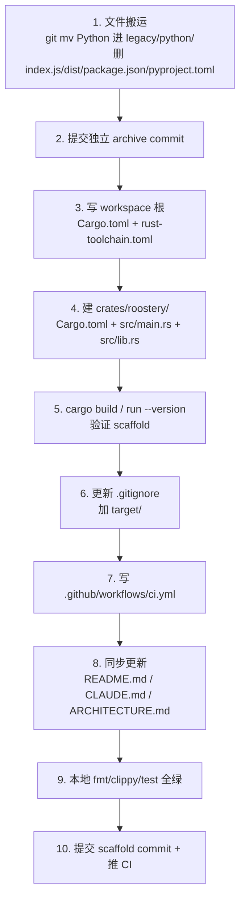

# rust-scaffold design

## 0. 术语约定

| 术语 | 定义 | 防冲突结论 |
|---|---|---|
| Python baseline | 当前 `src/roostery/` + `tests/` 下的 7339 LOC，从 prior `feishu_hub` import 的代码，仅作 reference（见 attention.md "代码-文档优先级"） | 项目内无歧义；不会跟 Rust 期模块同名 |
| legacy | 本 feature 引入的 `legacy/python/` 目录，承载归档后的 Python 代码；Phase 7 删 | grep 全仓库未出现冲突用法 |
| crate | Rust workspace 里的发布单位；本 feature 建立 workspace 根 + 单一 member crate `roostery` | Rust 生态标准术语，无冲突 |
| 占位发布 | npm `roostery@0.0.0` 和 PyPI `roostery==0.0.0` 已发布占位（commit 7b3cd1b），namespace 在 registry 端已 reserved，本地 manifest 文件存在与否不影响 | 项目专属概念，文档显式说明即可 |

参考：原 `planning/2026-05-15-rust-rewrite.md` §3 目录结构 + §Phase 0 任务清单作 reference，本 design 不重复其内容，只把可执行的具体决议沉淀。

## 1. 决策与约束

### 范围（本 feature 覆盖）

- 建 Cargo workspace 根 (`Cargo.toml` workspace + `rust-toolchain.toml`)
- 建单一 member crate `crates/roostery` 含 `Cargo.toml` + `src/main.rs` + `src/lib.rs`，能 `cargo run -- --version` 输出 `roostery 0.0.0 (rust)`
- 整体归档当前 Python baseline 进 `legacy/python/`
- 删除明确不需要的根级文件 (`index.js`、`dist/`、`.pytest_cache/`、`package.json`、`pyproject.toml`)
- 配 `.github/workflows/ci.yml` 含 fmt / clippy / test 三个 job
- 更新 `README.md` 加一句"Rust 重写中，详见 `.codestable/`"（**不**做完整 user-why 改写，那归 `legacy-removal` Phase 7）
- 更新 `CLAUDE.md` 把 Python-centric 描述切换为 Rust（在相应位置指向 `legacy/python/`）
- 更新 `.codestable/architecture/ARCHITECTURE.md` 同步 Rust 期描述
- 更新 `.gitignore` 加 Rust artifact (`target/`、`**/*.rs.bk`)

### 明确不做

- **不引入任何上层依赖**——本 feature 的 `Cargo.toml` 只声明 `package` 元信息，**不加** `serde` / `tokio` / `clap` / `chrono` 等。这些等到 Phase 1+ 真正需要时再加
- **不写任何业务逻辑**——`src/lib.rs` 只 export `pub const VERSION` 和 `pub const SCHEMA_VERSION`；`src/main.rs` 只打印版本号
- **不实现 `bin/shim.rs`**——shim 二进制是 `lark-cli-shim` (Phase 2) 的事
- **不引入跨模块接口契约**——roadmap §4 的 7 个契约（LarkRunner / JournalEntry / Runner / HookEvent / TraceContext / Config / 模板嵌入）一个不实现
- **不写完整新版 README**——`legacy-removal` (Phase 7) 兑现 user-why 改写。本 feature 只加一行 Rust 期 notice
- **不重新 publish npm / PyPI 占位**——namespace 已在 registry 端 reserved，本地 manifest 删除不影响（决策 5）
- **不动 `.codestable/`、`docs/`（gitignored）、`planning/`（gitignored）**——这三处与 Rust 重写无关
- **不修复 / 不维护 Python baseline 的任何已知问题**——进 `legacy/` 就 frozen（per attention.md "代码-文档优先级"）

### 复杂度档位

走默认档位——单平台（开发者本人机）+ 标准 CLI 工程。无对外 SDK、无高并发、无一次性工具的偏离信号。

### 关键决策

| # | 决策 | 内容 | 来源 |
|---|---|---|---|
| 1 | Rust edition | `edition = "2024"` | planning §2 |
| 2 | rust-toolchain pin | `channel = "stable"` + `components = ["clippy", "rustfmt"]`；**不 pin** 具体版本号 | planning §1.1 + §2 |
| 3 | Workspace 形态 | 单 member crate `crates/roostery` + workspace 根；目录预留多 crate 扩展余地 | planning §2 |
| 4 | 二进制目标数量 | Phase 0 只 1 个 (`roostery` 主程序)；shim 二进制等 Phase 2 加 | planning §3 + items.yaml |
| 5 | `package.json` / `pyproject.toml` 处置 | **两者都删**（npm + PyPI namespace 已在 registry 端 reserved，本地 manifest 不需要） | brainstorm v0.x-direction + attention.md |
| 6 | Python 归档内容 | `legacy/python/` 含：`src/roostery/`、`tests/`、`examples/`、`scripts/` 全部移入；在 `legacy/python/README.md` 标"已废弃，仅作 reference" | planning §Phase 0 任务 1-2 |
| 7 | CI 平台 | GitHub Actions；ubuntu-latest 单平台起步 | brainstorm v0.x-direction |
| 8 | CI job 范围 | 三个 job：`cargo fmt --check`、`cargo clippy -- -D warnings`、`cargo test`；**不**加 `cargo audit` / release artifact | planning §Phase 0 任务 7 |
| 9 | 包名 | crate `name = "roostery"`；二进制 `name = "roostery"`；`version = "0.0.0"` 跟当前对齐 | planning |
| 10 | 文档同步范围 | `README.md` 加 notice；`CLAUDE.md` 整体切换到 Rust 期叙述；`ARCHITECTURE.md` 模块映射改为 Rust 模块 | roadmap §7 观察项 |

## 2. 名词与编排

### 2.1 名词层

**现状**（重写前根目录）：

```
roostery/
├── CLAUDE.md / LICENSE / README.md / .gitignore
├── pyproject.toml / package.json / index.js
├── dist/ / docs/ / planning/
├── examples/ / scripts/
├── src/roostery/        # Python 包源码（21 模块 + dispatcher 子包）
├── tests/               # pytest 测试套件
└── .codestable/         # CodeStable 文档体系
```

**变化**（本 feature 完成后）：

```
roostery/
├── Cargo.toml                   # 【新】workspace 根
├── Cargo.lock                   # 【新】首次 build 后生成
├── rust-toolchain.toml          # 【新】pin stable + clippy/rustfmt
├── .gitignore                   # 【改】加 target/ / *.rs.bk
├── CLAUDE.md                    # 【改】切到 Rust 期叙述
├── LICENSE                      # 不动
├── README.md                    # 【改】加 Rust 期 notice 一句
├── crates/
│   └── roostery/                # 【新】单一 member crate
│       ├── Cargo.toml
│       ├── src/main.rs          # 输出版本号
│       └── src/lib.rs           # pub const VERSION + SCHEMA_VERSION
├── legacy/                      # 【新】归档目录
│   └── python/
│       ├── README.md
│       ├── src/roostery/
│       ├── tests/
│       ├── examples/
│       └── scripts/
├── .github/workflows/ci.yml     # 【新】fmt + clippy + test
├── .codestable/                 # 不动
├── docs/ / planning/            # gitignored，不动
```

**关键文件内容**：

`Cargo.toml`（workspace 根）：
```toml
[workspace]
resolver = "2"
members = ["crates/roostery"]

[workspace.package]
version = "0.0.0"
edition = "2024"
license = "MIT"
authors = ["Ben Dusy <ben@bendusy.dev>"]
repository = "https://github.com/bendusy/roostery"
```

`rust-toolchain.toml`：
```toml
[toolchain]
channel = "stable"
components = ["clippy", "rustfmt"]
```

`crates/roostery/Cargo.toml`：
```toml
[package]
name = "roostery"
version.workspace = true
edition.workspace = true
license.workspace = true
authors.workspace = true
repository.workspace = true
description = "🪺 Vendor-neutral agent broker, Feishu-native."

[lib]
name = "roostery"
path = "src/lib.rs"

[[bin]]
name = "roostery"
path = "src/main.rs"
```

`crates/roostery/src/lib.rs`：
```rust
pub const VERSION: &str = env!("CARGO_PKG_VERSION");
pub const SCHEMA_VERSION: u32 = 1;
```

`crates/roostery/src/main.rs`：
```rust
fn main() {
    let args: Vec<String> = std::env::args().collect();
    if args.len() >= 2 && (args[1] == "--version" || args[1] == "-V") {
        println!("roostery {} (rust)", roostery::VERSION);
        return;
    }
    println!("roostery {} (rust) — see https://github.com/bendusy/roostery", roostery::VERSION);
}
```

`legacy/python/README.md`：
```markdown
# Legacy Python Code

⚠️ **本目录已废弃，仅作 reference。**

这里是 Roostery 项目转 Rust 之前的 Python baseline（来自 prior `feishu_hub` import，
M3.C → M5.A，~7339 LOC，40+ 测试）。

按 `.codestable/attention.md` "代码-文档优先级" 原则：当代码和最新文档冲突时
**以文档为准**，本目录代码不维护、不修复。

Rust 实现见 `crates/roostery/`。完整 Rust 重写 roadmap 见 `.codestable/roadmap/rust-rewrite/`。

Phase 7 (`legacy-removal` feature) 完成后本目录将删除。
```

`.github/workflows/ci.yml`：
```yaml
name: CI
on:
  push:
    branches: [main]
  pull_request:
    branches: [main]

jobs:
  fmt:
    runs-on: ubuntu-latest
    steps:
      - uses: actions/checkout@v4
      - uses: dtolnay/rust-toolchain@stable
        with:
          components: rustfmt
      - run: cargo fmt --all --check

  clippy:
    runs-on: ubuntu-latest
    steps:
      - uses: actions/checkout@v4
      - uses: dtolnay/rust-toolchain@stable
        with:
          components: clippy
      - run: cargo clippy --all-targets --all-features -- -D warnings

  test:
    runs-on: ubuntu-latest
    steps:
      - uses: actions/checkout@v4
      - uses: dtolnay/rust-toolchain@stable
      - run: cargo test --all
```

### 2.2 编排层

**主流程**：



**现状**：当前仓库无 Rust workflow，pytest 是唯一测试入口（`pyproject.toml` 配置）。

**变化**：替换 build/test 链路——pytest → cargo test；setuptools → cargo；pip install → 不需要。Python 工具链对仓库不再 active。

**流程级约束**：

- **archive 提交独立于 scaffold 提交**——两次 commit 分开。archive 提交后仓库处于"过渡态"（无 Python 入口、无 Rust 入口），不允许跑任何 build；scaffold 提交后才进入"Rust 期就绪态"。这种分步有助回退（archive 出问题可单独 revert 不丢 Rust 工作）
- **文档同步在 scaffold 之后**——CLAUDE.md / ARCHITECTURE.md / README.md 改完后 PR review 才看到一致的 Rust 期视图。这步之前所有 Rust 文件应已就位
- **CI 配置在文档同步之前**——CI 能跑等于 Rust 工作台健康，先验证再改文档不会出现"文档说能 build 但实际不行"

### 2.3 挂载点清单

判据"删了它 feature 是否消失"：

1. **`Cargo.toml`（workspace 根）+ `rust-toolchain.toml`** — 删 → feature 消失（没 workspace 根 = 没 Rust 项目）
2. **`crates/roostery/`** — 删 → feature 消失（member crate 不在）
3. **`legacy/python/`** — 删 → feature 部分消失（archive 没有归宿）
4. **`.github/workflows/ci.yml`** — 删 → feature 部分消失（CI 失效）
5. **`.gitignore` 含 `target/`** — 删 → feature 部分消失（build artifact 会被误提交）

5 条均为 strong mounting points。**不列**：CLAUDE.md / ARCHITECTURE.md / README.md 的文档更新——它们是同步性改动，不是承载点。

### 2.4 推进策略

按 paradigm 维度切片（文件搬运 / 工作台 / CI / 文档），详细 step 落 checklist：

1. **文件搬运 + archive commit**——破坏旧形态，独立提交
   - 退出信号：`ls` 根目录无 Python / JS 文件；`git status` 干净
2. **Rust 工作台建立**——workspace 根 + member crate
   - 退出信号：`cargo build` 成功；`cargo run -- --version` 输出 `roostery 0.0.0 (rust)`；`cargo test` 0 passed
3. **.gitignore + CI 配置**
   - 退出信号：本地 `cargo fmt --check` / `clippy -D warnings` / `test` 三命令全绿
4. **文档同步**——README/CLAUDE/ARCHITECTURE
   - 退出信号：grep `src/roostery` 在三份文档不再作为 active 路径
5. **远端 CI 验证**——推 commit 触发
   - 退出信号：GitHub Actions 三个 job 全绿

### 2.5 结构健康度与微重构

**评估对象**：

- **要改的文件**：`CLAUDE.md`（6754 字节）/ `README.md`（1528 字节）/ `ARCHITECTURE.md`（roadmap 阶段刚建）/ `.gitignore`（146 字节）。都是配置 / 文档文件，无"胖"或"职责混杂"问题
- **要落新文件的目录**：根目录（加 `Cargo.toml` / `rust-toolchain.toml`）+ 新建 `crates/roostery/` + 新建 `legacy/python/` + 新建 `.github/workflows/`。都是新目录或在原本就空的根上加，无"摊平"问题

**先查 compound convention**——`compound/` 当前为空（onboard 刚建），无约定可对齐。

**结论**：**本次不做微重构**。

理由：rust-scaffold 是 greenfield Rust workspace 设置 feature，本身在建立新目录结构。Python baseline 的内部结构不评估（按 attention.md "代码-文档优先级"，不维护它的健康度，整体 archive 即可）。新建的 Rust 结构是 Cargo 标准布局，无需额外规划。

**超出范围的观察**（给后续 cs-refactor 注意，不阻塞本 feature）：

- `legacy/python/` 内的 Python 模块布局（21 个文件平铺在 `src/roostery/`，dispatcher 单独成子包但 bot_* / base_* / report_* 等是平铺命名前缀）不做整理——它进 legacy 就 frozen
- `crates/roostery/src/` 内的 Rust 模块组织等到 Phase 1+ 真正引入第一批模块（journal / redact / remoterefs）时再决定。目前只有 `main.rs` + `lib.rs` 两个文件，无组织决策
- 一旦 Rust 模块数 >5，建议起 `cs-decide convention` 归档"Rust 模块文件命名 / mod.rs 与 inline mod 选择 / sub-module 拆分时机"——那是 Phase 1+ 的事

## 3. 验收契约

### 3.1 关键场景清单（输入 / 触发 → 期望可观察结果）

#### 工作台基本验证

- `rustc --version` → 输出 1.85+ 版本号
- `ls Cargo.toml rust-toolchain.toml crates/roostery/Cargo.toml` 在仓库根 → 三个文件都存在
- `cargo build` → 成功，无 error / warning
- `cargo run -- --version` → stdout `roostery 0.0.0 (rust)`，exit 0
- `cargo run`（无参数） → stdout 含 `roostery 0.0.0 (rust)` 和 GitHub URL，exit 0
- `cargo test --all` → `0 passed; 0 failed; 0 ignored`，exit 0
- `cargo fmt --all --check` → exit 0
- `cargo clippy --all-targets --all-features -- -D warnings` → exit 0

#### Python 归档验证

- `ls src 2>&1` → "No such file or directory"
- `ls legacy/python/src/roostery/` → 列出 21+ `.py` 模块
- `ls legacy/python/tests/` → 列出 40+ `test_*.py`
- `cat legacy/python/README.md` → 含"已废弃，仅作 reference"
- `git log --follow legacy/python/src/roostery/journal.py` → 追溯到原 `src/roostery/journal.py` 历史（git mv 保留）
- `git ls-files | grep "^src/roostery/"` → 空

#### 文档同步验证

- `grep -rE "src/roostery/|pip install|pytest" CLAUDE.md README.md .codestable/architecture/ARCHITECTURE.md` → 仅在"指向 legacy/"或"历史 reference"语境出现
- `head -5 README.md` → 含"Rust 重写中"或类似 notice
- `cat .codestable/attention.md` → 9 条硬约束仍在（rust-scaffold 不动 attention.md）

#### CI 验证

- 推 commit 到 main 或建 PR → GitHub Actions 触发 fmt/clippy/test 三个 job
- 三个 job → 全绿

### 3.2 明确不做的反向核对项

- `grep -E "tokio|serde|clap|chrono" crates/roostery/Cargo.toml` → 无输出（Phase 0 不引依赖）
- `ls crates/roostery/src/bin/ 2>/dev/null` → 不存在（shim 是 Phase 2）
- `wc -l README.md` → ≤55 行（当前 ~43，仅加 notice 不做完整改写）
- `cat .gitignore | grep "target/"` → 包含
- `npm view roostery version` → 仍 `0.0.0`（占位未动）
- `pip show roostery 2>/dev/null` → 显示已发布 0.0.0（pypi namespace 占位未动）
- `ls .codestable/ docs/ planning/` → 内容未被本 feature 改动（除本轮已写入的 architecture/requirements/roadmap/brainstorms/attention.md）
- `diff -r legacy/python/src/roostery/ <archive-original>` → 完全一致（git mv 不改内容）

## 4. 与项目级架构文档的关系

**本 feature 提炼回 architecture 的内容**：

- **名词**：`crates/roostery/src/lib.rs` 暴露的 `VERSION` / `SCHEMA_VERSION` 是系统级常量——acceptance 提炼到 ARCHITECTURE.md "结构与交互"节"Rust workspace 入口"
- **目录布局**：`crates/` / `legacy/` / `.github/` 三个新顶层目录——acceptance 提炼到 ARCHITECTURE.md "模块索引"开头作 navigation
- **构建工具链**：cargo workspace + rust-toolchain pin——acceptance 提炼到 CLAUDE.md "Commands" 节（替换原 pip install / pytest）

**关联的已有架构 doc**：

- `.codestable/architecture/ARCHITECTURE.md` — 本 feature 直接修改（决策 10）
- `CLAUDE.md` — 本 feature 直接修改

**架构总入口新增描述**：ARCHITECTURE.md 需要在"项目简介"节加一段"Rust 重写阶段（2026-05-15 起）：Python baseline 归档在 `legacy/python/` 作 reference，活跃实现在 `crates/roostery/`"。

无需新建独立 arch doc——rust-scaffold 是工作台搭建，未引入新子系统。
