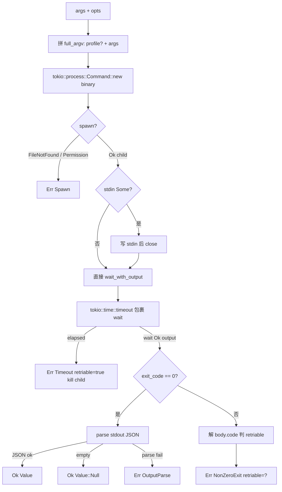
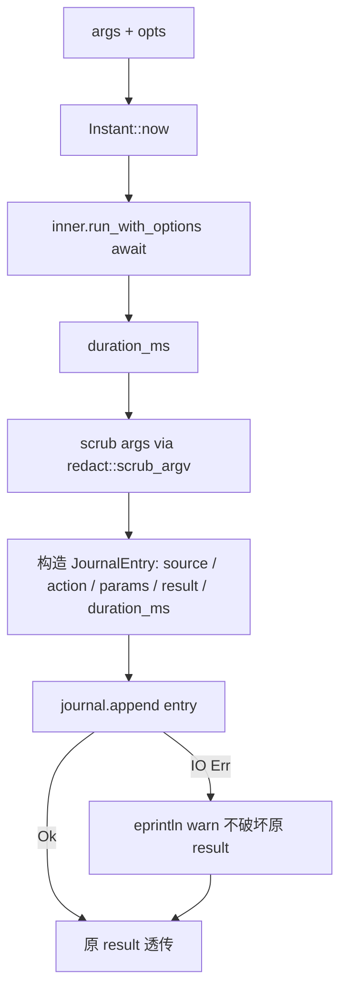
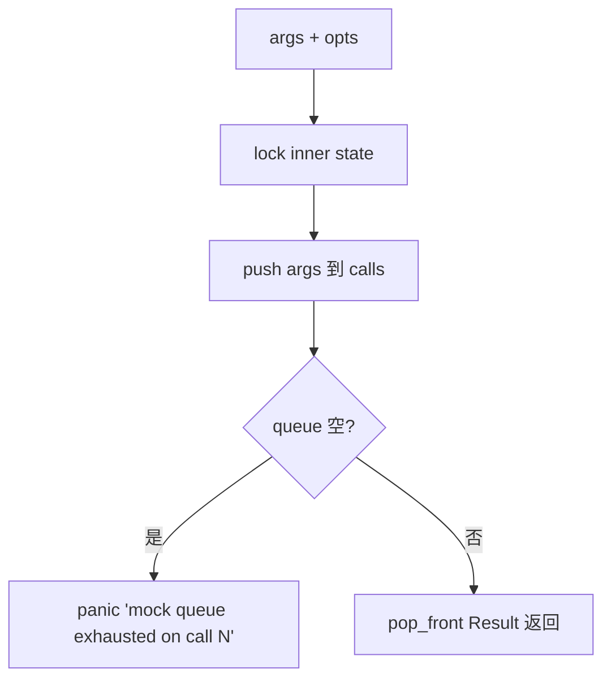

# lark-cli-wrapper design

## 0. 术语约定

| 术语 | 定义 | 防冲突结论 |
|---|---|---|
| `LarkRunner` | roadmap §4.1 钦定的 async trait —— 所有走向飞书的调用必经此抽象 | grep 全仓库无冲突；架构红线第 1 条 |
| `LarkCli` | 默认 subprocess 实现，wraps `tokio::process::Command::new("lark-cli")` | grep 无冲突 |
| `MockLarkRunner` | 测试用 mock 实现，FIFO 响应队列（`VecDeque<Result>`）+ 调用记录 | grep 无冲突 |
| `Journaled<R>` | 装饰器 newtype，wraps 任意 `R: LarkRunner`，调用前后写 `JournalEntry`；`R` 自身不写 journal | grep 无冲突 |
| `LarkError` | roadmap §4.1 钦定 `#[non_exhaustive]` **rich enum**（每变体携带专有数据：Spawn 的 path/io::Error、NonZeroExit 的 exit_code/body_code/stderr 等）+ thiserror derive Display/Error。`retriable()` 是函数（match 表达式）非字段——避免构造时 retriable 与 variant 数据不一致 | 2026-05-16 升级；本 feature 是首个实现者 0 下游影响时拉的 |
| `RunOptions` | `run_with_options` 接的辅助 struct（timeout / stdin / profile）；不在 §4.1 钦定 signature 内 | grep 无冲突 |
| `ROOSTERY_LARK_CLI_BIN` | 环境变量，覆盖 lark-cli 二进制路径；默认 `"lark-cli"` 走 PATH | 与 paths::ROOSTERY_HOME 同前缀风格；Python 旧 `FEISHU_HUB_LARK_CLI_BIN` 不读 |
| Retriable 提示 | `LarkError.retriable` 字段——LarkCli 自己**不**重试，把判别结果交给 caller（Phase 4 dispatcher） | 见 §1 D1 |

参考：`legacy/python/src/roostery/lark_cli.py`（行为 reference，`run_json` ~150 行；其余 ~450 行是 `im_send_text` / `docs_create_v2` 等业务包裹，**本 feature 不实现**——归 Phase 5+ bot/dispatcher）。

### 0.1 Rust idiom 杠杆（不只是 Python parity）

参考 core-remoterefs design §0.1 模式。本 feature 在 Python `lark_cli.py` `LarkCLIError(code, msg, stdout, stderr, retriable)` flat struct 之上，借 Rust 拉 3 处 Python 做不到的安全度：

1. **rich enum + thiserror 替代 C-style discriminator**——每变体携带各自数据：`Spawn { path, source: io::Error }` / `NonZeroExit { exit_code, body_code, message, stdout, stderr }` / `OutputParse { source: serde_json::Error, stdout }` / `Timeout { timeout_ms }`。caller `match err { Spawn { path, .. } => ... }` 只看到该变体真有的字段；不再有"NonZeroExit 但 stdout 是空 String 占位"这种 Python 风格污染
2. **`#[non_exhaustive]` 加在 enum 上**——同 RemoteRefs 套路；Phase 4 dispatcher 引入 `Cancelled`（用户中断 / shim NOJOURNAL）等新变体不破坏外部 caller `match`
3. **`retriable()` 是 method 不是字段**——match 表达式 `matches!(self, Self::Timeout {..} | Self::NonZeroExit { exit_code: 124, ..} | ...)` 编译期保证 retriable 判别与 variant 数据一致；Python 风格的"构造时算好存字段"会在重构时偷偷不一致

`MockLarkRunner` 也走 fluent 风格：`enqueue_ok(v) -> &Self` 让测试链式构造响应队列。

### 0.2 与已落地模块的关系

- **redact**：`Journaled<R>` 写 journal 前对 `args` 调 `redact::scrub_argv`，`stdout/stderr` 调 `redact::scrub_text`——避免 token 落盘
- **journal**：`Journaled<R>` 持有 `Journal` handle，每次 `run` 不论 Ok/Err 都写一条 `JournalEntry`；`source` 由构造方传入（如 `"lark-cli-wrapper"` / Phase 2 `"shim"`）
- **remoterefs**：本 feature **不内置** `extract`——下游 caller 拿到 `serde_json::Value` 后自己调；与 redact / remoterefs 同口径"caller 自调"
- **paths**：`ROOSTERY_LARK_CLI_BIN` env 解析放 `lark_cli/subprocess.rs` 内部，不动 `paths` 模块（paths 管路径不管二进制）

## 1. 决策与约束

### 范围

- 新目录 `crates/roostery/src/lark_cli/` 走 compound convention 档 2（mod.rs + 5 子文件，预估 ~700 行总）
- `lib.rs` 加 `pub mod lark_cli;`
- `Cargo.toml` 加 `tokio = { version = "1", features = ["full"] }` + `async-trait = "0.1"` + `thiserror = "1"` + `tracing = "0.1"`（Journaled 写 journal 失败用 `tracing::warn!` 而非 `eprintln!`，未来 dispatcher 起 tracing-subscriber 时自动接入；facade-only 不引 subscriber）
- 单元测试 ≥ 12 条，覆盖 trait 默认 method 委托 / subprocess happy path（用伪二进制）/ 4 种 LarkErrorKind 错误路径 / timeout / mock 队列行为 / Journaled 集成 / retriable 判别
- 不引 mockall / fake-process / assert_cmd 等额外 crate

### 明确不做

- **不实现业务包裹函数**（`im_send_text` / `docs_create_v2` / `drive_move` 等 Python 版 ~450 行业务包裹）—— 归 Phase 5+ `bot_task_writer` / `task_writer`。本 feature 公开面只有 LarkRunner trait + 三个实现 + 错误类型 + RunOptions。grep 反向核对：`grep -E "fn im_|fn docs_|fn drive_|fn base_" crates/roostery/src/lark_cli/` → 无
- **不内置 retry**：本 feature 单次 subprocess 调用 + retriable 提示。Phase 4 dispatcher 决定重试策略。grep 反向核对：`grep -E "retry|retries|attempt" crates/roostery/src/lark_cli/` → 非测试 / 非注释代码无
- **不实现 jq / json-path 选择器**：trait 返 `serde_json::Value`，caller 自己走 indexing 或 `serde_json::from_value`
- **不读 Config**：`LarkCli::new()` 走默认；`with_binary` / `with_default_timeout` 显式构造方法。Config 驱动等 Phase 3 `config-yaml` 起来后由该 feature 把 Config 字段桥接到 `LarkCli` 构造，不在本 feature 范围
- **不读 Python 旧 env `FEISHU_HUB_LARK_CLI_BIN`**：一次切到 `ROOSTERY_LARK_CLI_BIN`（与 `ROOSTERY_HOME` 同口径）。grep 反向核对：`grep "FEISHU_HUB_LARK_CLI_BIN" crates/roostery/src/lark_cli/` → 无运行时引用
- **不实现 LarkCli 的 `Default` impl**：`new()` 关联函数已经默认；避免 trait 实现暴露面增多
- **不实现高级 mock 表达**（matchers / verify in order / setup expectations DSL）：MockLarkRunner 仅 enqueue + assert no unconsumed + 暴露 calls Vec；测试代码自己断言 args
- **不让 LarkCli 自己写 journal**——必须包 `Journaled<LarkCli>` 才写。这样 mock 包不包都行；架构上 LarkCli 是 pure subprocess wrapper，journal 是装饰器
- **不暴露 std::io::Error / serde_json::Error / tokio Timeout 等底层错误**——全部归一为 `LarkError` 的 4 个 `LarkErrorKind` 变体；caller 不用 import tokio / serde_json / std::io 来 match 错误
- **不修改 `legacy/python/`**：frozen
- **不约束 lark-cli 子命令名集合**：trait 接 `args: &[&str]`，第一个元素是子命令名（如 `"im"`），实际可调任意 lark-cli 子命令——本 feature 不维护"已验证子命令清单"（Python 版那种），由 Phase 2 `roostery smoke` 单独负责验证矩阵

### 复杂度档位

走默认档位——纯库 + async 标准 Rust 工程。Async 是必需（tokio process），不构成偏离信号。

### 关键决策

| # | 决策 | 内容 | 来源 |
|---|---|---|---|
| 1 | Retry 留 Phase 4 dispatcher | LarkCli 单次调用；`LarkError::retriable() -> bool` 是 **method**（match 表达式），不是字段——避免构造时 retriable 与 variant 数据不一致。判别规则：`Timeout {..}` / `NonZeroExit { exit_code: 124, ..}` / `NonZeroExit { body_code: Some(99991663\|99991664), ..}` → true；其他 → false | 用户对齐；职责分离 + Rust idiom |
| 2 | trait 加 `run_with_options` 第二 method | `run` 保留 §4.1 钦定最简形态；`run_with_options(args, RunOptions { timeout, stdin, profile })` 覆盖高级场景。不破坏 §4.1 钦定 signature。`run` 默认实现 = `run_with_options(args, RunOptions::default())` | 用户对齐 |
| 3 | MockLarkRunner 自建 `Mutex<VecDeque<Result>>` | 不引 mockall；30 行手写可控；调用记录 `Vec<Vec<String>>` 暴露给测试断言 | 用户对齐 |
| 4 | tokio features `["full"]` | 用户接受首次引入 tokio 时省心；后续 dispatcher Phase 4 可能精简 | 用户对齐 |
| 5 | `Journaled<R>` 装饰器分离写 journal 职责 | LarkCli 自身**不写** journal；`Journaled::new(LarkCli::new(), journal, "shim")` 才写。Mock 不写 journal（除非显式 wrap）。下游 Phase 2 `lark-cli-shim` / Phase 4 dispatcher 各自决定包不包 | Rust idiom；trait composition over inheritance；测试更解耦 |
| 6 | 错误归一化 4 种 **rich enum 变体 + thiserror** | `Spawn { path, program_args, source: io::Error }`（subprocess 启动失败；program_args 是 owned Vec<String> 帮 debug，spawn 失败往往跟 args shell-escape 有关）/ `NonZeroExit { exit_code, body_code, message, stdout, stderr }`（lark-cli 退出码非 0；body_code 是从 stdout JSON 解出的飞书业务码 `Option<i64>`；message 是 summary，stdout/stderr 是 raw）/ `OutputParse { source: serde_json::Error, stdout }`（stdout 不是合法 JSON）/ `Timeout { timeout_ms }`。`#[non_exhaustive]` + thiserror Display；底层错误通过 `#[source]` 链接而非吞掉。**显式 `map_err` 不用 `#[from]`**——错误源不唯一（io::Error 未来可能也来自别处），`#[from]` 会限制后续演化；本 feature 内部 `?` 转换路径少，手写 `.map_err(|e| LarkError::Spawn { path, program_args, source: e })` 更显式。**stdout/stderr/program_args 在错误构造时截断到 4 KiB**（`MAX_FIELD_LEN_IN_ERR = 4096`）—— 防止 binary 误吐 GB 级数据让 LarkError 在 panic chain / journal 里爆炸 | roadmap §4.1（已升级 2026-05-16）+ architect review |
| 7 | 默认 timeout 30s | LarkCli 默认；`with_default_timeout` 可覆盖；`RunOptions.timeout` 单次覆盖 | Python parity (DEFAULT_TIMEOUT=30) |
| 8 | binary path 环境变量：`ROOSTERY_LARK_CLI_BIN` | env > `LarkCli::with_binary` 显式 > 默认 `"lark-cli"`（走 PATH）。不读 Python 旧 `FEISHU_HUB_LARK_CLI_BIN` | 与 `ROOSTERY_HOME` 一次切口径一致 |
| 9 | 模块组织走档 2（子目录）| `lark_cli/mod.rs` + `runner.rs`（trait + RunOptions）+ `error.rs`（LarkError + LarkErrorKind + retriable 判别）+ `subprocess.rs`（LarkCli + Command spawn + JSON parse + timeout）+ `mock.rs`（MockLarkRunner）+ `journaled.rs`（Journaled<R> 装饰器）。预估总 ~700 行超 500 触发档 2 | compound convention 2026-05-16-decision-rust-module-organization 第 2 档 |
| 10 | 业务标识符 newtype 暂不引入到 trait signature | trait `run(args: &[&str])` 用 `&str`；roadmap §4.1 + §4.5 写的 `TraceContext` 含 `String` 字段，按 newtype convention 应升级为 `TraceId` / `EventId`，但**本 feature 不动 trait signature**——roadmap §4.1 是硬契约。升级走 cs-roadmap update（business-identifier-newtype convention §"影响" 已 flag），不在本 feature 范围 | compound convention business-identifier-newtype 边界 |
| 11 | **MockLarkRunner 一直 public（不加 cfg gate）** | Roostery 现在单 crate；下游同 crate 内 task_writer (Phase 5) / dispatcher (Phase 4) 测试需要 mock。production binary 含 mock 代码但 release LTO 会 dead-code-eliminate。等 Roostery 真要 split crate 时再加 `feature = "test-utils"` flag。模块 doc 加显式 `// Test utility — production code should not depend on this` | architect review；社区惯例（tokio test-util 模式延后）|
| 12 | **Journaled 写 journal 失败用 `tracing::warn!` 而非 `eprintln!`** | tracing facade 是 Rust async 生态事实标准；现在引 facade-only crate（~30 KB）；Phase 4 dispatcher 起 tracing-subscriber 时自动接入结构化日志。eprintln 不可结构化、被 stdout/stderr captured 时丢失 | architect review |
| 13 | **roadmap 契约演化记录段固化为强制格式** | 任何对 §4.x 的修订都必须在该 § 末尾追加一条记录：`{date} ({trigger feature}): {change summary}. 理由：{rationale}. 受影响 caller：{count} ({list or "0 (首个实现者)"})`。本 feature 已是首例（§4.1 末尾"契约演化记录"段）。Acceptance 时把这条机制本身写进 roadmap.md §4 开头说明 | architect review；ADR-lite 模式 |

## 2. 名词与编排

### 2.1 名词层

**现状**：`crates/roostery/src/` 6 文件全在 Module A/B；无 Module C 任何代码。架构红线第 1 条已立"飞书 API 必经 lark-cli wrapper"，但 wrapper 本身不存在。

**变化**：

- 新增 `crates/roostery/src/lark_cli/` 子目录（走档 2）
  - `mod.rs`：`pub mod` re-export + `pub use` 暴露公开类型 + **顶部架构红线 docstring**——首段 `//! # 飞书 syscall 唯一通道` + 引用 `ARCHITECTURE.md §6 第 1 条` + 列出"绕过本模块的反例"（直接 `Command::new("lark-cli")` / `reqwest::get("https://open.feishu.cn/...")` / 引 Feishu SDK）。代码 reader 第一眼看到 module docstring 就 internalize 红线（双向引用，arch doc 也引代码）
  - `runner.rs`：`LarkRunner` trait + `RunOptions`
  - `error.rs`：`LarkError` + `LarkErrorKind` + retriable 判别 helper
  - `subprocess.rs`：`LarkCli` struct + `LarkRunner` impl
  - `mock.rs`：`MockLarkRunner`
  - `journaled.rs`：`Journaled<R>` 装饰器
- `lib.rs` 加 `pub mod lark_cli;`
- `Cargo.toml` 加 tokio + async-trait

**公开 API 接口契约**：

```rust
// crates/roostery/src/lark_cli/runner.rs

use async_trait::async_trait;
use serde_json::Value;
use std::time::Duration;

#[async_trait]
pub trait LarkRunner: Send + Sync {
    /// roadmap §4.1 钦定最简调用形态。
    /// args[0] 是 lark-cli 子命令（如 "im"），调用方不传 lark-cli 本身路径。
    async fn run(&self, args: &[&str]) -> Result<Value, LarkError> {
        self.run_with_options(args, RunOptions::default()).await
    }

    /// 高级场景：自定义 timeout / stdin / profile。
    async fn run_with_options(
        &self,
        args: &[&str],
        opts: RunOptions,
    ) -> Result<Value, LarkError>;
}

#[derive(Debug, Clone, Default)]
#[non_exhaustive]
pub struct RunOptions {
    pub timeout: Option<Duration>,    // None = 用 LarkCli::default_timeout（30s）
    pub stdin: Option<String>,
    pub profile: Option<String>,      // lark-cli --profile global flag
}
// non_exhaustive 让未来加 env / cwd / kill_on_drop 等字段不破坏 caller 的
// `RunOptions { timeout: x, ..Default::default() }` 构造模式。
```

```rust
// crates/roostery/src/lark_cli/error.rs

use std::path::PathBuf;
use thiserror::Error;

#[derive(Debug, Error)]
#[non_exhaustive]
pub enum LarkError {
    /// subprocess 启动失败（binary not found / permission denied / fork 失败）。
    /// program_args 是 owned 拷贝（已截断 ≤ 4 KiB）帮 debug——spawn 失败往往跟 args
    /// shell-escape 或 binary 选错版本有关，光看 path 不够。
    #[error("failed to spawn lark-cli at {path:?}: {source}")]
    Spawn {
        path: PathBuf,
        program_args: Vec<String>,
        #[source]
        source: std::io::Error,
    },

    /// lark-cli 退出码非 0；body_code 是从 stdout JSON 解出的飞书业务码（如 99991663 token expire）。
    /// message 是从 body.msg / stderr 抽出的人类可读 summary（给 Display 用）；
    /// stdout/stderr 是 raw 数据（已截断 ≤ 4 KiB）给 caller 自己解析。
    #[error("lark-cli exited {exit_code} (body code {body_code:?}): {message}")]
    NonZeroExit {
        exit_code: i32,
        body_code: Option<i64>,
        message: String,
        stdout: String,
        stderr: String,
    },

    /// stdout 不是合法 JSON。stdout 已截断 ≤ 4 KiB。
    #[error("lark-cli stdout is not valid JSON: {source}")]
    OutputParse {
        #[source]
        source: serde_json::Error,
        stdout: String,
    },

    /// 超 RunOptions.timeout 或 LarkCli 默认 30s
    #[error("lark-cli timed out after {timeout_ms}ms")]
    Timeout { timeout_ms: u64 },
}

/// 构造 LarkError 时对 stdout/stderr/program_args 字段截断的上限，防爆炸。
const MAX_FIELD_LEN_IN_ERR: usize = 4096;

impl LarkError {
    /// 提示给 caller 的"是否值得重试"——本模块自身不重试。
    /// 判别规则：Timeout / OS exit 124 / 飞书 transient 业务码（99991663/99991664 token expire）。
    pub fn retriable(&self) -> bool {
        matches!(self,
            Self::Timeout { .. }
            | Self::NonZeroExit { exit_code: 124, .. }
            | Self::NonZeroExit { body_code: Some(99991663 | 99991664), .. }
        )
    }
}
```

注：roadmap §4.1 已于 2026-05-16 同步升级为本形态（contract 演化记录在 §4.1 末尾）。

```rust
// crates/roostery/src/lark_cli/subprocess.rs

use std::path::PathBuf;
use std::time::Duration;

pub struct LarkCli {
    binary: PathBuf,
    default_timeout: Duration,
}

impl LarkCli {
    /// env ROOSTERY_LARK_CLI_BIN > "lark-cli"（走 PATH）；timeout 默认 30s。
    pub fn new() -> Self;
    pub fn with_binary(binary: impl Into<PathBuf>) -> Self;
    pub fn with_default_timeout(self, timeout: Duration) -> Self;
}

#[async_trait::async_trait]
impl LarkRunner for LarkCli {
    async fn run_with_options(&self, args: &[&str], opts: RunOptions) -> Result<Value, LarkError> { ... }
}
```

```rust
// crates/roostery/src/lark_cli/mock.rs

use std::sync::{Arc, Mutex};
use std::collections::VecDeque;

pub struct MockLarkRunner {
    inner: Arc<Mutex<MockState>>,
}

struct MockState {
    queue: VecDeque<Result<Value, LarkError>>,
    calls: Vec<Vec<String>>,  // 记录被调用过的 args（owned 拷贝）
}

impl MockLarkRunner {
    pub fn new() -> Self;
    /// fluent: 链式构造响应队列 `mock.enqueue_ok(v).enqueue_err(e).enqueue_ok(v2)`
    pub fn enqueue_ok(&self, value: Value) -> &Self;
    pub fn enqueue_err(&self, err: LarkError) -> &Self;
    /// 拷贝当前调用记录；按 Vec<Vec<String>> 形态返回（不暴露 RunOptions）
    pub fn calls(&self) -> Vec<Vec<String>>;
    /// 显式断言"恰好消费完"——剩余 panic with helpful message
    pub fn assert_no_unconsumed(&self);
}

impl Default for MockLarkRunner { /* = new() */ }

#[async_trait::async_trait]
impl LarkRunner for MockLarkRunner {
    async fn run_with_options(&self, args: &[&str], _opts: RunOptions) -> Result<Value, LarkError> {
        // pop_front 队列；空了 panic with helpful message
        // calls.push(args.to_vec())
    }
}
```

```rust
// crates/roostery/src/lark_cli/journaled.rs

use crate::journal::{Journal, JournalEntry, JournalResult};
use crate::redact;

pub struct Journaled<R: LarkRunner> {
    inner: R,
    journal: Journal,
    source: String,
}

impl<R: LarkRunner> Journaled<R> {
    pub fn new(inner: R, journal: Journal, source: impl Into<String>) -> Self;
}

#[async_trait::async_trait]
impl<R: LarkRunner> LarkRunner for Journaled<R> {
    async fn run_with_options(&self, args: &[&str], opts: RunOptions) -> Result<Value, LarkError> {
        let started = std::time::Instant::now();
        let result = self.inner.run_with_options(args, opts.clone()).await;
        let duration_ms = started.elapsed().as_millis() as u64;
        // 构造 JournalEntry，params 经 redact::scrub_argv 过 args
        // result 转 JournalResult::Ok { value } / JournalResult::Err { kind, message }
        // 写一行；写失败 silent log（不破坏原 result）
        result
    }
}
```

**示例**（验收用得着）：

```rust
// production
let runner = Journaled::new(LarkCli::new(), Journal::default(), "shim");
let v = runner.run(&["im", "+messages-send", "--user-id", "ou_x", "--text", "hi"]).await?;

// production with timeout
let opts = RunOptions { timeout: Some(Duration::from_secs(10)), ..Default::default() };
let v = runner.run_with_options(&["docs", "+create", ...], opts).await?;

// test
let mock = MockLarkRunner::new();
mock.enqueue_ok(json!({"data": {"message_id": "om_abc"}}));
let v = mock.run(&["im", "+messages-send", "--user-id", "ou_x", "--text", "hi"]).await?;
assert_eq!(mock.calls()[0], vec!["im", "+messages-send", "--user-id", "ou_x", "--text", "hi"]);
```

来源参考：

- §4.1 trait signature：`.codestable/roadmap/rust-rewrite/rust-rewrite-roadmap.md` §4.1（硬约束）
- subprocess + JSON parse + timeout 行为：`legacy/python/src/roostery/lark_cli.py:55-147` `run_json` + `_parse_output` + `_parse_error`
- transient codes 提示：`legacy/python/src/roostery/lark_cli.py:21` TRANSIENT_CODES

### 2.2 编排层

**现状**：无 caller。本 feature 之后 Phase 2 `roostery smoke` 是首个消费者；Phase 2 `lark-cli-shim` 和 Phase 4 `dispatcher` / Phase 5 `task_writer` 后续接入。

**变化**：模块作为基础设施被未来 caller 通过 trait 调用，无内部 workflow。三个 LarkRunner 实现各有自己的主流程。

**`LarkCli::run_with_options` 主流程图**（subprocess 实现）：



**`Journaled<R>::run_with_options` 主流程图**：



**`MockLarkRunner::run_with_options` 主流程图**：



**流程级约束**：

- **不变量 1**：trait 的 `run(args)` 默认实现委托 `run_with_options(args, default())`——3 个实现都不重写 `run`，统一走 `run_with_options`
- **不变量 2**：所有 LarkError 严格归一到 4 个 `LarkErrorKind` 变体；调用方不 import std::io / serde_json / tokio 也能 match 完整错误
- **不变量 3**：Journaled 写 journal 失败不破坏原 result——只 eprintln warn；journal IO 故障是次要可观察问题，不应让飞书操作回滚
- **不变量 4**：Journaled 写入前 `params.argv` 必经 `redact::scrub_argv`——避免 token 落 journal
- **不变量 5**：MockLarkRunner 队列空时 panic 而非默认返 Err——测试期望"调用恰好 N 次"必须被显式断言；潜在的 silent miss 会让测试 false-pass
- **不变量 6**：LarkCli timeout 触发时**必须 kill child process**——避免 zombie subprocess
- **不变量 7**：LarkCli 不重试——retriable 仅作为 error 字段提示给 caller
- **不变量 8**：subprocess stdout 为空时返 `Value::Null`（与 Python None 等价语义）；不报 OutputParse 错——空输出是 lark-cli 某些 fire-and-forget 子命令的合法行为
- **错误语义**：所有错误带 retriable 提示但不重试；caller 自己决定

### 2.3 挂载点清单

判据"删了它 feature 是否消失"：

1. **`crates/roostery/src/lark_cli/` 目录存在且含 mod.rs + 5 子文件** — 删 → trait + 实现全无 → feature 消失
2. **`crates/roostery/src/lib.rs` 含 `pub mod lark_cli;`** — 删 → API 对外不可见 → feature 消失
3. **`Cargo.toml` 含 `tokio` + `async-trait` 依赖** — 删 → build 失败
4. **`LarkRunner` trait 暴露**（`mod.rs` re-export `pub use runner::LarkRunner;`）— 删 → 下游无法依赖抽象
5. **`Journaled<R>` 装饰器存在** — 删 → journal 集成消失（架构红线 "lark-cli 必经" + journal 集成两件事拆开后，第二件就没了）
6. **`LarkError` 是 `#[non_exhaustive]` rich enum + thiserror derive** — 删 / 退化为 struct + C-style enum → 不变量 6 (rich enum) + 杠杆 2 (non_exhaustive) 双双失效；contract 与 roadmap §4.1 不符

6 条 strong mount points，比 3-5 上限略宽——其中第 6 条是契约形态的明文锁定，与挂载点 1-5 的"代码物理存在"在同一性质上但在抽象层。

**不列**：4 个 `LarkErrorKind` 变体内容、retriable 判别规则、子文件具体拆分、私有 helper——这些是模块内部，改一条不消失 feature。

## 2.4 推进策略

按 paradigm 维度切片（结构升档 → 类型骨架 → subprocess 主体 → mock + journaled → 测试覆盖）：

1. **结构升档 step（独立 commit）**：
   - 建 `crates/roostery/src/lark_cli/` 子目录 + 6 个空文件（mod.rs + 5 sub）
   - 每个子文件**仅含 module-level doc 注释**，内容空
   - `lib.rs` 加 `pub mod lark_cli;`
   - `Cargo.toml` 加 `tokio = { version = "1", features = ["full"] }` + `async-trait = "0.1"` + `thiserror = "1"` + `tracing = "0.1"`（Journaled 写 journal 失败用 `tracing::warn!` 而非 `eprintln!`，未来 dispatcher 起 tracing-subscriber 时自动接入；facade-only 不引 subscriber）

   - 退出信号：`cargo build` 成功；`cargo test --all` 仍跑通既有 99 测试无回归；**独立 commit** 标 "chore(lark-cli): scaffold module subdir (Phase 2 升档 2)"
2. **类型骨架**：runner.rs（trait + RunOptions）+ error.rs（LarkError + LarkErrorKind + retriable 判别 helper）；mod.rs `pub use` 暴露
   - 退出信号：`cargo build` 成功；trait + 类型可独立构造测试；error Display + Error trait 实现
3. **LarkCli subprocess 实现**：subprocess.rs 实现 `LarkCli::new` / `with_binary` / `with_default_timeout` + `LarkRunner` impl 主流程（spawn → stdin? → timeout-wrapped wait → exit code 分支 → JSON parse）
   - 退出信号：`LarkCli` 编译通过；用伪 binary（如 `/bin/echo` / shell script fixture）跑 happy path 测试
4. **MockLarkRunner**：mock.rs 实现 `enqueue_ok` / `enqueue_err` / `calls` / `assert_no_unconsumed` + `LarkRunner` impl
   - 退出信号：mock 单测覆盖队列消费 / calls 记录 / assert_no_unconsumed 行为
5. **Journaled 装饰器**：journaled.rs 实现 `Journaled<R>` + `LarkRunner` impl（Instant 计时 → inner.run → scrub → JournalEntry → append → result 透传）
   - 退出信号：Journaled<MockLarkRunner> 集成测试——assert journal 文件含一行符合 schema 的 entry，params.argv 已脱敏，result 字段正确
6. **完整验收 + 集成验证**：
   - 4 种 LarkErrorKind 路径各 1 测试（伪 binary 模拟）
   - retriable 判别 truth table（exit 124 / Timeout / body.code transient / 其他）
   - `cargo test --all + cargo test --doc + cargo clippy --all-targets --all-features -- -D warnings + cargo fmt --all --check` 四命令全绿
   - 推 CI 验三 job

### 2.5 结构健康度与微重构

**评估对象**：

- **要改的文件**：`lib.rs`（+1 行）、`Cargo.toml`（+2 行依赖）—— 无健康度问题
- **要落新文件的目录**：`crates/roostery/src/lark_cli/`（**新建子目录**）

**先查 compound convention**——`.codestable/compound/2026-05-16-decision-rust-module-organization.md`：

- 档 1（单文件 inline）：单文件 < 500 行、公开项 ≤ 8 个
- 档 2（子目录 + mod.rs）：单文件超 500 行 / 公开项 > 8

**预估**：本 feature 内容 trait + 4 类公开 struct (LarkCli / MockLarkRunner / Journaled / RunOptions) + 2 类公开错误 type + 私有 helper + 12+ 单测，预估总 ~700 行；公开项 ~7 个但触及 4 套独立职责（trait / subprocess IO / mock / journal 装饰器）—— 单文件**职责密度过高**，超 500 行阈值。

**结论**：**做微重构（重组目录）—— 新建子目录走档 2**

具体方案：
- 新建 `crates/roostery/src/lark_cli/` 子目录
- 拆 6 个文件：`mod.rs`（仅 re-export + 模块 doc）+ `runner.rs`（trait + RunOptions）+ `error.rs`（LarkError + Kind）+ `subprocess.rs`（LarkCli）+ `mock.rs`（MockLarkRunner）+ `journaled.rs`（Journaled<R>）
- 行为不变验证：本 feature 是**新建**模块，不存在"重构现有代码"——独立 commit 第 1 步是骨架（mod.rs + 5 空文件 + import 路径），之后的 step 才填实现，每步独立验证

**升档动作必须独立 commit**（compound convention 第 4 节强制）：步骤 1 单独 commit，message 标明"chore(lark-cli): scaffold module subdir"。

**不算"建议沉淀的 convention"**——compound convention business-identifier-newtype + rust-module-organization 已覆盖此场景所需全部规约；本 feature 只是**首个走档 2 的具体实例**，无需归档新 convention。

**超出范围的观察**（不阻塞本 feature）：

- **roadmap §4.1 trait signature 与 newtype convention 冲突**：roadmap §4.1 写 `args: &[&str]`、§4.5 `TraceContext` 写 `trace_id: String`。按 business-identifier-newtype convention 都应升级为 newtype；但 trait signature 修改是跨 feature 影响——本 feature 守 §4.1 钦定不动。建议后续走 `cs-roadmap update` 集中升级 §4.1 / §4.5 / §4.6 中所有 String 形态的业务标识符为 newtype，并连带影响 dispatcher / bot_writer / lark_cli_wrapper 三方 caller
- **`Journaled<R>` 是 LarkRunner 的第一个装饰器**——Phase 4 dispatcher 可能引入 `BudgetGated<R>` / `TraceProp<R>` 等多层装饰器；届时若装饰器嵌套深度超 3 层考虑抽 `LarkRunnerExt` extension trait（builder pattern）。本 feature 不预做

## 3. 验收契约

### 3.1 关键场景清单（输入 / 触发 → 期望可观察结果）

#### Trait 默认实现委托 + dyn-compatible

- **S1.1** `MockLarkRunner` 不重写 `run`，调用 `runner.run(&["foo"]).await` → 内部委托 `run_with_options(&["foo"], RunOptions::default())`，与直接调 `run_with_options` 行为一致
- **S1.2** **Dyn-compatible 测试**：`let r: Box<dyn LarkRunner> = Box::new(MockLarkRunner::new());` 编译通过且能调 `r.run(&["x"]).await`——证明 trait 是 object-safe，未来 dispatcher 异构 runner 容器（`Vec<Box<dyn LarkRunner>>`）不被签名锁死

#### LarkCli subprocess（用伪 binary fixture）

- **S2.1** Happy path：伪 binary `echo '{"foo":"bar"}'` 作 lark-cli → `run(&["any"]).await == Ok(json!({"foo":"bar"}))`
- **S2.2** 空 stdout：伪 binary `echo -n` → `run(...) == Ok(Value::Null)`
- **S2.3** 非 JSON stdout：伪 binary `echo 'not json'` → `Err(LarkError { kind: OutputParse, .. })`
- **S2.4** 退出码非 0 + stderr：伪 binary 退 1 + stderr 写"perm denied" → `match err { LarkError::NonZeroExit { exit_code: 1, stderr, body_code: None, .. } => assert!(stderr.contains("perm denied")) }`；`err.retriable() == false`
- **S2.4b** body_code 解析：伪 binary 退 1 + stdout `{"code":99991663,"msg":"token expired"}` → `LarkError::NonZeroExit { body_code: Some(99991663), message, .. }`；`err.retriable() == true`
- **S2.5** Spawn 失败：`LarkCli::with_binary("/nonexistent/lark-cli-bin")` → `match err { LarkError::Spawn { path, source } => assert!(matches!(source.kind(), io::ErrorKind::NotFound)) }`
- **S2.6** Timeout + child kill：伪 binary `sh -c 'echo $$ > $TMPFILE; sleep 5'`（写自己 PID 到 tmpfile 后 sleep），`RunOptions { timeout: Some(Duration::from_millis(100)), .. }` → `LarkError::Timeout { timeout_ms: 100 }`；`err.retriable() == true`；**100ms 后读 tmpfile 拿 child PID，`std::process::Command::new("kill").args(["-0", &pid]).status()` 退出码非 0** → child 真死无 zombie（不引 nix crate）
- **S2.7** stdin 透传：伪 binary `cat`（输出 stdin），`RunOptions { stdin: Some(r#"{"x":1}"#.into()), .. }` → `Ok(json!({"x":1}))`
- **S2.8** profile flag 透传：`RunOptions { profile: Some("bot2".into()), .. }` → 实际 spawn 的 argv 含 `["--profile", "bot2"]` 在子命令前

#### Retriable 判别（method）

- **S3.1** `LarkError::retriable()` truth table（每条构造对应 variant 后 assert）：
  - `Timeout { timeout_ms: 100 }` → true
  - `NonZeroExit { exit_code: 124, body_code: None, .. }` → true
  - `NonZeroExit { exit_code: 1, body_code: Some(99991663), .. }` → true
  - `NonZeroExit { exit_code: 1, body_code: Some(99991664), .. }` → true
  - `NonZeroExit { exit_code: 1, body_code: None, .. }` → false
  - `NonZeroExit { exit_code: 1, body_code: Some(12345), .. }` → false（其他业务码不重试）
  - `OutputParse { .. }` → false
  - `Spawn { .. }` → false

#### `#[non_exhaustive]` + Display / Error trait

- **S3.2** caller 必须 `match` 或 `_ =>`：在测试里写 `match err { LarkError::Spawn {..} => "spawn", LarkError::NonZeroExit {..} => "exit", LarkError::OutputParse {..} => "parse", LarkError::Timeout {..} => "timeout", _ => "other" }` 编译通过（_ 必须存在 → 编译期证明 non_exhaustive 生效）
- **S3.3** Display 输出：每变体 Display 含其专有数据（`format!("{}", err)` 包含 path / exit_code / body_code / timeout_ms 等）
- **S3.4** Error::source() 链：`Spawn::source` 返 `&io::Error`；`OutputParse::source` 返 `&serde_json::Error`

#### MockLarkRunner

- **S4.1** Enqueue Ok then call：`mock.enqueue_ok(json!({...}))` → `mock.run(&["x"]).await == Ok(json!({...}))`，`mock.calls() == [vec!["x"]]`
- **S4.2** Enqueue Err then call：`mock.enqueue_err(LarkError::Timeout { timeout_ms: 5 })` → `mock.run(&["x"]).await` 返 `LarkError::Timeout { timeout_ms: 5 }`
- **S4.3** 队列消费顺序：enqueue 3 个，调 3 次按 FIFO
- **S4.3b** Fluent 链式：`mock.enqueue_ok(v1).enqueue_err(e).enqueue_ok(v2)` 编译通过；调 3 次依次拿到 v1 / e / v2
- **S4.4** 队列空时调用 panic：`mock.run(&["x"]).await` 在空队列上 → panic with helpful message
- **S4.5** `assert_no_unconsumed`：enqueue 2 个调 1 次后 assert → panic；enqueue 2 个调 2 次后 assert → 不 panic
- **S4.6** `calls()` 返回顺序与调用顺序一致
- **S4.7** Drop 时未消费队列剩余 `tracing::warn!` 而非 panic（Drop 中 panic 危险）；测试可拦截 tracing event 验证 warn 触发

#### Journaled 集成

- **S5.1** Happy path：`Journaled::new(MockLarkRunner, Journal::open(tmpdir), "test_source")`，mock enqueue_ok，调 `runner.run(&["im","+messages-send","--text","hi"]).await` → 返 Ok 与 mock 队列值一致；同时 `<tmpdir>/<today>.jsonl` 含一行：
  - source == "test_source"
  - action == "lark-cli:im"
  - params.argv == ["im","+messages-send","--text","hi"]（无敏感字段，不脱敏也是原样）
  - result.outcome == "ok"
  - result.value == enqueue 的 Value
  - duration_ms ≥ 0
  - schema_version == 1
- **S5.2** Err 路径：mock `enqueue_err(LarkError::Timeout { timeout_ms: 5 })` → 返 Err；journal 文件含一行 `result.outcome == "err"`，`result.kind == "Timeout"`，`result.message` 含 timeout 描述
- **S5.3** Argv 脱敏：调 `runner.run(&["im","--access-token","xyz","+messages-send","--text","hi"]).await` → journal 文件 params.argv 含 "***" 替换 "xyz"；原 args 不变（caller 看到的 args 不被修改）
- **S5.4** 写 journal 失败不破坏原 result：人为构造 journal dir 不可写（如 mode 0 或 read-only mount），mock enqueue_ok → `runner.run(...)` 仍返 Ok 原值；只 `tracing::warn!` 触发（**不**用 eprintln）。journal 写入的 `JournalResult::Err` 含 `kind` + `message`（thiserror Display 输出），**不**包含 `source` 链（io::Error 不 Clone，无法整体 clone 进 entry）—— 不变量 3 + 7 共同语义

#### 模块级 / 架构红线

- **S6.1** `cargo test --all` 全绿，本 feature 新增测试 ≥ 12 个
- **S6.2** `cargo test --doc` 全绿
- **S6.3** `cargo clippy --all-targets --all-features -- -D warnings` 通过
- **S6.4** `cargo fmt --all --check` 通过
- **S6.5** **架构红线守护**：grep 全 crates/ 检查无任何 `reqwest` / `ureq` / `hyper::Client` 类直接 HTTP client 引入；本 feature 是 lark-cli 路径的兑现而非破坏
- **S6.6** **依赖膨胀守护**：`cargo tree | grep -c "openssl"` == 0（本 feature 引 tokio + thiserror + tracing facade 不该传递引入 openssl；引入即是 dependency 误设）

### 3.2 反向核对项（明确不做的可 grep 验证）

- `grep -rE "fn im_|fn docs_|fn drive_|fn base_" crates/roostery/src/lark_cli/` → 无（不实现业务包裹）
- `grep -rE "retry|retries|attempt" crates/roostery/src/lark_cli/` → 非测试 / 非注释代码无（不内置 retry）
- `grep -rE "fn jq|--jq|jq_path" crates/roostery/src/lark_cli/` → 无（不实现 jq 选择器）
- `grep "Config" crates/roostery/src/lark_cli/` → 无（不读 Config）
- `grep "FEISHU_HUB_LARK_CLI_BIN" crates/roostery/src/lark_cli/` → 无运行时引用
- `grep -E "^use mockall|mockall::" crates/roostery/src/lark_cli/` → 无（不引 mockall）
- `grep -E "^impl Default for LarkCli" crates/roostery/src/lark_cli/` → 无（不实现 Default）
- `grep -E "pub kind: LarkErrorKind|^pub enum LarkErrorKind\b" crates/roostery/src/lark_cli/error.rs` → 无（**rich enum 替代 C-style discriminator + struct**——杠杆 1 守护）
- `grep -E "pub retriable:" crates/roostery/src/lark_cli/error.rs` → 无（retriable 是 method 不是字段——杠杆 3 守护）
- `grep -E "^pub fn retriable" crates/roostery/src/lark_cli/error.rs` → 1（method 存在）
- `grep -c "#\[non_exhaustive\]" crates/roostery/src/lark_cli/error.rs` → 至少 1（杠杆 2 守护）
- `grep -E "^use thiserror|thiserror::" crates/roostery/src/lark_cli/error.rs` → 至少 1（用 derive 不手写 Display/Error）
- `grep -E "impl std::fmt::Display for LarkError|impl std::error::Error for LarkError" crates/roostery/src/lark_cli/error.rs` → 无（用 thiserror derive，不手写）
- `grep -E "MAX_FIELD_LEN_IN_ERR" crates/roostery/src/lark_cli/error.rs` → 至少 1（4 KiB 截断常量存在）
- `grep -c "#\[non_exhaustive\]" crates/roostery/src/lark_cli/runner.rs` → 至少 1（RunOptions 上）
- `grep -rE "use eprintln|eprintln!" crates/roostery/src/lark_cli/journaled.rs` → 无（**用 tracing::warn! 不用 eprintln**——杠杆 12 守护）
- `grep -E "tracing::warn!|tracing::error!" crates/roostery/src/lark_cli/journaled.rs` → 至少 1（journal 写失败 warn 路径）
- `grep -E "use nix|nix::" crates/roostery/Cargo.toml` → 无（不引 nix crate，timeout PID 验证用 std::process::Command）
- `grep -E "^pub struct LarkError|^pub enum LarkErrorKind" crates/roostery/src/lark_cli/error.rs` → 无（杠杆 1：rich enum 替代 struct + C-style 双 type）
- 反向核对：roadmap §4.1 末尾"契约演化记录"段含 `2026-05-16` 条目（机制本身的固化）
- 反向核对：`lark_cli/mod.rs` 顶部 module-level docstring 含 "飞书 syscall 唯一通道" + "ARCHITECTURE.md §6 第 1 条"（架构红线 docstring）
- `grep -rE "use reqwest|use ureq|use hyper::Client|use isahc" crates/` → 全仓库无（架构红线第 1 条）
- `grep -E "^use tokio" crates/roostery/src/lark_cli/` → 至少 1（subprocess.rs 必引 tokio::process 或 time）
- `grep -E "^use async_trait" crates/roostery/src/lark_cli/` → 至少 1（runner.rs / 各 impl）
- 文件大小：`wc -l crates/roostery/src/lark_cli/*.rs` 各文件 < 400；总和 < 1200
- `grep -c "pub trait LarkRunner" crates/roostery/src/lark_cli/runner.rs` → 1（trait 定义唯一）
- `grep -cE "^impl LarkRunner for|impl<R: LarkRunner> LarkRunner for" crates/roostery/src/lark_cli/` → 3（LarkCli + MockLarkRunner + Journaled<R>）

## 4. 与项目级架构文档的关系

**本 feature 提炼回 architecture 的内容**：

- **名词**：`LarkRunner` trait + `LarkCli` / `MockLarkRunner` / `Journaled<R>` 三实现 + `LarkError` / `LarkErrorKind` / `RunOptions` → ARCHITECTURE.md §3 Module C 节加 lark_cli 子节描述（公开 API + trait + 三实现 + 错误归一化 4 类 + retriable 提示语义 + Journaled 装饰器解耦）
- **架构红线兑现**：ARCHITECTURE.md §6 第 1 条"禁止重实现 lark-cli"是否定式约束；本 feature 是它的**肯定式实现**——所有飞书操作必经此 trait。Acceptance 在 §6 第 1 条加正向引用："本约束的兑现层是 `crates/roostery/src/lark_cli/`（feature `2026-05-16-lark-cli-wrapper`）；新模块依赖飞书操作必须 take `Arc<dyn LarkRunner>` / `impl LarkRunner` 注入，禁止直接拼 `Command::new("lark-cli")`"。**双向引用**——`lark_cli/mod.rs` 顶部 docstring 也回引 ARCHITECTURE.md §6 第 1 条
- **roadmap 契约演化机制固化**：本 feature 是首个走"直接 edit roadmap §4.x + 末尾追加'契约演化记录'段"路径的 feature。Acceptance 时把这条机制本身写进 roadmap.md §4 开头说明（强制格式：`{date} ({trigger feature}): {change summary}. 理由：{rationale}. 受影响 caller：{count}`），让未来任何 §4.x 修订都遵此 ADR-lite 模式——避免每次起 cs-roadmap full workflow 的 ceremony，又对 maintainer 透明可审计
- **§5 关键架构决定补充**：当前第 1 条 "vendor-neutral 桥而非 SDK" 谈 "Roostery 不替代 agent runtime / Feishu" 的总体定位；本 feature 落地后第 5 条 "llm_summary 是 LLM provider 集成的唯一白名单" 应类比加一句"飞书 API 集成的唯一通道是 `LarkRunner` trait + `LarkCli` 默认实现"——但这条已在 §6 第 1 条+第 1 条本 feature 加的正向引用覆盖，**不重复加 §5**
- **业务标识符 newtype convention 的边界确认**：本 feature trait signature 守 roadmap §4.1 钦定的 `args: &[&str]` 不动；business-identifier-newtype convention 的"trait signature 涉及业务标识符时升级 newtype"应在 acceptance 时**确认是否走 cs-roadmap update**——倾向走，但**本 feature 不阻塞**（roadmap §4.5 TraceContext / §4.6 Config 同样涉及，应集中处理而非零散）

**关联的已有架构 doc**：

- `.codestable/architecture/ARCHITECTURE.md` —— acceptance 按上述更新 §3 Module C + §6 第 1 条
- `.codestable/attention.md` —— **不动**（"飞书 API 必经 lark-cli" 已在；本 feature 是它的兑现，不引入新硬约束）
- `.codestable/requirements/` —— 主要支持 `agent-work-in-feishu`（Module C 是这个 req 的基础设施层）。Acceptance 在该 req 变更日志加一条；不升级 status
- `.codestable/roadmap/rust-rewrite/rust-rewrite-items.yaml` —— acceptance 时 `lark-cli-wrapper` 条目 `status: in-progress → done`
- `.codestable/compound/` —— 新增 attention.md 候选（见 §8 候选）：可能值得归档"LarkRunner 装饰器组合模式"作为 convention，但建议 Phase 4 dispatcher 引入第二个装饰器后再归档（一个数据点不够定 convention）

### 4.1 后续观察（不阻塞本 feature）

- **trait signature 升级 newtype**：roadmap §4.1 / §4.5 / §4.6 三处的业务标识符仍是 `String` / `&str`。建议本 feature acceptance 后起 `cs-roadmap update` 集中评估升级；改动会触及 LarkRunner trait method 签名 → 本 feature 之后所有走 LarkRunner 的 caller 都受影响。集中处理优于零散
- **Config 驱动**：Phase 3 `config-yaml` feature 起来后，`LarkCli::new()` 应能从 Config 取 binary path / default_timeout / default_profile。本 feature 接 env + 显式构造方法，足够；`config-yaml` 桥接不在本 feature 范围
- **subprocess 资源管理**：当前 timeout 触发后 kill child；如果未来 lark-cli 二进制需要 graceful shutdown signal（SIGTERM 后等待清理）再加。Phase 4 dispatcher 接入大量并发调用后再观察
- **多 binary 共存**：当前一个 LarkCli 实例固定一个 binary path；多 profile / 多版本 lark-cli 共存需求由 caller 维护多个 LarkCli 实例，不在本 feature 范围
- **trait extension methods**：装饰器嵌套（如 `Journaled<BudgetGated<TraceProp<LarkCli>>>`）超 3 层时考虑 `LarkRunnerExt` builder。Phase 4 dispatcher 引入第二个装饰器时再观察
