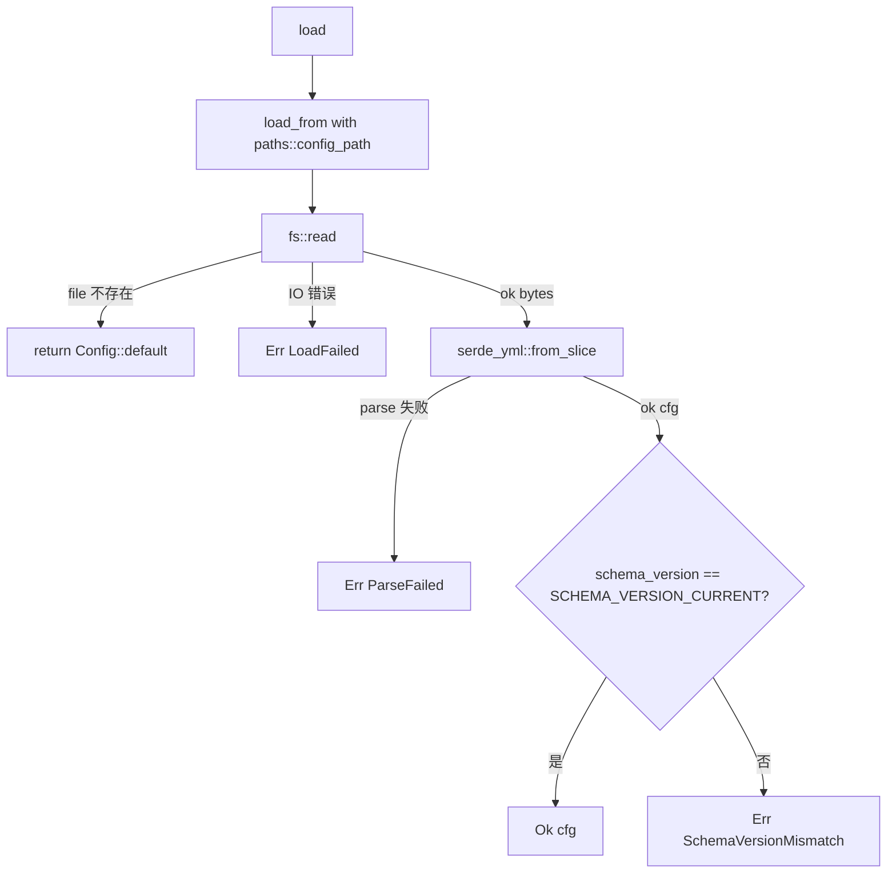
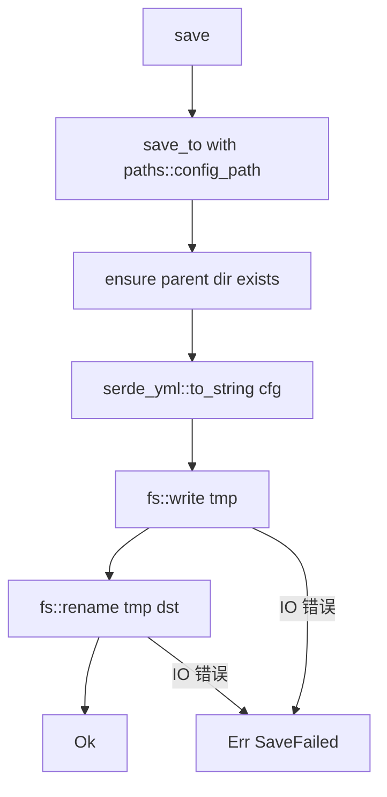

# config-yaml design

## 0. 术语约定

| 术语 | 定义 | 防冲突结论 |
|---|---|---|
| `Config` | 顶层配置 struct，1:1 映射 `~/.roostery/config.yaml`；`#[non_exhaustive]` 6 顶层字段（schema_version / identity / runners / budgets / trace / journal） | 新概念；grep 全仓库无现有 `Config` 类型冲突（lark_cli 模块只有 `RunOptions`） |
| `Identity` | `identity` 子节强类型 struct：`user_id` / `default_chat_id` / `default_task_app_token` 三个 String 字段；不引入 newtype（这些不是飞书侧 token，是用户填的字符串） | 新概念；与 `remoterefs` 的 9 个 newtype token 不混（那些是飞书 API 返回的，这些是用户配置的） |
| `Budgets` | `budgets` 子节：`default: BudgetCfg { max_calls: u32, max_cost_usd: f64 }`；目前只一档 `default`，future-proof 留 BTreeMap 形态 | 新概念；与 Phase 4 dispatcher `budget` 模块字段同名不冲突——Phase 4 用本 schema 反序列化消费 |
| `TraceConfig` | `trace` 子节：`max_depth: u32`（默认 8）；future-proof 单字段也用 struct 包 | 新概念；与 Phase 4 `TraceContext` / `trace_id` 是消费关系不是命名冲突 |
| `JournalConfig` | `journal` 子节：`dir: PathBuf`（默认从 `paths::journal_dir()` 取）+ `rotation: String`（默认 `"daily"`，Phase 1 journal-core 已固化为 daily 行为，本 feature 不消费 rotation 值仅作为配置文件契约保留） | 新概念；与已落地 `crate::journal` 模块是消费关系 |
| `RunnerCfgRaw` | runner 子节占位类型——本 feature **不强类型化** runner，存为 `BTreeMap<String, serde_yml::Value>`；caller（Phase 4 dispatcher-runners）自己 deserialize 子节 | 新概念；与 roadmap §4.6 "加新 runner kind 不动 schema 顶层" 一致 |
| `ConfigError` | thiserror enum `#[non_exhaustive]` 4 变体：LoadFailed / ParseFailed / SaveFailed / SchemaVersionMismatch | 新概念；与 `SmokeError` / `LarkError` / `ShimError` 平行 |
| `SCHEMA_VERSION_CURRENT` | const u32 = 1；Phase 3 唯一支持的 schema_version | 与 `lib.rs::SCHEMA_VERSION` 是另一个常量（后者管 `JournalEntry.schema_version`，本 const 管 `Config.schema_version`，两个 schema 独立 bump） |
| `paths::config_path()` | 新增 fn 返 `~/.roostery/config.yaml`（env override 仍走 `ROOSTERY_HOME` 由 `paths::roostery_home` 透传） | 与已有 `paths::journal_dir` / `paths::smoke_state_path` 同口径 |

参考：`legacy/python/src/roostery/config.py`（106 行）——**仅作 Python YAML 处理 reference**；schema 完全不沿用（Python 版字段 `notify_receive_id` / `daily_report` / `bitable` / `shim` 对应 Phase 6+ 报告 / Phase 7 base index 用，本 feature 走 roadmap §4.6 新设计）。

### 0.1 Rust idiom 杠杆

1. **`serde::Deserialize` + `#[serde(default)]` per-field 给缺字段填默认值**——比 Python 版 `_deep_merge` 手写递归合并简洁；与 roadmap "顶层字段缺失时使用编译期默认值"自然契合
2. **`#[non_exhaustive]` `Config` / `ConfigError`**——同 LarkError / SmokeError 风格；外部 crate 无法 struct-literal 构造（future 加字段不破坏 API）
3. **`#[derive(thiserror::Error)] enum ConfigError`** 4 变体 + `#[from]`——读 / 写 / parse / schema mismatch 分类
4. **`serde_yml` 替代 `serde_yaml`**——后者 2024 起 unmaintained；前者是 maintained fork（drop-in replacement）
5. **atomic write 用 `.tmp` + `std::fs::rename`** ——同 smoke `save_report` / shim 经验

### 0.2 与已落地模块的关系

- **`paths`**：本 feature 扩 `pub fn config_path()`；不动其他
- **`journal`**：`JournalConfig.dir` 字段默认值与 `paths::journal_dir()` 一致；但 journal 模块**不消费本 config**（Phase 1 已落，本 feature 不改动 journal）。consumer 关系延迟到 Phase 4+
- **`lark_cli`**：本 feature 不修改 lark_cli wrapper；`lark_cli/subprocess.rs::ENV_BIN` env 自管，**不**进 config schema
- **`smoke`**：smoke 不消费 config（Phase 3 config 起来后由 `smoke::resolve_binary` 评估是否回落 config——但那是 cs-refactor 候选不在本 feature 范围）
- **`redact`**：config 不含敏感数据（用户填的 chat_id / app_token 是公开标识，不脱敏）。`save` 不调 `redact`

## 1. 决策与约束

### 范围

- 新文件 `crates/roostery/src/config.rs`（档 1 单文件，预估 ~350 行含 inline tests）
- 修改 `crates/roostery/src/lib.rs`——加 `pub mod config;`
- 修改 `crates/roostery/src/paths.rs`——加 `pub fn config_path() -> PathBuf`
- 修改 `Cargo.toml`——加 `serde_yml = "0.0.12"` 依赖（fork 版本号低于 serde_yaml 但 maintained）
- 单元测试 ≥ 8 条：defaults 反序列化 / 完整 YAML 反序列化 / round-trip / atomic save / schema_version 4 路径（missing / =1 / >1 / <1）/ runners 任意子键反序列化

### 明确不做

- **不引 tokio**：config load/save 是同步文件操作，不需要 async；与现有 `paths` / `smoke` 同步风格一致。grep 反向核对：`grep -E "use tokio|tokio::|async fn" config.rs` → 无
- **不实现 `roostery init` 子命令**：写 config 文件、合并 hooks、装 shim 等动作归 `roostery-init` feature。本 feature 只提供 `save` API；caller 才是 init
- **不实现 hooks merge**：归 `hooks-merge` feature
- **不消费 runners 子结构**：本 feature 仅 deserialize 为 `BTreeMap<String, serde_yml::Value>`；具体 RunnerConfig 强类型化归 Phase 4 `dispatcher-runners` feature
- **不读 env override**：与 Python 版 `_apply_env_overrides` 分道——各模块自管 env（lark_cli/subprocess.rs 已自管 `ROOSTERY_LARK_CLI_BIN`，smoke 同理）。grep 反向核对：`grep "env::var\|env_os" config.rs` → 仅在 `paths::config_path` 通过 `roostery_home()` 间接走 `ROOSTERY_HOME`，config.rs 自身不读 env
- **不沿用 Python config.yaml schema**：Python 版字段（notify_receive_id / daily_report / bitable / shim）对应 Phase 6+ / Phase 7 功能，roadmap §4.6 重新设计了顶层结构。grep 反向核对：`grep -E "notify_receive_id|daily_report|bitable" config.rs` → 无
- **不读 Python legacy env**：`FEISHU_HUB_REAL_LARK_CLI` / `FEISHU_NOTIFY_TO` 完全不读
- **不做 schema 自动 migration**：Phase 3 唯一 schema_version=1；future v2 落地时由 `cs-roadmap update` 评估 migration 路径
- **不修改 `legacy/python/`**：frozen
- **不实现 `Config` validation 业务规则**：如 `user_id` 是否合法 open_id 格式、`default_chat_id` 是否真实存在——这是 caller (init / dispatcher) 的责任，config 模块只管"YAML 字符串 ↔ Rust struct"

### 复杂度档位

走默认档位——单 lib 模块 + 同步 IO + serde 序列化。无对外 SDK / 高并发 / size-sensitive 信号。

### 关键决策

| # | 决策 | 内容 | 来源 |
|---|---|---|---|
| D1 | YAML 库选 `serde_yml` | `serde_yaml` 2024 起 unmaintained；`serde_yml` 是主流 maintained fork（drop-in replacement）；版本 `0.0.12` 已稳定 | 用户对齐 |
| D2 | `runners: BTreeMap<String, serde_yml::Value>` 完全开放 | 本 feature 不消费 runners；Phase 4 dispatcher-runners 起来后各 Runner impl 自己 deserialize 子节；最符合 roadmap "加新 runner kind 不动 schema 顶层" 约束 | 用户对齐 |
| D3 | config 加载不动 env override | 各模块自管 env；config 只管文件层。简化 config 边界 | 用户对齐 |
| D4 | schema_version 处理：缺失当 1 / =1 OK / 不等于 1 报 SchemaVersionMismatch | 缺失走默认（roadmap "顶层字段缺失用编译期默认值"）；不等于 1 是显式不兼容报错让 caller 决定 migration | 用户对齐 |
| D5 | atomic write 用 `.tmp` + `std::fs::rename` | 同 smoke `save_report` / shim 经验；防写半途崩溃 | 项目惯例 |
| D6 | 4 公开 fn：`load` / `load_from(path)` / `save(&cfg)` / `save_to(&cfg, path)` | 两对函数：默认路径走 `paths::config_path()`；带 path 形态测试时清晰 | Rust idiom |
| D7 | `ConfigError` 4 变体：LoadFailed / ParseFailed / SaveFailed / SchemaVersionMismatch | thiserror + `#[non_exhaustive]` + `#[from]`；分类清晰 | 项目惯例（同 LarkError / SmokeError 风格） |
| D8 | 顶层 6 字段全 `#[serde(default)]` | 配合 `impl Default`；任意子集 YAML 都能反序列化（与 roadmap "顶层字段缺失用编译期默认值" 一致） | roadmap §4.6 约束 |
| D9 | `Identity` / `Budgets` / `BudgetCfg` / `TraceConfig` / `JournalConfig` 子 struct 全 `#[non_exhaustive]` | future 加字段不破坏外部 caller 构造；caller 用 `..Default::default()` 模式 | 项目惯例 |
| D10 | `SCHEMA_VERSION_CURRENT: u32 = 1` 模块私有常量 | 与 `lib.rs::SCHEMA_VERSION`（journal 用）独立——两个 schema 独立 bump；不混 | Rust idiom |
| D11 | `paths::config_path()` 返 `roostery_home().join("config.yaml")` | 与 `journal_dir` / `smoke_state_path` 同口径；env override 通过 `ROOSTERY_HOME` 间接生效 | 一致性 |
| D12 | 不在本 feature 暴露 CLI 子命令 | 本 feature 纯 lib；`roostery init` / `roostery config show` 等子命令归后续 feature；main.rs 完全不动 | 范围最小化 |

### 前置依赖

- `rust-scaffold`（done）—— lib crate 骨架就绪
- 隐式：`paths` 模块（已落 Phase 1 journal-core 时一起起）—— 本 feature 扩展它

## 2. 名词与编排

### 2.1 名词层

**现状**：

- `crates/roostery/src/paths.rs` 32-34 行有 `state_dir` / `smoke_state_path`，无 `config_path`
- `crates/roostery/src/lib.rs` 导出 6 个 pub mod（journal / lark_cli / paths / redact / remoterefs / smoke），无 `config`
- `~/.roostery/config.yaml` 路径约定存在于 roadmap §4.6 文档但无代码实现
- `Cargo.toml` 无 YAML 依赖

**变化**：

- 新增 `crates/roostery/src/config.rs`：声明 `Config` + 5 子 struct + `ConfigError` + 4 公开 fn + `SCHEMA_VERSION_CURRENT` 常量
- `paths.rs` 加 `pub fn config_path() -> PathBuf` 返 `roostery_home().join("config.yaml")`
- `lib.rs` 加 `pub mod config;`
- `Cargo.toml` 加 `serde_yml = "0.0.12"`

**公开 API 接口契约**：

```rust
// crates/roostery/src/config.rs

#[derive(Serialize, Deserialize, Debug, Clone, PartialEq, Default)]
#[non_exhaustive]
pub struct Config {
    #[serde(default = "default_schema_version")]
    pub schema_version: u32,
    #[serde(default)]
    pub identity: Identity,
    #[serde(default)]
    pub runners: std::collections::BTreeMap<String, serde_yml::Value>,
    #[serde(default)]
    pub budgets: Budgets,
    #[serde(default)]
    pub trace: TraceConfig,
    #[serde(default)]
    pub journal: JournalConfig,
}

#[derive(Serialize, Deserialize, Debug, Clone, PartialEq, Default)]
#[non_exhaustive]
pub struct Identity {
    #[serde(default)]
    pub user_id: String,
    #[serde(default)]
    pub default_chat_id: String,
    #[serde(default)]
    pub default_task_app_token: String,
}

#[derive(Serialize, Deserialize, Debug, Clone, PartialEq, Default)]
#[non_exhaustive]
pub struct Budgets {
    #[serde(default)]
    pub default: BudgetCfg,
}

#[derive(Serialize, Deserialize, Debug, Clone, PartialEq)]
#[non_exhaustive]
pub struct BudgetCfg {
    pub max_calls: u32,        // 默认 100（impl Default）
    pub max_cost_usd: f64,     // 默认 1.0
}

#[derive(Serialize, Deserialize, Debug, Clone, PartialEq)]
#[non_exhaustive]
pub struct TraceConfig {
    pub max_depth: u32,        // 默认 8（roadmap §4.6）
}

#[derive(Serialize, Deserialize, Debug, Clone, PartialEq)]
#[non_exhaustive]
pub struct JournalConfig {
    pub dir: std::path::PathBuf,   // 默认 paths::journal_dir() 调用时刻
    pub rotation: String,           // 默认 "daily"
}

#[derive(Debug, thiserror::Error)]
#[non_exhaustive]
pub enum ConfigError {
    #[error("config load failed: {source}")]
    LoadFailed { #[from] source: std::io::Error },
    #[error("config parse failed: {source}")]
    ParseFailed { source: serde_yml::Error },
    #[error("config save failed: {source}")]
    SaveFailed { source: std::io::Error },
    #[error("config schema_version mismatch: found {found}, expected {expected}")]
    SchemaVersionMismatch { found: u32, expected: u32 },
}

/// Load config from the default path (`~/.roostery/config.yaml`).
/// Missing file → returns `Config::default()` (caller can `save()` to create).
pub fn load() -> Result<Config, ConfigError>;

/// Load config from a specific path.
pub fn load_from(path: &std::path::Path) -> Result<Config, ConfigError>;

/// Save config to the default path (atomic `.tmp` + rename).
pub fn save(cfg: &Config) -> Result<(), ConfigError>;

/// Save config to a specific path.
pub fn save_to(cfg: &Config, path: &std::path::Path) -> Result<(), ConfigError>;
```

**调用示例**：

```rust
// roostery init 入口
use roostery::config::{self, Config, Identity};
let cfg = Config {
    identity: Identity {
        user_id: "ou_user_123".into(),
        default_chat_id: "oc_chat_abc".into(),
        ..Default::default()
    },
    ..Default::default()
};
config::save(&cfg)?;

// dispatcher 启动读 config
let cfg = config::load()?;
let max_depth = cfg.trace.max_depth;
for (kind, raw) in &cfg.runners {
    // 各 Runner impl 自己 deserialize raw 子节
}
```

**config.yaml 形态**（落盘示例）：

```yaml
schema_version: 1
identity:
  user_id: ou_user_123
  default_chat_id: oc_chat_abc
  default_task_app_token: bascn_app_xyz
runners:
  cc_headless:
    enabled: true
    cli_path: /usr/local/bin/claude-code
    extra_args:
      - --dangerous-permissions
  codex_exec:
    enabled: false
budgets:
  default:
    max_calls: 100
    max_cost_usd: 1.0
trace:
  max_depth: 8
journal:
  dir: /Users/ben/.roostery/journal
  rotation: daily
```

**来源参考**：

- schema：roadmap §4.6 1:1 落地
- Python YAML reference：`legacy/python/src/roostery/config.py:71-105`（`load` / `_deep_merge` / `save`）——Rust 期换 serde + `#[serde(default)]` 替代手写 deep merge
- atomic write：`legacy/python/src/roostery/config.py:97-106` (`save` 用 `os.replace` rename pattern) + Rust 期 smoke / shim 经验

### 2.2 编排层

**现状**：无 config 模块；无 caller 消费 config；`~/.roostery/config.yaml` 不存在（除非用户手动建）。

**变化**：本 feature 落地后形成两条调用路径——

1. **写**：未来 `roostery init`（Phase 3）→ 收集用户输入 → 构造 `Config` → `config::save(&cfg)`
2. **读**：未来 dispatcher / daily_report / 等模块（Phase 4+）→ `config::load()` → 消费各字段

本 feature 不真正消费 config（caller 还没起），但 API 已对外公开。

**主流程图（`config::load`）**：



**`config::save` 流程图**：



**流程级约束**：

- **不变量 1**：`load` 文件不存在不报错——返 `Config::default()`，让 first-run 装机场景能跑（roadmap "顶层字段缺失用默认"语义扩展到"整个文件缺失也用默认"）
- **不变量 2**：atomic save —— 用 `.tmp` 后缀写完 `fs::rename` 替换；不留半文件
- **不变量 3**：schema_version 缺失隐式为 1（`#[serde(default = "default_schema_version")]` 返 1）——roadmap 约束兑现
- **不变量 4**：load 不调 env override；`save` 不脱敏（config 不含 token 类敏感字段）
- **不变量 5**：`Config::default()` 必须是有效可保存的——`save(&Config::default())` 必须成功，反向 `load()` 必须返与原 default 等价的 Config（round-trip）
- **不变量 6**：runners 子键名是开放的——任意字符串都能反序列化为 BTreeMap 子节；本模块不校验 runner kind 合法性（caller 责任）
- **错误语义**：4 类 ConfigError 都实现 Display + thiserror；caller match 决定怎么处理（init 通常重写文件，dispatcher 通常 fatal）

### 2.3 挂载点清单

判据"删了它 feature 是否消失"：

1. **`crates/roostery/src/config.rs` 存在** — 删 → 模块消失 → feature 消失
2. **`pub mod config;` in lib.rs** — 删 → 外部 caller 拿不到 `roostery::config::*` → API 消失
3. **`paths::config_path()` 返 `~/.roostery/config.yaml`** — 路径改名 → caller 找不到文件 → 装机协议破坏
4. **`Cargo.toml` 含 `serde_yml` 依赖** — 删 → 编译失败
5. **`SCHEMA_VERSION_CURRENT = 1`** — 改值 → 已装机用户 config.yaml 失效

5 条 strong mount points，符合 3-5 条上限。

**不列**：`ConfigError` 变体数量、各子 struct 默认值具体数字（`max_calls=100` / `max_cost_usd=1.0` / `max_depth=8`）——内部参数。

### 2.4 推进策略

按 paradigm 维度切片（基础设施 → schema 骨架 → 计算节点 → 持久化 → 集成测试）：

1. **paths 扩 + Cargo.toml + lib.rs**：`paths::config_path()`；`Cargo.toml` 加 `serde_yml = "0.0.12"`；`lib.rs` `pub mod config;`；新建 `src/config.rs` 仅含 `// todo` 占位 + 6 字段 struct 声明 + `impl Default`
   - 退出信号：`cargo build` 成功；`paths::config_path` 单测；既有 testsuite 无回归
2. **schema 强类型化 + #[serde(default)] + ConfigError**：完整 `Config` / `Identity` / `Budgets` / `BudgetCfg` / `TraceConfig` / `JournalConfig` 各 `#[non_exhaustive]` + `impl Default`；`ConfigError` 4 变体；`SCHEMA_VERSION_CURRENT`
   - 退出信号：`Config::default()` 单测；YAML 空字符串 → Config::default() 反序列化单测；完整 YAML round-trip 单测
3. **load / load_from + schema_version 验证**：实现两个 load fn；缺失文件 → default；ParseFailed / SchemaVersionMismatch 分支
   - 退出信号：load 4 路径单测（missing file / valid / parse fail / schema mismatch）
4. **save / save_to + atomic write**：实现两个 save fn；`.tmp` + rename；ensure parent dir
   - 退出信号：save round-trip 单测（save 后立即 load 等价）；atomic 单测（`.tmp` 不残留）；parent dir 自动创建单测
5. **runners 开放结构 + 集成测试**：用 BTreeMap<String, serde_yml::Value> 验证任意 runner 子键能反序列化；写 1-2 集成测试覆盖完整 YAML 文件读写
   - 退出信号：runners 三键混合 YAML 反序列化单测；集成测试通过；`cargo test --all` 全绿
6. **完整验收 + CI**：四命令全绿
   - 退出信号：本地 fmt/clippy/test --all/--doc 四命令全绿；远端 CI 全绿

### 2.5 结构健康度与微重构

**评估对象**：

- **要改的文件**：
  - `Cargo.toml`（+1 行 serde_yml 依赖）—— 健康
  - `lib.rs`（+1 行 pub mod）—— 健康
  - `paths.rs`（80 → ~85 行）—— 仍档 1
- **要落新文件的目录**：`crates/roostery/src/`（现有 redact / journal / remoterefs / paths / smoke / lark_cli/ / bin/）；新增 `config.rs` 进入 lib 模块层

**先查 compound convention**——`.codestable/compound/2026-05-16-decision-rust-module-organization.md`：

- 档 1 单文件 inline pub mod：`< 500 行 + 公开项 ≤ ~8 个`。config.rs 预估 ~350 行（含 inline tests）+ 公开项 ~10 个（Config + 5 子 struct + ConfigError + 4 fn = 11 项）—— **临界**：公开项略超 8 个但都是 schema 子 struct（不独立成模块），符合 single-purpose 单文件场景

**结论**：**本次不做微重构**。

理由：

- config 模块的 11 个公开项里 6 个是 schema 子 struct（Config / Identity / Budgets / BudgetCfg / TraceConfig / JournalConfig），它们逻辑上"属于同一 schema 描述"，拆到子模块反而割裂；与 lark_cli 模块（拆 runner.rs / error.rs / subprocess.rs / mock.rs / journaled.rs）的情形不同——后者是有独立测试价值的实现拆分
- 预估 ~350 行 < 500 阈值
- paths 扩 1 个 fn 是自然增长

**超出范围的观察**（不阻塞本 feature）：

- Phase 4+ caller 消费 config 时若发现"每个 Runner impl 自己 deserialize 子节" 大量重复 → 评估抽 `RunnerConfigCommon` trait（cs-refactor 候选）
- smoke 模块 binary 解析未来加 config fallback（design §4.1 已 flag）

## 3. 验收契约

### 3.1 关键场景清单

#### Schema 反序列化行为

- **S1.1** 空 YAML（`""`）：`serde_yml::from_str("")` → `Config::default()`（所有字段走默认值）
- **S1.2** 完整 YAML（包含 6 顶层字段）：1:1 反序列化为对应 struct 字段值
- **S1.3** 部分字段（如只有 `identity: { user_id: "x" }`）：identity.user_id="x"，其他字段全默认值
- **S1.4** 未知字段：`serde` 默认行为忽略未知字段——未来加字段兼容旧 caller 写的 config
- **S1.5** runners 任意子键：`runners: { foo: {bar: 1}, baz: {qux: "z"} }` → BTreeMap 含两键，子节为 `serde_yml::Value`

#### schema_version 校验

- **S2.1** 缺失：YAML 不含 `schema_version` 字段 → 视为 1，load 成功
- **S2.2** `schema_version: 1`：load 成功
- **S2.3** `schema_version: 2`：`Err(ConfigError::SchemaVersionMismatch { found: 2, expected: 1 })`
- **S2.4** `schema_version: 0`：同 S2.3 报 mismatch（不容忍降级）

#### load API 行为

- **S3.1** 文件不存在：`load_from(&nonexistent)` → `Ok(Config::default())`
- **S3.2** 文件可读 valid YAML：返 `Ok(Config { ... })`
- **S3.3** 文件可读但 YAML 损坏：`Err(ConfigError::ParseFailed { ... })`
- **S3.4** 文件存在但 IO 错误（权限 denied）：`Err(ConfigError::LoadFailed { ... })`
- **S3.5** `load()` 默认路径走 `paths::config_path()` —— `ROOSTERY_HOME` env 覆盖时 load 正确走到 override 路径

#### save API 行为

- **S4.1** 写 Config 到不存在目录：`save_to` 自动创建 parent dir + 写入；`.tmp` 不残留
- **S4.2** Round-trip：`save(&cfg)` 后 `load()` 返与 cfg 等价的 Config
- **S4.3** Default round-trip：`save(&Config::default())` + `load()` → `Config::default()`
- **S4.4** Atomic：模拟写 `.tmp` 后崩溃（手工 rm `.tmp`）→ 原 `config.yaml` 不被破坏
- **S4.5** YAML 输出可读：人类能直接打开 config.yaml 看（不依赖工具）

#### 模块级

- **S5.1** `cargo test --all` 全绿，本 feature 新增测试 ≥ 8 条（unit + integration）
- **S5.2** `cargo test --doc` 全绿
- **S5.3** `cargo clippy --all-targets --all-features -- -D warnings` 通过
- **S5.4** `cargo fmt --all --check` 通过

### 3.2 反向核对项（明确不做的可 grep 验证）

- `grep -E "use tokio|tokio::|async fn" crates/roostery/src/config.rs` → 无
- `grep "FEISHU_HUB_\|FEISHU_NOTIFY_TO" crates/roostery/src/config.rs` → 无
- `grep -E "notify_receive_id|daily_report|bitable" crates/roostery/src/config.rs` → 无（不沿用 Python schema）
- `grep -E "env::var|env_os" crates/roostery/src/config.rs` → 无（config 不读 env，env 通过 paths 间接生效）
- `grep "LarkRunner\|Journaled\|smoke::" crates/roostery/src/config.rs` → 无（不耦合具体 caller）
- `grep "Runner\|Dispatch" crates/roostery/src/config.rs` → 仅 `Runner*` 字段命名（如 `RunnerCfgRaw`）作为类型别名/字段名出现允许，但不实现 Runner trait
- `grep "fn migrate\|fn upgrade" crates/roostery/src/config.rs` → 无（不做 schema migration）
- `wc -l crates/roostery/src/config.rs` → < 500（档 1 阈值；预估 ~350）

## 4. 与项目级架构文档的关系

**本 feature 提炼回 architecture 的内容**：

- **名词**：`Config` 顶层 + 5 子 struct + `ConfigError` + `ROOSTERY_HOME` 间接生效路径 → ARCHITECTURE.md §2 术语表加 Config 词条 + `paths::config_path` 路径约定
- **架构归并**：§3 Module D 加 config 子节描述（schema 6 字段 / serde_yml lib / atomic save / schema_version=1 公开承诺 / runners 开放结构 / 与 Phase 4 dispatcher caller 关系）+ 子 feature 列表标 done
- **§4 跨模块接口契约**：roadmap §4.6 Config schema 是 Phase 3 落地——acceptance 时把 §4.6 标 "Phase 3 已落地（feature `2026-05-17-config-yaml`）"
- **§5 关键架构决定补充**：可能加一条"Config schema 顶层字段全 `#[serde(default)]`；runners 子节走 `BTreeMap<String, Value>` 开放结构"——acceptance 评估是否值得入 §5（一般 schema 设计不入 §5，可能只更新 §3 Module D 就够）

**关联的已有架构 doc**：

- `.codestable/architecture/ARCHITECTURE.md` — acceptance 按上述更新 §2 / §3 Module D / §4.6 状态
- `.codestable/requirements/agent-work-in-feishu.md` — 本 feature 兑现 req 的"用户身份 / 默认群配置"维度；acceptance 加变更日志 + `implemented_by` 加本 feature
- `.codestable/roadmap/rust-rewrite/rust-rewrite-items.yaml` — `config-yaml` status `in-progress` → `done`
- `.codestable/roadmap/rust-rewrite/rust-rewrite-roadmap.md` §3 第 8 项 — status `planned` → `done`
- `.codestable/compound/` — 无新 decision 候选；serde_yml 选型是 tech-stack 但已被 rust-module-organization 决策档 1 覆盖

### 4.1 后续观察（不阻塞本 feature）

- **smoke 模块 binary 解析加 config fallback**：smoke 现在仅 `ROOSTERY_LARK_CLI_BIN` env > default；Phase 3 config 起来后可在 caller 层（init / smoke wrapper）拿到 `cfg.shim.real_lark_cli` 当 fallback。**本 feature 不预实现**——是 caller 集成时机
- **runners 强类型化**：Phase 4 `dispatcher-runners` 起来时设计 `RunnerConfig` trait / 共用基类；本 feature 留 `BTreeMap<String, serde_yml::Value>` 占位
- **schema_version 升级路径**：v2 落地时需 `cs-roadmap update`；本 feature `SchemaVersionMismatch` 错误变体已留钩子
- **JournalConfig.rotation 字段**：本 feature 反序列化但**不消费**（journal-core 硬编码 daily rotation）；Phase 1+ 重新评估时由 journal 模块决定是否切到 config 驱动
- **env 覆盖跨模块归并**：未来如发现 `ROOSTERY_LARK_CLI_BIN` / `ROOSTERY_HOME` / 等 env 散落多处难维护 → cs-refactor 候选抽公共 module
