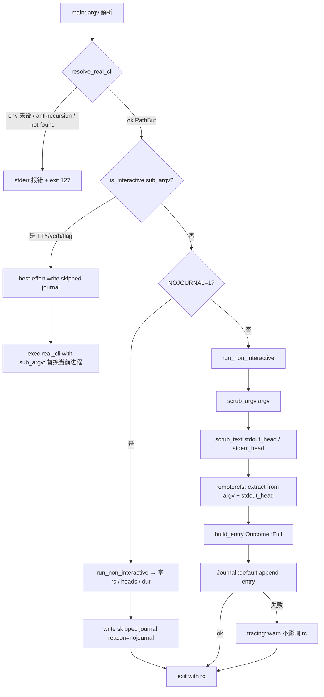
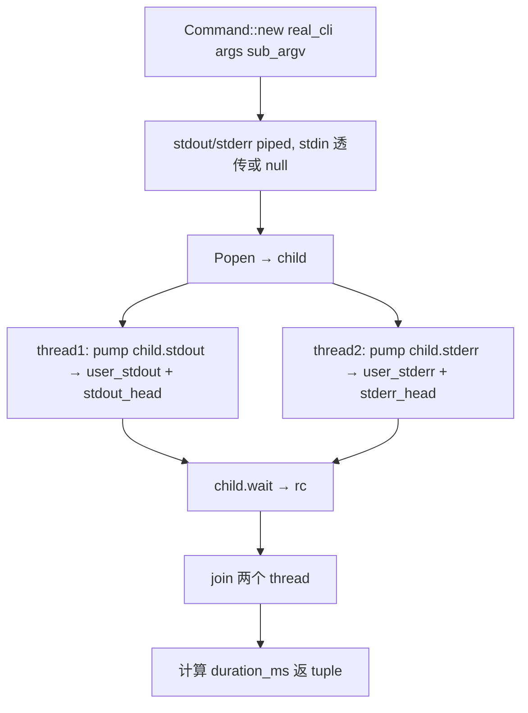

# lark-cli-shim design

## 0. 术语约定

| 术语 | 定义 | 防冲突结论 |
|---|---|---|
| `shim` 二进制 | 装到 `~/.local/bin/lark-cli` 的 PATH-prefix 透传工具，截获 agent runtime 对 `lark-cli` 的调用并写 journal | attention.md 已述（"命令与脚本陷阱" 节）；grep 全仓库新建二进制无冲突 |
| `real lark-cli` | 真 lark-cli 二进制路径（如 `/usr/local/bin/lark-cli`）；shim 通过 `execv` 或 `Popen` 委托给它执行 | 不在代码里命名常量；仅在 doc / env 名出现 |
| `ROOSTERY_REAL_LARK_CLI` | env 变量，shim 启动读取拿 real lark-cli 路径；不设则报错退 127 | 新增；Roostery prefix 与 `ROOSTERY_HOME` / `ROOSTERY_LARK_CLI_BIN` 同口径。不读 Python legacy `FEISHU_HUB_REAL_LARK_CLI` |
| `ROOSTERY_NOJOURNAL` | env 变量，设为 `1` 时 shim 不写 journal entry（用于 sensitive 一次性手工调用） | 新增；Roostery prefix。不读 Python legacy `FEISHU_HUB_NOJOURNAL` |
| Interactive 直通路径 | 检测到 TTY / 命中 interactive_verb / 含 `--interactive`/`-i`/`--repl` flag → `execv` 直接替换当前进程为 real lark-cli（不再有 Rust 进程，不写完整 journal entry，仅写一条 "skipped: interactive" 记录） | 新概念；下游 caller 无冲突 |
| Streaming pump | 非交互路径下两个 `std::thread::spawn`，每个从 child stdout/stderr 读取 4 KiB chunks，同步 tee 到用户的 stdout/stderr + head buffer（capped） | 新概念；与 `tokio::io::copy` 模型不同（同步阻塞 + tee 双写）|
| Head buffer | 流式读取过程中保留的前 N 字节副本，写入 JournalEntry params 用于事后审计。默认 stdout 64 KiB / stderr 16 KiB | 新概念 |
| Anti-recursion check | shim 启动时校验 `canonicalize(real_cli) != canonicalize(current_exe)`，防止 real_cli 指向 shim 自己导致无限递归 | Python parity；shim 装机方向决定的必要校验 |

参考：`legacy/python/src/roostery/shim.py`（行为 reference，238 行；envelope V2 schema 不沿用——按 JournalEntry §4.2 11 字段映射）。

### 0.1 Rust idiom 杠杆（不只是 Python parity）

参考 lark-cli-wrapper / core-remoterefs 第 0.1 模式。本 feature 在 Python `shim.py` 之上借 Rust 拉这些杠杆：

1. **同步 std::thread + std::process 取代 Python threading + Popen**——shim 是单次进程 + 2 流 + 退出的"shell 工具"，不需要 tokio runtime（启动开销大、二进制大、不 stream 任何东西）。`std::thread::spawn` + `std::io::copy` 100 行可读
2. **`std::os::unix::process::CommandExt::exec()` 替代 Python `os.execv`**——Rust 标准库直接提供，不引 `nix` crate
3. **`std::io::IsTerminal` (since 1.70 stable)**——TTY 检测内置标准库，不引 `atty` / `is-terminal` crate
4. **`#[derive(thiserror::Error)] enum ShimError`** 归一化失败路径（real cli 未配置 / anti-recursion 命中 / binary not found），caller match 具体变体处理；不混 `String` 错误信息
5. **anti-recursion 用 `std::fs::canonicalize` + `std::env::current_exe()`**——Rust 标准库直接拿，不需要 readlink C call

### 0.2 与已落地模块的关系

- **journal**：shim 调 `Journal::default()` + `JournalEntry::new("shim", action)` + `journal.append`；schema_version=1 保持
- **redact**：argv 过 `redact::scrub_argv`；stdout_head/stderr_head 过 `redact::scrub_text`
- **remoterefs**：stdout_head（lossy UTF-8 decode 后）过 `remoterefs::extract` 抽 9 个 token，结果塞 params.remote_refs 子对象
- **lark_cli (LarkRunner)**：**shim 不调 LarkRunner trait** —— 见 §1 D2 决策。两者 I/O 模型不同（streaming tee vs buffered Value）
- **paths**：不直接使用（journal 内部已用）；shim 只关心 real lark-cli 路径（env）和自己的 current_exe

## 1. 决策与约束

### 范围

- 新文件 `crates/roostery/src/bin/shim.rs`（**新增 bin target**，同 crate 复用 journal/redact/remoterefs 模块）
- `Cargo.toml` 加 `[[bin]] name = "shim" path = "src/bin/shim.rs"`
- 不新增 Cargo 依赖（std + 现有的 serde_json / chrono / thiserror 已够；tracing 也已经在）
- 单元测试 ≥ 8 条，覆盖 is_interactive truth table / anti-recursion / NOJOURNAL / TTY 直通路径写 skipped journal / 非交互路径完整 journal entry / pump 流式正确 tee + head cap
- 集成测试 ≥ 2 条，用 fixture script 验端到端（shim 调真 fixture → journal 文件内容正确 + exit code 透传）

### 明确不做

- **不引 tokio**：shim 是同步工具，`std::thread` + `std::process::Command` 够用；引 tokio 拉 800 KB+ 二进制大小（用户每次 `lark-cli` 都启动 shim，启动开销敏感）
- **不调 LarkRunner trait**：LarkCli 用 `wait_with_output` 一次性 buffer 全 stdout 解析为 `serde_json::Value`；shim 必须流式 tee 给用户 stdout/stderr（`lark-cli docs +download large-file` 等场景）。两者 I/O 语义根本不同；混用就要破坏 LarkRunner 契约。grep 反向核对：`grep "LarkRunner\|LarkCli\|Journaled" crates/roostery/src/bin/shim.rs` → 无
- **不读 Python legacy env**：`FEISHU_HUB_REAL_LARK_CLI` / `FEISHU_HUB_NOJOURNAL` 一次切口径到 `ROOSTERY_*`。grep 反向核对：`grep "FEISHU_HUB_" crates/roostery/src/bin/shim.rs` → 无运行时引用
- **不读 Config 文件**：Phase 3 `config-yaml` 未起；shim 仅靠 env。Phase 3 落地后由 `roostery init` 写 env wrapper script 注入或别的桥接方式，**不由 shim 直接读 config.yaml**
- **不自实现 interactive verbs 配置**：硬编码最小集合 `["auth"]`（覆盖 `lark-cli auth login` 这一主流交互场景）；Phase 3 config 可扩。grep 反向核对：`grep "INTERACTIVE_VERBS" crates/roostery/src/bin/shim.rs` → 1（常量定义）
- **不做 retry / backoff / 错误恢复**：shim 透传 exit code；real lark-cli 怎么退就怎么退；shim 自己只在 setup 阶段（config / spawn）失败时退 127
- **不解析 stdout JSON**：shim 不 parse；只 tee 字节 + head buffer 抽 remote_refs（remoterefs 内部自己 try parse 失败返默认）
- **不实现 stderr 转 structured log**：stderr 原样 tee 给用户 stderr；head buffer 写 journal
- **不修改 lark-cli wrapper 模块**：lark_cli/ 不动；shim 是另一条独立 caller 路径
- **不实现 install/uninstall 自身**：装机走 Phase 3 `roostery init`；shim 二进制路径硬编码 `~/.local/bin/lark-cli` 是 attention.md 约定而非 shim 自己 enforce
- **不修改 `legacy/python/`**：frozen

### 复杂度档位

走默认档位——独立二进制 + 标准 Rust 工程。同步 IO + 流式 tee 是 shim 类工具的常见形态，不构成偏离。

### 关键决策

| # | 决策 | 内容 | 来源 |
|---|---|---|---|
| 1 | I/O 模型：std::thread + std::process 同步 | 2 个 pump thread（stdout / stderr）从 child read 4 KiB chunks → tee 到用户流 + head buffer；wait 子进程；同步阻塞 | 用户对齐；shim 启动 / 二进制大小敏感 |
| 2 | **不调 LarkRunner trait** | LarkCli 是 buffered Value 模型，shim 是 streaming bytes 模型；语义不同。共享 journal/redact/remoterefs 模块直接调即可 | I/O 语义根本差异；架构清晰 |
| 3 | binary 在同 crate `bin/shim.rs` | 自动继承 deps（tokio etc.）但不主动使用；模块复用零成本 | 用户对齐 |
| 4 | real lark-cli 路径仅读 env `ROOSTERY_REAL_LARK_CLI` | 不设则 fail（127）"shim: ROOSTERY_REAL_LARK_CLI not set; run `roostery init`"；Phase 3 后由 init 写 env wrapper | 用户对齐；Phase 边界 |
| 5 | Interactive 检测三段式 | (a) `std::io::IsTerminal` 检 fd 0/1/2 任一是 TTY；(b) argv[0] in `INTERACTIVE_VERBS = ["auth"]`（硬编码最小集）；(c) argv 含 `--interactive` / `-i` / `--repl` flag | Python parity（简化版）|
| 6 | Interactive 走 `std::os::unix::process::CommandExt::exec()` | execve 替换当前进程；不返回；调用前 best-effort 写一条 "skipped: interactive" journal 记录 | Python parity + Rust std 直供 |
| 7 | Anti-recursion 用 `canonicalize` | `canonicalize(real_cli) == canonicalize(current_exe())` → 报错退 127 "real_lark_cli resolves to shim itself; abort" | Python parity；防误装 |
| 8 | NOJOURNAL env：`ROOSTERY_NOJOURNAL=1` 跳过 journal 写入 | 仍写一条 "skipped: nojournal" 标记记录（debug 用：知道有调用发生但故意没记完整 entry）。其他值 / 未设 = 写完整 entry | Python parity；Roostery prefix |
| 9 | Head buffer caps 硬编码 | stdout 64 KiB / stderr 16 KiB；超出部分继续 tee 给用户但不进 head buffer。常量 `STDOUT_HEAD_CAP` / `STDERR_HEAD_CAP` 模块私有 | Python parity（其 config 默认值）|
| 10 | JournalEntry 字段映射 | `source = "shim"` / `action = format!("lark-cli:{}", sub_argv.first().unwrap_or(&""))` / `params = json!({argv: scrubbed, cwd, stdin_present, stdout_head: scrubbed, stderr_head: scrubbed, remote_refs: extracted})` / `result = Ok { value: extracted_remote_refs as Value } if rc==0 else Err { kind: "NonZeroExit", message: <stderr head summary> }` / `duration_ms` | 用户对齐：仅填 11 字段 + extras 进 params；不 bump schema_version |
| 11 | Skipped 记录形态 | TTY 直通 / NOJOURNAL 路径写：`source="shim"` / `action="lark-cli:{verb}:skipped"` / `params = json!({argv: scrubbed, reason: "interactive" | "nojournal"})` / `result = Ok { value: Null }` / `duration_ms = 0`。**不**新增 schema 字段 | Python parity 语义（"知道发生了"）+ Rust schema 约束 |
| 12 | `ShimError` 用 thiserror 归一化 | 4 变体：`MissingRealCli` / `Recursion { real, shim }` / `RealCliNotFound { path }` / `JournalFailed { source }`（journal 失败也 warn + 继续，不让 shim 跟着退）| Rust idiom；不混 String 错误 |
| 13 | 失败语义：setup 失败 → exit 127，real cli 失败 → 透传 exit code | shim 透明性：用户视角看 `lark-cli xxx` 退什么码就是 real lark-cli 退什么码；shim 自己的失败用 127 区别开（127 = POSIX "command not found" 类语义） | Python parity；transparent shim 是核心契约 |

## 2. 名词与编排

### 2.1 名词层

**现状**：`crates/roostery/src/bin/` 目录不存在；`Cargo.toml` 只声明 `roostery` 主 bin target（`src/main.rs`）。无 shim 类二进制；attention.md 描述的 `~/.local/bin/lark-cli` shim 是装机约定但 Rust 期未实现。

**变化**：

- 新增 `crates/roostery/src/bin/shim.rs`（Rust 标准 `src/bin/<name>.rs` 自动作为 bin target，Cargo 自动发现；可选显式 `[[bin]]` 段更清晰）
- `Cargo.toml` 加 `[[bin]] name = "shim" path = "src/bin/shim.rs"`（显式声明 + 名字稳定）
- 无 `lib.rs` 改动（shim 是 bin 不是 lib export）
- 无新 Cargo 依赖

**公开 API 接口契约**：

shim 是二进制不是库 —— 公开面是**命令行行为**而非 Rust 函数签名。"接口"按行为契约写：

```text
# 调用形态
$ ROOSTERY_REAL_LARK_CLI=/usr/local/bin/lark-cli ~/.local/bin/lark-cli im +messages-send --text hi
                                                                              ^^^^^^^^^^^^^^^^^^^^^^
                                                                              sub_argv = argv[1..]

# 行为契约
1. shim 透明：用户视角看到的 stdout/stderr 字节 == real lark-cli 输出（流式）
2. exit code 透传：real lark-cli rc 是几，shim 就退几（仅 setup 失败用 127）
3. journal 副作用：每次调用写一条 JournalEntry 到 ~/.roostery/journal/YYYY-MM-DD.jsonl
   （除非 NOJOURNAL=1 或走 interactive 直通；这两种情况写一条 "skipped" entry）
4. interactive 直通：TTY / verb / flag 命中 → execv 替换为 real lark-cli（不再有 Rust 进程）
```

**内部辅助类型**（私有，仅本文件可见）：

```rust
// crates/roostery/src/bin/shim.rs

use thiserror::Error;
use std::path::PathBuf;

const ENV_REAL_CLI: &str = "ROOSTERY_REAL_LARK_CLI";
const ENV_NOJOURNAL: &str = "ROOSTERY_NOJOURNAL";
const INTERACTIVE_VERBS: &[&str] = &["auth"];
const STDOUT_HEAD_CAP: usize = 64 * 1024;  // 64 KiB
const STDERR_HEAD_CAP: usize = 16 * 1024;  // 16 KiB

#[derive(Debug, Error)]
enum ShimError {
    #[error("ROOSTERY_REAL_LARK_CLI not set; run `roostery init`")]
    MissingRealCli,
    #[error("real_lark_cli ({real:?}) resolves to shim itself ({shim:?}); abort to prevent recursion")]
    Recursion { real: PathBuf, shim: PathBuf },
    #[error("real_lark_cli not found: {path:?}")]
    RealCliNotFound { path: PathBuf },
}

/// 解析 real lark-cli 路径，做 anti-recursion 校验。
fn resolve_real_cli() -> Result<PathBuf, ShimError>;

/// 判定是否走 interactive 直通。
fn is_interactive(sub_argv: &[String]) -> bool;

/// 非交互路径主流程，返 (exit_code, stdout_head, stderr_head, duration_ms)。
fn run_non_interactive(
    real_cli: &Path,
    sub_argv: &[String],
) -> std::io::Result<(i32, Vec<u8>, Vec<u8>, u64)>;

/// 构造 JournalEntry（完整 / skipped 两种形态）。
fn build_entry(
    sub_argv: &[String],
    outcome: Outcome,
) -> JournalEntry;

enum Outcome {
    Full {
        rc: i32,
        stdout_head: Vec<u8>,
        stderr_head: Vec<u8>,
        duration_ms: u64,
        stdin_present: bool,
    },
    Skipped { reason: &'static str },
}

fn main() -> std::process::ExitCode;
```

来源参考：

- 整体流程：`legacy/python/src/roostery/shim.py:178-234` (`main`)
- TTY/interactive 检测：`shim.py:26-43` (`is_interactive`)
- anti-recursion：`shim.py:46-62` (`resolve_real_cli`)
- 2 pump 线程：`shim.py:78-91` (`_pump`) + `:117-138` (`run_non_interactive`)
- envelope build：`shim.py:143-175` (`build_record`)——映射到 JournalEntry 11 字段时按 §1 D10/D11 重新组织

### 2.2 编排层

**现状**：无 shim 调用路径；agent runtime（CC / Codex）直接调真 `lark-cli`，不写 Roostery journal。

**变化**：装机后（Phase 3 `roostery init`）agent runtime 调 `lark-cli` 命中 PATH 上 `~/.local/bin/lark-cli` = shim 二进制；shim 走下面主流程；最终 exec / 透传 real lark-cli。

**主流程图**：



**`run_non_interactive` 内部流程**：



**`pump` 实现行为**（每个 thread 一个）：

```rust
// 伪代码
loop {
    let chunk = src.read(4096)?;  // 阻塞读
    if chunk.is_empty() { break; }  // EOF
    let _ = dst.write_all(&chunk);  // 透传给用户（用户管道断了忽略）
    let _ = dst.flush();
    if head.len() < cap {
        let take = cap - head.len();
        head.extend_from_slice(&chunk[..chunk.len().min(take)]);
    }
}
```

**流程级约束**：

- **不变量 1**：透明性——用户视角 `lark-cli ...` stdout/stderr 字节 = real lark-cli 输出；shim 不修改不缓冲（除 head buffer 副本）
- **不变量 2**：exit code 透传——real lark-cli rc 是几，shim 退几；shim 自己 setup 失败用 127
- **不变量 3**：interactive 直通用 `exec()` 替换当前进程——不返回；any code after `exec()` call site is dead unless exec fails
- **不变量 4**：anti-recursion 在 `resolve_real_cli` 内强制——`canonicalize` 后比较；命中即 fail，不继续
- **不变量 5**：NOJOURNAL 路径仍跑 real lark-cli + tee（用户看到 stdout/stderr）；只跳过 journal 写完整 entry，但写一条 skipped 标记
- **不变量 6**：journal 写失败 `tracing::warn!` 不影响 exit code（与 Journaled 装饰器同口径）
- **不变量 7**：pump thread 对用户 stdout/stderr 写入失败（管道断了）silent 吞掉（`let _ =`），不让 broken pipe 终止 shim
- **不变量 8**：head buffer 超 cap 后**继续 tee** 给用户但停止扩展 head——transparency 优先于 journal 完整性
- **错误语义**：4 类 `ShimError` setup 错 → stderr "[roostery] {err}" + exit 127；real lark-cli 任何退码透传

### 2.3 挂载点清单

判据"删了它 feature 是否消失"：

1. **`crates/roostery/src/bin/shim.rs` 存在** — 删 → bin 不存在 → feature 消失
2. **`crates/roostery/Cargo.toml` 含 `[[bin]] name = "shim"` 段** — 删 → cargo 不构建 → feature 消失
3. **shim main 调用了 `journal::Journal` / `redact::scrub_argv` / `remoterefs::extract`** — 任一删 → journal 集成 / 脱敏 / token 抽取消失，shim 退化为纯透传无审计价值
4. **`ENV_REAL_CLI = "ROOSTERY_REAL_LARK_CLI"` 字符串常量** — 改名 → 装机协议破坏，所有装好 shim 的用户失效
5. **`std::os::unix::process::CommandExt::exec()` 调用存在于 interactive 路径** — 删 → interactive 不直通 / 退化为 wait（TTY 类调用如 `auth login` 卡住）

5 条 strong mount points，符合 3-5 条上限。

**不列**：`INTERACTIVE_VERBS` 内容、head buffer cap 数值、`ShimError` 变体数量——这些是内部调节参数。

## 2.4 推进策略

按 paradigm 维度切片（bin target → 类型骨架 → 核心子函数 → 整合 + 集成测试）：

1. **bin target + 骨架**：建 `crates/roostery/src/bin/shim.rs`（仅 `fn main() -> ExitCode { ExitCode::SUCCESS }` 占位）；`Cargo.toml` 加 `[[bin]] name = "shim" path = "src/bin/shim.rs"`
   - 退出信号：`cargo build --bin shim` 成功；`./target/debug/shim` 跑通退 0
2. **`ShimError` + `resolve_real_cli` + anti-recursion + 类型骨架**：声明 `ShimError` 4 变体 + 常量 + `resolve_real_cli` 实现（env 读 + canonicalize + 比对）+ 其他 fn 签名 todo!()
   - 退出信号：resolve_real_cli 单测覆盖 4 错误路径 + happy path（valid env + 真实可执行 fixture）
3. **`is_interactive` + `Outcome` + `build_entry`**：is_interactive 三段式判定；build_entry 两种形态（Full / Skipped）；都是纯函数易测
   - 退出信号：is_interactive truth table（TTY / verb / flag / 都不命中）测试 + build_entry 输出 schema 字段对齐 §4.2 测试
4. **`run_non_interactive` 流式 pump**：std::process::Command + 2 thread + head buffer cap；用伪 binary fixture（同 lark_cli/subprocess 模式）测端到端
   - 退出信号：pump 测试覆盖 happy / 超 cap / broken-pipe-tolerant / exit code 透传
5. **`main` 整合 + 集成测试**：main 把所有片段串起来；写 2 个集成测试（`crates/roostery/tests/shim_integration.rs`）：(a) 非交互路径写 journal 文件内容验证；(b) NOJOURNAL=1 路径写 skipped entry
   - 退出信号：集成测试全过；本地 cargo test --all 全绿
6. **集成验证**：`cargo test --all + cargo test --doc + cargo clippy --all-targets --all-features -- -D warnings + cargo fmt --all --check` 四命令全绿；推 CI 验三 job
   - 退出信号：本地四命令全绿；远端 CI 全绿

### 2.5 结构健康度与微重构

**评估对象**：

- **要改的文件**：`crates/roostery/Cargo.toml`（+5 行 `[[bin]]` 段）—— 无健康度问题
- **要落新文件的目录**：`crates/roostery/src/bin/`（**新建子目录**；目前不存在）

**先查 compound convention**——`.codestable/compound/2026-05-16-decision-rust-module-organization.md`：

- 档 1 单文件 inline → 不适用（bin 是另一种目标）
- 档 2 子目录 + mod.rs → 不适用（bin/ 是 Cargo 约定不是 mod.rs 模式）
- 档 3 独立 crate → 也不适用（用户明确选 bin target 在同 crate）

**这是 compound convention 未直接覆盖的第 4 类**：**Cargo bin target**（`src/bin/<name>.rs` 自动发现 + 同 crate 复用 lib 模块）。本 feature 是项目首个走这条路径的 feature。

**结论**：**本次不做微重构**——直接走 Cargo 约定的 `src/bin/shim.rs` 单文件 bin target。

理由：

- shim 预估代码量 ~250 行（含 inline tests）+ 集成测试单独 `tests/shim_integration.rs` ~100 行；单文件足够
- `src/bin/` 是 Cargo 标准约定，未来加 `bin/anything_else.rs` 自动 work；不需要 mod.rs
- 与现有 `src/main.rs`（roostery 主 bin）+ 即将出现的 `src/bin/shim.rs` 形态自然 —— 用户调 `roostery` 是 lib-style CLI，调 `lark-cli`（shim 装名）是 transparent wrapper；两种 bin 职责完全不同

**建议沉淀的 convention**（implement 跑通后 acceptance 评估是否走 cs-decide）：

> **Cargo bin target 组织约定（暂定）**：
> - 主程序 bin（用户面 CLI）：`src/main.rs`，与 lib 同名（Cargo 默认）
> - 辅助 bin（shim / 安装钩子 / 工具脚本）：`src/bin/<name>.rs`，Cargo 自动发现 + 显式 `[[bin]]` 段稳定名字
> - 当一个 bin 预估 > 500 行 或 内部模块化需求显著 → 升级到 `src/bin/<name>/main.rs` + 子模块（仍同 crate）
> - 当一个 bin 不需要 lib deps（如 tokio）且二进制大小敏感 → 独立 workspace crate

这条暂定 convention 由 acceptance 时评估是否走 `cs-decide convention` 归档（同 rust-module-organization 决策风格，扩展第 4 档）。**design 阶段不直接归档**——方案还没真跑过，留钩子给 implement 后再决定。

**超出范围的观察**（不阻塞本 feature）：

- shim 不引 tokio 但同 crate 已经 transitively 引入 tokio（lark_cli wrapper 用）—— shim 二进制 size 会因此包含 tokio 运行时代码（但 LTO 应该能 strip dead code）。**若 Phase 3 后真实测得 shim binary > 5 MB**，再评估走档 3 独立 crate

## 3. 验收契约

### 3.1 关键场景清单（输入 / 触发 → 期望可观察结果）

#### Setup 失败路径

- **S1.1** env 未设：`ROOSTERY_REAL_LARK_CLI` 未设 → shim 退 127 + stderr 含 "ROOSTERY_REAL_LARK_CLI not set"
- **S1.2** real cli 不存在：env 指 `/nonexistent/lark-cli` → 退 127 + stderr 含 "real_lark_cli not found"
- **S1.3** anti-recursion：env 指向 shim 自己（创建 symlink fixture 让 canonicalize 同路径）→ 退 127 + stderr 含 "resolves to shim itself"

#### Interactive 直通路径

- **S2.1** TTY 检测：mock stdin/stdout/stderr 任一为 TTY → `is_interactive` 返 true（用 `IsTerminal` trait 测试）
- **S2.2** Verb 命中：`sub_argv = ["auth", "login"]` → `is_interactive` 返 true
- **S2.3** Flag 命中：`sub_argv = ["any", "--interactive"]` / `["any", "-i"]` / `["any", "--repl"]` 三种都返 true
- **S2.4** 都不命中：`sub_argv = ["im", "+messages-send"]` + 无 TTY → 返 false
- **S2.5** Interactive 路径写 "skipped: interactive" journal entry（不写完整 entry）—— 单测 build_entry 输出形态

#### 非交互流式 pump 路径

- **S3.1** Happy path：fixture script `echo hello && echo error >&2 && exit 0` → 用户 stdout 收到 "hello\n"，stderr 收到 "error\n"，shim 退 0，journal entry result==Ok
- **S3.2** Exit code 透传：fixture `exit 42` → shim 退 42，journal entry result==Err kind="NonZeroExit"
- **S3.3** Head buffer cap：fixture 输出 200 KiB stdout → 用户收到 200 KiB（不被截断），journal entry params.stdout_head 仅 64 KiB
- **S3.4** Broken pipe tolerance：模拟用户 stdout closed 后 pump 不 panic / 不阻塞（这条难直接测，间接靠"pump 写 dst 用 `let _ =`"+ code review 守护）

#### NOJOURNAL 路径

- **S4.1** `ROOSTERY_NOJOURNAL=1` + 非交互 → 仍跑 real lark-cli + tee 给用户，journal 文件含一条 action 后缀 ":skipped" / params.reason="nojournal" 的 entry
- **S4.2** `ROOSTERY_NOJOURNAL=0` 或未设 → 写完整 entry（确认 env 解析仅识别 "1"）

#### Journal entry 形态（schema 锁定）

- **S5.1** 完整 entry：source="shim"；action="lark-cli:{argv[0]}"；params 含 argv（已脱敏） + cwd + stdin_present + stdout_head（已脱敏） + stderr_head（已脱敏） + remote_refs（remoterefs extract 结果）；result Ok(remote_refs as Value) / Err(NonZeroExit, message)；duration_ms > 0；schema_version==1
- **S5.2** Skipped entry：source="shim"；action="lark-cli:{argv[0]}:skipped"；params 含 argv + reason；result Ok(Null)；duration_ms==0
- **S5.3** Empty argv 边界：`sub_argv = []`（直接调 shim 不带参数）→ action="lark-cli:<empty>"；不 panic

#### Redact / remoterefs 集成

- **S6.1** argv 含 sensitive：`["im", "--access-token", "xyz", "send"]` → journal params.argv 第 3 项是 "***"
- **S6.2** stdout 含 message_id：fixture echo `{"data":{"message_id":"om_abc"}}` → journal params.remote_refs.message_id == "om_abc"
- **S6.3** stdout 含 sensitive 字符串：`{"access_token":"secret"}` → journal params.stdout_head 经过 scrub_text，"secret" 不出现

#### 模块级

- **S7.1** `cargo test --all` 全绿，本 feature 新增测试 ≥ 10 个（unit + integration）
- **S7.2** `cargo test --doc` 全绿（不引入新 doctests，shim 是 bin 不是 lib doc）
- **S7.3** `cargo clippy --all-targets --all-features -- -D warnings` 通过
- **S7.4** `cargo fmt --all --check` 通过
- **S7.5** 架构红线守护：`grep "LarkRunner\|LarkCli\|Journaled" crates/roostery/src/bin/shim.rs` → 无（shim 不调 LarkRunner trait，I/O 模型不同）

### 3.2 反向核对项（明确不做的可 grep 验证）

- `grep -E "use tokio|tokio::|#\[tokio::main\]" crates/roostery/src/bin/shim.rs` → 无（不引 tokio 到 shim；同 crate 传递依赖在不一样）
- `grep "LarkRunner\|LarkCli\|Journaled" crates/roostery/src/bin/shim.rs` → 无（不复用 LarkRunner 路径）
- `grep "FEISHU_HUB_" crates/roostery/src/bin/shim.rs` → 无运行时引用（注释里描述可以）
- `grep -E "use nix|nix::|use libc|libc::" crates/roostery/Cargo.toml` → 无新增（不引 nix / libc；用 std::os::unix）
- `grep "Config\|cfgmod\|toml::" crates/roostery/src/bin/shim.rs` → 无（不读 Config）
- `grep -E "fn retry|retries|backoff" crates/roostery/src/bin/shim.rs` → 无（不重试）
- `grep -E "serde_json::from_str|::from_slice" crates/roostery/src/bin/shim.rs` → 无（不 parse stdout JSON；remoterefs 内部 try parse 那是它的事）
- `grep -c "#\[non_exhaustive\]" crates/roostery/src/bin/shim.rs` → 0 OR ≥ 1（ShimError 是否加 non_exhaustive 由 implement 自决——shim 是 bin 不是 lib，错误类型不对外暴露，加不加 non_exhaustive 都行）
- `grep "INTERACTIVE_VERBS" crates/roostery/src/bin/shim.rs` → 1（常量定义；硬编码集合）
- `grep "STDOUT_HEAD_CAP\|STDERR_HEAD_CAP" crates/roostery/src/bin/shim.rs` → 各 1（head cap 常量）
- 反向核对：`Cargo.toml` `[[bin]] name = "shim"` 段存在
- `wc -l crates/roostery/src/bin/shim.rs` → < 400（compound convention 档 1 单文件阈值；预估 ~250）

## 4. 与项目级架构文档的关系

**本 feature 提炼回 architecture 的内容**：

- **名词**：`shim` 二进制 + `ROOSTERY_REAL_LARK_CLI` / `ROOSTERY_NOJOURNAL` env → ARCHITECTURE.md §2 术语表加 shim 词条（与 LarkRunner / Journaled 对比说明 I/O 模型差异）
- **架构归并**：§3 Module C 节加 shim 子节描述（commit + bin target + 流式 tee + interactive execv + anti-recursion + 与 Journaled 装饰器的关系/区别）
- **架构红线兑现的第二层**：§6 第 1 条 "禁止重实现 lark-cli" 已加 lark-cli-wrapper 作为兑现层；本 feature 是同一红线的**装机端兑现**——agent runtime 调 lark-cli 命中 PATH 上的 shim，shim 写 journal 后 execv 真 cli。Acceptance 在 §6 第 1 条加这层说明（兑现链：agent runtime → PATH-prefix shim → real lark-cli；任何绕过 shim 的调用都触发架构红线）
- **§5 关键架构决定补充**：本 feature 验证了"shim 与 LarkRunner 共存，I/O 模型不同所以各自独立"——streaming vs buffered。Acceptance 在 §5 加一条决定 "shim 走 streaming bytes 模型 + std::thread；LarkRunner 走 buffered Value 模型 + tokio。两条路径独立维护，不强行抽公共 trait"

**关联的已有架构 doc**：

- `.codestable/architecture/ARCHITECTURE.md` — acceptance 按上述更新 §2 / §3 / §5 / §6
- `.codestable/attention.md` — 加一条"shim 装机点 ~/.local/bin/lark-cli 是 PATH-prefix 拦截约定，ROOSTERY_REAL_LARK_CLI env 必须在 shim 启动时可见"（候选；acceptance §8 评估）
- `.codestable/requirements/portable-by-default.md` — 本 feature 是 req 的 audit 链路兑现（每次 lark-cli 调用都进本地 journal）。Acceptance 加变更日志；不升级 status（read/replay 工具仍未落地）
- `.codestable/roadmap/rust-rewrite/rust-rewrite-items.yaml` — acceptance 时 `lark-cli-shim` 条目 `status: in-progress → done`
- `.codestable/compound/` — design §2.5 末尾的"Cargo bin target 组织约定（暂定）"建议 acceptance 走 `cs-decide convention` 归档（同 rust-module-organization 决策风格）

### 4.1 后续观察（不阻塞本 feature）

- **Phase 3 `roostery init` 与 shim 的桥接**：init 负责把 shim 二进制装到 `~/.local/bin/lark-cli`、写 `ROOSTERY_REAL_LARK_CLI` env（通过 shell rcfile / systemd 用户单元 / 包装脚本）。本 feature 只保证 shim 自身行为正确；装机协议在 init feature design
- **Phase 4 dispatcher 触发的 lark-cli 调用**：dispatcher runner 内部直接调 LarkCli / Journaled<LarkCli>（不走 shim 路径），shim 仅截获 agent runtime 直接调用。两条路径独立写 journal，下游 read/replay 工具能区分（source="shim" vs source="dispatcher"）
- **bin 二进制 size 优化**：本 feature 同 crate 包含 tokio 但 shim 不用；release LTO 应能 strip。若 Phase 3 装机后实测 shim binary > 5 MB → 走档 3 独立 crate（compound convention 已 flag）
- **interactive_verbs 扩展**：硬编码 `["auth"]` 是最小集；Phase 3 config-yaml 起来后由 config 字段扩。本 feature 不预实现配置驱动
- **stdin 透传细节**：本 feature 假设 stdin 透传给 child（用户 pipe 数据进 shim → child 拿到）；如果发现 lark-cli 某些子命令对 stdin 有特殊期望（如必须 TTY），届时由 interactive_verbs 扩展处理
