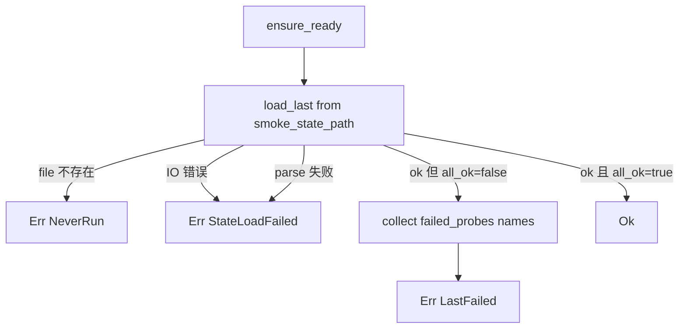

# roostery-smoke design

## 0. 术语约定

| 术语 | 定义 | 防冲突结论 |
|---|---|---|
| Probe | 一条 `lark-cli {sub} ... --dry-run` 调用，验证 lark-cli 子命令 + flag 集合 + 输出 marker 行为是否符合预期；不发真请求 | 新概念；与 LarkRunner 的"调用一次飞书"语义无冲突 |
| Probe matrix | 6 条 probe 的有序集合（im_messages_send / docs_create_v2 / docs_update_overwrite / drive_files_list / drive_create_folder / drive_move），Python 版 PROBES 同款；本机 2026-05-17 实测 lark-cli 1.0.29 全过 | 名字与 Python 版 `PROBES` 区分（Rust 期改成 `PROBE_MATRIX` 内部常量） |
| `roostery smoke` 子命令 | `roostery` 主 bin 的第一个真正子命令；跑完整 probe matrix 写状态文件；退 0 = all_ok / 退非 0 = 至少一条失败 | 新概念；Phase 3 起还会加 `roostery init` 子命令，clap 统一管 |
| Smoke state | `~/.roostery/state/smoke.json`（env override `ROOSTERY_HOME`），单文件 JSON；schema_version=1；包含 `started_at` / `binary` / `lark_cli_version`（**新增字段，Python 版没有**）/ `all_ok` / `probes: {name: {ok, rc, head, reason?}}` | 与 journal jsonl 不同——journal 是 append-only 日志，state 是覆盖式快照 |
| Gate API | 公开 `pub fn ensure_ready() -> Result<(), SmokeError>`：读 state file 检 `all_ok`；未跑 / 失败 → `Err`，caller match 后决定是否拒绝执行 | Python parity（`ensure_ready_or_raise`）；Rust 期换成 Result 返值不抛异常 |
| `SmokeError` | thiserror enum 4 变体：`NeverRun` / `LastFailed { failed_probes }` / `StateLoadFailed { source }` / `BinaryNotFound { path }` | 新概念；与 `LarkError` / `ShimError` 平行不混用 |
| `ROOSTERY_LARK_CLI_BIN` | lark-cli 二进制路径 env override；smoke 与 `LarkCli` wrapper 共用同一 env（同口径），未设走 PATH 上的 `lark-cli`（部署后是 shim） | 与 `lark_cli/subprocess.rs::ENV_BIN` 同字符串；smoke.rs 直接读相同 env name |

参考：`legacy/python/src/roostery/smoke.py`（166 行）——行为 reference；state file schema 不沿用 Python 字段顺序，按下面 §2.1 新形态映射。

### 0.1 Rust idiom 杠杆（不只是 Python parity）

1. **同步 `std::process::Command` + 10s timeout 取代 Python `subprocess.run`**——probe 是顺序跑 6 次的简单 batch，不需要并发；Rust std 直接给 `Command::output()` + `wait_timeout`（用 `wait-timeout` crate 或简单 `std::thread::sleep` 轮询）
2. **`#[derive(thiserror::Error)] enum SmokeError`** 替代 Python `RuntimeError(str)`——caller 能 match 具体失败类型决定行为
3. **`clap` derive macro** 取代 Python `sys.argv` 手解析——主 bin `roostery` 第一次有真正子命令，clap 是 Rust CLI 事实标准；项目首次引入
4. **`serde_json` 直接序列化 `SmokeReport` struct** 取代 Python `json.dumps(dict)`——schema 强类型固化，反序列化时类型不匹配 compile-time / parse-time 拦截
5. **`#[non_exhaustive]` `SmokeError` + builder 模式**——遵循 `LarkError` 同款约定（lark_cli/mod.rs 顶部 docstring 已定义；compound convention 已沉淀）

### 0.2 与已落地模块的关系

- **journal**：smoke **不写 journal**——它是 state 快照不是流水审计；与 journal 关注点分离（journal 记"agent 做了什么"，smoke state 记"基础设施健康度"）。理由：Python 版也分两文件
- **redact**：smoke probe 用的是无敏感数据 fixture（`ou_smoke` / `fld_smoke` / `doc_smoke`），不需要 scrub；stdout head 直接落 state file 用于人工诊断
- **remoterefs**：probe 不真调飞书，stdout 是 dry-run JSON 不含真实远端 token，不抽 remote_refs
- **lark_cli (LarkRunner)**：**smoke 不调 LarkRunner trait** —— 见 §1 D2 决策。两者 I/O 模型不同（raw bytes + "Dry Run" marker 文本检测 vs buffered Value JSON parse）
- **paths**：smoke 调 `paths::state_dir()`（**本 feature 新增**），与 `journal_dir()` 同口径

## 1. 决策与约束

### 范围

- 新文件 `crates/roostery/src/smoke.rs`（档 1 单文件，预估 ~300 行含 inline tests）
- 修改 `crates/roostery/src/main.rs`——引 clap，加 `smoke` 子命令；`--version` 行为保留（clap 内置 `--version` 用 `CARGO_PKG_VERSION`，与现状字符串一致即可）
- 修改 `crates/roostery/src/lib.rs`——`pub mod smoke;` 导出
- 修改 `crates/roostery/src/paths.rs`——加 `pub fn state_dir() -> PathBuf` + `pub fn smoke_state_path() -> PathBuf`
- 修改 `Cargo.toml`——加 `clap = { version = "4", features = ["derive"] }` 依赖
- 单元测试 ≥ 8 条（probe 矩阵不变量 / state file 序列化反序列化往返 / ensure_ready 4 路径 / SmokeError 4 变体）
- 集成测试 ≥ 2 条（用 fixture lark-cli 脚本验端到端：all_ok / 部分失败）

### 明确不做

- **不引 tokio**：smoke 是同步 6 条顺序 probe + 写一个 json file；引 tokio 拉大启动 + 二进制 size；用 `std::process::Command`
- **不调 LarkRunner trait**：LarkCli 用 `wait_with_output` + serde_json::from_slice 一次性 parse 成 Value；smoke 要的是 raw stdout 文本 + "Dry Run" marker 检测，I/O 语义不同（同 shim 决定）。grep 反向核对：`grep "LarkRunner\|LarkCli\|Journaled" crates/roostery/src/smoke.rs` → 无
- **不读 Python legacy env**：`FEISHU_HUB_LARK_CLI_BIN` 一次切口径到 `ROOSTERY_LARK_CLI_BIN`（与 `lark_cli/subprocess.rs::ENV_BIN` 共用同字符串），grep 反向核对 → 无
- **不读 Config 文件**：Phase 3 `config-yaml` 未起；smoke 仅靠 env + 默认值。Phase 3 落地后由 config 注入 `real_lark_cli` 字段时再 update（届时 design 阶段评估是否扩 `cs-roadmap update` 改 §4.6 契约）
- **不并发跑 probe**：6 条顺序跑，约 6×10s = 最差 60s timeout 上限；并发收益小（升级验证场景用户能等），代码复杂度大幅上升
- **不写 journal**：smoke 是 state 快照不是事件流（同 §0.2）
- **不实现 retry / 失败重跑**：probe 失败直接记录到 state file；caller 看 state 决定怎么办；smoke 自身 idempotent（每次跑覆盖 state）
- **不解析 dry-run JSON 出**：只检 "Dry Run" 字符串 + rc==0 + "unknown flag" / "unknown command" 错误模式（同 Python 版）
- **不暴露 `--probe-name {name}` 单跑选项**：本 feature 跑全集；单跑选项是后续可选扩展
- **不修改 `legacy/python/`**：frozen
- **不修改 lark_cli wrapper 模块**：smoke 是另一条独立 caller 路径

### 复杂度档位

走默认档位——单模块 + 顺序 batch + state file 快照。无对外 SDK / 高并发 / size-sensitive 信号。

### 关键决策

| # | 决策 | 内容 | 来源 |
|---|---|---|---|
| D1 | CLI 解析用 clap 4 derive | 引 `clap = { version = "4", features = ["derive"] }`；`roostery` 主 bin 转为 clap subcommand 模式；首个子命令 `smoke`；保留 `--version` 行为（clap 内置） | 用户对齐；后续 init / dispatch 都会加子命令 |
| D2 | smoke 直接 subprocess 不走 LarkRunner | 同 shim 决定：raw bytes 模型 vs buffered Value 模型；trait 共用收益不抵语义错位代价 | 用户对齐 |
| D3 | gate API 用 lib fn `ensure_ready() -> Result<(), SmokeError>` | Python parity；caller match 具体 SmokeError 变体处理；不通过 CLI exit code 绕一圈 | 用户对齐 |
| D4 | probe matrix 直接搬 Python 版 6 条 + lark-cli 1.0.29 实测验证 | 6 条全过（im+1 / docs+2 / drive+3）；本机已 1.0.29 但 attention.md pin 1.0.28，1.0.29 向后兼容；schema 不漂移 | 用户对齐 + 实测 2026-05-17 |
| D5 | state file `~/.roostery/state/smoke.json`，schema_version=1 | 单文件覆盖式快照；schema_version=1 落地即对外承诺；包含 `lark_cli_version` 字段（**Rust 期新增**——记录 probe 跑时实际 lark-cli 版本，acceptance 阶段可对照 attention.md pin 做漂移诊断） | Rust 期增强 |
| D6 | binary 解析：`ROOSTERY_LARK_CLI_BIN` env > `"lark-cli"` PATH lookup | 与 `lark_cli/subprocess.rs::ENV_BIN` 同字符串（grep 验证 / 复用同口径）；不读 config（Phase 3 起来再扩） | Python 简化 + 同 wrapper |
| D7 | probe timeout 10s/条 + 失败 head 截 500 字节 | 同 Python 版默认；多数 probe 实际 < 1s；timeout 防 lark-cli 卡死阻塞 CI | Python parity |
| D8 | "Dry Run" marker 检测 + rc==0 才视为 ok；"unknown flag/command" 模式探测 | 同 Python 版；不依赖 stdout JSON 结构 | Python parity |
| D9 | `SmokeError` thiserror 4 变体 `#[non_exhaustive]` + 不需要 builder | `NeverRun` / `LastFailed { failed_probes: Vec<String> }` / `StateLoadFailed { source: io::Error }` / `BinaryNotFound { path: PathBuf }`；`#[non_exhaustive]` 遵循 lark_cli compound convention；不带 RunOptions 类参数所以不需 builder | Rust idiom；与 LarkError 风格对齐 |
| D10 | paths 模块加 `state_dir()` + `smoke_state_path()` | 路径集中管理同 `journal_dir`；不在 smoke 内部硬编码 join | Rust idiom |
| D11 | atomic write：写 `.tmp` 再 `rename` 替换 state file | Python parity；防 SIGTERM / 写入半途崩溃留半文件 | Python parity |
| D12 | smoke 失败不让 `roostery smoke` 子命令 panic | 把 io 失败 / spawn 失败也收进 SmokeReport.probes[name].reason，子命令退 1（与 all_ok=false 同义） | Python parity |

### 前置依赖

- `lark-cli-wrapper`（done，commit `cc44dfa`）—— 不调 LarkRunner trait 但需要其 `ENV_BIN = "ROOSTERY_LARK_CLI_BIN"` 字符串契约（共享同 env name）。本 feature 不修改 wrapper，但需要它的 env name 稳定

## 2. 名词与编排

### 2.1 名词层

**现状**：

- `crates/roostery/src/main.rs` 14 行；手写 `argv[1] == "--version"` match；无子命令体系；无 clap 依赖
- `crates/roostery/src/paths.rs` 仅 `roostery_home()` + `journal_dir()`；无 `state_dir`
- `crates/roostery/src/lib.rs` 导出 `journal` / `lark_cli` / `paths` / `redact` / `remoterefs`；无 `smoke`
- 无 state 目录约定
- `lark_cli/subprocess.rs::ENV_BIN = "ROOSTERY_LARK_CLI_BIN"` 已声明（私有常量；本 feature 用同字符串）

**变化**：

- 新增 `crates/roostery/src/smoke.rs`：声明 `PROBE_MATRIX: &[Probe]` 常量 6 条 + `pub struct SmokeReport` + `pub enum SmokeError` + `pub fn run() -> SmokeReport` + `pub fn ensure_ready() -> Result<(), SmokeError>` + 私有 `probe_one` / `load_last` / `save_report`
- `paths.rs` 加 `pub fn state_dir() -> PathBuf` 返 `roostery_home().join("state")` + `pub fn smoke_state_path() -> PathBuf` 返 `state_dir().join("smoke.json")`
- `lib.rs` 加 `pub mod smoke;`
- `main.rs` 重写为 clap App + subcommand：保留 `--version`、加 `smoke` 子命令
- `Cargo.toml` 加 `clap = { version = "4", features = ["derive"] }`

**公开 API 接口契约**：

```rust
// crates/roostery/src/smoke.rs

/// 6 条 probe 命令矩阵。索引内部细节，外部不直接消费。
const PROBE_MATRIX: &[Probe] = &[...];

/// 单条 probe 描述（name + argv）。
struct Probe { name: &'static str, argv: &'static [&'static str] }

/// 单条 probe 结果。
#[derive(Serialize, Deserialize, Debug, Clone, PartialEq)]
pub struct ProbeResult {
    pub ok: bool,
    #[serde(skip_serializing_if = "Option::is_none")]
    pub rc: Option<i32>,
    #[serde(skip_serializing_if = "Option::is_none")]
    pub head: Option<String>,
    #[serde(skip_serializing_if = "Option::is_none")]
    pub reason: Option<String>,
}

/// 完整 smoke run 报告，与 ~/.roostery/state/smoke.json 1:1 序列化。
#[derive(Serialize, Deserialize, Debug, Clone, PartialEq)]
#[non_exhaustive]
pub struct SmokeReport {
    pub schema_version: u32,             // 1
    pub binary: String,                  // 实际跑的 lark-cli 路径
    pub lark_cli_version: Option<String>, // 跑 `lark-cli --version` 抓出来；失败为 None
    pub started_at: chrono::DateTime<chrono::Utc>,
    pub all_ok: bool,
    pub probes: std::collections::BTreeMap<String, ProbeResult>,  // BTreeMap 保序方便 diff
}

/// caller 调用错误码归一。
#[derive(Debug, thiserror::Error)]
#[non_exhaustive]
pub enum SmokeError {
    #[error("smoke probe never run; execute `roostery smoke` first")]
    NeverRun,
    #[error("smoke probe last run reported failures: {failed_probes:?}; re-run `roostery smoke` after fixing")]
    LastFailed { failed_probes: Vec<String> },
    #[error("smoke state file load failed: {source}")]
    StateLoadFailed { #[from] source: std::io::Error },
    #[error("lark-cli binary not found: {path:?}")]
    BinaryNotFound { path: std::path::PathBuf },
}

/// 跑完整 probe 矩阵；写 state file；返报告。
pub fn run() -> SmokeReport;

/// roostery init / daily_report 调的 gate：读上次 state file 检 all_ok。
pub fn ensure_ready() -> Result<(), SmokeError>;
```

**调用示例**（caller 视角）：

```rust
// roostery init / daily_report 入口处
use roostery::smoke;
if let Err(e) = smoke::ensure_ready() {
    eprintln!("[roostery] smoke gate failed: {e}");
    return ExitCode::from(127);
}

// `roostery smoke` 子命令实现
let report = smoke::run();
println!("{}", serde_json::to_string_pretty(&report)?);
std::process::exit(if report.all_ok { 0 } else { 1 });
```

**state file 形态**（`~/.roostery/state/smoke.json`，pretty-printed）：

```json
{
  "schema_version": 1,
  "binary": "/Users/ben/.local/bin/lark-cli",
  "lark_cli_version": "1.0.29",
  "started_at": "2026-05-17T10:55:00Z",
  "all_ok": true,
  "probes": {
    "docs_create_v2": { "ok": true, "rc": 0, "head": "=== Dry Run ===\n{...truncated..." },
    "docs_update_overwrite": { "ok": true, "rc": 0, "head": "..." },
    "drive_create_folder": { "ok": true, "rc": 0, "head": "..." },
    "drive_files_list": { "ok": true, "rc": 0, "head": "..." },
    "drive_move": { "ok": true, "rc": 0, "head": "..." },
    "im_messages_send": { "ok": true, "rc": 0, "head": "..." }
  }
}
```

**main.rs CLI 形态**（clap derive）：

```rust
use clap::{Parser, Subcommand};

#[derive(Parser)]
#[command(name = "roostery", version, about = "🪺 Vendor-neutral agent broker, Feishu-native.")]
struct Cli {
    #[command(subcommand)]
    command: Option<Command>,
}

#[derive(Subcommand)]
enum Command {
    /// 跑 lark-cli probe 矩阵验证升级兼容性
    Smoke,
}

fn main() -> ExitCode {
    match Cli::parse().command {
        None => { /* 默认行为：打印短欢迎 */ }
        Some(Command::Smoke) => { let r = roostery::smoke::run(); ... }
    }
}
```

**来源参考**：

- 整体流程：`legacy/python/src/roostery/smoke.py:103-130` (`run` + `_save`) — Rust 期改成强类型 struct + atomic rename
- probe 矩阵：`smoke.py:24-67` (`PROBES`) — 6 条 1:1 搬运，2026-05-17 本机 lark-cli 1.0.29 实测全过
- gate：`smoke.py:143-156` (`ensure_ready_or_raise`) — Rust 期改 `Result<(), SmokeError>` 不抛异常
- binary 解析：`smoke.py:70-76` (`_binary`) — 简化掉 config 回落，只剩 env > default

### 2.2 编排层

**现状**：无 smoke 模块；无 `roostery smoke` 子命令；没有任何代码会调 `ensure_ready` 类 gate（Phase 3 init / Phase 6 daily_report 尚未起）。

**变化**：本 feature 落地后形成两条调用路径——

1. **手动跑**：用户在升级 lark-cli 后 `roostery smoke` → 跑 6 条 probe → 写 state file → 退 0/1。**唯一的 user-facing 入口**
2. **gate 调用**（本 feature 不真正消费，预先暴露给后续 feature）：`roostery init` / `daily_report` 启动时调 `smoke::ensure_ready()` → 检 state file → `Ok / Err`

**主流程图（`smoke::run`）**：

```mermaid
flowchart TD
    A[run start: 取当前时间] --> B[resolve_binary: env ROOSTERY_LARK_CLI_BIN > 'lark-cli']
    B --> C{binary exists?}
    C -->|否 PATH 找不到| D[probe[i] = Err 'binary not found' 对所有 6 条]
    D --> Z[build SmokeReport all_ok=false]
    C -->|是| E[fetch lark_cli_version: run 'lark-cli --version' 取首行]
    E --> F[for probe in PROBE_MATRIX]
    F --> G[probe_one: Command spawn + 10s timeout + capture stdout/stderr]
    G --> H{rc==0 && stdout 含 'Dry Run'?}
    H -->|是| I[ProbeResult ok=true rc=0 head=前 500 字节]
    H -->|否 unknown flag/cmd 模式| J[ProbeResult ok=false reason='flag/command mismatch']
    H -->|否 其他| K[ProbeResult ok=false reason='unexpected exit or missing marker']
    I --> L[probes.insert]
    J --> L
    K --> L
    L --> F
    F -->|all done| M[all_ok = probes.values().all(ok)]
    M --> N[save_report: 写 .tmp 再 rename]
    N --> Z2[return SmokeReport]
```

**`smoke::ensure_ready` 流程图**：



**`probe_one` 实现行为**（每条 probe 一次调用）：

```rust
// 伪代码
let mut cmd = Command::new(binary);
cmd.args(probe.argv);
cmd.stdin(Stdio::null());
cmd.stdout(Stdio::piped());
cmd.stderr(Stdio::piped());
// 跑 + 10s timeout（用简单 wait + kill 模式，不引 wait-timeout crate）
let output = cmd.spawn_and_wait_timeout(Duration::from_secs(10))?;
let combined = String::from_utf8_lossy(&output.stdout).to_string()
             + &String::from_utf8_lossy(&output.stderr);
let head: String = combined.chars().take(500).collect();
let rc = output.status.code().unwrap_or(-1);
match (rc, &combined) {
    (0, c) if c.contains("Dry Run") => ProbeResult { ok: true, rc: Some(0), head: Some(head), reason: None },
    (_, c) if c.to_lowercase().contains("unknown flag") || c.to_lowercase().contains("unknown command") =>
        ProbeResult { ok: false, rc: Some(rc), head: Some(head), reason: Some("flag/command mismatch (lark-cli upgrade?)".into()) },
    _ => ProbeResult { ok: false, rc: Some(rc), head: Some(head), reason: Some(format!("unexpected exit {rc} or missing Dry Run marker")) },
}
```

**流程级约束**：

- **不变量 1**：smoke run 是 idempotent ——每次跑覆盖 state file；state file 永远是"最近一次 smoke 的快照"
- **不变量 2**：atomic write —— `serde_json::to_writer_pretty` 写 `.tmp` 再 `std::fs::rename` 替换，永不留半文件
- **不变量 3**：probe 顺序固定（按 PROBE_MATRIX 中静态定义的顺序），保证 state file diff 友好（BTreeMap 自动按 name 字典序但 PROBE_MATRIX 内部仍按 im → docs → drive 排）
- **不变量 4**：lark-cli binary 未找到时**不 panic**——所有 6 条 probe 标 ok=false / reason="binary not found"，写 state file，退 1。理由：caller `ensure_ready()` 必须能从 state 看到这次跑失败的原因
- **不变量 5**：单条 probe timeout 10s——超时视为失败（reason="timeout after 10s"），不阻塞后续 probe；最差总耗时 60s
- **不变量 6**：`ensure_ready()` 读 state 失败（文件不存在 / parse 失败）必须返 specific 错误变体，让 caller 区分"从没跑过" vs "跑过但坏了"
- **错误语义**：4 类 `SmokeError` 都实现 `Display` + `thiserror`；caller match 决定 stderr 输出 + exit code

### 2.3 挂载点清单

判据"删了它 feature 是否消失"：

1. **`crates/roostery/src/smoke.rs` 存在** — 删 → 模块不存在 → feature 消失
2. **`pub mod smoke;` in lib.rs** — 删 → 外部 caller 拿不到 `roostery::smoke::ensure_ready` → gate API 消失
3. **`PROBE_MATRIX` 常量含 6 条 probe** — 改空 / 改成 1 条 → 矩阵 coverage 失效 / Python parity 破坏
4. **`paths::smoke_state_path()` 返 `~/.roostery/state/smoke.json`** — 路径改名 → caller (init / daily_report) 找不到 state file → gate 协议破坏
5. **`Cargo.toml` 含 `clap` 依赖 + main.rs `Smoke` 子命令** — 删 → 用户没法跑 smoke

5 条 strong mount points，符合 3-5 条上限。

**不列**：`SmokeError` 变体数量、probe timeout 数值、head 截断长度——这些是内部参数调优空间。

### 2.4 推进策略

按 paradigm 维度切片（基础设施 → 计算节点 → state 持久化 → CLI 集成 → 集成测试）：

1. **paths 扩 + 类型骨架 + Cargo.toml + lib.rs**：`paths::state_dir` + `paths::smoke_state_path`；新建 `src/smoke.rs` 声明 `ProbeResult` / `SmokeReport` / `SmokeError` / `PROBE_MATRIX` + 全部 fn 签名 `todo!()`；`Cargo.toml` 加 `clap = "4"`；`lib.rs` `pub mod smoke;`
   - 退出信号：`cargo build` 成功；`paths::smoke_state_path()` 单测 returns 正确路径；`SmokeReport` serde round-trip 单测通过
2. **`probe_one` + 10s timeout**：实现单条 probe（spawn + wait_timeout + classify "Dry Run" / "unknown flag" / 其他）；用伪 binary fixture 测 4 case（happy / timeout / unknown flag / non-zero rc）
   - 退出信号：4 case 单测全过
3. **`run()` 编排 + atomic save**：实现 `run`（resolve binary → fetch version → 顺序跑 6 probe → all_ok → save report .tmp + rename）+ `save_report` + `load_last`
   - 退出信号：用伪 binary fixture 跑整个 run，验证 state file 内容 schema + atomic 行为；load round-trip 通过
4. **`ensure_ready()` + 4 错误路径**：实现 gate API；单测覆盖 4 路径（NeverRun / LastFailed / StateLoadFailed / happy）
   - 退出信号：4 单测全过
5. **main.rs 重写 clap + smoke 子命令 + 集成测试**：引 clap derive；`roostery smoke` 子命令；保留 `--version`；写 2 集成测试（`tests/smoke_integration.rs` 用 fixture lark-cli 验 all_ok / 部分失败两条路径）
   - 退出信号：`./target/debug/roostery smoke` 跑通；2 集成测试通过；`cargo test --all` 全绿
6. **完整验收 + CI**：`cargo test --all + cargo test --doc + cargo clippy --all-targets --all-features -- -D warnings + cargo fmt --all --check` 四命令全绿；推 CI 验三 job
   - 退出信号：本地四命令全绿；远端 CI 全绿

### 2.5 结构健康度与微重构

**评估对象**：

- **要改的文件**：
  - `crates/roostery/src/main.rs`（14 行 → 预估 ~50 行；clap derive 后仍小）—— 健康
  - `crates/roostery/src/lib.rs`（10 行，只有 mod 声明）—— 健康
  - `crates/roostery/src/paths.rs`（80 行）+ 加 ~10 行 `state_dir` / `smoke_state_path`—— 仍在档 1 阈值
  - `Cargo.toml`—— 加 1 行依赖
- **要落新文件的目录**：`crates/roostery/src/`（已有 redact.rs / journal.rs / paths.rs / remoterefs.rs / lib.rs / main.rs / lark_cli/ / bin/）；新增 `smoke.rs` 进入 lib 模块层，与 redact / journal / remoterefs / paths 同档 1

**先查 compound convention**——`.codestable/compound/2026-05-16-decision-rust-module-organization.md`：

- 档 1 单文件 inline：单文件 < 500 行 + 公开项 ≤ ~8 个。smoke 预估 ~300 行 + 公开项 5 个（`ProbeResult` / `SmokeReport` / `SmokeError` / `run` / `ensure_ready`）—— **符合档 1**

**结论**：**本次不做微重构**。

理由：

- smoke.rs 预估 ~300 行 < 500 行档 1 阈值
- 主 bin `roostery` 走 `src/main.rs`（档 4 决策：主程序 bin 用 Cargo 默认 `src/main.rs`），不进 `src/bin/`
- paths.rs 扩两个 fn 是自然增长（80 → ~90 行），仍远低于阈值
- main.rs 重写为 clap subcommand 模式是**功能扩展不是重构**——结构变化与功能本质绑定，不能"先重构后加功能"独立验证

**超出范围的观察**（不阻塞本 feature）：

- main.rs 引入 clap 后未来 `roostery init` / `roostery dispatch` 等子命令陆续加入；若主 bin > 200 行有内部模块化需求，按 rust-module-organization 档 4 升级（升级到 `src/bin/roostery/main.rs` + 子模块；同 crate）—— **本 feature 不预实现**，等真有第 3 个子命令时评估
- attention.md "命令与脚本陷阱" 节的 lark-cli pin 1.0.28 描述：本机实测 1.0.29 兼容，acceptance 阶段评估是否 update 到"pin 在 1.0.28（最低）；已验证 1.0.29 兼容"——**本 feature 不擅自动 attention.md**

## 3. 验收契约

### 3.1 关键场景清单

#### Probe matrix 行为

- **S1.1** Happy：lark-cli 装好且 6 条 probe 全过 → `run()` 返 `all_ok=true` / `probes` 含 6 条 ok=true entry / state file 写入正确
- **S1.2** Binary 不存在：`ROOSTERY_LARK_CLI_BIN=/nonexistent` → `run()` 返 `all_ok=false` / 6 条 probe 全 ok=false reason 含 "binary not found"
- **S1.3** 单条 probe 失败（unknown flag 模式）：fixture 输出 "unknown flag: --foo" + rc=2 → 该 probe ok=false reason="flag/command mismatch (lark-cli upgrade?)"
- **S1.4** 单条 probe timeout：fixture `sleep 30` → 该 probe ok=false reason 含 "timeout"
- **S1.5** 单条 probe rc!=0 但非已知错误：fixture exit 5 → ok=false reason 含 "unexpected exit 5"
- **S1.6** Probe 顺序固定：连续两次 `run()` 的 `probes` map 顺序一致（BTreeMap 按 name 排序，diff-friendly）

#### State file 形态

- **S2.1** Schema 锁定：state file 11 个顶层字段（`schema_version` / `binary` / `lark_cli_version` / `started_at` / `all_ok` / `probes`）+ probes 子对象每条 `ProbeResult` 4 字段（ok / rc / head / reason；后三个 optional）
- **S2.2** Atomic write：模拟写入过程中崩溃（手工杀 `.tmp` 文件） → state 文件保持原状不被破坏
- **S2.3** schema_version = 1：序列化产物含 `"schema_version": 1`
- **S2.4** Pretty-printed JSON：state file 人类可读（`serde_json::to_writer_pretty`）
- **S2.5** `lark_cli_version` 抓取：`run()` 调 `lark-cli --version` 取首行；失败时字段为 null（不影响 all_ok）

#### Gate API（`ensure_ready`）

- **S3.1** 从未跑过：state file 不存在 → `Err(SmokeError::NeverRun)`
- **S3.2** 上次失败：state file 含 all_ok=false → `Err(SmokeError::LastFailed { failed_probes: [...] })`，failed_probes 含失败 probe 的 name 列表
- **S3.3** Parse 失败：state file 存在但是损坏 JSON → `Err(SmokeError::StateLoadFailed { source })`
- **S3.4** 上次成功：state file all_ok=true → `Ok(())`

#### CLI 集成（`roostery smoke`）

- **S4.1** 全过退 0：`roostery smoke` 跑 happy path → stdout 打 pretty JSON + 退 0
- **S4.2** 部分失败退 1：任一 probe ok=false → 退 1（不 panic）
- **S4.3** `roostery --version`：输出严格保持现状 `roostery 0.0.0 (rust)`（clap derive 的 `#[command(version)]` 默认产物是 `roostery 0.0.0`，本 feature 用 `#[command(version = concat!(env!("CARGO_PKG_VERSION"), " (rust)"))]` 锁定带 `(rust)` 后缀；零行为差异）
- **S4.4** `roostery` 无参数：打印短欢迎信息（保留现状）
- **S4.5** `roostery smoke --help`：clap 内置 help 输出

#### 模块级

- **S5.1** `cargo test --all` 全绿，本 feature 新增测试 ≥ 10 个（unit + integration）
- **S5.2** `cargo test --doc` 全绿
- **S5.3** `cargo clippy --all-targets --all-features -- -D warnings` 通过
- **S5.4** `cargo fmt --all --check` 通过
- **S5.5** 架构红线守护：`grep "LarkRunner\|LarkCli\|Journaled" crates/roostery/src/smoke.rs` → 无（smoke 不走 LarkRunner trait）
- **S5.6** env name 共享：`grep "ROOSTERY_LARK_CLI_BIN" crates/roostery/src/` → 至少在 `smoke.rs` 和 `lark_cli/subprocess.rs` 两处出现（同字符串，未来若改需同步两处——acceptance 评估是否抽公共常量）

### 3.2 反向核对项（明确不做的可 grep 验证）

- `grep -E "use tokio|tokio::|#\[tokio::main\]" crates/roostery/src/smoke.rs` → 无
- `grep "LarkRunner\|LarkCli\|Journaled" crates/roostery/src/smoke.rs` → 无
- `grep "FEISHU_HUB_" crates/roostery/src/smoke.rs` → 无运行时引用
- `grep "Config\|cfgmod\|toml::" crates/roostery/src/smoke.rs` → 无
- `grep -E "fn retry|retries|backoff" crates/roostery/src/smoke.rs` → 无
- `grep -E "rayon|tokio::spawn|std::thread::spawn" crates/roostery/src/smoke.rs` → 无（probe 串行跑）
- `grep -E "Journal::|journal::" crates/roostery/src/smoke.rs` → 无（smoke 不写 journal）
- `grep "PROBE_MATRIX" crates/roostery/src/smoke.rs` → 1（常量定义）+ 消费处
- `wc -l crates/roostery/src/smoke.rs` → < 500（档 1 阈值；预估 ~300）
- 反向核对：`grep "smoke" crates/roostery/src/lark_cli/` → 无（lark_cli wrapper 不引 smoke，单向依赖）
- 反向核对：`Cargo.toml` 含 `clap = { version = "4"` 段

## 4. 与项目级架构文档的关系

**本 feature 提炼回 architecture 的内容**：

- **名词**：`SmokeReport` / `SmokeError` / `Probe matrix` / `Gate API` / state file 路径约定 → ARCHITECTURE.md §2 术语表加 smoke 词条 + state file 路径 + gate API 解释
- **架构归并**：§3 Module C 加 smoke 子节（PROBE_MATRIX 6 条 / state file schema_version=1 / atomic write / `ensure_ready` gate / 与 LarkRunner / Journaled 关系）+ 子 feature 列表标 done
- **§5 关键架构决定补充**：加一条"smoke 与 shim 共享 raw bytes I/O 模型（独立于 LarkRunner buffered Value）；两条独立 caller 路径都不走 trait 是因为 I/O 语义本质差异"——可能合并到现有第 7 条"shim 与 LarkRunner 走两条独立 I/O 路径"扩为"shim / smoke 与 LarkRunner ..."
- **§6 已知约束补充**：第 4 条 "lark-cli 版本 pin 在 1.0.28" + 第 5 条 "smoke 是升级 gate" 已存在；acceptance 阶段加 commit 引用 + 兑现链描述

**关联的已有架构 doc**：

- `.codestable/architecture/ARCHITECTURE.md` — acceptance 按上述更新 §2 / §3 / §5 / §6
- `.codestable/attention.md` — "lark-cli pin 在 1.0.28" 条目实测 1.0.29 兼容；acceptance 阶段评估是否 update 措辞（候选；不阻塞本 feature）
- `.codestable/roadmap/rust-rewrite/rust-rewrite-items.yaml` — acceptance 时 `roostery-smoke` 条目 `status: in-progress → done`
- `.codestable/roadmap/rust-rewrite/rust-rewrite-roadmap.md` §3 第 6 项 — acceptance 时 `roostery-smoke` 状态 `planned → done` + 加 feature 引用
- `.codestable/compound/` — 无新 decision 候选；clap 引入是 tech-stack 但已被 rust-module-organization 决策 ② 间接覆盖（无需独立 decision）

### 4.1 后续观察（不阻塞本 feature）

- **`ROOSTERY_LARK_CLI_BIN` 常量去重**：smoke.rs 和 lark_cli/subprocess.rs 共享同字符串；若未来这个 env name 要改 → 抽到 lib 顶层 pub const，本 feature **不预重构**（cs-refactor 候选）
- **Phase 3 config-yaml 起来后**：smoke binary 解析增加 config fallback 路径；届时 design 阶段评估
- **probe matrix 扩展**：硬编码 6 条最小集；Phase 3 config-yaml 起来后可以由 config 驱动扩展；本 feature 不预实现配置驱动
- **lark-cli 1.0.29 升级 attention.md**：本机实测兼容，但 attention 仍写 pin 1.0.28；acceptance 阶段评估
- **`SmokeReport` schema_version=1 公开承诺**：与 `JournalEntry.schema_version=1` 同口径——一旦本 feature 落地，state file schema 破坏性改动需要 bump 版本 + 旧版兼容 + `cs-roadmap update`。本 feature 不在 roadmap §4 列接口契约（state file 是内部 audit cache 不是跨模块契约层），但 read/replay 工具消费时仍可视为 stable 形态
