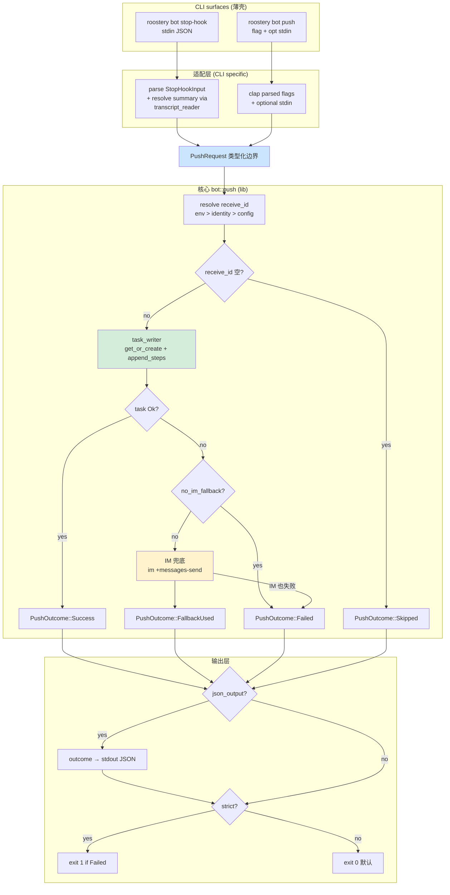

# bot-stop-hook 设计

## 0. 决策头注

- **req 对齐**：`agent-work-in-feishu` 的**双向兑现**——不只是"CC 退出时被动出 task"，更是"任意 agent / 脚本主动 push 到飞书"。后者是 Python 期没做但 vendor-neutral broker 定位上必备的能力（让 Gemini CLI / 自写 bash agent / cron 任务都能用 roostery 当飞书出口）
- **roadmap 上下文**：rust-rewrite §3 Module F 第 2 子 feature；`minimal_loop: true`；§5 明确 "bot-stop-hook 完成 = 最小闭环 = '可用' = 0.1.0 触发"
- **设计原则**：**核心库 + 双 CLI 薄壳**——`bot::push(req: PushRequest, runner)` 是唯一业务函数；`stop-hook` 子命令负责把 stdin JSON / transcript 翻译成 PushRequest；`push` 子命令负责把 flag / stdin 文本翻译成 PushRequest。两条 CLI 路径**没有功能差异**，只是输入适配器不同
- **决策头**（user 拍板 2026-05-18）：
  - **双 CLI**：`roostery bot stop-hook`（被动 hook，stdin JSON 协议）+ `roostery bot push`（主动反向调用，flag + 可选 --summary-stdin）
  - **IM 兜底 receive_id** = `env ROOSTERY_NOTIFY_TO > identity::current().user_open_id > config.identity.user_id`；三层全空 → 静默 exit 0
  - **summary 抽取在 Rust 层**——CC transcript_path jsonl tail；`push` 子命令无 transcript 概念（caller 自己提供 summary）
  - **agent_stop_notify.sh** 简化为单行 `ROOSTERY_AGENT=cc exec roostery bot stop-hook`
  - **Rust 红利显式发挥**（D-RUST 系列）：
    - 类型化 `PushRequest` 边界（不是 stringly-typed flag forwarding）
    - 类型化 `PushOutcome` + `--json` 结构化输出（caller 可 jq 取 task_url / fallback_used）
    - `--strict` opt-in 真实 exit code（Python "exit 0 一切吞掉"是缺陷不是原则）
    - 稳态 idempotency key 用 **blake3 短哈希**（默认 hasher 启动种子随机化在 hook 链路里是 bug）
    - structured tracing（不是 `sys.stderr.write` 拼字符串）
    - single binary：反向 push 不需 sh wrapper，跨平台一致

## 1. 范围 / 决策 / 明确不做 / 复杂度档位

### 1.1 必做（用户故事 → 行为）

**核心库** `bot::push`：

| # | 行为 | 输入 | 期望可观察结果 |
|---|---|---|---|
| C1 | `push(req: PushRequest, runner, opts: PushOptions) -> PushOutcome` | 类型化请求 + runner trait + options | 解析 receive_id 三层链；调 task_writer 主路径；失败转 IM 兜底；返结构化 outcome |
| C2 | `PushRequest` 字段验证 | request | `agent` / `session` / `cwd` 非空（builder API 编译期校验）；summary 可空（后续路径自填默认） |
| C3 | summary 默认值规则 | 空 summary | append_steps 文本 = `"Agent stopped (no summary)"` |
| C4 | idempotency key 稳态哈希 | (agent, session, summary) | blake3 短摘要 8 字符；session 级别 + step 级别两种 key |

**CLI surface 1**：`roostery bot stop-hook`（被动 hook）

| # | 行为 | 输入 | 期望可观察结果 |
|---|---|---|---|
| H1 | clap 子命令注册 | 无 flag（stdin JSON） | `roostery bot stop-hook --help` 列出 stdin JSON schema 文档 |
| H2 | stdin JSON 解析 | CC SessionEnd schema | serde with #[serde(default)]；缺字段走默认 |
| H3 | agent kind 来源 | env `ROOSTERY_AGENT` | 缺省 = `"unknown"`；sh wrapper 负责设 env |
| H4 | summary 抽取（CC transcript）| transcript_path | 调 `transcript_reader::read_last_assistant_text(path, 200)`；从文件末尾倒序找首条 `type=="assistant"` 的 `message.content[0].text` |
| H5 | summary 兜底（Codex / Gemini）| transcript 失败 | 退回 stdin `prompt_response` 字段；再缺 → 空 |
| H6 | 翻译成 PushRequest | 已抽取字段 | 构造 PushRequest 调 `bot::push` |
| H7 | 模板替换 | onboarding | `templates/agent_stop_notify.sh` 改为 `ROOSTERY_AGENT=cc exec roostery bot stop-hook` |

**CLI surface 2**：`roostery bot push`（主动反向调用）

| # | 行为 | 输入 | 期望可观察结果 |
|---|---|---|---|
| P1 | clap 子命令注册 | flag + 可选 stdin | `roostery bot push --agent X --session Y --cwd Z [--summary "..." \| --summary-stdin]` |
| P2 | flag 校验 | clap | `--agent` / `--session` 必填（clap required）；`--cwd` 缺省 = env::current_dir() |
| P3 | summary 输入两种模式 | `--summary` 或 `--summary-stdin` | 互斥（clap ArgGroup）；`--summary-stdin` → 全量读 stdin 当 summary 字符串 |
| P4 | 翻译成 PushRequest | flag | 构造 PushRequest 调 `bot::push` |
| P5 | `--description` 可选 flag | flag | 透传到 task_writer.description；不传 → task_writer 自动生成 |
| P6 | `--assignee-open-id` 可选 flag | flag | 显式 override 三层 receive_id 链；存在时直接用 |
| P7 | 反向 CLI 用例验证 | bash 调用 | `echo "did X" \| roostery bot push --agent custom-bot --session run-1 --summary-stdin --strict --json` 真跑成功 |

**共享 options**（两路 CLI 都支持）：

| # | 行为 | 输入 | 期望可观察结果 |
|---|---|---|---|
| O1 | `--strict` 真实 exit code | flag | 默认 false（Python 兼容 hook 不阻塞 agent）；true 时 task_writer/IM 失败 exit 1 + outcome 仍序列化到 stdout |
| O2 | `--json` 结构化输出 | flag | 把 PushOutcome JSON 打到 stdout（不是 stderr）；caller 可 jq 解析 `{ task_url, task_guid, fallback_used, errors: [...] }` |
| O3 | `--no-im-fallback` opt-out | flag | task_writer 失败时不调 IM；仅记 outcome.errors |
| O4 | tracing 输出可控 | env `RUST_LOG` | 标准 tracing_subscriber；默认 warn；hook 路径用户可 `RUST_LOG=info` 排错 |

### 1.2 关键决策（D1-D18）

| # | 决策 | 理由 |
|---|---|---|
| D1 | 双 CLI surface 共享一个 `bot::push` 核心 lib fn | user 反馈"反向调用必须有"；分两条 CLI 但底层同一函数，避免功能漂移；与 bot-task-writer D1"纯库 API"一致延伸 |
| D2 | `PushRequest` builder API（不是 7 个独立 flag stringly forward）| Rust 强类型红利；调用方拿到的是 `PushRequest::new(agent, session, cwd).with_summary(...).with_description(...)`，IDE 补全 + 编译期检查；clap 解析后转 builder 不是直接 4 个 String 互传 |
| D3 | `PushOutcome` + `--json` 结构化输出 | user 反馈"凸显 Rust 好"；caller agent 可结构化消费（jq / serde_json）；Python `print(url)` 字符串拼接 fragile |
| D4 | `--strict` opt-in exit code | user 反馈"Python 坏处全学进去了"；hook 路径默认 exit 0 是 runtime 约定（不阻塞 agent），但 `bot push` 是开发者 / 脚本主动调用，错就该让 caller 知道 |
| D5 | idempotency key = blake3 8-char | std::hash 启动种子随机化在跨进程链路是 bug（同 summary 两次跑产生不同 key 让 lark-cli 幂等失效）；blake3 是稳态 cryptographic；8 字符（hex 4 字节）冲突空间 4G 足够 session 级 |
| D6 | sh 模板退化为 `exec roostery bot stop-hook` | 见 H7；stdin 直透；sh 不解析 |
| D7 | summary 抽取（CC transcript jsonl tail）在 Rust 层 | 见 H4；可单测；不靠 jq 环境依赖 |
| D8 | transcript_reader 走 `BufReader::new(file)` + 倒序 chunk 读 | 大 transcript（10MB+）不全文加载；先 seek 到末尾向前块读直到找到 newline 后 jsonl 解析；找到首条 assistant 即停 |
| D9 | summary 截断 200 字节 + UTF-8 边界安全 | `str::floor_char_boundary` 不切坏多字节字符；Python `head -c 200` 在中文上会切坏 UTF-8 |
| D10 | receive_id 三层链 = env > identity > config.identity.user_id | env 是临时 override / CI；identity 是 lark-cli 当前登录态；config 是装机持久态；三层独立失败不阻塞下一层 |
| D11 | env 变量名 `ROOSTERY_NOTIFY_TO`（不沿用 Python `FEISHU_NOTIFY_TO`）| attention.md "Roostery 而非 feishu-*" 决议；统一 ROOSTERY_* 前缀 |
| D12 | 不引入 `config.identity.notify_receive_id` 新字段 | 复用 `config.identity.user_id`（用户 open_id）；语义"通知本人" = user_id；避免 schema 膨胀；`--assignee-open-id` flag 已覆盖一次性 override 场景 |
| D13 | task_writer 错误分类 = LarkCallFailed 与其他都走 IM 兜底 | 同 bot-task-writer D-acc；用户至少看到一条 IM 比完全沉默好；`--no-im-fallback` 给确实不想兜底的 caller |
| D14 | 不调 dispatcher fire / 不走 rules / budget | 见 bot-task-writer D1 延伸；本期保持 dispatcher 通用编排 vs stop-hook/push 快通道两条独立线；如未来要 rule 路由开新 feature 加 Runner 适配器 |
| D15 | structured `tracing` + `tracing_subscriber::fmt` | 不用 `eprintln!`；caller 可 `RUST_LOG=debug` 看链路；和 dispatcher / journal 现有 tracing 体系一致 |
| D16 | 模块文件 = `crates/roostery/src/bot_stop_hook.rs` 单文件 + inline `mod transcript_reader` | 第 2.5 节评估结论；不升目录；Module F 收尾再统一搬 `src/bot/` |
| D17 | `--description` 默认 = `format!("Agent {agent} working in {cwd}")` | Python parity；可被 `--description` flag override |
| D18 | clap 子命令组织 = `Bot { subcmd: StopHook \| Push }`；二者并列 | 未来还要加 `bot status` / `bot list` 等 sibling；本期只实现 2 个 |

### 1.3 明确不做

- ❌ 不通过 dispatcher fire 路由 stop hook（D14）
- ❌ 不引入 `config.identity.notify_receive_id` 新字段（D12）
- ❌ 不处理 Codex / Gemini 独立 transcript 文件协议（这两个 runtime 当前用 stdin `prompt_response`；若未来有协议变化，扩 transcript_reader 分发表，不阻塞本期）
- ❌ 不实现 retry / 指数退避（task_writer 内部已有 lark-cli 层重试；本层失败直接 IM 兜底或 outcome.errors）
- ❌ 不实现 local notify-send / osascript 本地通知兜底（飞书 IM 是最后兜底；本地通知与 vendor-neutral 愿景冲突）
- ❌ 不实现 dry-run 模式（caller 想 dry-run 可 `--no-im-fallback` 后看 `--json` outcome）
- ❌ 不实现 streaming step（一次 push = 一条 step；多步推送由 caller 多次调 `bot push`）
- ❌ 不引入 `--config <path>` flag（Config::load 走默认路径，env override 已够）

### 1.4 复杂度档位

走默认档位。无对外 SDK / 高并发 / 一次性工具偏离信号。**唯一非默认点**：CLI 出错语义有两套（hook 默认 exit 0 / push 用户可 `--strict`），但这是显式 opt-in 不是分叉。

## 2. 名词层 / 编排层 / 挂载点 / 推进策略

### 2.1 名词层

**现状**：
- `TaskRef { guid: TaskGuid, url: String }`（`bot_task_writer.rs:28`）
- `TaskWriterError`（`bot_task_writer.rs:58` 5 变体）
- `Identity { user_open_id, ... }`（`identity.rs`）
- `Config { identity: Identity { user_id }, ... }`（`config.rs`）
- `LarkRunner` trait + `call_json` / `call_raw`（`lark_cli/mod.rs`）

**变化**（新增 in `bot_stop_hook.rs`）：

```rust
/// 双 CLI surface 共享的类型化请求边界。
/// builder pattern：必填项构造函数 + with_* 链式可选
#[derive(Debug, Clone)]
pub struct PushRequest {
    pub agent: String,
    pub session: String,
    pub cwd: PathBuf,
    pub summary: Option<String>,           // None → "Agent stopped (no summary)"
    pub description: Option<String>,       // None → 自动生成
    pub assignee_open_id: Option<String>,  // None → 三层链解析
}

impl PushRequest {
    pub fn new(agent: impl Into<String>, session: impl Into<String>, cwd: impl Into<PathBuf>) -> Self;
    pub fn with_summary(mut self, s: impl Into<String>) -> Self;
    pub fn with_description(mut self, d: impl Into<String>) -> Self;
    pub fn with_assignee(mut self, oid: impl Into<String>) -> Self;
}

/// 共享 options（两个 CLI 共用）
#[derive(Debug, Clone, Default)]
pub struct PushOptions {
    pub strict: bool,            // true → 出错 exit 1（仅影响 caller exit code，不影响 outcome 落档）
    pub json_output: bool,       // true → outcome 序列化到 stdout
    pub no_im_fallback: bool,    // true → 不调 IM 兜底
}

/// 结构化结果。两路 CLI 都返这个，--json 时序列化到 stdout
#[derive(Debug, Clone, serde::Serialize)]
pub struct PushOutcome {
    pub status: PushStatus,                // Success / FallbackUsed / Failed / Skipped
    pub task_url: Option<String>,
    pub task_guid: Option<String>,
    pub fallback_used: bool,
    pub fallback_im_message_id: Option<String>,
    pub errors: Vec<String>,               // 人类可读错误摘要列表
}

#[derive(Debug, Clone, Copy, serde::Serialize)]
#[serde(rename_all = "snake_case")]
pub enum PushStatus {
    Success,         // task 创建 + step 追加成功
    FallbackUsed,    // task 失败 IM 兜底成功
    Failed,          // 任务 + IM 都失败（仅 strict 时 exit 1）
    Skipped,         // receive_id 三层全空，没找到通知对象
}

/// stop-hook 子命令专属：stdin JSON payload schema
#[derive(serde::Deserialize, Debug, Clone, Default)]
#[serde(default)]
pub struct StopHookInput {
    pub cwd: Option<String>,
    pub session_id: Option<String>,
    pub transcript_path: Option<String>,
    pub prompt_response: Option<String>,
    pub hook_event_name: Option<String>,
}

/// transcript_reader 子模块（inline mod）
mod transcript_reader {
    pub fn read_last_assistant_text(path: &Path, max_bytes: usize) -> Result<String, TranscriptReadError>;

    pub enum TranscriptReadError {
        NotFound(PathBuf),
        Io(std::io::Error),
        NoAssistantMessage,
    }
}
```

**接口示例**：

反向 CLI 调用（任意脚本 / agent）：

```bash
# 简单：cron 任务推一条进度
roostery bot push \
  --agent backup-script \
  --session "$(date +%Y%m%d)" \
  --cwd /var/backups \
  --summary "backup complete, 47GB transferred"

# 结构化：CI 拿 task_url 贴到 PR
TASK_URL=$(echo "build green" | roostery bot push \
  --agent gha-runner \
  --session "$GITHUB_RUN_ID" \
  --summary-stdin \
  --strict \
  --json \
  | jq -r .task_url)

# Gemini CLI 集成：进度推送（不要本地通知兜底）
roostery bot push \
  --agent gemini \
  --session "$GEMINI_SESSION" \
  --cwd "$PWD" \
  --summary "iteration 3: tests passing" \
  --no-im-fallback \
  --json
```

```rust
// 库 API 示例
let req = PushRequest::new("custom-agent", "session-abc", "/Users/ben/x")
    .with_summary("did the thing");
let opts = PushOptions { strict: false, json_output: false, no_im_fallback: false };
let outcome = bot_stop_hook::push(req, &runner, opts).await;
assert_eq!(outcome.status, PushStatus::Success);
println!("{}", outcome.task_url.unwrap());
```

```rust
// PushOutcome JSON 输出示例
{
  "status": "success",
  "task_url": "https://applink.feishu.cn/.../tasks/...",
  "task_guid": "abcd-1234",
  "fallback_used": false,
  "fallback_im_message_id": null,
  "errors": []
}

// fallback 路径
{
  "status": "fallback_used",
  "task_url": null,
  "task_guid": null,
  "fallback_used": true,
  "fallback_im_message_id": "om_xxx",
  "errors": ["task_writer: LarkCallFailed(NonZeroExit { code: 1 })"]
}
```

### 2.2 编排层

**现状**：CC SessionEnd → `agent_stop_notify.sh`（jq extract）→ `roostery dispatcher fire`（generic rule engine）→ 无规则命中 → exit 0。**链路从未到达 task_writer**。无反向 CLI 入口。

**变化**：



**关键编排函数**（`bot_stop_hook.rs`）：

```rust
// 核心 lib fn（两 CLI 都调）
pub async fn push(
    req: PushRequest,
    runner: &dyn LarkRunner,
    opts: PushOptions,
) -> PushOutcome;

// CLI surface 1
pub async fn run_stop_hook(runner: &dyn LarkRunner, opts: PushOptions) -> PushOutcome {
    let input = read_stdin_json::<StopHookInput>();
    let agent = std::env::var("ROOSTERY_AGENT").unwrap_or_else(|_| "unknown".into());
    let summary = resolve_summary_from_hook_input(&input);
    let cwd = input.cwd.unwrap_or_else(default_cwd);
    let session = input.session_id.unwrap_or_else(|| "no-session".into());
    let req = PushRequest::new(agent, session, cwd).with_summary_opt(summary);
    push(req, runner, opts).await
}

// CLI surface 2
pub async fn run_push(args: PushArgs, runner: &dyn LarkRunner, opts: PushOptions) -> PushOutcome {
    let summary = match args.summary_stdin {
        true => Some(read_stdin_to_string()),
        false => args.summary,
    };
    let cwd = args.cwd.unwrap_or_else(default_cwd);
    let mut req = PushRequest::new(args.agent, args.session, cwd);
    if let Some(s) = summary { req = req.with_summary(s); }
    if let Some(d) = args.description { req = req.with_description(d); }
    if let Some(a) = args.assignee_open_id { req = req.with_assignee(a); }
    push(req, runner, opts).await
}

// 内部 helpers
async fn resolve_receive_id(runner: &dyn LarkRunner, explicit: Option<&str>) -> Option<String>;
fn resolve_summary_from_hook_input(input: &StopHookInput) -> Option<String>;
fn stable_idem_key(parts: &[&str]) -> String;  // blake3 8-char
fn cwd_basename(cwd: &Path) -> &str;
fn truncate_utf8(s: &str, max_bytes: usize) -> &str;  // floor_char_boundary
```

**控制流拓扑**：线性 + 三个明确分支（receive_id 空 / task_writer 失败 / IM 兜底失败）。两路 CLI 在适配层后**完全合流**到 `push` fn——这是消除"两份代码两套 bug"风险的关键。

### 2.3 挂载点

> 判据：删了它本 feature 是否在用户/系统视角消失？

| # | 挂载点 | 位置 | 删了之后 |
|---|---|---|---|
| 1 | clap CLI `Bot` 顶层子命令注册 + `StopHook` / `Push` 二级 | `crates/roostery/src/main.rs` Command 枚举 + run_bot 分发 | 用户 + sh wrapper 都没法触发；CC 端 hook 报 unknown subcommand；反向 CLI 入口消失 |
| 2 | sh 模板内容（agent_stop_notify.sh）| `crates/roostery/src/templates/agent_stop_notify.sh` | onboarding 装出来的 hook 仍跑老 dispatcher fire 路径，CC 被动 hook E2E 不通（但反向 push CLI 仍可用） |
| 3 | bot_stop_hook 模块 mod 声明 | `crates/roostery/src/lib.rs` 加 `pub mod bot_stop_hook;` | clap dispatch 找不到入口；编译失败 |

3 条精准挂载点。**不列**：transcript_reader（是 inline mod，删除即 push 失去 CC transcript 抽取，但模块本体仍在）；bot_task_writer / identity / Config（已存在依赖）。

### 2.4 推进策略（paradigm 维度切片）

| step | paradigm 维度 | 内容 | 退出信号 |
|---|---|---|---|
| 0 | 结构健康度 | 见 2.5 评估结论 | 见 2.5 |
| 1 | 名词 / 类型边界 | 新建 `bot_stop_hook.rs`：`PushRequest` builder + `PushOptions` + `PushOutcome` + `PushStatus` + `StopHookInput` + `PushArgs`（clap derive struct）；类型单测 3 条（builder 链 / outcome serde roundtrip / status snake_case 序列化） | `cargo test bot_stop_hook::types::tests` 全绿 |
| 2 | 计算 / 纯函数 | 同文件 inline `mod transcript_reader`：`read_last_assistant_text` 块读倒序 + jsonl parse；纯 fn `truncate_utf8` / `cwd_basename` / `stable_idem_key`（blake3）；单测 7 条（transcript happy / 大文件 10MB tail / 无 assistant 返 Err / NotFound / truncate UTF-8 边界 / idem key 稳态 / basename 各种 path） | 计算层单测全绿；加 dev-dep `blake3` |
| 3 | 编排骨架（核心 lib） | `bot_stop_hook::push(req, runner, opts) -> PushOutcome`：解 receive_id 三层链 → task_writer 主路径 → IM 兜底；MockLarkRunner 集成测 8 条（happy / receive_id explicit / env override / identity 回退 / config 回退 / receive_id 全空 Skipped / task fail → IM 兜底 / IM 也 fail Failed） | `cargo test bot_stop_hook::push::tests` 全绿 |
| 4 | CLI 接线 | `main.rs` 加 `Bot { subcmd }` + `BotSub::{StopHook, Push}`；`run_bot` 异步 dispatch 用 tokio rt + Journaled<LarkCli> runner；`--json` / `--strict` / `--no-im-fallback` 共享 ArgGroup；help 文本 + stdin schema 文档 | `cargo run -- bot push --help` / `cargo run -- bot stop-hook --help` 显示完整帮助；`cargo build` 全绿 |
| 5 | CLI 集成测试 | `crates/roostery/tests/bot_cli.rs`：用 `assert_cmd` + 临时 ROOSTERY_HOME + Mock binary 验证 4 条 e2e CLI 路径（stop-hook stdin + push flag + push stdin + json output）；不调真 lark-cli（靠 PATH 注入 mock 脚本） | `cargo test --test bot_cli` 全绿 |
| 6 | 模板替换 | `templates/agent_stop_notify.sh` 改为 `#!/usr/bin/env bash\nset -u\nROOSTERY_AGENT=${ROOSTERY_AGENT:-cc} exec roostery bot stop-hook`；onboarding golden test 更新 | `cargo test onboarding::install_templates::golden` 通过 |
| 7 | E2E 自检（manual）| 本地真跑：(a) `echo "test" \| roostery bot push --agent manual --session m1 --summary-stdin --strict --json` → 飞书出 task；(b) CC 跑一轮 prompt → SessionEnd 触发 sh wrapper → 飞书出 task | 飞书 app 看到 2 条任务；journal jsonl 出现对应 lark-cli 记录 |

每步独立可验证、可回滚。

### 2.5 结构健康度与微重构

**评估对象 1：要改的文件**

- `crates/roostery/src/main.rs`（352 行）→ 加 `Bot` 子命令 + `BotSub` enum + `run_bot` 分发 + 共享 `PushOptions` ArgGroup ≈ +60 行 → 412 行。**接近偏胖临界但未越线**（项目内 bot_task_writer.rs 700+ 行、journal.rs ~800 行都属正常）。但 main.rs 已经有 `Command` + `DispatcherSub` + `Smoke` + `Init` 等多个 subcommand 分发，**职责开始混杂**——它既是 CLI router 又是各子命令的胶水
- **建议沉淀的 convention**（待 implement 跑通后归档）：main.rs 仅做 clap 顶层 enum + dispatch match；每个 subcommand 的 args struct 和 run_* fn 放回各自模块（如 `bot_stop_hook::cli::{BotSub, run}`）。本期**不阻塞**实施这个 convention，但 `Bot` 子命令的 args + run_bot 应放回 `bot_stop_hook` 模块而不是塞 main.rs
- `crates/roostery/src/lib.rs` → 加 1 行 pub mod，健康
- `crates/roostery/src/templates/agent_stop_notify.sh` → 完全替换，<5 行

**评估对象 2：要落新文件的目标目录**

- 顶层 `crates/roostery/src/`：13 条目 → 新增 bot_stop_hook.rs 后 14 条目，**仍 < 20 容忍区**
- 不升 `bot_stop_hook/` 子目录（D16）；transcript_reader 走 inline mod

**已查 compound convention**：grep `.codestable/compound/` 关键词 "目录组织 / 文件归属 / 命名约定 / cli". 未命中明确硬性规约。bot-task-writer D14 已记 Module F 全部完成后聚 `src/bot/` 子目录走 cs-refactor，本期保持一致

**结论：不做微重构（但有 convention 提议待 implement 阶段验证后归档）**

- 单文件 `bot_stop_hook.rs` 含 inline `mod transcript_reader`
- `Bot` 子命令的 `BotSub` enum + args struct + `run_bot` fn **放在 bot_stop_hook 模块**（不塞 main.rs），main.rs 只做 `Command::Bot(args) => bot_stop_hook::cli::run(args)` 这一层 dispatch
- 顶层条目数 13 → 14，仍健康

**建议沉淀的 convention**（implement 跑通后走 `cs-decide`）：

> "main.rs 仅做 clap 顶层 enum + 一行 dispatch；子命令的 args / run 函数放对应模块的 `pub mod cli` 子模块"
>
> 适用于本仓库所有未来新增子命令；本期 bot-stop-hook 作为首例验证。

**超出范围的观察**

- O1（**已 mark 在 bot-task-writer**）：Module F 全部完成后顶层 `bot_*` 可能 3-4 个文件，建议届时走 cs-refactor 收 `src/bot/` 子目录
- O2（**新观察**）：`Bot::Push` CLI 启用反向调用后，若有用户大量脚本依赖 `roostery bot push --json` 结构化输出，未来 `PushOutcome` schema 需要做 schema_version 演进（参 BudgetState / JournalEntry 模式）；本期 PushOutcome 不带 schema_version 字段，破坏性变更需 cs-roadmap update。**建议**：实施 cs-decide 归档 `Bot::Push --json output schema = stable contract` 决策

## 3. 验收契约

### 3.1 关键场景（输入 → 期望可观察结果）

**正常路径**（stop-hook CLI）

| # | 输入 / 触发 | 期望可观察结果 |
|---|---|---|
| A1 | `roostery bot stop-hook` + stdin = CC SessionEnd JSON（cwd + session_id + transcript_path 真实 jsonl）+ env ROOSTERY_NOTIFY_TO=<oid> | task +create 调用 1 次 + append_task_steps 调用 1 次 + exit 0；append step 文本 = transcript 最后一条 assistant text 截 200 字节 |
| A2 | A1 同条件但带 `--json` | stdout 输出 PushOutcome JSON，status="success"，task_url 非空 |
| A3 | A1 同条件已 cache 同 (agent, session) 第二次跑 | 不调 task +create（session_cache hit），仅 append_steps |
| A4 | transcript 含 emoji 接近 200 字节边界 | step 文本截断在 UTF-8 char boundary，不切坏字符 |

**正常路径**（push CLI 反向调用）

| # | 输入 / 触发 | 期望可观察结果 |
|---|---|---|
| A5 | `roostery bot push --agent custom --session abc --cwd /tmp --summary "did X"` + ROOSTERY_NOTIFY_TO 设置 | task 创建 + step 追加 + exit 0 |
| A6 | `echo "did Y" \| roostery bot push --agent ci --session "$RUN_ID" --summary-stdin --strict --json` | task 创建 + JSON 到 stdout + exit 0；status="success" |
| A7 | `roostery bot push ... --description "custom desc"` | task_writer.description = "custom desc"（不是自动生成的） |
| A8 | `roostery bot push ... --assignee-open-id ou_xxx` | 跳过三层链；直接用 ou_xxx 作 assignee + receive_id |

**边界**

| # | 输入 / 触发 | 期望可观察结果 |
|---|---|---|
| B1 | stop-hook stdin 不是合法 JSON | tracing::warn! + outcome.status=Failed + 默认 exit 0；`--strict` 时 exit 1 |
| B2 | stop-hook stdin 空 | serde_default 全填默认；继续主路径（agent=unknown, session=no-session, cwd=current_dir, summary=空）|
| B3 | push CLI 没传 `--summary` 也没 `--summary-stdin` | summary=None；task append_steps 文本 = "Agent stopped (no summary)" |
| B4 | push CLI 同时传 `--summary` 和 `--summary-stdin` | clap ArgGroup 报错；exit 2（clap usage error，不进入业务逻辑） |
| B5 | transcript_path 不存在 | TranscriptReadError::NotFound → 退回 prompt_response → 退回空 |
| B6 | transcript 10MB 仅尾部一条 assistant | read_last_assistant_text 块读不全文加载（assertion：测试 mock 10MB 文件 + 计时 < 50ms） |
| B7 | receive_id 三层全空 | outcome.status=Skipped；不调 lark-cli；默认 exit 0；`--strict` 时仍 exit 0（Skipped 不是错误） |
| B8 | env ROOSTERY_NOTIFY_TO 设置 + identity 也能拿 | 优先 env（不调 identity::current 节省一次 lark-cli IO） |
| B9 | identity::current 失败但 config.identity.user_id 非空 | 跳过 identity 走 config；不当 fatal |

**错误**

| # | 输入 / 触发 | 期望可观察结果 |
|---|---|---|
| E1 | task_writer.get_or_create_for_session 返 LarkCallFailed + 默认 opts | IM 兜底触发；outcome.status=FallbackUsed；outcome.errors 含 task 错误摘要；exit 0 |
| E2 | E1 + `--strict` | 同上但 exit 0（FallbackUsed 不是 Failed）。Failed 仅出现在 task + IM 都失败时 |
| E3 | E1 + `--no-im-fallback` | 不调 IM；outcome.status=Failed；exit 0 默认 / exit 1 with `--strict` |
| E4 | task_writer 失败 + IM 也 LarkCallFailed | outcome.status=Failed；outcome.errors 2 条；exit 0 / exit 1 strict |
| E5 | task_writer 成功但 append_steps LarkCallFailed | 同 E1 IM 兜底 |
| E6 | task_writer 返 ResponseShapeUnexpected（非 LarkCallFailed） | IM 兜底触发（D13：所有非 Ok 都走 IM） |
| E7 | Config::load 失败 | receive_id 走前两层；若全空 → Skipped |
| E8 | tokio runtime 启动失败 | 极罕见；eprintln + exit 2（systemic error，非业务错误） |

### 3.2 明确不做的反向核对项

- ✅ 不出现 `roostery dispatcher fire` 调用（grep main.rs / bot_stop_hook.rs，确认 push 主路径独立于 dispatcher）
- ✅ 不出现 `reqwest::` / `Client::new()` 直连飞书 API（架构红线 grep）
- ✅ 不引入 `config.identity.notify_receive_id` 新字段（grep config.rs Identity 结构不变）
- ✅ 不出现 retry loop / backoff（grep `retry` / `backoff` 在 bot_stop_hook.rs 为 0）
- ✅ `--strict` 默认 false（grep clap default_value，确认 `--strict` 是 opt-in 不是默认）
- ✅ PushOutcome serde 输出 status 是 snake_case（grep `#[serde(rename_all = "snake_case")]` on PushStatus）
- ✅ idempotency key 用 blake3（grep `blake3::` 在 bot_stop_hook.rs ≥ 1 处；非 std::hash）

## 4. 接口契约 / 跨模块影响

**新增依赖**：
- `blake3`（idempotency key 稳态哈希；轻量，无 transitive bloat）

**clap CLI** 顶层 enum 新增：
```rust
enum Command {
    // ... existing ...
    Bot(BotArgs),
}

struct BotArgs {
    #[command(subcommand)]
    subcmd: BotSub,
}

enum BotSub {
    /// CC/Codex/Gemini SessionEnd hook 入口；stdin JSON
    StopHook(StopHookCliArgs),
    /// 反向调用入口；任意 agent / 脚本可推送
    Push(PushCliArgs),
}
```

**`lib.rs`** 新增 `pub mod bot_stop_hook;`

**`bot_task_writer` 模块**：无任何修改

**`identity` 模块**：无任何修改

**`config` 模块**：无任何修改

**`templates/agent_stop_notify.sh`**：内容完全替换（include_str! 自动重读）

**`onboarding::install_templates`**：golden test 需更新；逻辑不改

**ARCHITECTURE.md 影响**：本 feature 不改架构红线，但应在 §3 Module F 描述里加一句"bot-stop-hook 提供 `roostery bot push` 反向调用 CLI，让任意 agent / 脚本通过 single binary 推送到飞书"——这是 vendor-neutral broker 定位的具体兑现。**acceptance 阶段更新**。

**与 dispatcher 模块的关系**：本期 dispatcher fire CLI 保留不动。bot_stop_hook 与 dispatcher 是**两个独立顶层入口**：
- `roostery dispatcher fire`：通用 rule 引擎，HookEvent 输入，走 budget / trace / rules
- `roostery bot {stop-hook,push}`：飞书 task 快通道，PushRequest 输入，无 rule 引擎

未来若需要"stop hook 也走 rule 路由"，新开 feature 加 `BotPushRunner` 适配器：dispatcher fire 命中 rule 后调 BotPushRunner 内部转 `bot_stop_hook::push`，不阻塞 0.1.0。

## 5. 设计假设 / 风险 / 未决

**假设**（user 可精确反驳）：

1. 假设 CC `SessionEnd` event JSON 的 `transcript_path` 总是绝对路径或可解为绝对路径
2. 假设 transcript jsonl 每行合法 JSON，`type=="assistant"` 行含 `message.content[0].text`
3. 假设 `lark-cli im +messages-send --user-id <open_id>` 接受 open_id（非 union_id）
4. 假设 user 装机后会手动重跑 `roostery init` 升级 sh 模板（feature 落地时 CLAUDE.md 注明）
5. 假设 `blake3` 加入不破坏 cargo-deny / cargo-audit 现有策略
6. 假设 `--summary-stdin` 一次性读全量 stdin 是可接受的（不是逐行流式；agent 推送的 summary 不会超过几 KB）

**风险**：

- R1（中）：transcript_path 某些 CC 版本可能为空 → mitigation：fallback chain 已覆盖
- R2（低）：tokio runtime 启动开销 10-30ms hook 路径可接受
- R3（低）：sh 模板用户已手改会被 onboarding 覆盖 → 注明升级步骤；未来加 diff 提示
- R4（中）：`roostery bot push --json` 输出 schema 是面向脚本作者的稳定契约；本期 v1 即定型，后续破坏性变更代价大 → mitigation：PushOutcome 字段保守起步，所有非必需字段用 `Option<T>`；后续新增字段走 backwards-compatible append；**归档为 cs-decide 决策**
- R5（低）：`--strict` 与 hook 路径配合时若用户配错，agent runtime 可能被阻塞 → mitigation：sh 模板不带 `--strict`；文档强调 `--strict` 仅用于 push 反向调用

**未决**（implement 阶段实测决）：

- U1：transcript 倒序读策略——`File::seek(SeekFrom::End)` 块读 vs `BufReader::lines().collect()` 全读 rev → 实测 bench 决定阈值；初版可全读简单实现 + TODO 大文件优化
- U2：MockLarkRunner 是否需扩 `with_failure_at(call_index, error)` builder API → 看 step 3 测试需求决定
- U3：`PushOutcome` 是否要加 `duration_ms` 字段（caller 可统计 push 延迟）→ 本期暂不加，acceptance 阶段看 implement 跑出的延迟数据再决定是否补
