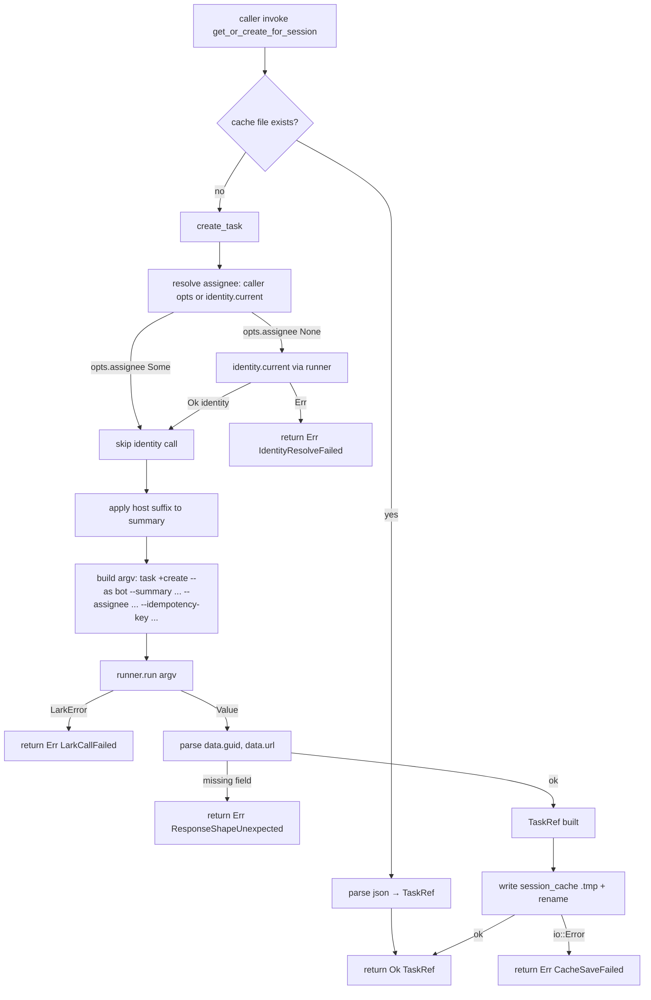

# bot-task-writer 设计

## 0. 决策头注

- **req 对齐**：`agent-work-in-feishu`——本 feature 是 req"agent 跑完出现在飞书任务卡里"的核心兑现层（第一砖）。bot-stop-hook（minimal-loop=true）才是 E2E 兑现点，本期是 bot-stop-hook 必经依赖
- **roadmap 上下文**：rust-rewrite §3 Module F 第 1 子 feature；消费 §4.1 LarkRunner trait（已 done）+ §4.6 Config（已 done）+ journal-core（已 done）；产物给 bot-stop-hook（下一 feature）消费
- **决策头**（user 拍板）：
  - **API 形状 = 纯库 API 3 pub fn**（不作为 Runner impl 挂 dispatcher registry——dispatcher.fire 不路由到 task_writer；bot-stop-hook 是 caller 直调）
  - **保留 host suffix**——`summary` 自动后缀 `· {host}`；host = `ROOSTERY_HOST` env > `hostname.split('.')[0]` > `"unknown"`；多机部署同账号下 task 列表能一眼区分来源
  - **部分失败 → Ok(TaskRef) + 独立 log**——`create_task` 成功 + `append_steps` 失败时返 `Ok(TaskRef)` 让 caller 仍能拿 url；append 错误走 `tracing::warn!` 不阻塞主流程；下次 `get_or_create_for_session` 走 session_cache 拿回同一 guid 自然重试 append

## 1. 范围 / 决策 / 明确不做 / 复杂度档位

### 1.1 必做（用户故事 → 行为）

| # | 行为 | 输入 | 期望可观察结果 |
|---|---|---|---|
| F1 | `create_task` 创建飞书 task | agent / cwd / summary / 可选 description / assignee_open_id / idempotency_key | 调 `lark-cli task +create --as bot --summary "{final}" [--description ...] [--assignee ...] [--idempotency-key ...]`；解 stdout JSON `data.guid` + `data.url` 返 `TaskRef { guid: TaskGuid, url: String }` |
| F2 | summary 自动加 host suffix | summary | 若 summary 不含 `· {host}` 后缀 → 追加；含 → 不重复加；host = `ROOSTERY_HOST` env > hostname 首段 > "unknown" |
| F3 | assignee 默认走 `identity::current` 解析 | assignee_open_id = None | 经 `LarkRunner` trait 调 `auth status` / `profile list` 拿当前 user open_id；得不到则不带 `--assignee`（task 仍可创建但不出现在用户"我的待办") |
| F4 | `append_steps` 追加步骤流 | task_guid / steps: &[&str] / 可选 idempotency_key | 调 `lark-cli task agent_task_step_info append_task_steps --as bot --data {json} --yes`；空 steps 直接 Ok(()) 不调 lark-cli |
| F5 | append_steps `--yes` flag | 任意调用 | 始终带 `--yes`（高风险写但是 bot 写自己创建的 task = agent 自描场景，等价 agent 内部行为，架构红线明示允许）|
| F6 | `get_or_create_for_session` session 维度幂等 | agent / session / cwd / summary / ... | 读 `~/.roostery/state/session_tasks/{safe_name}.json`：命中 → 返 cached TaskRef；未命中 → 调 create_task + 写 cache + 返 TaskRef |
| F7 | session cache schema v1 | 持久化 | JSON 文件 `{ schema_version: 1, task_guid, task_url, created_at: RFC3339, summary }`；atomic `.tmp` + rename 写；缺父目录自建 |
| F8 | safe filename 防路径跳出 | (agent, session) | 非 `[A-Za-z0-9._-]` 字符替换 `_`；连续 `..` 替换 `__`；末尾加 `.json` |
| F9 | TaskGuid newtype | 暴露类型 | `pub struct TaskGuid(String)` `#[serde(transparent)]` + business-identifier-newtype decision 一致；和 task_url 字符串分层 |
| F10 | TaskWriterError 颗粒度 | 错误返还 | `#[non_exhaustive]` 5 变体（LarkCallFailed / ResponseShapeUnexpected / CacheLoadFailed / CacheSaveFailed / IdentityResolveFailed）|
| F11 | LarkRunner 依赖注入 | 顶层 fn 签名 | 三 pub fn 都 take `runner: &dyn LarkRunner`；测试用 MockLarkRunner，生产用 LarkCli 通过 Journaled 装饰器走 journal |
| F12 | tracing instrument | log 输出 | `create_task` / `append_steps` 用 `tracing::warn!` 在部分失败路径打 task_guid / source；caller 看 ~/.roostery/journal/ 同时能在 stderr 看到 |

### 1.2 关键决策（D1-D14）

| # | 决策 | 理由 |
|---|---|---|
| D1 | 纯库 API 3 pub fn（不是 Runner impl）| user 拍板；与 Python parity；bot-stop-hook 是 caller 直调；如未来真有"用户在 rules.yaml 路由到 bot_task_writer"需求，新开 feature 加 BotTaskWriterRunner wrap，不阻塞当前 |
| D2 | 保留 host suffix（ROOSTERY_HOST env > hostname）| user 拍板；Python 实战验证有用；不沿用 `FEISHU_HUB_HOST`（attention.md 已记 ROOSTERY_* 切口径） |
| D3 | 部分失败 Ok(TaskRef) + log | user 拍板；task 已存在是可见事实，不要因为 append 错就丢 url；幂等性靠下次 get_or_create_for_session 重试自然走 |
| D4 | append_steps 始终 `--yes`（架构红线允许）| Python parity；agent 写自己创建的 task 等价 agent 内部行为；不需要每步用户同意。设计 doc 显式标这条破例理由，accept 阶段进 ARCHITECTURE 已知约束 |
| D5 | 三 pub fn take `&dyn LarkRunner`（不 take Arc）| 与 identity::current 同模式；caller 决定 Arc / Box / 借用；mod 顶层不强 Arc |
| D6 | TaskGuid newtype + serde transparent | business-identifier-newtype decision 一致；trace.rs TraceId 同模式 |
| D7 | TaskWriterError 5 变体 | error 颗粒度按 idiom #2；CacheLoadFailed / CacheSaveFailed 单独分（io 错误 vs lark 错误根本不同） |
| D8 | session cache JSON 文件路径 `~/.roostery/state/session_tasks/{safe}.json` | 与 Python 一致；不沿用 `~/.feishu_hub/`（attention.md 已记 `~/.roostery/` 切口径）|
| D9 | session cache schema_version=1 公开承诺 | 同 BudgetState / JournalEntry 模型；未来字段增改要 bump |
| D10 | safe_filename 过滤 + `..` 重复消除 | Python parity；路径跳出防御 |
| D11 | atomic 写 cache（.tmp + rename） | 与 budget.save 同模式；防写中崩坏文件 |
| D12 | idempotency_key 默认 `f"{agent}-session-{session}"` | Python parity；让 lark-cli `--idempotency-key` 同 session 多次创建不重复 |
| D13 | host_suffix 检测幂等 | Python parity；avoid `summary · host · host` 重复加 |
| D14 | bot_task_writer 模块文件名 `bot_task_writer.rs`（顶层）| Module F 第 1 子 feature；同 Module E 模式后续聚 `src/bot/` 子目录推到 Module F 全部完成后走 cs-refactor。当前顶层 12 → 13 < 20 容忍区 |

### 1.3 明确不做（acceptance 反向核对项）

| # | 不做 | grep 守护 |
|---|---|---|
| N1 | 不实装 BotTaskWriterRunner（不是 Runner impl）| `grep -E 'impl Runner for|BotTaskWriterRunner' crates/roostery/src/bot_task_writer.rs` → 0 |
| N2 | 不读 `FEISHU_HUB_*` legacy env | `grep 'FEISHU_HUB_' crates/roostery/src/bot_task_writer.rs` → 0 |
| N3 | 不直接 `Command::new` 飞书 IO（必经 LarkRunner trait）| `grep -E 'Command::new|std::process::Command|tokio::process' crates/roostery/src/bot_task_writer.rs` → 0 |
| N4 | 不引 reqwest / openai / anthropic | `grep -E 'reqwest\|openai\|anthropic' crates/roostery/src/bot_task_writer.rs` → 0 |
| N5 | 不实装 IM 兜底（rule "task 创建失败发 IM"）| Phase 5 bot-stop-hook 范畴；`grep -E 'im_send\|fallback_im' crates/roostery/src/bot_task_writer.rs` → 0 |
| N6 | 不实装 task 状态更新 / 关闭 / 删除 | 仅 create + append；其他生命周期不在本期范畴 |
| N7 | 不实装多 task 批量创建 | 一次 call 一 task |
| N8 | 不实装 task list 查询 | get_or_create_for_session 走本地 cache 不 query 飞书 |
| N9 | 不实装多 assignee / multi-follower | 单 assignee 字段 |
| N10 | 不暴露 CLI 子命令 | `grep -E 'Command::Bot|Command::Task' crates/roostery/src/main.rs` → 0；本期 main.rs 不动 |
| N11 | 不动 stop hook sh 模板 | `git diff` 该文件 0 |
| N12 | 不实装 cache 过期清理 | 用户自管理 ~/.roostery/state/session_tasks/；本期无 TTL / GC |

### 1.4 复杂度档位

走默认档位 + 偏离信号 = "首次真消费 LarkRunner trait 做生产飞书 IO"：

- 单进程 / 单用户 / async LarkRunner trait 调用
- 三 pub fn 都是 async（runner.run 是 async）
- session cache 走同步 IO（小文件 atomic 写，无需 async）

### 1.5 Rust idiom checklist（来自 `2026-05-18-decision-rust-idiom-first.md` §28）

| # | idiom | 本 feature 应用 |
|---|---|---|
| 1 | 强类型 schema vs `Value` | `TaskRef` / `TaskGuid` / `SessionCacheEntry` 全 struct/newtype；lark-cli 返 JSON 用 serde struct 中间 deserialize |
| 2 | error 变体颗粒度 | `TaskWriterError` `#[non_exhaustive]` 5 变体 |
| 3 | newtype 隔离 | `TaskGuid(String)` `#[serde(transparent)]` 与 `business-identifier-newtype` decision 一致；与 `task_url: String` 分层（前者用 `lark-cli task lookup`，后者扔浏览器） |
| 4 | typestate | 不引入 |
| 5 | 零拷贝 + 借用优先 | 三 pub fn 参数全借用（`&dyn LarkRunner` / `&str`）；返 owned `TaskRef`（小 struct 简化） |
| 6 | 编译期 vs 运行时 | `SESSION_CACHE_SCHEMA_VERSION: u32 = 1` const + `DEFAULT_HOST_FALLBACK: &str = "unknown"` const |

## 2. 名词层与编排层

### 2.1 名词层（现状 → 变化）

**现状**（本 feature 消费）：

- `lark_cli::{LarkRunner, RunOptions, LarkError}`（已落地，feature `2026-05-16-lark-cli-wrapper`）—— `run / run_with_options` async API
- `identity::{Identity, IdentityError, current}`（已落地，feature `2026-05-18-roostery-init`）—— `pub async fn current(runner: &dyn LarkRunner) -> Result<Identity, IdentityError>`
- `paths::roostery_home`（已落地）—— `~/.roostery/` 根目录
- `journal::Journaled` 装饰器（已落地）—— caller 应用 Journaled<LarkCli> 让本模块的 lark-cli 调用自动写 journal

**变化**（本 feature 新增）：

#### 2.1.1 `crates/roostery/src/bot_task_writer.rs`（新建）

```rust
//! Bot identity task writer — Module F 第 1 子 feature.
//! 三 pub fn API：create_task / append_steps / get_or_create_for_session.

use crate::lark_cli::{LarkError, LarkRunner};
use serde::{Deserialize, Serialize};
use thiserror::Error;
use std::path::PathBuf;

pub const SESSION_CACHE_SCHEMA_VERSION: u32 = 1;
pub const DEFAULT_HOST_FALLBACK: &str = "unknown";

/// 飞书 Task 引用——`guid` 用 newtype 隔离防与 url / event_id 等其他 id-like 串混；
/// `url` 是浏览器可点的飞书任务页 URL，业务上扔 IM 消息 / docs 链接用。
#[derive(Serialize, Deserialize, Debug, Clone, PartialEq)]
pub struct TaskRef {
    pub guid: TaskGuid,
    pub url: String,
}

#[derive(Serialize, Deserialize, Debug, Clone, PartialEq, Eq, Hash)]
#[serde(transparent)]
pub struct TaskGuid(String);

impl TaskGuid {
    pub fn as_str(&self) -> &str { &self.0 }
    pub fn from_existing(s: impl Into<String>) -> Self { Self(s.into()) }
}

#[derive(Debug, Error)]
#[non_exhaustive]
pub enum TaskWriterError {
    #[error("lark-cli call failed: {source}")]
    LarkCallFailed { #[source] source: LarkError },
    #[error("lark-cli response shape unexpected (expected {expected}): got {raw_head:?}")]
    ResponseShapeUnexpected { expected: &'static str, raw_head: String },
    #[error("session cache load failed at {path}: {source}")]
    CacheLoadFailed { path: PathBuf, #[source] source: std::io::Error },
    #[error("session cache save failed at {path}: {source}")]
    CacheSaveFailed { path: PathBuf, #[source] source: std::io::Error },
    #[error("identity resolve failed: {0}")]
    IdentityResolveFailed(#[source] crate::identity::IdentityError),
}

/// bot 身份建任务。assignee_open_id=None 时走 identity::current 解析当前
/// user open_id 作 assignee（让 task 进入用户"我的待办"视图）。
pub async fn create_task(
    runner: &dyn LarkRunner,
    agent: &str,
    cwd: &str,
    summary: &str,
    opts: CreateTaskOptions<'_>,
) -> Result<TaskRef, TaskWriterError>;

/// bot 身份追加步骤流。空 steps 立即 Ok(()) 不调 lark-cli。
/// `--yes` 已内置：bot 写自己创建的 task 是 agent 内部行为，架构红线允许。
pub async fn append_steps(
    runner: &dyn LarkRunner,
    task_guid: &TaskGuid,
    steps: &[&str],
    opts: AppendStepsOptions<'_>,
) -> Result<(), TaskWriterError>;

/// (agent, session) 维度幂等：首次调用 create_task + 写 ~/.roostery/state/session_tasks/{}.json；
/// 后续 call 直接读 cache 返已有 TaskRef。
pub async fn get_or_create_for_session(
    runner: &dyn LarkRunner,
    agent: &str,
    session: &str,
    cwd: &str,
    summary: &str,
    opts: CreateTaskOptions<'_>,
) -> Result<TaskRef, TaskWriterError>;

/// 可选参数集合。`#[non_exhaustive]` + Default 让新增字段不破坏 caller。
#[derive(Default)]
#[non_exhaustive]
pub struct CreateTaskOptions<'a> {
    pub description: Option<&'a str>,
    pub assignee_open_id: Option<&'a str>,  // None 走 identity 解析
    pub idempotency_key: Option<&'a str>,
    pub host: Option<&'a str>,  // None 走 env / hostname
    pub profile: Option<&'a str>,
}

#[derive(Default)]
#[non_exhaustive]
pub struct AppendStepsOptions<'a> {
    pub idempotency_key: Option<&'a str>,
    pub profile: Option<&'a str>,
}
```

**调用示例**（bot-stop-hook 后续 feature pseudo）：

```rust
let runner = Journaled::new(LarkCli::new());
let ref_ = bot_task_writer::get_or_create_for_session(
    &runner,
    "cc",
    &session_id,
    &cwd,
    "Refactor module-e to subdir",
    Default::default(),
).await?;
bot_task_writer::append_steps(
    &runner,
    &ref_.guid,
    &["Read scan.md", "Move 7 files", "Update imports", "Tests pass"],
    Default::default(),
).await?;
```

#### 2.1.2 `crates/roostery/src/lib.rs`（修改）

加 `pub mod bot_task_writer;`

#### 2.1.3 `crates/roostery/Cargo.toml`

**0 新增依赖**——所有需要的（thiserror / serde / serde_json / tracing）均已在用。

### 2.2 编排层（现状 → 变化）

**现状**：Module C lark_cli wrapper / Module D config + identity / Module E dispatcher 已全部就绪；尚无业务模块**真正消费** LarkRunner trait 做生产飞书 IO（dispatcher 不走飞书；smoke / shim 走独立 I/O 路径）。

**变化**：本 feature 是首个生产业务消费 LarkRunner trait 的模块。

#### 2.2.1 主流程（mermaid）



#### 2.2.2 append_steps 流程

```
[empty steps?] -> yes -> Ok(())
              -> no -> [build data json: {task_guid, task_steps: [{content}]}]
                    -> [build argv: task agent_task_step_info append_task_steps --as bot --data ... --yes]
                    -> [runner.run argv]
                    -> Err(LarkCallFailed) | Ok(())
```

#### 2.2.3 流程级约束（不变量）

1. **三 pub fn 都 take `&dyn LarkRunner`**——caller 注入；生产期套 Journaled<LarkCli>，测试期用 MockLarkRunner
2. **不绕过 LarkRunner trait**：不 Command::new；不引 reqwest；架构红线
3. **host suffix 幂等**：检测 summary 已含 `· {host}` 不重复加
4. **session cache atomic 写**：.tmp + rename + 父目录自建
5. **safe_filename 路径跳出防御**：连续 `..` 替换 `__`
6. **append_steps `--yes` 始终带**：bot 写自己创建 task 是架构红线允许的破例（D4）
7. **append_steps 空 steps 短路**：避免无意义 lark-cli call
8. **部分失败语义**（caller layer，本模块只 surface 三 fn 错误）：caller 在 create_task OK 后 append_steps Err 时自决要不要继续；本模块 fn 不耦合 caller 编排
9. **host fallback 链**：`opts.host` > `ROOSTERY_HOST` env > `hostname.split('.')[0]` > `DEFAULT_HOST_FALLBACK = "unknown"`
10. **assignee 解析 fail-soft**：identity::current 失败 → 返 IdentityResolveFailed（**不** silently 不带 assignee，因为没 assignee 的 task 不进用户"我的待办"——用户预期 task 出现在自己 inbox 是核心 UX）。caller 若想容错可显式 catch

### 2.3 挂载点清单（"删了它 feature 是否消失"判据）

| # | 挂载点 | 位置 | 删了会怎样 |
|---|---|---|---|
| 1 | `pub mod bot_task_writer;` in lib.rs | `lib.rs` | 模块消失，bot-stop-hook caller 编译失败 |
| 2 | `bot_task_writer.rs::create_task / append_steps / get_or_create_for_session` 三 pub fn | `bot_task_writer.rs` | 删任一 fn 就缺基本能力 |
| 3 | `~/.roostery/state/session_tasks/` 目录使用 | `bot_task_writer.rs` | session 幂等机制消失；每次 stop hook 触发都新建一个 task |

**不列**（内部）：TaskWriterError 变体 / TaskRef 结构 / TaskGuid newtype / CreateTaskOptions 字段 / 常量 / 私有 helper（_safe_filename / _default_host / _session_cache_dir）

**反向核查**（grep `bot_task_writer::` 全 repo）：本期只在 lib.rs 暴露；caller bot-stop-hook 未来 feature 会在 main.rs / src/bot_*.rs 引用。本期外部引用 = 0（除测试）

**拔除沙盘推演**：删 `lib.rs::pub mod` + `src/bot_task_writer.rs` + 集成测试 → cargo build 通过；其他模块零反向依赖（task_writer 是 leaf 模块）；`~/.roostery/state/session_tasks/` 用户目录无 GC 但用户可手工清。可完整卸载。

### 2.4 推进策略（按 paradigm 切片）

| Step | Paradigm | 内容 | 退出信号 |
|---|---|---|---|
| S1 | 类型骨架 | 新建 `src/bot_task_writer.rs`；`TaskRef` / `TaskGuid` / `TaskWriterError` / `CreateTaskOptions` / `AppendStepsOptions` 类型定义；三 pub fn 签名 `todo!()`；2 const | cargo build；类型 trivial 单测（TaskGuid serde transparent / TaskWriterError display / 常量暴露）3+ |
| S2 | host suffix 私有 helper | `fn host_default() -> String`；`fn apply_host_suffix(summary: &str, host: &str) -> String`（幂等检测）| 4 单测（env 命中 / hostname fallback / unknown 兜底 / 幂等不重复加） |
| S3 | safe_filename helper | `fn safe_filename(agent: &str, session: &str) -> String`；非白名单字符替换 `_` + 连续 `..` 替换 `__` + .json 末尾 | 3 单测（普通名 / 特殊字符 / `..` 路径攻击） |
| S4 | session cache layer | `fn session_cache_dir() -> PathBuf`；`fn load_cache(path)` / `fn save_cache(path, &TaskRef)` 私有；JSON schema_version=1；atomic `.tmp` + rename | 4 单测（empty load 返 None / save round-trip / atomic 写不留 .tmp / schema_version 缺失向后兼容 read） |
| S5 | create_task 主流程 | argv 构造 + assignee 解析（identity::current 注入） + summary suffix + runner.run + parse stdout JSON → TaskRef；用 MockLarkRunner 注入响应 | 5 单测（happy 返 TaskRef / lark err 透传 / response 缺 guid 返 ResponseShapeUnexpected / assignee opts 优先 / assignee None 走 identity） |
| S6 | append_steps | argv + 空 steps 短路 + `--yes` 始终带 + idempotency_key 可选 | 3 单测（happy / empty steps short-circuit / lark err 透传） |
| S7 | get_or_create_for_session | 拼 cache path → load_cache → hit 返 / miss 调 create_task + save_cache | 3 单测（首次 create + save / 二次 hit 返 cached / cache 损坏走 create） |
| S8 | 集成测试 + 模块挂载 | lib.rs 加 pub mod；新建 `tests/bot_task_writer_integration.rs`：MockLarkRunner enqueue + 真 ~/.roostery/ tempdir 隔离 + 全链路 e2e（create → append → second get → cache hit） | 集成测试 3+ 全绿 |
| S9 | 完整验收 + 守护 grep + CI | 四命令本地全绿；N1-N12 + idiom grep 0 命中；推 CI | 本地四命令全绿；远端 CI 全绿；守护 grep 全 0 命中 |

### 2.5 结构健康度与微重构

**评估对象 1：要改的文件**

- `lib.rs` 加 1 行 pub mod；增量极小
- 无既有文件被结构性修改

**评估对象 2：新文件落入的目录**

- `crates/roostery/src/` 顶层 .rs 文件清单当前 = 12（refactor module-e-subdir 后）；本 feature 加 1 → 13 顶层
- compound decision `2026-05-16-rust-module-organization.md` 档 1-2 限定"业务模块化 .rs 文件 < 20 不强制目录化"，13 < 20 仍宽松区
- bot_task_writer.rs 估 ~280-380 LOC 产品 + ~150-200 LOC 测试；单文件合理（与 trace.rs / smoke.rs / hooks_merge.rs 同模式）

**结论**：**不做微重构**。

理由：(1) 顶层 13 < 20 容忍区，远低于 Module E 重构时的 19 接近上限；(2) bot_task_writer.rs 单文件含三 pub fn + 类型 + helper 是合理内聚；(3) **Module F `src/bot/` 子目录化推到 Phase 5 收尾**——bot-stop-hook + bot-bridge-cluster 两个剩余 sub-feature 跟着进来后 3 个文件一起进 src/bot/ 子目录，与 Module E 同模式

**超出范围的观察**：

- Phase 5 收尾建议走 `cs-refactor` 把 `bot_task_writer / bot_stop_hook / bot_bridge_*` 等所有 Module F 模块聚到 `src/bot/` 子目录（与 Module E module-e-subdir refactor 同 convention）
- `Journaled<LarkCli>` 在生产应用层装配是 caller 责任——本 feature 不替 caller 决定要不要套；bot-stop-hook 起来后建议 main.rs 入口装配统一一次

**建议沉淀的 convention**：本 feature 不引入新结构约定（Module F 子目录化 convention 与 Module E 重复）

## 3. 验收契约

### 3.1 类型 / 命名 C1.1-C1.5

| # | 场景 | 期望 |
|---|---|---|
| C1.1 | `TaskRef` 2 字段（guid: TaskGuid / url: String）全 pub | struct serde |
| C1.2 | `TaskGuid` newtype `#[serde(transparent)]` | 序列化为 bare string；`as_str / from_existing` API |
| C1.3 | `TaskWriterError` `#[non_exhaustive]` 5 变体 | LarkCallFailed / ResponseShapeUnexpected / CacheLoadFailed / CacheSaveFailed / IdentityResolveFailed |
| C1.4 | `CreateTaskOptions` / `AppendStepsOptions` `#[non_exhaustive]` + Default | 借用 lifetime；可选字段 Option |
| C1.5 | 2 const 公开（SESSION_CACHE_SCHEMA_VERSION / DEFAULT_HOST_FALLBACK）| 单测可访问 |

### 3.2 host suffix C2.1-C2.4

| # | 场景 | 期望 |
|---|---|---|
| C2.1 | `ROOSTERY_HOST` env 命中 | host_default 返该 env 值 |
| C2.2 | env 缺失 fallback hostname | host_default 返 hostname 首段（去 `.local` 等） |
| C2.3 | 都缺失 unknown 兜底 | 返 "unknown" |
| C2.4 | summary 含 `· {host}` 已有 | 不重复 suffix |

### 3.3 safe_filename C3.1-C3.3

| # | 场景 | 期望 |
|---|---|---|
| C3.1 | 普通 (agent, session) | `{agent}-{session}.json` |
| C3.2 | 特殊字符（`/` / `\` / 空格） | 替换 `_` |
| C3.3 | `..` 路径跳出尝试 | `..` → `__`；最终 filename 不含连续 `..` |

### 3.4 session cache C4.1-C4.4

| # | 场景 | 期望 |
|---|---|---|
| C4.1 | empty load（文件不存在） | 返 None |
| C4.2 | save → load round-trip | 字段全一致 |
| C4.3 | atomic 写不留 .tmp | save 后目录无 `.tmp` 后缀 |
| C4.4 | schema_version 缺失（旧 cache 兼容） | load 仍 Ok（不抛 SchemaVersionMismatch）|

### 3.5 create_task C5.1-C5.5

| # | 场景 | 期望 |
|---|---|---|
| C5.1 | happy MockLarkRunner 返 `{"data": {"guid": "g", "url": "u"}}` | Ok(TaskRef { guid: "g", url: "u" }) |
| C5.2 | LarkRunner Err | TaskWriterError::LarkCallFailed |
| C5.3 | response 缺 data.guid | TaskWriterError::ResponseShapeUnexpected { expected: "data.guid" } |
| C5.4 | assignee_open_id 显式传 | argv 含 `--assignee {val}`；不调 identity::current |
| C5.5 | assignee_open_id None | argv 含 `--assignee {identity 解 user_open_id}` 或 identity err 返 IdentityResolveFailed |

### 3.6 append_steps C6.1-C6.3

| # | 场景 | 期望 |
|---|---|---|
| C6.1 | empty steps | Ok(()) 不调 lark-cli（MockLarkRunner enqueue 数为 0） |
| C6.2 | 3 steps | argv 含 `--data {json with 3 task_steps}` + `--yes` |
| C6.3 | LarkRunner Err | TaskWriterError::LarkCallFailed |

### 3.7 get_or_create_for_session C7.1-C7.3

| # | 场景 | 期望 |
|---|---|---|
| C7.1 | 首次 call | 调 create_task + 写 session_cache + 返 TaskRef |
| C7.2 | 二次 call 同 (agent, session) | 不调 create_task；直接读 cache 返同 TaskRef |
| C7.3 | cache 损坏（手工写非法 JSON）| 走 create_task 路径（不阻塞）|

### 3.8 明确不做反向核查 C8（N1-N12 守护 grep）

### 3.9 模块级 C9.1-C9.5

| # | 命令 | 期望 |
|---|---|---|
| C9.1 | `cargo test --all` | lib 既有 + 本 feature ≥15 lib + ≥3 integ；全绿 |
| C9.2 | `cargo test --doc` | 全绿 |
| C9.3 | `cargo clippy --all-targets --all-features -- -D warnings` | 全绿 |
| C9.4 | `cargo fmt --all --check` | 全绿 |
| C9.5 | 守护 grep 0 命中（§1.3） | 通过 |

## 4. 架构 / requirement / roadmap 回写说明（acceptance 阶段执行）

- **`ARCHITECTURE.md §2 术语表`**：加 `TaskRef` / `TaskGuid` / `TaskWriterError` / `CreateTaskOptions` / `SESSION_CACHE_SCHEMA_VERSION` 词条
- **`ARCHITECTURE.md §3 Module F`**：加 `bot_task_writer` 模块描述（首个生产业务消费 LarkRunner trait 的模块；纯库 API 3 pub fn + session cache）；子 feature 清单 `bot-task-writer` 标 done
- **`ARCHITECTURE.md §5 关键架构决定` 或 §6 已知约束**：加 "append_steps `--yes` 是架构红线允许的破例（bot 写自己创建的 task = agent 内部行为）"——这条破例必须显式归档避免后续 PR 误以为是 bug
- **`.codestable/requirements/agent-work-in-feishu.md`**：变更日志加 2026-05-18 落地条目；**req 保持 `draft`**——升级 current 等 bot-stop-hook（minimal-loop）跑通端到端"agent 跑完出现在飞书任务卡里"再升
- **`.codestable/roadmap/rust-rewrite/rust-rewrite-items.yaml`**：`bot-task-writer` `planned → done`
- **`.codestable/roadmap/rust-rewrite/rust-rewrite-roadmap.md §5 第 15 项`**：标 done + 备注重写
- **`.codestable/compound/`**：不引入新 decision

## 5. 待 review 提示

请整体过一遍，重点：

1. **§1.2 D1**：纯库 API 3 pub fn（不挂 dispatcher registry）——bot-stop-hook 是 caller 直调
2. **§1.2 D2**：host suffix 保留（ROOSTERY_HOST env > hostname 首段）—— Python parity 实战验证
3. **§1.2 D3 + §2.2.3 不变量 8**：create_task OK + append fail 时 caller 自决；本模块 fn 不耦合编排
4. **§1.2 D4 + §2.2.3 不变量 6**：append_steps `--yes` 始终带——架构红线**显式破例**（bot 写自己创建的 task），acceptance 阶段写进 ARCHITECTURE §5/§6
5. **§2.2.3 不变量 10**：assignee 默认走 identity::current；identity 失败返 Err 不 silently 不带 assignee——保证 task 进入用户"我的待办"是核心 UX
6. **§2.5**：本期不做微重构（13 < 20 容忍区）；Module F 子目录化推到 Phase 5 收尾走 cs-refactor
