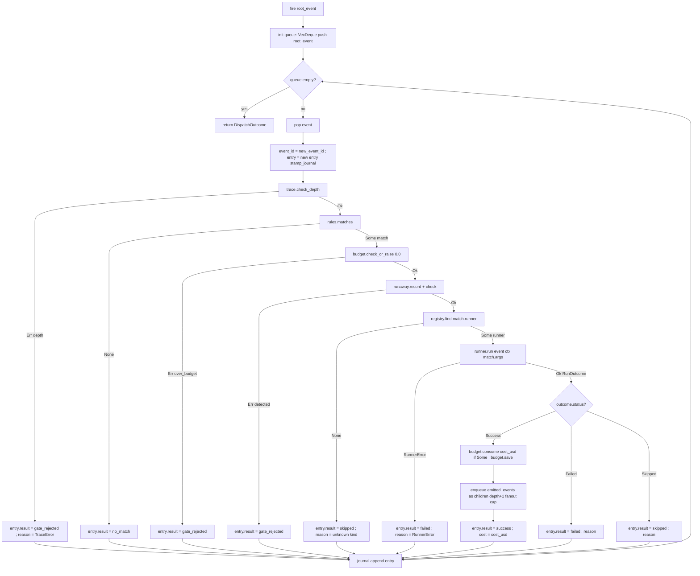

# dispatcher-loop 设计

## 0. 决策头注

- **req 对齐**：`runtime-neutral`——本 feature 是 req 的"换 runtime 飞书侧呈现不变"端到端核心兑现层。HookEvent in → 走规则 → 找 Runner → run → 出 RunOutcome / journal，dispatcher 完全不感知具体哪家 runtime
- **roadmap 上下文**：rust-rewrite §3 Module E 第 4 / 收尾子 feature；消费 §4.3 Runner trait（已 done）+ §4.4 HookEvent schema（已 done）+ §4.5 TraceContext（已 done）+ §4.6 Config（已 done）；本期不消费 §4.1 LarkRunner（dispatcher loop 本身不直接走飞书 IO，Phase 5 bot-task-writer feature 才接）
- **决策头**（用户拍板）：
  - replay 子命令 = **live-replay 真跑 runner**（不是 dry-replay；读 journal 重建 HookEvent 再走完整 fire）
  - emitted_events = **本期消费走自触发链式分发**；每条 emitted_event 作新 fire 输入，trace.depth +1，trace.check_depth gate 守爆炸
  - `roostery dispatcher fire` 退出码 = **始终 0 + journal 落档失败原因**（hook 调用方对错误不敏感，避 hook 链上下游被无效错误污染）
  - rules 命中但 runner kind 在 registry 找不到 = **RunOutcome::Skipped { reason: "unknown runner kind: …" }**（语义上"看见想跑但跑不动"，与 runtime-neutral "新 runtime 接入前用户感知 not supported" 一致；budget 不消费、journal 标 skipped）

## 1. 范围 / 决策 / 明确不做 / 复杂度档位

### 1.1 必做（用户故事 → 行为）

| # | 行为 | 输入 | 期望可观察结果 |
|---|---|---|---|
| F1 | `roostery dispatcher fire` 子命令 | flag 模式 `--agent <kind> --session <id> --cwd <path> --summary <text>`（已部署 stop hook sh 调用形态）；可选 `--stdin-event` 模式读 stdin JSON HookEvent | 合成 HookEvent → 走 fire 主链路 → 写 journal → **始终 exit 0**（错误吞 journal）；终端默认静默（stdout / stderr 空），`--verbose` 才打印 RunOutcome 摘要 |
| F2 | fire 主链路串场景 | HookEvent | 顺序经 `rules.matches → trace.check_depth → runaway.record + check → budget.check_or_raise → registry.find → runner.run → budget.consume(cost) + save → journal.append`；每 gate / step 失败走 short-circuit，但都 journal 落档 |
| F3 | unknown runner kind 处理 | rules 命中 `runner: "foo_bar"` 但 registry 没注册 | `RunOutcome::Skipped { reason: "unknown runner kind: foo_bar" }`；budget 不消费；journal 标 `result=skipped` + reason |
| F4 | 链式分发 emitted_events | runner 返 `RunOutcome.emitted_events: Vec<HookEvent>` 非空 | 每条 emitted_event 作 child event，`trace = Some(parent_ctx.child(...))`（depth +1）后再走 fire；trace.check_depth 守 max_depth 爆炸；runaway.record + check 防同 trace_id 高频自激 |
| F5 | self-event 短路（已存在） | rules `matches` 自带 self-event 前缀短路（`dispatcher.` / `roostery.`） | dispatcher 自身写出的 hook_source 不重新匹配规则；F4 链式分发的 emitted_event 走的是用户业务前缀，能被匹配 |
| F6 | `roostery dispatcher replay --trace <trace_id>` | journal 中找到该 trace_id 的根 entry | 从 journal 重建根 HookEvent（hook_source / session_id / workspace / trigger_meta）→ 调 fire；真跑 runner（含 cost 消费）；新 trace_id（不沿用原 trace_id 避混淆审计） |
| F7 | `roostery dispatcher test-rule` | flag 模式同 fire 或 `--stdin-event` | 走 `rules.matches` dry-run → 输出 match 形状（命中规则名 + runner kind + args 预览）；**不调 runner、不写 journal、不消费 budget**；rules 不命中输出 `no match` |
| F8 | DispatchOutcome 数据形状 | 内部类型 | `struct DispatchOutcome { trace_id, root_event_id, dispatched: Vec<DispatchStep> }`；每 step 含 hook_source / matched_rule / runner_kind / status / depth / event_id / 子 emitted_events 个数 |
| F9 | journal 读取 API | 文件系统的 jsonl 们 | `journal::load_by_trace_id(&dir, &trace_id) -> Result<Vec<JournalEntry>, JournalError>`；扫 journal_dir 下所有 jsonl 文件按 trace_id 过滤；公开给 replay 用 |
| F10 | tokio runtime 接入 | main.rs | dispatcher fire / replay 走 `tokio::runtime::Builder::new_current_thread()`（与 init 同模式）；`runner.run` 是 async（dispatcher-runners 已落） |
| F11 | DispatchError 类型 | 内部 | `#[non_exhaustive] enum DispatchError { ConfigLoadFailed / RulesLoadFailed / JournalDirNotFound / ReplayNotFound / EventReconstructFailed / BadCliInput }`；分层不与 RunnerError / RulesError / BudgetError 混；fire 内吞 → journal；replay 直接显示给用户 |
| F12 | 失败也写 journal | 任何 gate 拒绝 / runner failed / DispatchError | journal 总要落一条；`result` 字段标 `gate_rejected` / `skipped` / `failed` / `success`；reason 字段含原始 error 字符串 |

### 1.2 关键决策（D1-D14）

| # | 决策 | 理由 |
|---|---|---|
| D1 | fire 失败始终 exit 0 + journal 落档 | hook 调用方（CC SessionEnd sh）对错误不敏感（hook 已结束），分级 exit code 会污染 hook 链上下游；用户拍板 |
| D2 | emitted_events 本期消费走链式分发 | 自触发是 dispatcher 的核心能力；trace.max_depth + runaway 已有守门，链式爆炸已可控；推后到独立 feature 反而要重做基础设施 |
| D3 | replay 走 live 真跑 runner（不 dry） | 用户拍板；replay 价值 = "诊断时让某个 trace 链重新跑出真效果"；dry-replay 简单但价值低 |
| D4 | replay 分配新 trace_id 不沿用原 trace_id | 避审计混淆——原 trace_id 已落档；replay 应产生新一条独立审计链，journal 加 `replay_of` 字段指回源 trace_id |
| D5 | unknown runner kind = Skipped | 与 runtime-neutral req "新 runtime 接入前用户感知 not supported" 一致；budget 不消费；语义比 Failed 准确（没跑过怎么算失败） |
| D6 | DispatchError 是顶层 dispatcher 错误，不与 RunnerError 混 | RunnerError 4 变体已层级清晰；DispatchError 装"CLI 输入 / 配置 / journal 读取 / replay 找不到事件"等 dispatcher 编排层错误 |
| D7 | fire 默认从 CLI flag 合成 HookEvent，`--stdin-event` 走 stdin JSON | 与已部署 stop hook sh 兼容（sh 用 `--agent/--session/--cwd/--summary` 调用）；`--stdin-event` 留给 replay / 富 trigger_meta 场景 |
| D8 | fire 终端默认静默，`--verbose` 才打印 | hook 调用方 sh 已 `>/dev/null 2>&1`，默认输出本就被弃；verbose 给人工调试用 |
| D9 | dispatcher 模块文件名 `dispatcher.rs`（单文件） | 与现有 trace.rs / budget.rs / rules.rs / runners.rs 平级；不立 `dispatcher/` 子目录（顶层 18 → 19 仍 < 20 容忍区）；Phase 4 收尾后建议走 cs-refactor 一次性聚 trace+budget+runaway+hook_event+rules+runners+dispatcher 7 模块到 `dispatcher/` 子目录（与历次 acceptance observation 一致）|
| D10 | dispatcher.rs 不消费 LarkRunner trait | dispatcher 本身只做编排 + journal；飞书 IO 责任在 runner 实装内部（CcHeadless 调 claude binary，不调飞书）+ Phase 5 bot-task-writer feature；红线守护：grep `LarkRunner|lark_cli::` in dispatcher.rs → 0 |
| D11 | 自触发链式分发用循环（VecDeque<HookEvent>），不递归 | Rust async 递归要 Box::pin，复杂；循环 + push back to queue 简单且 stack-safe |
| D12 | trace.max_depth 是唯一深度守门（runaway 是事后兜底） | trace.check_depth 已存在；自触发 emitted_event 用 `ctx.child(...)` 自动 depth +1；超 max_depth → TraceError，journal 标 gate_rejected 后停止链 |
| D13 | journal::load_by_trace_id 实装为本 feature 的 journal 模块扩展（不新增模块） | journal 模块当前只有 append；加 load_by_trace_id 是 read path 启动，落在 journal.rs 同文件；replay 是唯一消费方 |
| D14 | clap subcommand 嵌套 `dispatcher { fire / replay / test-rule }` | 三子命令同属 dispatcher 域，flat 三个顶层子命令污染 main.rs；嵌套清晰 |

### 1.3 明确不做（acceptance 反向核对项）

| # | 不做 | grep 守护 |
|---|---|---|
| N1 | dispatcher.rs 不调 LarkRunner trait | `grep -E 'LarkRunner\|lark_cli::' crates/roostery/src/dispatcher.rs` → 0 |
| N2 | dispatcher.rs 不消费 reqwest / HTTP / 外部 LLM | `grep -E 'reqwest\|openai\|anthropic' crates/roostery/src/dispatcher.rs` → 0 |
| N3 | dispatcher.rs 不直接 spawn 子进程（runner 自己负责 spawn） | `grep -E 'Command::new\|std::process::Command\|tokio::process' crates/roostery/src/dispatcher.rs` → 0 |
| N4 | 不实装 dry-replay 模式 | replay 子命令无 `--dry` flag |
| N5 | 不实装 per-runner / per-rule budget bucket | `grep -E 'per_runner\|per_rule' crates/roostery/src/dispatcher.rs` → 0 |
| N6 | 不实装 cron / scheduler / daemon mode | `grep -E 'cron\|scheduler\|daemon\|tokio::time::interval' crates/roostery/src/dispatcher.rs` → 0 |
| N7 | 不实装规则热加载 | rules 在 fire / replay 入口加载一次，单次 dispatch 期间不重读 |
| N8 | 不实装 stop hook sh 模板替换（template 已稳定） | `crates/roostery/src/templates/agent_stop_notify.sh` 本期不动；改 template 走独立 feature |
| N9 | 不实装 dispatcher fire 重试 | `grep -E '\bretry\b\|max_retries' crates/roostery/src/dispatcher.rs` → 0 |
| N10 | 不实装 IM 兜底（rules 不命中时不发 IM） | rules 不命中 = `no_match` 写 journal 即可；IM 兜底是 Phase 5 bot-stop-hook 范畴 |
| N11 | 不实装多 trace 并发（单 fire 内 emitted_events 链式分发是串行队列） | `grep -E 'tokio::spawn\|join_all\|FuturesUnordered' crates/roostery/src/dispatcher.rs` → 0 |
| N12 | 不修改既有 dispatcher 上游模块（trace / budget / runaway / rules / runners / hook_event / journal）行为 | 仅 journal 加 `load_by_trace_id` 是新增 read API；其他 5 模块零改动（守护：git diff 仅 dispatcher.rs / main.rs / journal.rs / lib.rs / tests / Cargo.toml） |

### 1.4 复杂度档位

走默认档位 + 偏离信号 = "本地编排 + async runtime + 多模块串联"：

- 单进程 / 单用户 / `tokio::runtime::Builder::new_current_thread()` async runtime（与 init 同模式）
- 模块串联：5 上游 gate / engine 都已落地，本 feature 是"编排层"组装；无新基础设施需求
- async：仅 `runner.run` 是 async（dispatcher-runners 落地）；fire 主体可写成 async fn 让 await 自然
- replay 加载 journal 走同步 IO（journal jsonl 小、scan-once 即可）

### 1.5 Rust idiom checklist（来自 `2026-05-18-decision-rust-idiom-first.md` §28）

| # | idiom | 本 feature 应用 |
|---|---|---|
| 1 | 强类型 schema vs `Value` | `DispatchOutcome` / `DispatchStep` / `DispatchError` 全 struct/enum；本 feature 不引新 `Value` 字段 |
| 2 | error 变体颗粒度 | `DispatchError` `#[non_exhaustive]` 6 变体；不混 String reason；不与既有 RulesError / BudgetError / RunnerError 平铺合并 |
| 3 | newtype 隔离 | 不新引入；复用 trace.rs `TraceId` newtype |
| 4 | typestate | 不引入（fire 函数式风格更直接） |
| 5 | 零拷贝 + 借用优先 | DispatchStep 引用借用 trace_id / rule_name（生命周期同 DispatchOutcome） |
| 6 | 编译期 vs 运行时 | `DEFAULT_MAX_FANOUT: usize` const 守 emitted_events 链式分发的单 step 单批 fanout 上限（即使 trace.max_depth 守了深度，width 上限也需要） |

## 2. 名词层与编排层

### 2.1 名词层（现状 → 变化）

**现状**（本 feature 消费）：

- `hook_event::HookEvent`（已落地，feature `2026-05-18-dispatcher-rules`）—— `schema_version / hook_source / session_id / workspace / trigger_meta / trace: Option<TraceContext>` 6 字段
- `trace::{TraceContext, TraceId, TraceError, ENV_*}`（已落地）—— `new_root / child / check_depth / to_env_pairs / stamp_journal`
- `budget::{BudgetState, BudgetCfg, BudgetError, load, save}`（已落地）—— `check_or_raise / consume / roll_over_if_needed`
- `runaway::{RunawayTracker, RunawayError, DEFAULT_*}`（已落地）—— `record / check`
- `rules::{CompiledRule, Match, RulesError, RuleName, load, matches}`（已落地）—— `matches(rules, event) -> Option<Match>`
- `runners::{Runner, RunOutcome, RunnerStatus, RunnerError, RunnerRegistry, NoopRunner, CcHeadlessRunner}`（已落地）—— `registry.find(kind) -> Option<&dyn Runner>` / `runner.run(event, ctx, args).await`
- `journal::{Journal, JournalEntry, JournalResult, new_event_id}`（已落地）—— `Journal::open(dir) / append(entry)`；**当前只有 write API**
- `config::{Config, BudgetCfg, TraceConfig}`（已落地）
- `paths::{journal_dir, rules_path, budget_state_path}`（已落地）

**变化**（本 feature 新增）：

#### 2.1.1 `crates/roostery/src/dispatcher.rs`（新建）

```rust
//! Dispatcher loop — 串 trace/budget/runaway/rules/runners/journal 五模块为
//! `HookEvent in → DispatchOutcome out + journal` 主链路 + 三 CLI 子命令。

use crate::{
    budget, config, hook_event::HookEvent, journal, paths, rules, runaway::RunawayTracker,
    runners::{Runner, RunOutcome, RunnerError, RunnerRegistry, RunnerStatus},
    trace::{TraceContext, TraceError, TraceId},
};

/// 单次 fire 内单个 step 的 fanout 上限（防 runner 返巨量 emitted_events 把队列撑爆）。
pub const DEFAULT_MAX_FANOUT: usize = 16;

/// dispatcher 单次 fire 编排结果总览（含链式分发的所有 step）。
#[derive(Debug)]
pub struct DispatchOutcome {
    pub trace_id: TraceId,
    pub root_event_id: String,
    pub dispatched: Vec<DispatchStep>,  // 0 条 = rules 不命中或入口 gate 拒
}

#[derive(Debug)]
pub struct DispatchStep {
    pub event_id: String,
    pub hook_source: String,
    pub depth: u32,
    pub matched_rule: Option<String>,   // None = 不命中
    pub runner_kind: Option<String>,
    pub status: StepStatus,
    pub fanout: usize,                  // 触发的 emitted_events 个数（被消费的）
}

#[derive(Debug, PartialEq)]
pub enum StepStatus {
    Success,                  // runner OK
    Skipped { reason: String }, // unknown runner kind / runner 主动 skip
    GateRejected { reason: String }, // trace / budget / runaway gate 拒
    Failed { reason: String },  // RunnerError 或 runner 业务 Failed
    NoMatch,                    // rules 不命中
}

/// dispatcher 编排层错误（与 RunnerError / RulesError / BudgetError 分层）。
#[derive(Debug, thiserror::Error)]
#[non_exhaustive]
pub enum DispatchError {
    #[error("config load failed: {0}")] ConfigLoadFailed(#[source] config::ConfigError),
    #[error("rules load failed: {0}")] RulesLoadFailed(#[source] rules::RulesError),
    #[error("journal dir not found: {0}")] JournalDirNotFound(std::path::PathBuf),
    #[error("replay: no journal entry for trace_id {0}")] ReplayNotFound(String),
    #[error("replay: failed to reconstruct HookEvent from journal: {reason}")]
    EventReconstructFailed { reason: String },
    #[error("bad CLI input: {0}")] BadCliInput(String),
}

/// fire 主入口（async；runner.run 是 async）。
pub async fn fire(
    root_event: HookEvent,
    registry: &RunnerRegistry,
    rules: &[rules::CompiledRule],
    cfg: &config::Config,
) -> DispatchOutcome { /* ... */ }

/// replay 入口：读 journal 找 trace_id → 重建 HookEvent → 调 fire。
pub async fn replay(
    source_trace_id: &str,
    registry: &RunnerRegistry,
    rules: &[rules::CompiledRule],
    cfg: &config::Config,
) -> Result<DispatchOutcome, DispatchError> { /* ... */ }

/// test-rule 入口：rules.matches dry-run；不调 runner / 不写 journal。
pub fn test_rule(
    event: &HookEvent,
    rules: &[rules::CompiledRule],
) -> Option<rules::Match<'_>> { /* trivial wrapper */ }
```

**调用示例**（dispatcher fire from main.rs）：

```rust
let cfg = config::load()?;
let rules = rules::load()?;
let registry = RunnerRegistry::with_defaults();
let root = synth_hook_event_from_flags(&args, &cfg);
let outcome = rt.block_on(dispatcher::fire(root, &registry, &rules, &cfg));
// outcome 落终端（verbose 模式打印；默认静默）
```

#### 2.1.2 `crates/roostery/src/journal.rs`（修改：加 read API）

```rust
/// 扫 `dir` 下所有 jsonl 文件，挑出 trace_id 匹配的 entry，按文件名顺序（日期序）返回。
/// 性能：journal 文件小（默认按日 rotate），全量扫描 OK。
pub fn load_by_trace_id(
    dir: &Path,
    trace_id: &str,
) -> std::io::Result<Vec<JournalEntry>>;
```

**约束**：JournalEntry 已有 `trace_id` 字段（trace.stamp_journal 注入），filter 直接走该字段；jsonl 解析失败的行 skip + 不报错（journal 是 append-only，前向兼容）。

#### 2.1.3 `crates/roostery/src/main.rs`（修改：加 Dispatcher 子命令）

```rust
enum Command {
    Smoke,
    Init(InitArgs),
    Dispatcher(DispatcherArgs),
}

#[derive(Args)]
struct DispatcherArgs {
    #[command(subcommand)]
    sub: DispatcherSub,
}

#[derive(Subcommand)]
enum DispatcherSub {
    Fire(FireArgs),
    Replay(ReplayArgs),
    TestRule(TestRuleArgs),
}

#[derive(Args)]
struct FireArgs {
    #[arg(long)] agent: Option<String>,       // "cc" / "codex" / "gemini"
    #[arg(long)] session: Option<String>,
    #[arg(long)] cwd: Option<PathBuf>,
    #[arg(long)] summary: Option<String>,
    /// 从 stdin 读 JSON HookEvent，覆盖以上 flag；replay / 富 trigger_meta 用
    #[arg(long)] stdin_event: bool,
    #[arg(long)] verbose: bool,
}

#[derive(Args)]
struct ReplayArgs {
    #[arg(long)] trace: String,
    #[arg(long)] verbose: bool,
}

#[derive(Args)]
struct TestRuleArgs {
    // 同 FireArgs 输入选项；输出 match 形状
    #[arg(long)] agent: Option<String>,
    #[arg(long)] session: Option<String>,
    #[arg(long)] cwd: Option<PathBuf>,
    #[arg(long)] summary: Option<String>,
    #[arg(long)] stdin_event: bool,
}
```

#### 2.1.4 `crates/roostery/src/lib.rs`（修改）

加 `pub mod dispatcher;`

#### 2.1.5 `crates/roostery/Cargo.toml`

**0 新增依赖**——所有需要的（tokio / thiserror / serde / serde_json / clap）均已在用。

### 2.2 编排层（现状 → 变化）

**现状**：5 上游 gate / engine 各自独立可用，但没有 caller 把它们串起来。dispatcher 主链路不存在；hook sh 调 `roostery dispatcher fire` 会拿到 clap "unknown subcommand" 错误（被 `|| true` 吞掉）。

**变化**：本 feature 提供 fire / replay / test-rule 三入口；fire 是主链路 + emitted_events 链式分发；replay 借 fire；test-rule 仅匹配不执行。

#### 2.2.1 fire 主流程（mermaid）



**fire 实装结构**：

- 用 `VecDeque<HookEvent>` 做 BFS 队列（FIFO，避免 stack-recursion）
- 入口先 stamp root_event.trace = `Some(TraceContext::new_root(None, cfg.trace.max_depth))`
- 每 step 弹一个 event，把 step.event_id 注入 entry；entry.trace_id / depth / parent_event_id 走 trace.stamp_journal
- runner.run 返 RunOutcome.emitted_events 后，每条 child_event：
  - child_event.trace = `Some(parent_ctx.child(Some(step.event_id)))`（depth +1）
  - push 入 queue；**fanout cap = DEFAULT_MAX_FANOUT**——超出截断，journal 标 fanout_truncated
- 子事件出队时再走 trace.check_depth；超 max_depth 自动 gate_rejected

#### 2.2.2 replay 流程

1. `journal::load_by_trace_id(journal_dir, trace_id)` → Vec<JournalEntry>
2. 找根 entry（`depth == 0` 或 `parent_event_id is None`）；没找到 → DispatchError::ReplayNotFound
3. 从根 entry 重建 HookEvent：
   - `hook_source` ← entry.action（命名约定：journal action == hook_source）
   - `session_id` / `workspace` / `trigger_meta` ← entry.params（journal 写入时也 dump 进 params）
   - `trace: None`（fire 入口分配新 trace_id；journal 加 `replay_of: <source_trace_id>` meta 关联）
4. 重建失败 → `DispatchError::EventReconstructFailed`
5. 走 fire 主链路（同 F2）

**replay 不沿用原 trace_id**——避审计混淆。新 trace_id 在 entry.meta 或 trigger_meta 里加 `replay_of: <orig>` 字段便于人工追溯。

#### 2.2.3 test-rule 流程

```rust
pub fn test_rule(event: &HookEvent, rules: &[CompiledRule]) -> Option<Match<'_>>
```

main.rs 调用：

```rust
match dispatcher::test_rule(&event, &rules) {
    Some(m) => println!("MATCH: rule={} runner={} args={}", m.rule_name, m.runner, m.args),
    None => println!("NO MATCH"),
}
```

不写 journal、不 spawn runner、不消费 budget。

#### 2.2.4 流程级约束（不变量）

1. **失败也写 journal**：任何 gate / runner / DispatchError 失败路径都要 journal.append 一条带 `result` 状态的 entry；用户随时能从 journal 反查
2. **trace.max_depth 是唯一深度守门**：自触发 emitted_events 队列出队时走 trace.check_depth；超限 → gate_rejected + 不再展开该子树
3. **fanout 守 width**：单 step 单批 emitted_events 个数 ≤ DEFAULT_MAX_FANOUT（16）；超出截断 + journal 标 fanout_truncated
4. **budget gate 在 runner 调用前 check（0 cost）**：`budget.check_or_raise(0.0)` 守"是否已超额"；runner 成功后才走 `budget.consume(cost_usd if Some) + budget.save`
5. **runaway.record 在 budget 之后、registry.find 之前**：单 trace_id 在窗口内 record 次数 > threshold → gate_rejected
6. **dispatcher.rs 不直接走飞书 IO**：所有飞书写入是 runner 实装的事（CcHeadless 当前不写飞书；Phase 5 bot-task-writer feature 来写）；红线 grep N1 / N3 守护
7. **fire 内部错误吞 + journal**：DispatchError 在 fire 入口（rules load / config load）就会抛；fire 主循环里的 RunnerError / RulesError / BudgetError / TraceError 全捕走 journal，不冒泡到 CLI
8. **始终 exit 0**：main.rs `Command::Dispatcher(Fire)` 分支无论 outcome 如何始终 `ExitCode::SUCCESS`；replay / test-rule 走 DispatchError 时 exit 1（这俩用户主动调，对错误敏感）
9. **rules 加载一次**：fire / replay 入口加载一次 rules，链式分发期间不重读
10. **journal::load_by_trace_id 容错**：jsonl 解析失败行 skip + 不报错；journal 是 append-only 前向兼容

### 2.3 挂载点清单（"删了它 feature 是否消失"判据）

| # | 挂载点 | 位置 | 删了会怎样 |
|---|---|---|---|
| 1 | `pub mod dispatcher;` in lib.rs | `lib.rs` | dispatcher 编排层消失，main.rs 编译失败 |
| 2 | `Command::Dispatcher(DispatcherArgs)` in main.rs | `main.rs` | `roostery dispatcher` 子命令消失；hook sh 调用拿"unknown subcommand"（被 `|| true` 吞掉同 Phase 3 期间状态） |
| 3 | `journal::load_by_trace_id` | `journal.rs` | replay 子命令编译失败（无 journal read API） |

**不列**（内部）：DispatchOutcome / DispatchStep / DispatchError 私有结构、fire 内部辅助 fn、test-rule 实装。

**反向核查（grep）**：`grep -rE 'dispatcher::|fn fire|fn replay|test_rule' crates/roostery/{src,tests}` 命中的位置应只在：本 feature 的 dispatcher.rs / main.rs / 集成测试。零外部 / 上游模块引用——dispatcher 是终态 caller。

**拔除沙盘推演**：删挂载点 1 + 2 + 3 → cargo build 通过；trace / budget / runaway / rules / runners 上游模块零感知；hook sh 调用退回"unknown subcommand"被吞掉；用户感知 = 回到 Phase 3 期间状态。可完整卸载。

### 2.4 推进策略（按 paradigm 切片）

| Step | Paradigm | 内容 | 退出信号 |
|---|---|---|---|
| S1 | 类型骨架 | 新建 `src/dispatcher.rs`：`DispatchOutcome` / `DispatchStep` / `StepStatus` / `DispatchError` 全类型定义；`fire` / `replay` / `test_rule` 函数签名 `todo!()`；`DEFAULT_MAX_FANOUT` const | cargo build 成功；类型 trivial 单测（StepStatus eq / DispatchError display） |
| S2 | journal read API | journal.rs 加 `load_by_trace_id(dir, trace_id)`；扫 dir 下 jsonl 按 trace_id filter；jsonl 解析失败 skip | 3 单测（empty dir / single file 命中 / 多文件多 trace 过滤 / 解析失败行 skip） |
| S3 | fire 主链路（无 emitted_events） | `fire` 实装 BFS 队列但只处理根 event 一条；trace.check_depth + rules.matches + budget.check_or_raise + runaway + registry.find + runner.run + budget.consume + journal.append 顺序串；emitted_events 暂忽略 | 5 单测（happy success / no_match / unknown_kind skipped / budget over_budget gate_rejected / runner Failed） |
| S4 | emitted_events 链式分发 | 加 fanout cap + 子 event push back to queue + ctx.child + trace.stamp_journal；DEFAULT_MAX_FANOUT 截断 + journal 标 fanout_truncated | 3 单测（链式 2 层 success / 超 max_depth 第 2 层 gate_rejected / fanout 超 16 截断） |
| S5 | replay 主流程 | `replay(trace_id, registry, rules, cfg)`：load_by_trace_id → 找根 entry → 重建 HookEvent → 调 fire | 3 单测（happy replay / trace_id 不存在 ReplayNotFound / 根 entry 字段缺 EventReconstructFailed） |
| S6 | test-rule | `test_rule(event, rules) -> Option<Match>` trivial wrapper | 2 单测（命中返 Some / 不命中返 None） |
| S7 | CLI wiring | main.rs 加 `Command::Dispatcher`；clap subcommand 嵌套 `fire / replay / test-rule`；FireArgs / ReplayArgs / TestRuleArgs；flag 合成 HookEvent + `--stdin-event` 读 stdin；fire 始终 exit 0；replay / test-rule 走 DispatchError exit 1 | clap 解析单测；main 集成 smoke（不真跑 runner，registry 注入 NoopRunner） |
| S8 | 集成测试 | 新建 `tests/dispatcher_integration.rs`：fire happy / fire chain 2 层 / fire over_budget / fire over_depth / replay roundtrip / test-rule match-yes / test-rule match-no | 集成测试 ≥7 全绿 |
| S9 | 完整验收 + 守护 grep + CI | 四命令本地全绿；N1-N12 + idiom grep 0 命中；推 CI | 本地四命令全绿；远端 CI 全绿；守护 grep 全 0 命中 |

### 2.5 结构健康度与微重构

**评估对象 1：要改的文件**

- `lib.rs` 加 1 行 pub mod；增量极小
- `journal.rs` 加 1 个 read fn（~30-50 行 + 测试）；当前 journal.rs 仅有 write API，加 read 是自然扩张
- `main.rs` 加 Command::Dispatcher 分支 + 3 个 sub Args struct + 合成 HookEvent helper（~80-120 行）；当前 main.rs 110 行 → ~190-230 行；扩张可控

**评估对象 2：新文件落入的目录**

- `crates/roostery/src/` 顶层 .rs 文件清单当前 = 18（dispatcher-runners 后）；本 feature 加 1 → 19 顶层
- `.codestable/compound/2026-05-16-decision-rust-module-organization.md` 档 1-2 限定"业务模块化 .rs 文件 < 20 不强制目录化"，19 < 20 仍在容忍区
- dispatcher.rs 同时含 5 个类型 + 3 个公开 fn（fire / replay / test_rule）+ 内部辅助 fn；预估 ~400-600 LOC + ~100-150 LOC 内联测试；单文件合理（与 trace.rs / budget.rs / rules.rs 同模式）

**结论**：**不做微重构**。

理由：(1) 顶层 19 < 20 容忍区；(2) dispatcher.rs 单文件 5 类型 + 3 公开 fn 是合理内聚（fire / replay / test_rule 共享同一 DispatchOutcome / DispatchError 命名空间）；(3) **dispatcher/ 子目录化建议**自 dispatcher-trace-budget / dispatcher-rules / dispatcher-runners 反复 flag——本 feature 是 Phase 4 收尾，**强烈建议本 feature acceptance 后立即走 `cs-refactor`** 把 trace / budget / runaway / hook_event / rules / runners / dispatcher 7 模块一次性聚到 `src/dispatcher/` 子目录（与所有前期 acceptance observation 一致；19 接近 20 上限，dispatcher 加入正好触发动作）

**超出范围的观察**：

- Phase 4 收尾 cs-refactor：dispatcher / 子目录化（上一段已述）。这是只搬不改行为的纯目录重组，属 cs-refactor 范畴，不阻塞本 feature
- 若 emitted_events 链式分发实战中出现需要持久化队列状态（崩溃后恢复）的场景，独立 feature `dispatcher-resumable-queue` 评估
- 若用户实战中要 cron / scheduler 触发的 dispatcher fire，独立 feature `dispatcher-scheduler`

**建议沉淀的 convention**：本 feature 不引入新结构约定。

## 3. 验收契约

### 3.1 类型 / 命名 C1.1-C1.5

| # | 场景 | 期望 |
|---|---|---|
| C1.1 | `DispatchOutcome` 3 字段（trace_id / root_event_id / dispatched） | struct + pub |
| C1.2 | `DispatchStep` 7 字段（event_id / hook_source / depth / matched_rule / runner_kind / status / fanout） | struct + pub |
| C1.3 | `StepStatus` 5 态（Success / Skipped { reason } / GateRejected { reason } / Failed { reason } / NoMatch） | enum + pub |
| C1.4 | `DispatchError` `#[non_exhaustive]` 6 变体 | ConfigLoadFailed / RulesLoadFailed / JournalDirNotFound / ReplayNotFound / EventReconstructFailed / BadCliInput |
| C1.5 | `DEFAULT_MAX_FANOUT: usize = 16` const 公开 | 可访问 |

### 3.2 fire 主链路 C2.1-C2.10

| # | 场景 | 期望 |
|---|---|---|
| C2.1 | rules 不命中 | DispatchOutcome.dispatched 1 step.status = NoMatch；journal 写 result=no_match |
| C2.2 | rules 命中 + runner success | step.status = Success；budget.consume(cost) called；journal result=success + cost |
| C2.3 | rules 命中 + unknown runner kind | step.status = Skipped { reason: "unknown runner kind: ..." }；budget 不 consume；journal result=skipped |
| C2.4 | rules 命中 + runner Failed (exit ≠ 0) | step.status = Failed { reason }；budget 不 consume；journal result=failed |
| C2.5 | rules 命中 + RunnerError (binary 不存在) | step.status = Failed { reason: RunnerError display }；journal result=failed |
| C2.6 | trace.check_depth 超 max_depth | step.status = GateRejected；journal result=gate_rejected + reason |
| C2.7 | budget.check_or_raise 超额 | step.status = GateRejected；journal result=gate_rejected |
| C2.8 | runaway.check 触发 | step.status = GateRejected；journal result=gate_rejected |
| C2.9 | fire 永不冒泡错误 | 任何分支返 DispatchOutcome（不 Err）；exit code 0 |
| C2.10 | 每 step 都写 journal | dispatched.len() == journal entries 新增数（同 trace_id 过滤） |

### 3.3 emitted_events 链式分发 C3.1-C3.4

| # | 场景 | 期望 |
|---|---|---|
| C3.1 | runner 返 emitted_events 1 条 | 子 event 入队走 fire；DispatchOutcome.dispatched 含 2 step（root + child）；child.depth = root.depth + 1 |
| C3.2 | runner 返 emitted_events 2 条 + 2 层链 | dispatched ≥ 3 step；BFS 顺序 |
| C3.3 | 链式触发超 max_depth | 第 N+1 层 step.status = GateRejected；不继续展开 |
| C3.4 | fanout 超 DEFAULT_MAX_FANOUT (16) | 超出截断；root step.fanout = 16；journal entry 加 `fanout_truncated: true` 字段（或 reason 注明） |

### 3.4 replay C4.1-C4.4

| # | 场景 | 期望 |
|---|---|---|
| C4.1 | replay 真跑 happy | 读 journal 找根 entry → 重建 HookEvent → 走 fire；新 trace_id；journal entry 加 `replay_of: <orig>` meta |
| C4.2 | replay 不存在 trace_id | Err(DispatchError::ReplayNotFound) |
| C4.3 | replay 根 entry 字段缺（hook_source / session_id 缺失） | Err(DispatchError::EventReconstructFailed { reason }) |
| C4.4 | replay exit 1（与 fire 不同） | main.rs Dispatcher::Replay 分支 DispatchError → ExitCode::from(1) |

### 3.5 test-rule C5.1-C5.2

| # | 场景 | 期望 |
|---|---|---|
| C5.1 | test_rule 命中 | 返 Some(Match); main.rs 打印 `MATCH: rule=... runner=... args=...` |
| C5.2 | test_rule 不命中 | 返 None; main.rs 打印 `NO MATCH`；不写 journal、不消费 budget |

### 3.6 CLI 集成 C6.1-C6.5

| # | 场景 | 期望 |
|---|---|---|
| C6.1 | `roostery dispatcher fire --agent cc --session s1 --cwd /tmp --summary "hi"` | 合成 HookEvent { hook_source: "cc-stop", session_id: "s1", workspace: "/tmp", trigger_meta: {"summary": "hi"} }；exit 0 |
| C6.2 | `roostery dispatcher fire --stdin-event` + stdin JSON | 解析 stdin 为 HookEvent；走 fire；exit 0 |
| C6.3 | `roostery dispatcher fire --verbose` | stdout 打印 DispatchOutcome 摘要（dispatched.len + 每 step.status） |
| C6.4 | `roostery dispatcher replay --trace abc123` | 走 replay；exit 0 or 1 |
| C6.5 | `roostery dispatcher test-rule --agent cc --cwd /tmp` | 走 test_rule；stdout 打印 MATCH / NO MATCH；exit 0 |

### 3.7 明确不做反向核查 C7（执行 1.3 节守护 grep N1-N12 + idiom grep）

### 3.8 模块级 C8.1-C8.5

| # | 命令 | 期望 |
|---|---|---|
| C8.1 | `cargo test --all` | lib 既有 291 + 本 feature ≥18；集成 ≥7；全绿 |
| C8.2 | `cargo test --doc` | 全绿 |
| C8.3 | `cargo clippy --all-targets --all-features -- -D warnings` | 全绿 |
| C8.4 | `cargo fmt --all --check` | 全绿 |
| C8.5 | 守护 grep 0 命中（见 §1.3） | 通过 |

## 4. 架构 / requirement / roadmap 回写说明（acceptance 阶段执行）

- **`ARCHITECTURE.md §2 术语表`**：加 `DispatchOutcome` / `DispatchStep` / `StepStatus` / `DispatchError` / `DEFAULT_MAX_FANOUT` 词条；journal 词条补充 `load_by_trace_id` API
- **`ARCHITECTURE.md §3 Module E`**：加 `dispatcher` 模块描述（fire 主链路 + replay + test-rule + emitted_events 链式分发）；子 feature 清单 `dispatcher-loop` 标 done；标 Module E **整个 Phase 4 完成**
- **`ARCHITECTURE.md §4 契约`**：4.4 HookEvent 在生产路径上已被 fire 消费；4.5 TraceContext 同；状态在表中刷
- **`ARCHITECTURE.md §6 已知约束`**：加 "dispatcher.rs 不消费 LarkRunner trait / 不直接 spawn 子进程"；加 "fire 始终 exit 0；replay/test-rule 走 DispatchError exit 1"；加 "emitted_events 链式分发 fanout cap + trace.max_depth 守爆炸"
- **`.codestable/requirements/runtime-neutral.md`**：变更日志加 2026-05-18 落地条目；**评估升级 draft → current**——本 feature 是端到端兑现层（HookEvent 进，RunOutcome 出，dispatcher 不感知 runtime），但用户感知"换 runtime 飞书侧呈现不变"还要等 Phase 5 bot-task-writer + bot-stop-hook 才完整。建议保持 draft，由 Phase 5 bot-stop-hook acceptance 时一次性升级
- **`.codestable/roadmap/rust-rewrite/rust-rewrite-items.yaml`**：`dispatcher-loop` `planned → done`
- **`.codestable/roadmap/rust-rewrite/rust-rewrite-roadmap.md §5 第 14 项`**：标 done + 备注重写
- **`.codestable/roadmap/rust-rewrite/rust-rewrite-roadmap.md §4.3`**：建议同时做 `cs-roadmap update` 把 §4.3 原契约按 dispatcher-runners 偏离声明改齐（run 不收 BudgetGate / RunOutcome 加 cost_usd）
- **`.codestable/compound/`**：本 feature 不引入新 decision；acceptance 阶段推送做 cs-refactor 把 7 模块聚到 dispatcher/ 子目录

## 5. 待 review 提示

请整体过一遍，重点：

1. **§1.2 D2 + D11**：emitted_events 链式分发用 BFS 循环 + `VecDeque<HookEvent>` 队列；trace.max_depth + fanout cap (16) 双守门
2. **§1.2 D3 + D4**：replay 走 live 真跑 runner + 分配新 trace_id（不沿用原 trace_id）；journal entry 加 `replay_of` 字段关联源 trace_id
3. **§1.2 D5**：unknown runner kind → RunOutcome::Skipped（不是 Failed）
4. **§1.2 D7**：fire 默认从 CLI flag 合成 HookEvent（兼容已部署 stop hook sh）；`--stdin-event` 留给 replay / 富 trigger_meta
5. **§1.2 D8**：fire exit 0 始终；replay / test-rule 走 DispatchError exit 1（用户主动调，对错误敏感）
6. **§1.2 D9 + §2.5**：单文件 dispatcher.rs 顶层 19 < 20 容忍区；**强烈建议本 feature acceptance 后立即走 cs-refactor 把 7 模块聚到 src/dispatcher/**（自 dispatcher-trace-budget 起反复 flag，本期是 Phase 4 收尾正好触发动作）
7. **§2.1.2 journal::load_by_trace_id**：journal.rs 第一次加 read API（之前只 write）；性能上小文件全扫 OK；jsonl 解析失败行 skip
