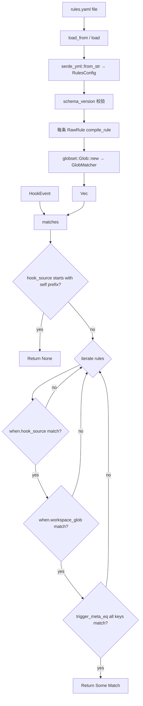

# dispatcher-rules 设计

## 0. 决策头注

- **req 对齐**：`runtime-neutral`——rules 不感知 runtime；Action 用 opaque `args: Value` 让各 Runner impl 自决怎么 parse
- **roadmap 上下文**：rust-rewrite §3 Module E 第 2 子 feature；接 §4.4 HookEvent schema；后续 dispatcher-loop 直接消费本 feature 的 `matches(event)` API
- **roadmap items.yaml notes 明示**："rule schema 重新设计"——拒绝 Python 1:1 翻译；HookEvent 形状变了，对应 match 维度全新
- **决策头**（用户拍板）：
  - Match = `hook_source` eq + `workspace_glob` fnmatch + `trigger_meta` 点路径 eq （3 维 MVP）
  - Action = `{ runner: String, args: Value }` opaque 透传，无 prompt / model / cwd 字段
  - 无模板引擎；模板渲染推到 Runner 内部
  - first-match-wins，返 `Option<Match>` 非 `Vec<Match>`

## 1. 范围 / 决策 / 明确不做 / 复杂度档位

### 1.1 必做（用户故事 → 行为）

| # | 行为 | 输入 | 期望可观察结果 |
|---|---|---|---|
| F1 | HookEvent schema 定义 | roadmap §4.4 | `#[non_exhaustive]` struct 6 字段；serde derive；`schema_version=1` const |
| F2 | RulesConfig YAML 反序列化 | `~/.roostery/rules.yaml` 或 `&Path` | `Vec<CompiledRule>`，校验 schema_version、name 唯一、runner 非空 |
| F3 | hook_source 精确匹配 | when.hook_source = "claude-code-stop" | `event.hook_source == "claude-code-stop"` 命中 |
| F4 | workspace fnmatch | when.workspace_glob = "~/Projects/**" | 用 `globset` 编译 GlobMatcher；`event.workspace` 匹配返 true |
| F5 | trigger_meta 点路径 eq | when.trigger_meta_eq = { "action": "stop", "user.role": "owner" } | 每条 key 点路径在 `event.trigger_meta` 中找到等值；所有 key 都满足才命中 |
| F6 | AND 多维度 | when 含 1+ 维度 | 所有维度都必须满足 |
| F7 | first-match-wins | `matches(rules, event) -> Option<Match>` | 按 rules 顺序第一条全命中即返；之后规则不再考虑 |
| F8 | Self-event 防自激 | event.hook_source starts_with "dispatcher." / "roostery." | 直接返 None，跳过所有规则 |
| F9 | Action 透传 | matched rule | `Match { rule_name, runner, args: Value }`；rules 不解释 args |
| F10 | 文件不存在 → 空规则集 | rules.yaml 缺 | 返 `Ok(vec![])`（first-run 装机友好）；不报错 |
| F11 | YAML 非法 / schema_version != 1 | parse 失败 | `RulesError::ParseFailed` / `SchemaVersionMismatch` 含 path + reason |

### 1.2 关键决策（D1-D10）

| # | 决策 | 理由 |
|---|---|---|
| D1 | Match 维度 3 项 MVP（user 拍板） | 与 HookEvent §4.4 字段集对齐；Python parity 的 actor.agent / event_type / tags 是 legacy envelope 字段不适用 |
| D2 | Action opaque `args: Value` 透传（user 拍板） | rules 模块单一职责（只决定"哪条规则 + 哪个 runner"），不解释 runner 内部需要的参数 |
| D3 | 无模板引擎（user 拍板） | runner 拿到 `HookEvent + args: Value` 自决 prompt 拼法；rules 模块零模板依赖 |
| D4 | first-match-wins（user 拍板） | dispatcher-loop "一次事件一次派发"最简语义；continue 链式真要时再加 |
| D5 | workspace_glob 用 `globset` crate | ripgrep team 维护、well-tested；自己 fnmatch→regex 容易踩边角（`**` vs `*` / 转义等） |
| D6 | YAML 反序列化用 `serde_yml`（既有依赖） | 与 config-yaml feature 同栈；不引第二个 YAML 库 |
| D7 | Rules path 固定 `~/.roostery/rules.yaml`；走 `paths::rules_path()` | 与 `config.yaml` / `budget.json` 同目录约定 |
| D8 | Self-event prefix list = `["dispatcher.", "roostery."]` const | 防自激是 dispatcher 自己的责任而非 caller；本模块兜底守护更稳 |
| D9 | RulesError `#[non_exhaustive]` 4 变体（LoadFailed / ParseFailed / SchemaVersionMismatch / DuplicateRuleName） | error 颗粒度遵循 idiom #2 |
| D10 | HookEvent 落 `src/hook_event.rs` 独立文件，不进 rules.rs | HookEvent 是 §4.4 跨模块契约（loop / bot bridge 都消费），rules 仅是其消费者之一；独立成文件让其他 feature 引用清晰 |

### 1.3 明确不做（acceptance 反向核对项）

| # | 不做 | grep 守护 |
|---|---|---|
| N1 | 不实装模板引擎 / 字符串渲染 | `grep -E 'render\|template_render\|\{\{|handlebars|tinytemplate' src/rules.rs src/hook_event.rs` → 无 |
| N2 | 不消费 Runner trait / runner_registry（Phase 4 dispatcher-runners） | `grep -E 'Runner|runner_registry' src/{rules,hook_event}.rs` → 仅作为 args.runner: String 字面字段名 |
| N3 | 不消费 budget / runaway / trace（caller dispatcher-loop 串场景） | `grep -E 'BudgetState\|RunawayTracker\|TraceContext' src/{rules,hook_event}.rs` → 仅 HookEvent.trace 字段（§4.4 契约要求） |
| N4 | 不实装 continue 链式 | `grep -E '"continue"\|\.cont\b' src/rules.rs` → 无 |
| N5 | 不实装 switch_by_field / branches | `grep -E 'switch_by_field\|branches' src/rules.rs` → 无 |
| N6 | 不实装 budget_override / result_writeback | `grep -E 'budget_override\|result_writeback' src/rules.rs` → 无 |
| N7 | 不读 `FEISHU_HUB_*` legacy env | `grep 'FEISHU_HUB_' src/{rules,hook_event}.rs` → 无 |
| N8 | 不暴露 CLI 子命令（dispatcher-loop feature 才加） | `grep 'Command::Rules' src/main.rs` → 无 |
| N9 | 不消费 LarkRunner trait（rules 无飞书 IO） | `grep -E 'LarkRunner|lark_cli::' src/{rules,hook_event}.rs` → 无 |
| N10 | 不实装 rule disable / priority / tags 字段 | `grep -E 'disabled\|priority\|tags' src/rules.rs` → 无（除非测试 fixture） |

### 1.4 复杂度档位

走默认档位（CLI tool / 同步代码 / 文件读 IO only）。**偏离信号**：无 SDK / 无高并发 / 无 async。所有 fn sync。`globset` 是 ripgrep 团队维护的稳定 crate，**0 transitive heavy deps**（已 vetted）。

### 1.5 Rust idiom checklist（来自 `2026-05-18-decision-rust-idiom-first.md` §28）

| # | idiom | 本 feature 应用 |
|---|---|---|
| 1 | 强类型 schema vs `Value` | `HookEvent` / `RuleWhen` / `RuleAction` / `CompiledRule` / `RulesConfig` 全 struct；唯一 `Value` 出现在 `RuleAction.args` 和 `HookEvent.trigger_meta`——前者契约性 opaque 透传给 runner，后者 §4.4 契约就是 `Value` |
| 2 | error 变体颗粒度 | `RulesError` `#[non_exhaustive]` 4 变体（LoadFailed / ParseFailed / SchemaVersionMismatch / DuplicateRuleName）；不混 String reason |
| 3 | newtype 隔离 | `RuleName(String)` `#[serde(transparent)]` newtype（与 `business-identifier-newtype` decision 一致；防与 runner_kind / hook_source 字符串混用）；`HookSource(String)` 不立 newtype（仅 hook_source eq 一处用，过度 newtype 化反成 noise）|
| 4 | typestate | `Rule`（YAML 解析后未编译）→ `CompiledRule`（含 `GlobMatcher` 实例）二态分离——caller 拿到 `Vec<CompiledRule>` 编译期保证 glob 已编译过 |
| 5 | 零拷贝 + 借用优先 | `matches(&[CompiledRule], &HookEvent) -> Option<Match<'_>>`；`Match { rule_name: &'a str, runner: &'a str, args: &'a Value }` 借用引用 rules / event 字段 |
| 6 | 编译期 vs 运行时 | `RULES_SCHEMA_VERSION: u32 = 1` const；self-event prefix list 用 `&[&'static str]` const |

## 2. 名词层与编排层

### 2.1 名词层（现状 → 变化）

**现状**：

- `crates/roostery/src/trace.rs` `TraceContext`（§4.5 已落地）
- `crates/roostery/src/budget.rs` `BudgetState`（roadmap §4.6 已落地）
- `crates/roostery/src/config.rs` `Config` / `BudgetCfg` / `TraceConfig`（feature `2026-05-17-config-yaml`）
- `crates/roostery/src/paths.rs` `roostery_home()` / `config_path()` / `budget_state_path()`；**缺** `rules_path()`
- 无 HookEvent / Rule / RuleAction / RulesConfig 类型

**变化**：

#### 2.1.1 `crates/roostery/src/hook_event.rs`（新建）

```rust
//! HookEvent (roadmap §4.4) — 跨模块契约：dispatcher 入口数据形状。

use crate::trace::TraceContext;
use serde::{Deserialize, Serialize};
use std::path::PathBuf;

pub const HOOK_EVENT_SCHEMA_VERSION: u32 = 1;

#[derive(Serialize, Deserialize, Debug, Clone)]
#[non_exhaustive]
pub struct HookEvent {
    pub schema_version: u32,           // const 1
    pub hook_source: String,           // "claude-code-stop" | "codex-stop" | ...
    pub session_id: String,
    pub workspace: PathBuf,
    pub trigger_meta: serde_json::Value,  // opaque runtime payload
    #[serde(default)]
    pub trace: Option<TraceContext>,   // 外部 hook 必为 None；内部链路填
}

impl HookEvent {
    /// dotted path lookup into `trigger_meta`. Returns `None` if any segment
    /// missing or non-object. Used by `rules::Match` for trigger_meta_eq.
    pub fn trigger_meta_path(&self, path: &str) -> Option<&serde_json::Value>;
}
```

**调用示例**：
```rust
let ev: HookEvent = serde_json::from_str(stdin_json)?;
let v = ev.trigger_meta_path("user.role");  // None or Some(&Value)
```

#### 2.1.2 `crates/roostery/src/rules.rs`（新建）

```rust
//! Rule engine: YAML schema v1 + match HookEvent → Match.

use crate::hook_event::HookEvent;
use globset::{Glob, GlobMatcher};
use serde::{Deserialize, Serialize};
use std::collections::BTreeMap;
use std::path::Path;
use thiserror::Error;

pub const RULES_SCHEMA_VERSION: u32 = 1;

const SELF_EVENT_PREFIXES: &[&str] = &["dispatcher.", "roostery."];

#[derive(Serialize, Deserialize, Debug, Clone, PartialEq, Eq, Hash, PartialOrd, Ord)]
#[serde(transparent)]
pub struct RuleName(String);

impl RuleName {
    pub fn as_str(&self) -> &str;
}

#[derive(Deserialize, Debug, Clone)]
pub struct RulesConfig {
    pub schema_version: u32,
    #[serde(default)]
    pub rules: Vec<RawRule>,
}

#[derive(Deserialize, Debug, Clone)]
pub struct RawRule {
    pub name: RuleName,
    pub when: RuleWhen,
    pub action: RuleAction,
}

#[derive(Deserialize, Debug, Clone, Default)]
pub struct RuleWhen {
    #[serde(default)]
    pub hook_source: Option<String>,
    #[serde(default)]
    pub workspace_glob: Option<String>,
    #[serde(default)]
    pub trigger_meta_eq: BTreeMap<String, serde_json::Value>,
}

#[derive(Deserialize, Serialize, Debug, Clone)]
pub struct RuleAction {
    pub runner: String,
    #[serde(default)]
    pub args: serde_json::Value,  // opaque, passed through to Runner impl
}

/// Compiled-form rule. `workspace_glob` resolved into `GlobMatcher` once.
#[derive(Debug)]
pub struct CompiledRule {
    pub name: RuleName,
    pub hook_source: Option<String>,
    pub workspace: Option<GlobMatcher>,
    pub trigger_meta_eq: BTreeMap<String, serde_json::Value>,
    pub action: RuleAction,
}

#[derive(Debug, Clone)]
pub struct Match<'a> {
    pub rule_name: &'a RuleName,
    pub runner: &'a str,
    pub args: &'a serde_json::Value,
}

#[derive(Debug, Error)]
#[non_exhaustive]
pub enum RulesError {
    #[error("failed to read rules file {path}: {source}")]
    LoadFailed { path: PathBuf, #[source] source: io::Error },
    #[error("failed to parse rules YAML {path}: {source}")]
    ParseFailed { path: PathBuf, #[source] source: serde_yml::Error },
    #[error("rules schema version {found} not supported (expected {expected})")]
    SchemaVersionMismatch { found: u32, expected: u32 },
    #[error("duplicate rule name {name:?}")]
    DuplicateRuleName { name: RuleName },
    #[error("rule {name:?} has invalid workspace_glob {glob:?}: {source}")]
    InvalidGlob { name: RuleName, glob: String, #[source] source: globset::Error },
}

/// Load + compile in one go. Missing file → Ok(vec![]).
pub fn load() -> Result<Vec<CompiledRule>, RulesError>;
pub fn load_from(path: &Path) -> Result<Vec<CompiledRule>, RulesError>;

/// First-match-wins.
pub fn matches<'a>(rules: &'a [CompiledRule], event: &'a HookEvent) -> Option<Match<'a>>;
```

**调用示例**：
```rust
let rules = rules::load()?;
let ev: HookEvent = serde_json::from_str(stdin_json)?;
match rules::matches(&rules, &ev) {
    Some(m) => { /* dispatch m.runner with m.args */ }
    None => { /* skip — no rule matched */ }
}
```

**rules.yaml 示例**：
```yaml
schema_version: 1
rules:
  - name: cc-projects
    when:
      hook_source: "claude-code-stop"
      workspace_glob: "/Users/ben/Projects/**"
    action:
      runner: cc_headless
      args:
        prompt: "Summarize this session"
        model: sonnet-4
  - name: codex-only
    when:
      hook_source: "codex-stop"
      trigger_meta_eq:
        action: stop
    action:
      runner: codex_exec
      args: {}
```

#### 2.1.3 `crates/roostery/src/paths.rs`（修改）

```rust
pub fn rules_path() -> PathBuf {
    roostery_home().join("rules.yaml")
}
```

#### 2.1.4 `crates/roostery/src/lib.rs`（修改）

加 2 个 `pub mod`：`pub mod hook_event; pub mod rules;`

#### 2.1.5 `crates/roostery/Cargo.toml`（修改）

新增依赖 `globset = "0.4"`（ripgrep team；用于 fnmatch glob 编译）。`serde_yml` 已有（config-yaml）。

### 2.2 编排层（现状 → 变化）

**现状**：dispatcher 模块树仅有 trace / budget / runaway 三独立 gate（feature `2026-05-18-dispatcher-trace-budget`），无编排层。本 feature 不引入跨模块编排——rules 是纯函数库。

**变化**：rules 内部编排：



**上游 caller 编排预期**（dispatcher-loop feature 落实）：


本 feature 提供 A→B 节点；C-G 由 dispatcher-loop 拼接。

**流程级不变量**：

1. **load 缺文件 → Ok(vec![])**：first-run / 用户没配规则时 dispatcher-loop 不应报错只是 noop
2. **compile 一次性**：load 内部一次性把 glob 字符串编译成 `GlobMatcher`；matches 阶段不再走字符串
3. **first-match-wins**：matches 返第一个全命中即返；剩余规则不评估
4. **self-event 短路**：matches 第一步是 self-event 前缀检查，跳过所有规则
5. **AND 维度**：when 中所有非 None / 非空字段都必须满足
6. **CompiledRule 不可变**：load 后 caller 持有 `Vec<CompiledRule>`，matches 只读
7. **RULES_SCHEMA_VERSION=1 公开承诺**：bump 需 cs-roadmap update + 旧版兼容

### 2.3 挂载点清单（"删了它 feature 是否消失" 判据）

| # | 挂载点 | 位置 | 删了会怎样 |
|---|---|---|---|
| 1 | `pub mod rules;` in lib.rs | `lib.rs` | Rule engine 消失，dispatcher-loop 编译失败 |
| 2 | `pub mod hook_event;` in lib.rs | `lib.rs` | HookEvent 类型消失，rules 编译失败；loop / runner / hook bridge 都消费这个类型 |
| 3 | `paths::rules_path()` fn | `paths.rs` | rules 持久化目标路径无法集中复用 |
| 4 | `Cargo.toml` 加 `globset = "0.4"` | `Cargo.toml` | fnmatch 能力消失 |

**不列**（内部）：私有 fn / `RULES_SCHEMA_VERSION` const / `SELF_EVENT_PREFIXES` const。

**反向核查**：删 1-4 全部 → `cargo build` 编译失败仅在 `lib.rs`；trace / budget / runaway / journal / config 不受影响 → 边界清晰。

**拔除沙盘推演**：删 2 pub mod + paths fn + globset dep + 2 新文件 → cargo build 通过其他模块不感知；可完整卸载。

### 2.4 推进策略（按 paradigm 切片）

| Step | Paradigm | 内容 | 退出信号 |
|---|---|---|---|
| S1 | HookEvent 名词层 | 新建 `src/hook_event.rs`：`HookEvent` `#[non_exhaustive]` 6 字段 + `HOOK_EVENT_SCHEMA_VERSION` const + `trigger_meta_path` fn | trivial 单测（serde round-trip + schema_version const + trigger_meta_path 命中 / 缺失） |
| S2 | rules 类型骨架 | 新建 `src/rules.rs`：`RuleName` newtype + `RawRule` / `RuleWhen` / `RuleAction` / `CompiledRule` / `Match` / `RulesError` 全 declared；fn 签名 todo!() | cargo build 成功；类型 trivial 测试（Serde / Display） |
| S3 | YAML 加载 + 编译 | `load / load_from` 实装：serde_yml 反序列化 + schema_version 校验 + 重名校验 + glob 编译 | load 5+ 单测（missing 文件 / invalid yaml / wrong version / duplicate name / invalid glob / happy path） |
| S4 | 匹配实装 | `matches` 实装：self-event 短路 + AND 维度 + first-match-wins | matches 8+ 单测（self-event 短路 / 无规则 / 单维度命中 / AND 全过 / AND 部分过失败 / trigger_meta 缺路径 / first-match-wins / workspace_glob `**` 通配） |
| S5 | 挂载 + 集成测试 | lib.rs 加 pub mod；paths.rs 加 fn；新建 `tests/rules_integration.rs` 串场景：load real yaml → match real event → assert Match | 集成 3+ 测试全绿 |
| S6 | 完整验收 + 守护 grep + CI | 四命令本地全绿；N1-N10 + idiom grep 0 命中；推 CI | 本地四命令全绿；CI 三 job 远端绿 |

### 2.5 结构健康度与微重构

**评估对象 1：要改的文件**

- `lib.rs` 加 2 行 pub mod；`paths.rs` 加 3 行 fn；增量小
- `Cargo.toml` 加 1 行依赖
- 无既有文件被结构性修改

**评估对象 2：新文件落入的目录**

- `crates/roostery/src/` 顶层 .rs 文件清单当前 = 15（dispatcher-trace-budget 后），本 feature 加 2 → 17 顶层
- 查 `.codestable/compound/2026-05-16-decision-rust-module-organization.md` 档 1-2 限定 "业务模块化 .rs 文件 < 20 不强制目录化"，17 < 20 仍在容忍区
- dispatcher-trace-budget design §2.5 已 flag："Phase 4 收尾时若 dispatcher/ 子目录化 = 一次稳定 convention 触发点"——届时再评估

**结论**：**不做微重构**。

理由：(1) 顶层 17 < 20 容忍区；(2) hook_event.rs 与 rules.rs 互引但**与 trace / budget / runaway 互不引用**，物理打包成子目录无功能价值；(3) Phase 4 收尾时如果 dispatcher-loop 加上来会有 5-6 个 dispatcher 相关文件，**届时**一次性重组目录更准（避免每个 feature 都局部小拆）。

**超出范围的观察**：

- Phase 4 收尾（dispatcher-loop 落地后）建议走 `cs-refactor` 把 trace / budget / runaway / hook_event / rules + 后续 runners / loop 一次性聚到 `src/dispatcher/` 子目录。**本期不做**——design 2.5 边界守住"只搬不改行为"，提前重组目录会让 dispatcher-rules 这个 feature PR 稀释成"功能 + 重组"综合改动。

**建议沉淀的 convention**：本 feature 不引入新结构约定。

## 3. 验收契约

### 3.1 HookEvent C1.1-C1.4

| # | 场景 | 期望 |
|---|---|---|
| C1.1 | JSON round-trip | 反序列化 + 序列化字段顺序稳定；trace 字段缺失默认 None |
| C1.2 | `HOOK_EVENT_SCHEMA_VERSION = 1` | const 暴露 |
| C1.3 | trigger_meta_path 命中 | `event.trigger_meta = {"a": {"b": 42}}`，`trigger_meta_path("a.b")` 返 `Some(&Value(42))` |
| C1.4 | trigger_meta_path 缺失 | 任意路径分段缺失返 None；不 panic |

### 3.2 RulesConfig load C2.1-C2.6

| # | 场景 | 期望 |
|---|---|---|
| C2.1 | 文件不存在 | `Ok(vec![])`（first-run 友好） |
| C2.2 | YAML 非法 | `Err(ParseFailed)` 含 path |
| C2.3 | schema_version=2 | `Err(SchemaVersionMismatch { found: 2, expected: 1 })` |
| C2.4 | 两条同 name | `Err(DuplicateRuleName)` |
| C2.5 | invalid glob `[abc` | `Err(InvalidGlob)` 含 rule name + glob |
| C2.6 | happy path 2 规则 | `Ok(vec!)` 长度 2；glob / hook_source 字段已编译 |

### 3.3 matches C3.1-C3.10

| # | 场景 | 期望 |
|---|---|---|
| C3.1 | 空规则集 | `None` |
| C3.2 | self-event prefix "dispatcher.foo" | `None`（短路，不评估规则） |
| C3.3 | self-event prefix "roostery.bar" | `None` |
| C3.4 | 单 hook_source eq 命中 | `Some(Match)` |
| C3.5 | 单 hook_source eq 不命中 | 跳到下条 |
| C3.6 | workspace_glob `**/Projects/**` 命中 | `Some(Match)` |
| C3.7 | trigger_meta_eq `{"action": "stop"}` 命中 | `Some(Match)` |
| C3.8 | trigger_meta_eq 路径不存在 | rule 不命中 |
| C3.9 | AND 多维度全命中 | `Some(Match)` |
| C3.10 | AND 多维度部分命中 | rule 不命中（跳过） |
| C3.11 | first-match-wins | 多规则都能命中时，仅返第一条；后续不评估 |

### 3.4 明确不做反向核查 C4.1-C4.10

- `grep -E 'render|template_render|\{\{|handlebars|tinytemplate' src/{rules,hook_event}.rs` → 0 ✓
- `grep -E 'Runner|runner_registry' src/{rules,hook_event}.rs` → 仅作 args.runner 字面字段名 ✓
- `grep -E 'BudgetState|RunawayTracker' src/{rules,hook_event}.rs` → 0（TraceContext 仅 HookEvent.trace 字段，§4.4 契约要求） ✓
- `grep -E '"continue"|\.cont\b' src/rules.rs` → 0 ✓
- `grep -E 'switch_by_field|branches' src/rules.rs` → 0 ✓
- `grep -E 'budget_override|result_writeback' src/rules.rs` → 0 ✓
- `grep 'FEISHU_HUB_' src/{rules,hook_event}.rs` → 0 ✓
- `grep 'Command::Rules' src/main.rs` → 0 ✓
- `grep -E 'LarkRunner|lark_cli::' src/{rules,hook_event}.rs` → 0 ✓
- `grep -E 'disabled|priority' src/rules.rs`（仅 const / 测试 fixture 容忍）→ 检查无主代码 ✓
- `grep -rE 'as_object_mut\(\)\.unwrap\(\)|as_array_mut\(\)\.unwrap\(\)' src/{rules,hook_event}.rs` → 0 ✓

### 3.5 模块级 C5.1-C5.5

| # | 命令 | 期望 |
|---|---|---|
| C5.1 | `cargo test --all` | lib 既有 239 + 本 feature ≥15；集成 ≥3；全绿 |
| C5.2 | `cargo test --doc` | 全绿 |
| C5.3 | `cargo clippy --all-targets --all-features -- -D warnings` | 全绿 |
| C5.4 | `cargo fmt --all --check` | 全绿 |
| C5.5 | 守护 grep 0 命中（见 §3.4） | 通过 |

## 4. 架构 / requirement / roadmap 回写说明（acceptance 阶段执行）

- **`ARCHITECTURE.md §2 术语表`**：加 `HookEvent` / `RulesConfig` / `CompiledRule` / `Match` 词条
- **`ARCHITECTURE.md §3 Module E`**：加 rules + hook_event 模块描述；子 feature 列表 `dispatcher-rules` 标 done
- **`ARCHITECTURE.md §4 契约表 §4.4`**：标 "Phase 4 已落地（feature `2026-05-18-dispatcher-rules`）"
- **`ARCHITECTURE.md §6 已知约束`**：加 1 条 "RULES_SCHEMA_VERSION=1 公开承诺；HOOK_EVENT_SCHEMA_VERSION=1 公开承诺"
- **`.codestable/requirements/runtime-neutral.md`**：变更日志加 2026-05-18 落地条目；`implemented_by` 加本 feature
- **`.codestable/roadmap/rust-rewrite/rust-rewrite-items.yaml`**：`dispatcher-rules` `in-progress → done`
- **`.codestable/roadmap/rust-rewrite/rust-rewrite-roadmap.md §5 第 12 项`**：`planned → done`
- **`.codestable/attention.md`**：候选盘点（acceptance 阶段决定）
- **`.codestable/compound/`**：本 feature 不引入新 decision

## 5. 待 review 提示

请整体过一遍，重点：

1. **§1.2 D1-D4**：4 个用户拍板（match 3 维 / opaque args / 无模板 / first-match-wins）严格落地
2. **§1.2 D8**：Self-event prefix list 内置 `["dispatcher.", "roostery."]` 兜底
3. **§1.2 D10**：HookEvent 独立 `src/hook_event.rs`，不进 rules.rs（§4.4 是跨模块契约 dispatcher-loop / runners / bot bridge 都消费）
4. **§1.5 idiom #4 typestate**：`RawRule`（YAML 字符串态）→ `CompiledRule`（含 GlobMatcher 实例态）二态分离
5. **§2.5 模块组织**：本期顶层 17 < 20 不重组；Phase 4 收尾 dispatcher-loop 起来后建议一次性聚 `dispatcher/` 子目录（不阻塞本 feature）
