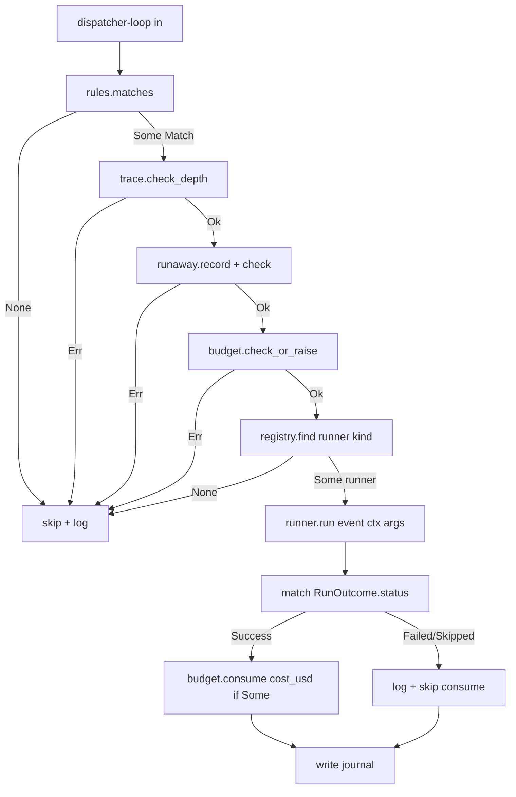

# dispatcher-runners 设计

## 0. 决策头注

- **req 对齐**：`runtime-neutral`——Runner trait 是 runtime 接入点；新 runtime adapter 实装一个 `impl Runner` 即可挂入 registry，对 dispatcher-loop 编排零耦合
- **roadmap 上下文**：rust-rewrite §3 Module E 第 3 子 feature；接 §4.3 Runner trait + RunOutcome 契约；下游 dispatcher-loop 直接消费 `RunnerRegistry::find(kind)` API
- **roadmap items.yaml notes 明示**："首发实现 cc_headless 即可工作；其他 runner 实现可为 stub" —— 本期严格按"noop + cc_headless 真实现，codex/gemini 不出现"
- **决策头**（用户拍板）：
  - Runner trait 不收 budget 参数（roadmap §4.3 的 `&BudgetGate` 形参被移除；budget 在 dispatcher-loop 编排层处理）
  - 首发 runner = noop + cc_headless 真实现（codex / gemini 不出现在代码里）
  - `RunOutcome` = §4.3 原状 + `cost_usd: Option<f64>` 给 caller 走 `budget.consume`
  - `runner_registry` = `Vec<Box<dyn Runner>>` linear find by kind() —— O(n) 但 n=2-4 可忽略

## 1. 范围 / 决策 / 明确不做 / 复杂度档位

### 1.1 必做（用户故事 → 行为）

| # | 行为 | 输入 | 期望可观察结果 |
|---|---|---|---|
| F1 | Runner trait 定义 | roadmap §4.3 + 用户拍板 | `#[async_trait] pub trait Runner: Send + Sync { fn kind() -> &'static str; async fn run(...) -> ... }` |
| F2 | RunOutcome 数据形状 | §4.3 + cost_usd 扩展 | `pub struct RunOutcome { status: RunnerStatus, stdout: String, stderr: String, emitted_events: Vec<HookEvent>, cost_usd: Option<f64> }` |
| F3 | RunnerStatus 三态 | §4.3 | `enum RunnerStatus { Success, Failed { reason: String }, Skipped { reason: String } }` |
| F4 | RunnerError 变体 | error 颗粒度 | `#[non_exhaustive]` 4 变体（BinaryNotFound / SpawnFailed / Timeout / OutputParseFailed） |
| F5 | NoopRunner 实现 | 任意 event | 返 `RunOutcome { status: Success, stdout: "", stderr: "", emitted_events: vec![], cost_usd: None }`；kind() = "noop" |
| F6 | CcHeadless 实现 | event + 配置 | 跑 `claude -p <prompt> --output-format json [--model <m>] [--resume <id>]`；从 args 取 prompt / model / resume_id |
| F7 | CcHeadless stdout JSON parse | CC 退码 0 + stdout 是 JSON | 解 cost_usd / final_text；放进 RunOutcome；解析失败仍返 Success（cost None） |
| F8 | CcHeadless timeout | 子进程超 timeout | kill + `RunnerError::Timeout { timeout_ms }` |
| F9 | CcHeadless binary not found | claude 不在 PATH 且 ROOSTERY_CC_BIN 未设 | `RunnerError::BinaryNotFound` |
| F10 | env sanitize | run 时 | 走 SAFE_ENV_FORWARD allowlist（PATH/HOME/LANG/TERM + API keys + proxy + XDG），**不**整盘 copy；trace ctx 注入 `ROOSTERY_TRACE_ID` / `ROOSTERY_DEPTH` / `ROOSTERY_PARENT_EVENT_ID` |
| F11 | RunnerRegistry 注册 | `Vec<Box<dyn Runner>>` | `RunnerRegistry::new()` + `with_runner(Box<dyn Runner>) -> Self` 链式构造；`with_defaults() -> Self` 自动注册 noop + cc_headless |
| F12 | RunnerRegistry find | kind str | `find(&str) -> Option<&dyn Runner>`；O(n) 线性扫描 |

### 1.2 关键决策（D1-D12）

| # | 决策 | 理由 |
|---|---|---|
| D1 | Runner trait **不收** budget 参数（与 roadmap §4.3 偏离） | user 拍板；让 Runner 单一职责（跑 binary 取结果）；budget gate 编排留给 dispatcher-loop。偏离记录到第 4 节并提示 acceptance 阶段走 `cs-roadmap update` 把 §4.3 改齐 |
| D2 | RunOutcome 扩 `cost_usd: Option<f64>`（与 §4.3 扩展） | dispatcher-loop 需要真实 cost 走 budget.consume；roadmap §4.3 字段集是开放式的，扩展兼容 |
| D3 | 首发 = noop + cc_headless（其他不出现） | items.yaml notes 明示；codex / gemini 等真需求出现时新增 feature 加 impl，不阻塞 0.1.0 minimal-loop |
| D4 | cc_headless 走 `std::process::Command` 同步而非 `tokio::process`（async 包装） | dispatcher-loop 当前是同步还是 async 未定（后续 feature）；Runner trait 已 async 兼容 tokio；内部用 `tokio::task::spawn_blocking` 包同步 Command 简单且不引入 `tokio::process` 依赖踩 ETXTBSY race（已在 attention.md 记） |
| D5 | env sanitize 走 SAFE_ENV_FORWARD const allowlist | 与 Python parity；防 `ROOSTERY_AGENT` 等父 hook 状态串到子 agent；安全默认 |
| D6 | trace ctx 注入 env 用 `trace::TraceContext::to_env_pairs()`（既有 API） | 已落地 feature `dispatcher-trace-budget` 提供；不重复实装 |
| D7 | CC JSON 解析容错——解析失败仍返 Success | CC json schema 可能漂移；不让"读不出 cost"阻塞核心流程 |
| D8 | timeout 默认 600s + 走 RuleAction.args 覆盖（Option<u64>） | Python parity；Rule yaml 可覆盖 per-rule |
| D9 | `RunOutcome::emitted_events` 本期 cc_headless 始终返空 Vec | chain dispatch 是 dispatcher-loop feature 关注点；本期不解 CC json 中的子事件 |
| D10 | RunnerRegistry::with_defaults() 自动注册 noop + cc_headless | 装机即用；caller 也可走 RunnerRegistry::new() + with_runner() 自定义 |
| D11 | RunnerError 4 变体（BinaryNotFound / SpawnFailed / Timeout / OutputParseFailed） | error 颗粒度按 idiom #2；不混 String reason |
| D12 | 不引入 `tokio::process` / `tokio::time::timeout`（D4 顺延） | 同步 `Command` + `wait_timeout` crate（轻量）或 `std::thread::spawn + Sender::recv_timeout` —— implement 阶段选；保持 dep 集小 |

### 1.3 明确不做（acceptance 反向核对项）

| # | 不做 | grep 守护 |
|---|---|---|
| N1 | 不实装 codex_exec runner | `grep -E 'codex_exec\|CodexExec\|fn codex' crates/roostery/src/runners.rs` → 0 |
| N2 | 不实装 gemini_headless runner | `grep -E 'gemini_headless\|GeminiHeadless\|fn gemini' crates/roostery/src/runners.rs` → 0 |
| N3 | 不消费 budget / runaway / rules（caller dispatcher-loop 串场景） | `grep -E 'BudgetState\|RunawayTracker\|CompiledRule\|rules::matches' crates/roostery/src/runners.rs` → 0 |
| N4 | 不暴露 CLI 子命令 | `grep -E 'Command::Runner\|Command::Run\b' crates/roostery/src/main.rs` → 0 |
| N5 | 不消费 LarkRunner trait（cc_headless 调 claude binary 而非飞书 API） | `grep -E 'LarkRunner\|lark_cli::' crates/roostery/src/runners.rs` → 0 |
| N6 | 不读 `FEISHU_HUB_*` legacy env | `grep 'FEISHU_HUB_' crates/roostery/src/runners.rs` → 0 |
| N7 | 不引入 `tokio::process` / `tokio::time` dep | `grep -E 'tokio::process\|tokio::time::timeout' crates/roostery/src/runners.rs` → 0 |
| N8 | 不实装 chain dispatch（emitted_events 始终空） | `grep -E 'emitted_events\.push\|RunOutcome { .*emitted' crates/roostery/src/runners.rs` → 仅初始化为 `vec![]` |
| N9 | 不实装 cost 预扣 / 估算（cost_usd 只在 cc_headless 解 json 后填） | `grep -E 'estimated_cost\|pre_consume\|try_consume' crates/roostery/src/runners.rs` → 0 |
| N10 | 不实装 retry（连续失败 / non-zero exit 不自重试） | `grep -E '\bretry\b\|max_retries' crates/roostery/src/runners.rs` → 0 |

### 1.4 复杂度档位

走默认档位 + 偏离信号 = "外部 binary 调用 (子进程)"：

- 单进程 / 单用户 / 同步 fork+exec 子进程：默认 OK
- async trait 是为了与 future dispatcher-loop 接 tokio runtime 兼容；内部走 `tokio::task::spawn_blocking` 包同步 Command 是常见模式
- env sanitize 是 attention.md 已 flag 的"测试 env 串行化"姐妹问题（生产代码侧）；走 const allowlist 而非 process.env() 整盘

### 1.5 Rust idiom checklist（来自 `2026-05-18-decision-rust-idiom-first.md` §28）

| # | idiom | 本 feature 应用 |
|---|---|---|
| 1 | 强类型 schema vs `Value` | `RunOutcome` / `RunnerStatus` / `RunnerError` 全 struct/enum；唯一 `Value` 出现在 cc_headless 解 stdout JSON 的中间 step（用 `serde_json::from_str` parse 后拿强类型字段） |
| 2 | error 变体颗粒度 | `RunnerError` `#[non_exhaustive]` 4 变体（BinaryNotFound / SpawnFailed / Timeout / OutputParseFailed），每变体携带 path / source / timeout_ms / stdout_head 等专有数据 |
| 3 | newtype 隔离 | `RunnerKind(&'static str)` newtype 暴露给 caller find by kind；与 `business-identifier-newtype` decision 一致 |
| 4 | typestate | 不引入（Runner trait 实例本身即用即弃；RunnerRegistry 容器化已足够强约束） |
| 5 | 零拷贝 + 借用优先 | `RunnerRegistry::find(&str) -> Option<&dyn Runner>` 借用；SAFE_ENV_FORWARD `&[&'static str]` const；RunOutcome.stdout / stderr 走 String owning（subprocess 输出 own 不可避） |
| 6 | 编译期 vs 运行时 | `SAFE_ENV_FORWARD: &[&'static str]` const；`DEFAULT_TIMEOUT_MS: u64 = 600_000` const；`STDOUT_HEAD_CAP: usize = 4096` const |

## 2. 名词层与编排层

### 2.1 名词层（现状 → 变化）

**现状**：

- `crates/roostery/src/hook_event.rs::HookEvent`（feature `2026-05-18-dispatcher-rules` 落地）
- `crates/roostery/src/trace.rs::{TraceContext, to_env_pairs}`（feature `2026-05-18-dispatcher-trace-budget` 落地）
- `crates/roostery/src/budget.rs::BudgetState`（同上 feature）
- `crates/roostery/src/rules.rs::Match` （含 `runner: &str` + `args: &Value`，feature `2026-05-18-dispatcher-rules` 落地）
- 无 Runner trait / RunOutcome / RunnerError / RunnerRegistry / NoopRunner / CcHeadlessRunner 类型

**变化**：

#### 2.1.1 `crates/roostery/src/runners.rs`（新建）

```rust
//! Runner trait + 默认实现 + registry (roadmap §4.3, with budget moved out).

use crate::hook_event::HookEvent;
use crate::trace::TraceContext;
use async_trait::async_trait;
use serde::{Deserialize, Serialize};
use thiserror::Error;

pub const DEFAULT_TIMEOUT_MS: u64 = 600_000;  // 10 min
pub const STDOUT_HEAD_CAP: usize = 4096;       // 4 KiB

pub const SAFE_ENV_FORWARD: &[&str] = &[
    "USER", "LOGNAME", "SHELL", "TMPDIR",
    "XDG_CONFIG_HOME", "XDG_CACHE_HOME", "XDG_DATA_HOME", "XDG_STATE_HOME", "XDG_RUNTIME_DIR",
    "HTTP_PROXY", "HTTPS_PROXY", "ALL_PROXY", "NO_PROXY",
    "http_proxy", "https_proxy", "all_proxy", "no_proxy",
    "SSL_CERT_FILE", "SSL_CERT_DIR", "REQUESTS_CA_BUNDLE", "CURL_CA_BUNDLE",
    "ANTHROPIC_API_KEY", "OPENAI_API_KEY", "GEMINI_API_KEY", "GOOGLE_API_KEY",
    "GOOGLE_APPLICATION_CREDENTIALS",
    "ANTHROPIC_BASE_URL", "OPENAI_BASE_URL",
    "CLAUDE_CONFIG_DIR", "ANTHROPIC_CONFIG_DIR",
    "CODEX_HOME", "CODEX_CONFIG_DIR", "GEMINI_HOME", "GEMINI_CONFIG_DIR",
];

#[derive(Serialize, Deserialize, Debug, Clone, PartialEq)]
#[serde(rename_all = "snake_case")]
pub enum RunnerStatus {
    Success,
    Failed { reason: String },
    Skipped { reason: String },
}

#[derive(Debug)]
pub struct RunOutcome {
    pub status: RunnerStatus,
    pub stdout: String,
    pub stderr: String,
    pub emitted_events: Vec<HookEvent>,
    pub cost_usd: Option<f64>,
}

#[derive(Debug, Error)]
#[non_exhaustive]
pub enum RunnerError {
    #[error("runner {kind} binary not found at {path:?}")]
    BinaryNotFound { kind: &'static str, path: PathBuf },
    #[error("failed to spawn runner {kind}: {source}")]
    SpawnFailed { kind: &'static str, #[source] source: io::Error },
    #[error("runner {kind} timed out after {timeout_ms}ms")]
    Timeout { kind: &'static str, timeout_ms: u64 },
    #[error("failed to parse runner {kind} output: {source}; stdout_head={stdout_head:?}")]
    OutputParseFailed {
        kind: &'static str,
        #[source] source: serde_json::Error,
        stdout_head: String,
    },
}

#[async_trait]
pub trait Runner: Send + Sync {
    fn kind(&self) -> &'static str;

    async fn run(
        &self,
        event: &HookEvent,
        ctx: &TraceContext,
        args: &serde_json::Value,
    ) -> Result<RunOutcome, RunnerError>;
}

pub struct RunnerRegistry {
    runners: Vec<Box<dyn Runner>>,
}

impl RunnerRegistry {
    pub fn new() -> Self { Self { runners: vec![] } }

    pub fn with_runner(mut self, runner: Box<dyn Runner>) -> Self {
        self.runners.push(runner);
        self
    }

    /// Convenience: registers `NoopRunner` + `CcHeadlessRunner` defaults.
    pub fn with_defaults() -> Self {
        Self::new()
            .with_runner(Box::new(NoopRunner))
            .with_runner(Box::new(CcHeadlessRunner::default()))
    }

    pub fn find(&self, kind: &str) -> Option<&dyn Runner> {
        self.runners.iter().find(|r| r.kind() == kind).map(|b| b.as_ref())
    }
}

// --- NoopRunner -----------------------------------------------------------

pub struct NoopRunner;

#[async_trait]
impl Runner for NoopRunner {
    fn kind(&self) -> &'static str { "noop" }
    async fn run(&self, _: &HookEvent, _: &TraceContext, _: &serde_json::Value)
        -> Result<RunOutcome, RunnerError> { /* 返 Success 空字段 */ }
}

// --- CcHeadlessRunner -----------------------------------------------------

pub struct CcHeadlessRunner {
    pub bin_override: Option<PathBuf>,  // 测试可注入
}

impl Default for CcHeadlessRunner {
    fn default() -> Self { Self { bin_override: None } }
}

#[async_trait]
impl Runner for CcHeadlessRunner {
    fn kind(&self) -> &'static str { "cc_headless" }
    async fn run(&self, event: &HookEvent, ctx: &TraceContext, args: &serde_json::Value)
        -> Result<RunOutcome, RunnerError>;
}
```

**调用示例**（dispatcher-loop pseudo，Phase 4 收尾 feature）：

```rust
let registry = RunnerRegistry::with_defaults();
let event: HookEvent = serde_json::from_str(stdin_json)?;
let m: Match = rules::matches(&rules, &event).expect("matched");

let runner = registry.find(m.runner).expect("known kind");
let outcome = runner.run(&event, &ctx, m.args).await?;

if let Some(c) = outcome.cost_usd {
    budget.consume(c);
}
```

**args 形状约定**（cc_headless）：

```json
{ "prompt": "Summarize this session", "model": "sonnet-4", "resume_id": "...", "timeout_ms": 300000 }
```

prompt 必填；model / resume_id / timeout_ms 都可选。

#### 2.1.2 `crates/roostery/src/lib.rs`（修改）

加 `pub mod runners;`

#### 2.1.3 `crates/roostery/Cargo.toml`（依赖）

候选新增（implement 阶段挑一种）：

- `wait-timeout = "0.2"`（small + std::process::Child 加 wait_timeout method）
- 或 用 `tokio::task::spawn_blocking` + 内置 timer（已有 tokio 全 features）

→ 倾向选 tokio 既有（不引新 dep）；implement 阶段定。

### 2.2 编排层（现状 → 变化）

**现状**：Phase 4 模块 E 已落 `trace / budget / runaway / hook_event / rules`，本 feature 引入 `runners`——dispatcher-loop 上层 caller 把它们串起来的最后一组类型（除 loop 本身）。

**变化**：



本 feature 提供 F / G 节点；A-E / H-K 由 dispatcher-loop 拼。

**runners 内部编排**：

- NoopRunner: 无 IO，直接返
- CcHeadlessRunner: spawn_blocking → Command::new(claude_bin) → args 拼 → env sanitize → 等 timeout → 解 JSON → 拼 RunOutcome

**流程级不变量**：

1. **Runner trait 同步语义包 async**：内部走 spawn_blocking 不引入新 dep
2. **env sanitize 一致性**：所有 runner 用同一个 `prep_env(ctx, runner_name)` helper（避免每个 runner 各写一份）
3. **trace env 注入**：每次 spawn 都注 ctx 三 env，与 SAFE_ENV_FORWARD 合并
4. **timeout 边界**：default 600s + RuleAction.args.timeout_ms 覆盖（max u64 上限走 i32::MAX as u64）
5. **CC JSON 解析容错**：失败仅记 cost None，不失败整 run
6. **registry find 不发现 → caller None**：runner_kind 不在 registry 时 find 返 None；不报错（caller dispatcher-loop 决定怎么处理 unknown kind）
7. **RunnerError vs RunOutcome.status.Failed**：前者是基础设施失败（spawn / timeout / 解析）；后者是 runner 业务失败（CC 退码非 0 但跑完了）

### 2.3 挂载点清单（"删了它 feature 是否消失" 判据）

| # | 挂载点 | 位置 | 删了会怎样 |
|---|---|---|---|
| 1 | `pub mod runners;` in lib.rs | `lib.rs` | Runner trait 消失，dispatcher-loop 编译失败 |
| 2 | `RunnerRegistry::with_defaults()` 注册 NoopRunner | `runners.rs` | 默认 registry 不含 noop，规则用 runner: "noop" 找不到 |
| 3 | `RunnerRegistry::with_defaults()` 注册 CcHeadlessRunner | `runners.rs` | cc_headless 装机即用 / minimal-loop 失败 |

**不列**（内部）：私有 fn / const / RunnerError 变体 / SAFE_ENV_FORWARD。

**反向核查**：删 1-3 全部 → `cargo build` 编译失败仅在 `lib.rs` import；trace / budget / rules 不受影响。

**拔除沙盘推演**：删 1 pub mod + 1 模块文件 + integ test → cargo build 通过其他模块不感知；rules.rs `Match.runner: &str` 仍存在但不会被 find 到。可完整卸载。

### 2.4 推进策略（按 paradigm 切片）

| Step | Paradigm | 内容 | 退出信号 |
|---|---|---|---|
| S1 | 类型骨架 | 新建 `src/runners.rs`：`RunnerStatus` / `RunOutcome` / `RunnerError` enum + `Runner` async trait 签名 + `RunnerRegistry` 类型；fn 签名 todo!()；SAFE_ENV_FORWARD const + DEFAULT_TIMEOUT_MS const | cargo build 成功；类型 trivial 单测（RunnerStatus serde / RunnerError display） |
| S2 | NoopRunner 实装 | `NoopRunner` 全部实装；返 `RunOutcome { status: Success, ... cost_usd: None }` | NoopRunner 2 单测（kind=="noop" + run 返 Success 空字段） |
| S3 | RunnerRegistry 实装 | `new / with_runner / with_defaults / find` 实装；linear find by kind | registry 4 单测（empty new / 注册一个 / find 命中 / find 未命中 / with_defaults 含 2 个） |
| S4 | env sanitize + spawn helper | 私有 `prep_env(ctx, runner_name) -> HashMap<String, String>`：SAFE_ENV_FORWARD allowlist + trace env 注入 + base env (PATH/HOME/LANG/TERM) | prep_env 3 单测（allowlist 过滤 / trace env 注入 / base env 补齐） |
| S5 | CcHeadlessRunner spawn | 实装 `claude -p ... --output-format json` Command 构造 + spawn_blocking + timeout + binary 缺失返 BinaryNotFound | CcHeadless 3 单测（binary 不存在 / 假 binary 假返 / timeout 触发） |
| S6 | CcHeadlessRunner JSON enrich | stdout JSON parse 解 cost_usd / final_text；解析失败仍返 Success cost None | enrich 3 单测（完整 JSON / 缺 cost / 非法 JSON 容错） |
| S7 | 集成测试 + 模块挂载 | lib.rs 加 pub mod；新建 `tests/runners_integration.rs` 串场景（registry + NoopRunner + CcHeadless 用假 claude binary） | lib.rs 1 mod 暴露；集成测试 3+ 全绿 |
| S8 | 完整验收 + 守护 grep + CI | 四命令本地全绿；N1-N10 + idiom grep 0 命中；推 CI | 本地四命令全绿；CI 三 job 远端绿；守护 grep 全 0 命中 |

### 2.5 结构健康度与微重构

**评估对象 1：要改的文件**

- `lib.rs` 加 1 行 pub mod；增量极小
- 无既有文件被结构性修改

**评估对象 2：新文件落入的目录**

- `crates/roostery/src/` 顶层 .rs 文件清单当前 = 17（dispatcher-rules 后）；本 feature 加 1 → 18 顶层
- 查 `.codestable/compound/2026-05-16-decision-rust-module-organization.md` 档 1-2 限定 "业务模块化 .rs 文件 < 20 不强制目录化"，18 < 20 仍在容忍区
- 本 feature 落 `runners.rs` 同文件含 trait + 两 impl + registry（与 trace.rs / budget.rs 同模式一文件一职责），是项目主流
- **dispatcher/ 子目录化建议**已在 dispatcher-trace-budget 和 dispatcher-rules acceptance 反复 flag——Phase 4 收尾 dispatcher-loop 起来时一次性聚

**结论**：**不做微重构**。

理由：(1) 顶层 18 < 20 容忍区；(2) runners.rs 单文件包含 trait + 2 个 runner impl + registry 是合理内聚（如未来加 codex_exec / gemini_headless 实装超 500 LOC 再拆 `runners/{noop,cc_headless,codex_exec,gemini_headless}.rs`）；(3) **dispatcher/ 子目录化推到 Phase 4 收尾**，不在本期范围。

**超出范围的观察**：

- Phase 4 收尾 dispatcher-loop 起来后建议走 `cs-refactor` 把 trace / budget / runaway / hook_event / rules / runners + loop 一次性聚到 `src/dispatcher/` 子目录（与 dispatcher-trace-budget 同 observation）
- 若 codex_exec / gemini_headless 实装时单文件超 500 LOC，拆 `runners/{...}.rs` 走 cs-refactor 微重构

**建议沉淀的 convention**：本 feature 不引入新结构约定。

## 3. 验收契约

### 3.1 Runner trait + 类型 C1.1-C1.4

| # | 场景 | 期望 |
|---|---|---|
| C1.1 | `RunnerStatus::Success` / `Failed { reason }` / `Skipped { reason }` 三态 | enum 完整；serde rename_all snake_case |
| C1.2 | `RunOutcome` 5 字段全公开 | status / stdout / stderr / emitted_events / cost_usd 均 pub |
| C1.3 | `RunnerError` 4 变体 `#[non_exhaustive]` | BinaryNotFound / SpawnFailed / Timeout / OutputParseFailed |
| C1.4 | const `DEFAULT_TIMEOUT_MS / STDOUT_HEAD_CAP / SAFE_ENV_FORWARD` 公开 | 测试断言可访问 |

### 3.2 NoopRunner C2.1-C2.2

| # | 场景 | 期望 |
|---|---|---|
| C2.1 | `kind() == "noop"` | 字符串相等 |
| C2.2 | run 任意 event/ctx/args | `Ok(RunOutcome { status: Success, stdout: "", stderr: "", emitted_events: vec![], cost_usd: None })` |

### 3.3 RunnerRegistry C3.1-C3.5

| # | 场景 | 期望 |
|---|---|---|
| C3.1 | `new()` 空 registry | `find` 返 None |
| C3.2 | `with_runner(Box::new(NoopRunner))` | find("noop") 返 Some |
| C3.3 | `with_defaults()` | find("noop") + find("cc_headless") 都返 Some；find("codex_exec") 返 None |
| C3.4 | find 未命中 | None |
| C3.5 | 同 kind 两次注册 | linear find 返第一个；不报错（用户责任） |

### 3.4 CcHeadlessRunner C4.1-C4.7

| # | 场景 | 期望 |
|---|---|---|
| C4.1 | `kind() == "cc_headless"` | 字符串相等 |
| C4.2 | binary 不存在（bin_override 指向不存在路径） | `Err(RunnerError::BinaryNotFound)` |
| C4.3 | binary 跑通退码 0 + JSON 含 cost_usd | `Ok(RunOutcome { status: Success, cost_usd: Some(...) })` |
| C4.4 | binary 退码 0 + 非 JSON stdout | `Ok(RunOutcome { status: Success, cost_usd: None })`（解析容错） |
| C4.5 | binary 退码非 0 | `Ok(RunOutcome { status: Failed { reason }, ... })` |
| C4.6 | binary 超 timeout | `Err(RunnerError::Timeout { timeout_ms })` |
| C4.7 | trace env 注入 + SAFE_ENV_FORWARD | 假 binary 写 stdout 含 `ROOSTERY_TRACE_ID` 等 env 值断言被 receive；不在 allowlist 的 env 不串过 |

### 3.5 env sanitize C5.1-C5.3

| # | 场景 | 期望 |
|---|---|---|
| C5.1 | `prep_env(ctx, "cc")` 输出 | 含 PATH / HOME / LANG / TERM 基础；含 trace 三 env；不含 unsafe env（如本进程 set 一个 `RANDOM_VAR`） |
| C5.2 | SAFE_ENV_FORWARD 命中 | 本进程 set `OPENAI_API_KEY` → prep_env 输出含该 var |
| C5.3 | 父 hook 状态隔离 | 本进程 set `ROOSTERY_AGENT=cc`（父） → prep_env 输出不含（trace 三 env 独立） |

### 3.6 明确不做反向核查 C6.1-C6.10

```bash
grep -E 'codex_exec|CodexExec|fn codex' src/runners.rs            # → 0
grep -E 'gemini_headless|GeminiHeadless|fn gemini' src/runners.rs # → 0
grep -E 'BudgetState|RunawayTracker|CompiledRule|rules::matches' src/runners.rs  # → 0
grep -E 'Command::Runner|Command::Run\b' src/main.rs              # → 0
grep -E 'LarkRunner|lark_cli::' src/runners.rs                    # → 0
grep 'FEISHU_HUB_' src/runners.rs                                 # → 0
grep -E 'tokio::process|tokio::time::timeout' src/runners.rs      # → 0
grep -E 'emitted_events\.push' src/runners.rs                     # → 0 (始终 vec![])
grep -E 'estimated_cost|pre_consume|try_consume' src/runners.rs   # → 0
grep -E '\bretry\b|max_retries' src/runners.rs                    # → 0
grep -rE 'as_object_mut\(\)\.unwrap\(\)|as_array_mut\(\)\.unwrap\(\)' src/runners.rs  # → 0
```

### 3.7 模块级 C7.1-C7.5

| # | 命令 | 期望 |
|---|---|---|
| C7.1 | `cargo test --all` | lib 既有 267 + 本 feature ≥15；集成 ≥3；全绿 |
| C7.2 | `cargo test --doc` | 全绿 |
| C7.3 | `cargo clippy --all-targets --all-features -- -D warnings` | 全绿 |
| C7.4 | `cargo fmt --all --check` | 全绿 |
| C7.5 | 守护 grep 0 命中（见 §3.6） | 通过 |

## 4. 架构 / requirement / roadmap 回写说明（acceptance 阶段执行）

- **`ARCHITECTURE.md §2 术语表`**：加 `Runner trait` / `RunOutcome` / `RunnerRegistry` / `NoopRunner` / `CcHeadlessRunner` / `SAFE_ENV_FORWARD` 词条
- **`ARCHITECTURE.md §3 Module E`**：加 runners 模块描述；子 feature 列表 `dispatcher-runners` 标 done
- **`ARCHITECTURE.md §4 契约表 §4.3`**：标 "Phase 4 已落地（feature `2026-05-18-dispatcher-runners`）+ **本 feature 对 §4.3 偏离**：(a) Runner.run 不收 budget 参数（dispatcher-loop 担责）；(b) RunOutcome 加 cost_usd 字段。建议 acceptance 阶段走 `cs-roadmap update` 把 §4.3 改齐"
- **`ARCHITECTURE.md §6 已知约束`**：加 1 条 "Runner 子进程 env 必经 `SAFE_ENV_FORWARD` allowlist；父 hook 状态（`ROOSTERY_AGENT` 等）不串到子 agent"
- **`.codestable/requirements/runtime-neutral.md`**：变更日志加 2026-05-18 落地条目；`implemented_by` 加本 feature
- **`.codestable/roadmap/rust-rewrite/rust-rewrite-items.yaml`**：`dispatcher-runners` `in-progress → done`
- **`.codestable/roadmap/rust-rewrite/rust-rewrite-roadmap.md §5 第 13 项`**：`planned → done`
- **`.codestable/roadmap/rust-rewrite/rust-rewrite-roadmap.md §4.3`**：更新契约（acceptance 阶段决定是否走 cs-roadmap update 流程）
- **`.codestable/attention.md`**：候选盘点（acceptance 阶段决定）
- **`.codestable/compound/`**：本 feature 不引入新 decision

## 5. 待 review 提示

请整体过一遍，重点：

1. **§1.2 D1**：Runner trait **不收** budget 参数（与 roadmap §4.3 形参 `&BudgetGate` 偏离）——你拍板把 budget 移到 dispatcher-loop 编排层。acceptance 阶段建议走 `cs-roadmap update` 把 §4.3 改齐
2. **§1.2 D2**：RunOutcome 扩 `cost_usd: Option<f64>` 字段——§4.3 字段集是开放式的，扩展合理
3. **§1.2 D3**：首发 = noop + cc_headless（codex / gemini 完全不出现）——items.yaml notes 明示
4. **§1.2 D4**：Runner trait 是 async 但内部走 `tokio::task::spawn_blocking` 包同步 Command（不引 `tokio::process`）
5. **§2.5 模块组织**：本期 18 < 20 容忍区不重组；Phase 4 收尾 dispatcher-loop 落地后建议一次性聚 `src/dispatcher/` 子目录
