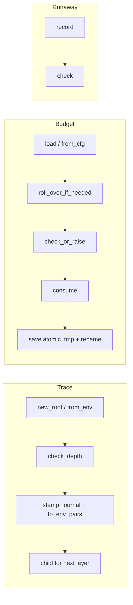
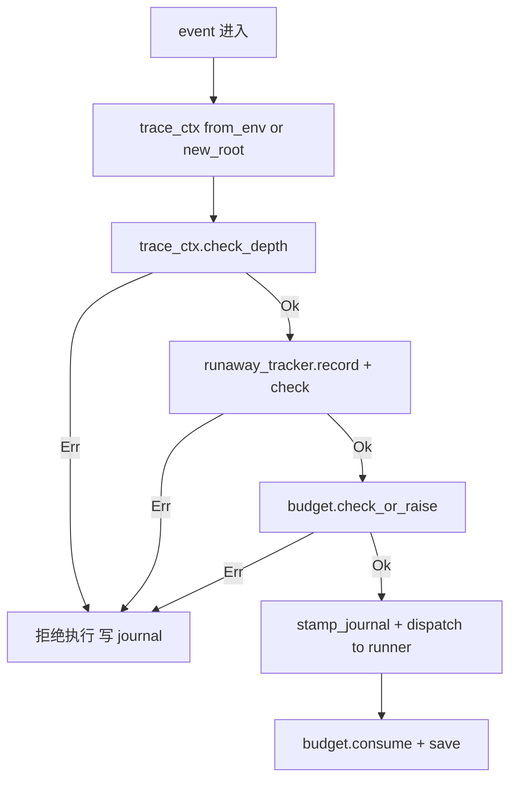

# dispatcher-trace-budget 设计

## 0. 决策头注

- **req 对齐**：兑现 `runtime-neutral` 的"loop 保护是中立 dispatcher 的前提"——TraceContext + Budget gate 是任何 runner 派发前必经的两个守门，与具体哪家 agent runtime 无关
- **roadmap 上下文**：rust-rewrite §3 Module E 第 1 子 feature；接 §4.5 TraceContext 契约 + §4.6 Config.budgets/trace schema；后续 dispatcher-rules / dispatcher-runners / dispatcher-loop 三 feature 直接消费本 feature 的 API
- **决策头**：
  - Budget bucket = roadmap §4.6 default 单 bucket + f64 USD（per-runner / per-rule 等粒度等后续真需要时走 cs-roadmap update）
  - RunawayTracker 本 feature 包含（depth 是事前防御，runaway 是事后兜底防御，two-layer）
  - 模块位置 = 顶层 `src/trace.rs` + `src/budget.rs`（与 Module D 一致；不开 `dispatcher/` 子目录）

## 1. 范围 / 决策 / 明确不做 / 复杂度档位

### 1.1 必做（用户故事 → 行为）

| # | 行为 | 输入 | 期望可观察结果 |
|---|---|---|---|
| F1 | TraceContext 新建（链路起点） | parent_event_id: Option<String> | `TraceContext { trace_id=new_ulid_or_hex, parent_event_id, depth=0, max_depth=config.trace.max_depth }` |
| F2 | TraceContext 派生子上下文 | existing ctx + new parent_event_id | trace_id 不变 + parent_event_id 更新 + depth +1 |
| F3 | depth 守门 | ctx + max_depth | `depth >= max_depth` → `TraceError::DepthExceeded { trace_id, depth, max_depth }` |
| F4 | TraceContext → JournalEntry 字段注入 | ctx + JournalEntry | entry.trace_id / parent_event_id / depth 三字段对齐 ctx |
| F5 | TraceContext ↔ env 序列化 | ctx | 写出 `ROOSTERY_TRACE_ID` / `ROOSTERY_DEPTH` / `ROOSTERY_PARENT_EVENT_ID` 三 env；缺 trace_id 读回 None |
| F6 | Budget load | `~/.roostery/state/budget.json`（或不存在） | `BudgetState`；不存在用 `Config.budgets.default` 编译期默认；过期日自动 rollover |
| F7 | Budget check | state + 候选 cost_usd | `Ok(())` 或 `BudgetError::Exceeded { kind, reason }` |
| F8 | Budget consume | state + cost_usd | calls +1, cost_usd += cost；不写盘（caller 决定何时 flush） |
| F9 | Budget save | state | atomic `.tmp` + rename 写 `~/.roostery/state/budget.json`；缺父目录自动建 |
| F10 | Budget rollover | state | 跨日（state.day != today）→ 重置 `calls=0 / cost_usd=0.0` + 更新 day；返回 bool 标记是否真的 rolled |
| F11 | RunawayTracker record | trace_id + clock | 内存 BTreeMap<TraceId, Vec<Instant>>；窗口外清理；返窗口内 count |
| F12 | RunawayTracker check | trace_id | `count >= threshold` → `RunawayError::Detected { trace_id, count, window_secs }` |

### 1.2 关键决策（D1-D11）

| # | 决策 | 理由 |
|---|---|---|
| D1 | TraceContext **不携带** runner kind / event payload | §4.5 契约纯粹只管 trace 链；payload 归各 caller 业务字段 |
| D2 | trace_id 用 16-byte hex（`secrets-rs` / `getrandom`）而非 ULID | Python parity；ULID 排序对 trace 无价值，纯随机即可；getrandom 已是依赖 |
| D3 | depth 从 0 起步（**与 roadmap §4.5 一致，与 Python 不同**） | roadmap §4.5 "起始为 0，每层 +1" 明文；Python 从 1 起是历史偏差，docs-authority 选 0 |
| D4 | env 前缀切到 `ROOSTERY_TRACE_ID` / `ROOSTERY_DEPTH` / `ROOSTERY_PARENT_EVENT_ID` | 与 `ROOSTERY_HOME` / `ROOSTERY_AGENT` 一致 prefix；不沿用 Python `FEISHU_HUB_*`（架构红线已明示） |
| D5 | Budget bucket = `default` 单 bucket（无 per-runner / per-rule） | roadmap §4.6 当前 schema 仅 `default: BudgetCfg`；扩展走 cs-roadmap update，本 feature 不抢跑 |
| D6 | Budget cost 单位 = `f64 USD`（不是 Python `i64 cents`） | roadmap §4.6 已定 `max_cost_usd: f64`；Python cents 是更早的实现细节 |
| D7 | Budget state 路径固定 `~/.roostery/state/budget.json` | 与 smoke.json 同目录；走 `paths::state_dir()` 已有 helper |
| D8 | Budget rollover 时机 = 每次 `check_or_raise` / `consume` 前内部调一次 | Python 同模式；tail 长进程过午夜也能正确 roll |
| D9 | RunawayTracker 内存 only，不持久化 | dispatcher 进程内单实例够用；多进程 / 长 daemon 跨进程 runaway 是 Phase 4 dispatcher-loop 落地后才知是否需要；当前不抢跑 |
| D10 | RunawayTracker 默认 `window_secs=300` + `threshold=10` | Python parity；可注入 clock for test |
| D11 | 三模块（trace / budget / runaway）独立**不**互引——budget 只看 cost；runaway 只看 trace_id 计数；trace 只管 ctx 派生 | 解耦：dispatcher-loop 上层 orchestrator 才把它们串起来；本 feature 不在 trace / budget 内部假设 dispatcher 形态 |

### 1.3 明确不做（acceptance 反向核对项）

| # | 不做 | grep 守护 |
|---|---|---|
| N1 | 不集成 Runner trait / runner_registry（Phase 4 dispatcher-runners） | `grep -E "Runner\|RunnerKind\|runner_registry" src/{trace,budget,runaway}.rs` → 无 |
| N2 | 不写 rule schema / rule matcher（Phase 4 dispatcher-rules） | `grep -E "Rule\|rules::" src/{trace,budget,runaway}.rs` → 无 |
| N3 | 不写 dispatcher loop / event queue（Phase 4 dispatcher-loop） | `grep -E "Loop\|loop_\|EventQueue\|dispatch" src/{trace,budget,runaway}.rs` → 无 |
| N4 | 不实现 per-runner / per-rule budget bucket | `grep -E "per_runner\|by_rule\|by_runner" src/budget.rs` → 无 |
| N5 | 不实现 RunawayTracker 持久化 | `grep -E "fs::write\|fs::read.*runaway\|save\|load" src/runaway.rs` → 无 |
| N6 | 不读取 Python 期 `FEISHU_HUB_TRACE_ID` 等 legacy env | `grep "FEISHU_HUB_" src/{trace,budget,runaway}.rs` → 无 |
| N7 | 不引入新外部依赖（trace_id 用 getrandom；budget 走 std + chrono + serde）| `grep "uuid\|ulid_rs\|crossbeam\|moka" crates/roostery/Cargo.toml` → 无新增 |
| N8 | 不暴露 CLI 子命令 | `grep "Command::Budget\|Command::Trace\|Command::Runaway" src/main.rs` → 无 |
| N9 | 不消费 LarkRunner trait（无飞书侧 I/O） | `grep -E "LarkRunner\|lark_cli::" src/{trace,budget,runaway}.rs` → 无 |

### 1.4 复杂度档位

走默认档位（单进程同步代码 / 单用户 / 无外部 I/O 除 budget.json 文件读写）。**偏离信号**：无 SDK / 无高并发。所有 fn 都是 sync（无 `async`）——本 feature 的 caller 是 dispatcher loop（Phase 4），loop 自己决定 async or sync 编排模型，gate fn 同步语义更简单。

### 1.5 Rust idiom checklist（来自 `2026-05-18-decision-rust-idiom-first.md` §28）

| # | idiom | 本 feature 应用 |
|---|---|---|
| 1 | 强类型 schema vs `Value` | `TraceContext` / `BudgetState` / `Bucket` / `RunawayTracker` 全部强类型 struct；budget.json 反序列化走 `BudgetStatePersisted` 中间 struct（schema_version 字段 + Bucket 字段），不用 `serde_json::Value` |
| 2 | error 变体颗粒度 | `TraceError` `#[non_exhaustive]` (DepthExceeded / EnvParseFailed)；`BudgetError` `#[non_exhaustive]` (LoadFailed / ParseFailed / SaveFailed / Exceeded { kind, reason })；`RunawayError` `#[non_exhaustive]` (Detected { trace_id, count, window_secs }) |
| 3 | newtype 隔离 | `TraceId(String)` newtype `#[serde(transparent)]`——与 `business-identifier-newtype` decision 一致；同 commit 的 `EventId` / `ParentEventId` 也走 newtype；`BudgetBucketKind` enum（本期 `Default` 单变体，留 `#[non_exhaustive]` 给将来扩展 per-runner） |
| 4 | typestate | 不引入（trace ctx 是 snapshot 用即弃；budget check 与 consume 分离已经够强约束——caller 必须先 check_or_raise 再 consume，否则记账漂移由调用方负责） |
| 5 | 零拷贝 + 借用优先 | env 解析返 `Option<TraceContext>`，env key 用 `const &'static str`；JournalEntry 注入走 `&mut entry` 借用更新字段；budget rollover 用 `&mut state` |
| 6 | 编译期 vs 运行时 | env key 名 const；默认 window_secs / threshold const；trace_id length const；budget schema_version const |

无"本 feature 不适用"豁免。

## 2. 名词层与编排层

### 2.1 名词层（现状 → 变化）

**现状**：

- `crates/roostery/src/config.rs`：`BudgetCfg { max_calls: u32, max_cost_usd: f64 }` + `TraceConfig { max_depth: u32 (default 8) }` 已落地（feature `2026-05-17-config-yaml`）
- `crates/roostery/src/journal.rs`：`JournalEntry { trace_id: Option<String>, parent_event_id: Option<String>, depth: u32, ... }` 已落地（feature `2026-05-15-journal-core`）
- `crates/roostery/src/paths.rs`：`state_dir()` / `roostery_home()` 已落地；**缺** `budget_state_path()`
- 无 trace / budget / runaway 模块

**变化**：

#### 2.1.1 `crates/roostery/src/trace.rs`（新建）

```rust
//! Loop protection trace context (roadmap §4.5).

use thiserror::Error;

const ENV_TRACE_ID: &str = "ROOSTERY_TRACE_ID";
const ENV_DEPTH: &str = "ROOSTERY_DEPTH";
const ENV_PARENT: &str = "ROOSTERY_PARENT_EVENT_ID";

#[derive(Serialize, Deserialize, Debug, Clone, PartialEq, Eq, Hash)]
#[serde(transparent)]
pub struct TraceId(String);

impl TraceId {
    pub fn new_random() -> Self;     // 16-byte hex via getrandom
    pub fn as_str(&self) -> &str;
    pub fn from_existing(s: impl Into<String>) -> Self;
}

#[derive(Serialize, Deserialize, Debug, Clone)]
#[non_exhaustive]
pub struct TraceContext {
    pub trace_id: TraceId,
    pub parent_event_id: Option<String>,
    pub depth: u32,
    pub max_depth: u32,
}

impl TraceContext {
    /// Link root: depth=0, fresh trace_id.
    pub fn new_root(parent_event_id: Option<String>, max_depth: u32) -> Self;

    /// Child of an existing context: same trace_id, depth+1, new parent_event_id.
    pub fn child(&self, parent_event_id: Option<String>) -> Self;

    /// Returns Err if `depth >= max_depth`.
    pub fn check_depth(&self) -> Result<(), TraceError>;

    /// Emit `(KEY, VALUE)` pairs for env injection downstream.
    pub fn to_env_pairs(&self) -> Vec<(&'static str, String)>;

    /// Parse from env vars (e.g. process inheritance). `max_depth` injected by caller from Config.
    pub fn from_env(env_lookup: impl Fn(&str) -> Option<String>, max_depth: u32) -> Option<Self>;

    /// Stamp trace fields onto a JournalEntry (mutating in place; preserves all other fields).
    pub fn stamp_journal(&self, entry: &mut JournalEntry);
}

#[derive(Debug, Error)]
#[non_exhaustive]
pub enum TraceError {
    #[error("trace {trace_id:?} depth {depth} >= max_depth {max_depth}")]
    DepthExceeded { trace_id: TraceId, depth: u32, max_depth: u32 },
    #[error("env value ROOSTERY_DEPTH not parseable as u32: {raw:?}")]
    EnvParseFailed { raw: String },
}
```

**调用示例**：

```rust
// dispatcher loop pseudocode (Phase 4)
let ctx = TraceContext::new_root(Some(event_id.clone()), config.trace.max_depth);
ctx.check_depth()?;
let mut entry = JournalEntry::new("dispatcher", "runner.invoke");
ctx.stamp_journal(&mut entry);
let env_pairs = ctx.to_env_pairs(); // pass into subprocess
```

#### 2.1.2 `crates/roostery/src/budget.rs`（新建）

```rust
//! Budget gate (roadmap §4.6 default bucket; per-runner / per-rule 等粒度后续 cs-roadmap update).

const BUDGET_SCHEMA_VERSION: u32 = 1;

#[derive(Serialize, Deserialize, Debug, Clone, PartialEq)]
pub struct Bucket {
    pub calls: u32,
    pub cost_usd: f64,
    pub max_calls: u32,
    pub max_cost_usd: f64,
}

impl Bucket {
    pub fn from_cfg(cfg: &BudgetCfg) -> Self;
    pub fn would_exceed(&self, *, calls: u32, cost_usd: f64) -> Option<String>;
    pub fn consume(&mut self, *, calls: u32, cost_usd: f64);
}

#[derive(Serialize, Deserialize, Debug, Clone, PartialEq)]
#[non_exhaustive]
pub struct BudgetState {
    pub schema_version: u32,    // const 1
    pub day: chrono::NaiveDate,  // ISO 8601 date
    pub default: Bucket,
}

impl BudgetState {
    pub fn from_cfg(cfg: &BudgetCfg) -> Self;

    /// Reset counters when day changed; returns true if reset happened.
    pub fn roll_over_if_needed(&mut self) -> bool;

    /// 当前 default bucket 是否能再花 cost_usd？rolled-over 后判定。
    pub fn check_or_raise(&mut self, *, cost_usd: f64) -> Result<(), BudgetError>;

    /// 记账。caller 决定何时调，通常在 runner 调用成功后。
    pub fn consume(&mut self, *, cost_usd: f64);
}

pub fn load() -> Result<BudgetState, BudgetError>;        // 走 paths::budget_state_path()
pub fn load_from(path: &Path) -> Result<BudgetState, BudgetError>;
pub fn save(state: &BudgetState) -> Result<PathBuf, BudgetError>;
pub fn save_to(state: &BudgetState, path: &Path) -> Result<PathBuf, BudgetError>;

#[derive(Debug, Error)]
#[non_exhaustive]
pub enum BudgetError {
    #[error("failed to read budget state {path}: {source}")]
    LoadFailed { path: PathBuf, #[source] source: io::Error },
    #[error("failed to parse budget state {path}: {source}")]
    ParseFailed { path: PathBuf, #[source] source: serde_json::Error },
    #[error("failed to write budget state {path}: {source}")]
    SaveFailed { path: PathBuf, #[source] source: io::Error },
    #[error("budget bucket {kind}: {reason}")]
    Exceeded { kind: String, reason: String },
    #[error("budget schema version {found} not supported (expected {expected})")]
    SchemaVersionMismatch { found: u32, expected: u32 },
}
```

**调用示例**：

```rust
let cfg = config::load()?;
let mut state = budget::load().unwrap_or_else(|_| BudgetState::from_cfg(&cfg.budgets.default));
state.check_or_raise(cost_usd: 0.001)?;   // before runner call
// ... run agent ...
state.consume(cost_usd: 0.0024);          // after success
budget::save(&state)?;
```

#### 2.1.3 `crates/roostery/src/runaway.rs`（新建）

```rust
//! Sliding-window runaway detector (memory only; cross-process bucket
//! would be a separate concern if ever needed — see roadmap §7 observations).

use std::collections::BTreeMap;
use std::time::{Duration, Instant};
use thiserror::Error;

const DEFAULT_WINDOW_SECS: u64 = 300;
const DEFAULT_THRESHOLD: u32 = 10;

pub struct RunawayTracker {
    window: Duration,
    threshold: u32,
    fires: BTreeMap<TraceId, Vec<Instant>>,
    clock: Box<dyn Fn() -> Instant + Send + Sync>,
}

impl RunawayTracker {
    pub fn new() -> Self;
    pub fn with_window_and_threshold(window: Duration, threshold: u32) -> Self;
    pub fn with_clock(window: Duration, threshold: u32, clock: impl Fn() -> Instant + Send + Sync + 'static) -> Self;

    /// 登记并返回窗口内 count。
    pub fn record(&mut self, trace_id: &TraceId) -> u32;

    /// 超阈值返 Err；不超返 Ok(count)。
    pub fn check(&self, trace_id: &TraceId) -> Result<u32, RunawayError>;
}

#[derive(Debug, Error)]
#[non_exhaustive]
pub enum RunawayError {
    #[error("trace {trace_id:?} fired {count} dispatches in {window_secs}s (threshold {threshold})")]
    Detected { trace_id: TraceId, count: u32, window_secs: u64, threshold: u32 },
}
```

**调用示例**：

```rust
let mut tracker = RunawayTracker::new();
let count = tracker.record(&ctx.trace_id);
tracker.check(&ctx.trace_id)?;            // raises if over threshold
```

#### 2.1.4 `crates/roostery/src/paths.rs`（修改）

```rust
pub fn budget_state_path() -> PathBuf {
    state_dir().join("budget.json")
}
```

#### 2.1.5 `crates/roostery/src/lib.rs`（修改）

加 3 `pub mod`：`pub mod trace; pub mod budget; pub mod runaway;`

#### 2.1.6 `crates/roostery/Cargo.toml`（无新依赖）

trace_id 用既有 `getrandom`；budget 走 `serde_json` + `chrono`（已有）；runaway 用 `std::time` + `std::collections::BTreeMap`（std-only）。

### 2.2 编排层（现状 → 变化）

**现状**：dispatcher 模块树空——本 feature 第 1 次引入。三模块之间编排关系尚不存在（dispatcher-loop feature 起来才把它们串起来）。

**变化**：本 feature 是基础 gate 层，不引入跨模块编排。每模块**内部**编排：



**上游 caller 编排预期**（Phase 4 dispatcher-loop feature 落实）：



本 feature 提供 B/C/D/E/G 的 API；A/F 由 dispatcher-loop 拼接。

**流程级不变量**：

1. **TraceContext 不可变性**：所有 method 返新值，不就地修改（除 stamp_journal 借用 entry）
2. **depth 单调递增**：child() 总是 +1；没有 decrement API
3. **budget save atomic**：`.tmp` + rename；不直接覆盖；缺父目录自动建
4. **budget rollover 幂等**：同一日多次调 `roll_over_if_needed` 无副作用
5. **budget schema_version=1 公开承诺**：跨 feature 稳定；bump 需 cs-roadmap update + 旧版兼容反序列化
6. **runaway 内存隔离**：tracker drop 即丢；不持久化；多 tracker 实例不共享状态
7. **runaway 窗口清理懒计算**：每次 record 时清理过期；不开后台 thread

### 2.3 挂载点清单

新增公开挂载点：

| # | 挂载点 | 位置 | 删了会怎样 |
|---|---|---|---|
| 1 | `pub mod trace;` in `lib.rs` | `lib.rs` | TraceContext 类型消失，dispatcher-loop 编译失败 |
| 2 | `pub mod budget;` in `lib.rs` | `lib.rs` | Budget gate 类型消失，dispatcher-loop 编译失败；budget.json 持久化能力消失 |
| 3 | `pub mod runaway;` in `lib.rs` | `lib.rs` | RunawayTracker 消失，dispatcher-loop 失去事后兜底防御 |
| 4 | `paths::budget_state_path()` fn | `paths.rs` | budget 持久化目标路径无法集中复用；caller 各自硬编码 → 漂移风险 |

**不列**（内部）：env key const / Bucket helper / private fn / 默认 window/threshold const。

**反向核查**：删 1-4 全部 → `cargo build` 编译失败只在 `lib.rs`；journal.rs / config.rs / smoke.rs 不受影响 → 边界清晰。

**拔除沙盘推演**：删 3 个 `pub mod` + 1 个 paths fn + 3 新文件 + `Cargo.lock` 同步 → cargo build 通过其他模块不感知；journal 的 trace_id 字段仍在但永远 None（无 caller 注入）。可完整卸载。

### 2.4 推进策略（按 paradigm 切片）

| Step | Paradigm | 内容 | 退出信号 |
|---|---|---|---|
| S1 | 名词层基底 trace | `trace.rs` 新文件 + `TraceId` newtype + `TraceContext` struct + `TraceError` 2 变体；fn 签名 todo!() | cargo build 成功；TraceId 序列化 transparent 单测；TraceError display 单测 |
| S2 | trace 计算 | `new_root` / `child` / `check_depth` / `to_env_pairs` / `from_env` / `stamp_journal` 实装；env key const | 6+ 单测（happy / depth 边界 / env round-trip / stamp 字段对齐 / from_env 缺字段 / from_env 非法 depth） |
| S3 | 名词层基底 budget | `budget.rs` 新文件 + `Bucket` / `BudgetState` + `BudgetError` 5 变体 + paths fn；fn 签名 todo!() | cargo build 成功；Bucket::would_exceed 边界单测 |
| S4 | budget 计算 + 持久化 | `from_cfg` / `roll_over_if_needed` / `check_or_raise` / `consume` 实装；`load` / `load_from` / `save` / `save_to` atomic IO 实装 | 8+ 单测（rollover happy / 跨日 reset / check 内 rollover / consume 增量 / save atomic / load missing 文件 / load invalid JSON / schema version mismatch） |
| S5 | 名词层基底 runaway | `runaway.rs` 新文件 + `RunawayTracker` + `RunawayError` 1 变体；fn 签名 todo!() | cargo build 成功；RunawayError display 单测 |
| S6 | runaway 计算 | `new` / `with_window_and_threshold` / `with_clock` / `record` / `check` 实装；窗口外懒清理 | 5+ 单测（单次 record 返 1 / 窗口内累计 / 窗口外清理 / 超阈值报错 / 注入 clock fixture） |
| S7 | 集成测试 + 模块挂载 | lib.rs 3 pub mod；`tests/trace_budget_integration.rs` 跨模块串场景：trace+stamp_journal byte-for-byte / budget roundtrip 真磁盘 / runaway 时间线推进 | 集成 3+ 测试 |
| S8 | 完整验收 + 守护 grep + CI | fmt + clippy + test --all + test --doc 四命令本地全绿；N1-N9 + idiom grep 0 命中；推 CI | 本地四命令全绿；CI 三 job 远端绿 |

### 2.5 结构健康度与微重构

**评估对象 1：要改的文件**

- `lib.rs` 加 3 行 pub mod；`paths.rs` 加 5 行 fn。增量小。**不拆**。
- 无既有文件被结构性修改。

**评估对象 2：新文件落入的目录**

- `crates/roostery/src/` 顶层 .rs 文件清单当前 = 12 文件（roostery-init 后）；本 feature 加 3 → 15 顶层
- **查 compound convention**：`.codestable/compound/2026-05-16-decision-rust-module-organization.md` 档 1-2 限定 "业务模块化 .rs 文件 < 20 不强制目录化"；15 < 20 仍在容忍区
- 用户决策已选**顶层方式**（不开 `dispatcher/` 子目录），与 Module D 五模块顶层放置一致

**结论**：**不做微重构**。

理由：(1) 顶层 15 个 .rs 文件仍在容忍区；(2) trace / budget / runaway 三者**互不引用**——本 feature 不需要把它们打包成一个 `dispatcher/` 子目录来表达内聚（它们各自独立 gate）；(3) 待 Phase 4 后期 dispatcher-rules / dispatcher-runners / dispatcher-loop 落地（再加 3-4 顶层文件）时，**届时**再评估是否走重组目录把所有 dispatcher 相关聚拢——是否聚拢取决于到那时 5-7 个文件之间是否出现紧耦合（loop 必读 rules + runners + budget + trace）。本期太早判断。

**超出范围的观察**：

- Phase 4 收尾时若 dispatcher/ 子目录化 = 一次稳定 convention 触发点（届时按 rust-module-organization decision 走档位升级评估）。**当前不阻塞**。

**建议沉淀的 convention**：本 feature 不引入新结构约定。

## 3. 验收契约

### 3.1 TraceContext C1.1-C1.6

| # | 场景 | 期望 |
|---|---|---|
| C1.1 | `TraceContext::new_root(None, 8)` | depth=0 / parent_event_id=None / max_depth=8 / trace_id 32-char hex 唯一 |
| C1.2 | `ctx.child(Some(eid))` | trace_id 不变 / depth +1 / parent_event_id=Some(eid) / max_depth 不变 |
| C1.3 | depth=8, max_depth=8, check_depth() | `Err(DepthExceeded { trace_id, depth=8, max_depth=8 })` |
| C1.4 | depth=7, max_depth=8, check_depth() | `Ok(())` |
| C1.5 | `to_env_pairs` 写出 3 pair + `from_env` round-trip | 完全一致；缺 ROOSTERY_TRACE_ID → from_env 返 None；ROOSTERY_DEPTH="x" 非数字 → `Err(EnvParseFailed)` |
| C1.6 | `stamp_journal(&mut entry)` | entry.trace_id / parent_event_id / depth 三字段与 ctx 一致；其他字段（event_id / ts / source / action / params / result / duration_ms / schema_version）字节级未动 |

### 3.2 Budget C2.1-C2.10

| # | 场景 | 期望 |
|---|---|---|
| C2.1 | `BudgetState::from_cfg(&cfg.budgets.default)` | day=today / default Bucket 用 cfg max_calls + max_cost_usd / calls=0 / cost_usd=0.0 |
| C2.2 | `check_or_raise(cost_usd=0)` 在 0-balance | `Ok(())` |
| C2.3 | calls=99 max_calls=100 check(cost=0) | 第 1 次 Ok；consume(1 call) 后 check 失败 `Exceeded { kind="default", reason 含 calls }` |
| C2.4 | cost_usd=0.9 max_cost_usd=1.0 check(cost=0.2) | `Exceeded` reason 含 cost_usd |
| C2.5 | 跨日 rollover：state.day=昨天 → check_or_raise | rollover 触发，calls/cost reset 0；返 Ok(()) |
| C2.6 | `roll_over_if_needed` 同日二次 | 第 2 次返 false，state 字段不变 |
| C2.7 | `save_to(&state, &tmp.path)` | 文件存在 + JSON pretty + `.tmp` 不残留 + serde round-trip 一致 |
| C2.8 | `load_from(&tmp.path)` 文件不存在 | `Err(LoadFailed)` 含 path |
| C2.9 | `load_from(...)` 文件非法 JSON | `Err(ParseFailed)` 含 path |
| C2.10 | schema_version=2 在文件中 | `Err(SchemaVersionMismatch { found: 2, expected: 1 })` |

### 3.3 RunawayTracker C3.1-C3.5

| # | 场景 | 期望 |
|---|---|---|
| C3.1 | 单次 record(tid) | 返 1；fires 含 1 个 instant |
| C3.2 | 同窗口内 5 次 record | 返值递增 1..=5；check 返 Ok(5) |
| C3.3 | window=300s threshold=10，11 次 record | 第 11 次 record 返 11；随后 check 返 `Err(Detected { count=11, ... })` |
| C3.4 | 注入 clock 模拟过窗口 305s | 后续 record 返 1（旧的被清掉）；check 返 Ok(1) |
| C3.5 | 不同 trace_id 互不影响 | tid_a 记 5 次，tid_b 记 1 次 → check(a) Ok(5)，check(b) Ok(1) |

### 3.4 明确不做反向核查 C4.1-C4.9

- `grep -E "Runner|RunnerKind|runner_registry" crates/roostery/src/{trace,budget,runaway}.rs` → 0 ✓
- `grep -E "Rule|rules::" ...` → 0 ✓
- `grep -E "Loop|loop_|EventQueue|dispatch" ...` → 0 ✓
- `grep -E "per_runner|by_rule|by_runner" src/budget.rs` → 0 ✓
- `grep "FEISHU_HUB_" src/{trace,budget,runaway}.rs` → 0 ✓
- `grep "uuid\|ulid_rs\|crossbeam\|moka" Cargo.toml` → 0 ✓
- `grep "Command::Budget|Command::Trace|Command::Runaway" src/main.rs` → 0 ✓
- `grep -E "LarkRunner|lark_cli::" src/{trace,budget,runaway}.rs` → 0 ✓
- `grep -rE 'as_object_mut\(\)\.unwrap\(\)|as_array_mut\(\)\.unwrap\(\)' src/{trace,budget,runaway}.rs` → 0 ✓

### 3.5 模块级 C5.1-C5.5

| # | 命令 | 期望 |
|---|---|---|
| C5.1 | `cargo test --all` | lib 既有 200 + 本 feature 新增 ≥20；本 feature 加 1 集成测试文件 ≥3 测试 全绿 |
| C5.2 | `cargo test --doc` | 全绿 |
| C5.3 | `cargo clippy --all-targets --all-features -- -D warnings` | 全绿 |
| C5.4 | `cargo fmt --all --check` | 全绿 |
| C5.5 | 守护 grep 0 命中（见 §3.4） | 通过 |

## 4. 架构 / requirement / roadmap 回写说明（acceptance 阶段执行）

- **`ARCHITECTURE.md §2 术语表`**：加 `TraceContext` / `TraceId` / `BudgetState` / `Bucket` / `RunawayTracker` 词条
- **`ARCHITECTURE.md §3 Module E`**：加 trace / budget / runaway 三子节描述；子 feature 列表 `dispatcher-trace-budget` 标 done
- **`ARCHITECTURE.md §4 契约表 §4.5`**：标 "Phase 4 已落地（feature `2026-05-18-dispatcher-trace-budget`）"
- **`ARCHITECTURE.md §6 已知约束`**：加 1 条 "TraceContext.max_depth 与 Config.trace.max_depth 必须 caller 注入；budget schema_version=1 公开承诺"
- **`.codestable/requirements/runtime-neutral.md`**：变更日志加 2026-05-18 落地条目；`implemented_by` 加本 feature；status 保持 `draft`（loop 真起来要 Phase 4 收尾）
- **`.codestable/roadmap/rust-rewrite/rust-rewrite-items.yaml`**：`dispatcher-trace-budget` `in-progress → done`
- **`.codestable/roadmap/rust-rewrite/rust-rewrite-roadmap.md §5 第 11 项`**：`planned → done`
- **`.codestable/attention.md`**：候选盘点（acceptance 阶段决定）
- **`.codestable/compound/`**：本 feature 不引入新 decision

## 5. 待 review 提示

请整体过一遍，重点：

1. **§1.2 D5 / D6**：Budget bucket = default 单 bucket + f64 USD（你拍板了，design 严格按此实现；Python per-runner / per-rule 推后）
2. **§1.2 D3**：depth 从 0 起（与 Python 不同，按 roadmap §4.5 docs-authority）
3. **§1.2 D11**：trace / budget / runaway 三模块独立不互引（caller 即 dispatcher-loop 才串起来）
4. **§1.5 idiom checklist 6 条**：`TraceId` newtype 是否要拆出（与 `business-identifier-newtype` decision 关联）
5. **§3 验收契约**：覆盖 30 条场景；明确不做 9 条 grep 守护
