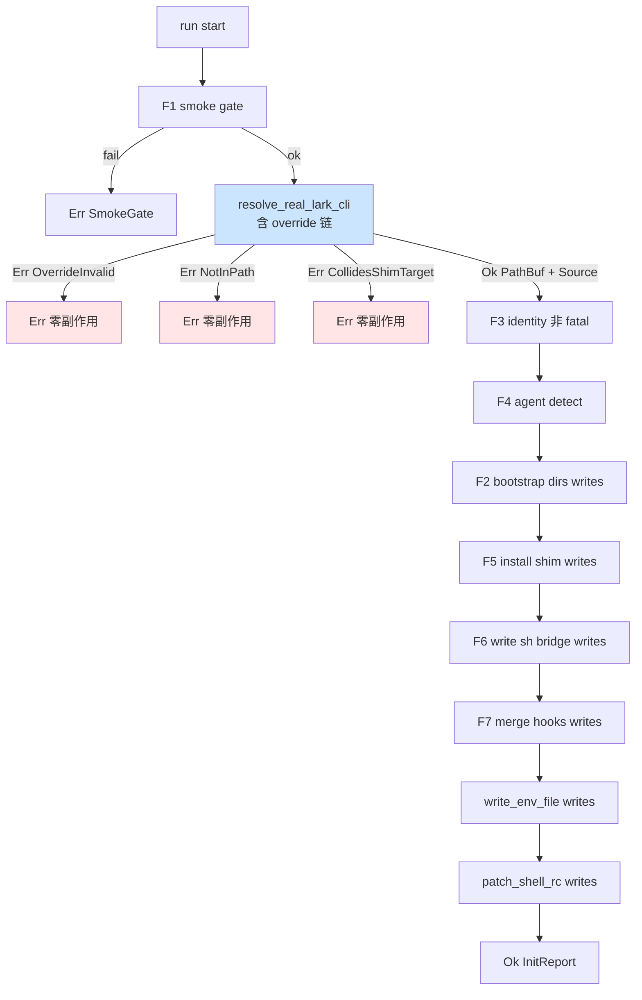

# init real-lark-cli override 设计

## 0. 决策头注

- **issue 背景**：`.codestable/issues/2026-05-18-init-shim-conflicts-npm-prefix/` confirmed P2。bot-stop-hook 真机 dogfood 时撞到：npm 全局 prefix (`~/.local`) ≡ 默认 shim target (`~/.local/bin/lark-cli`)，`resolve_real_lark_cli` 排除 shim target 后 0 候选 → `RealLarkCliMissing`。**用户拍板根治**：override flag/env + 错误信息改善 + resolve 上移避免破损状态
- **req 对齐**：`agent-work-in-feishu`——onboarding 是 B 用户首次装机入口，init 卡住等于 req 入口卡住。本 feature 让"装过 npm lark-cli 的用户"也能跑通 init
- **决策头**（user 拍板 2026-05-18）：
  - **D1 env 名复用 `ROOSTERY_LARK_CLI_BIN`**——既有 runtime override（`smoke` / `LarkCli::new` 走它），init 同读同义务，一个 env 走天下。**不引入** `ROOSTERY_REAL_LARK_CLI_BIN` 等近义新 env
  - **D2 scope = override + 移 resolve + 错误信息重构**三件齐做。理由：三者同一调用点同一失败面；分两 feature 第二 feature 又要回来改同一段代码
  - **D3 accept 含 dogfood**：env 设 + roostery init 跑通 + CC SessionEnd 真飞书被动路径验证（兑现 bot-stop-hook accept 跳掉的那一半）

## 1. 范围 / 决策 / 明确不做 / 复杂度档位

### 1.1 必做（用户故事 → 行为）

| # | 行为 | 输入 | 期望可观察结果 |
|---|---|---|---|
| F1 | `--real-lark-cli <path>` flag | `roostery init --real-lark-cli /path/to/lark-cli` | 跳过 PATH 搜索；直接用此值作 real lark-cli 写入 `~/.roostery/env` |
| F2 | `ROOSTERY_LARK_CLI_BIN` env override（init 复用 runtime override） | 启动 init 时进程 env 已设此值 | 等同 F1；env 优先级**低于** flag |
| F3 | flag + env 同设 → flag 赢 | `ROOSTERY_LARK_CLI_BIN=/a roostery init --real-lark-cli /b` | 用 `/b` |
| F4 | resolve 调用上移到 smoke gate 之后第一时间 | live 模式跑 init | 失败时（无 override + PATH 搜不到）零文件副作用：未 install shim / 未写 sh bridge / 未 merge hook / 未写 env file |
| F5 | 错误信息拆 2 sub-variant | resolve 失败 | (a) PATH 上 0 候选 → `LarkCliNotInPath`；(b) 唯一候选 = shim target → `LarkCliCollidesShimTarget { found_at, shim_target }` |
| F6 | 错误信息含 fix hint | (a) / (b) 任一变体 | 文本含建议："set `--real-lark-cli <path>` 或 `ROOSTERY_LARK_CLI_BIN` env 显式指定" |
| F7 | override 路径校验 | flag/env 指向不存在文件或非可执行 | resolve 阶段返 `OverrideInvalid { path, reason }`；零文件副作用 |
| F8 | InitReport 含 real_lark_cli 来源 | report.real_lark_cli_source: enum | `Flag` / `Env` / `PathDetected`——format_report 文本里输出来源 |
| F9 | dry-run 行为对齐 live | `--dry-run` + 任意 override / 无 override 路径 | 与 live 模式同样 fail-early 同样错误信息；不写任何文件 |

### 1.2 关键决策（D1-D10）

| # | 决策 | 理由 |
|---|---|---|
| D1 | env 名复用 `ROOSTERY_LARK_CLI_BIN` | user 拍板；与现 runtime override 语义一致，避免命名空间膨胀 |
| D2 | 优先级 flag > env > PATH 搜索 | flag 是当前命令一次性意图，env 是 shell session 长效，PATH 是兜底 |
| D3 | resolve 上移到 F1 smoke 之后 | 见 F4；fail-late 在 live 模式会留 install_shim 后破损态。修这个 = 错误零副作用 = "smoke gate 失败零文件副作用"红线在 resolve 上复刻 |
| D4 | RealLarkCliMissing 拆 2 sub-variant（`OnboardingError` 是 `#[non_exhaustive]`，外部 caller 走 `_ =>` 兼容）| 错误信息按 case 区分给不同 hint；原 variant 保留还是删？删——`#[non_exhaustive]` 允许新增/删除变体，且本 feature 是 P2 bugfix 不需要 backwards-compat（feature 未发版） |
| D5 | 不引入 `ROOSTERY_REAL_LARK_CLI_BIN` 等新 env | 与 D1 配套；env 命名空间精简 |
| D6 | override 路径校验：存在 + 可执行 | which::which 已隐含此检查；显式 override 也要等价校验，否则 init 装完跑起来 shim 报错 |
| D7 | InitArgs 加 `real_lark_cli: Option<PathBuf>` 字段；clap derive `--real-lark-cli` long flag | 与现 `--dry-run` / `--skip-agent` 风格一致 |
| D8 | InitOptions 同步加 `real_lark_cli_override: Option<PathBuf>` | main.rs 把 args 翻成 opts 不丢字段 |
| D9 | InitReport 加 `real_lark_cli_source` 枚举 | 让 `roostery init` 输出 "using real lark-cli from flag/env/PATH at <path>" 让用户知道走了哪条路径 |
| D10 | 不改 shim 本身行为 | shim 读 `ROOSTERY_REAL_LARK_CLI` 走 transparent forward 这段不动；本 feature 只动"init 时怎么决定 ROOSTERY_REAL_LARK_CLI 写啥" |

### 1.3 明确不做

- ❌ 不实现 `roostery init --uninstall` / shim reverter（已在 roostery-init feature design 排除）
- ❌ 不改 shim 二进制本身（只动 init 的 resolve 阶段）
- ❌ 不改 `LarkCli::new()` 的 `ROOSTERY_LARK_CLI_BIN` 读取语义（保持 runtime override 原义）
- ❌ 不引入 `--shim-target <path>` flag 改 shim 安装位（本 feature 不解决"shim 不装到 ~/.local/bin"诉求；若未来有需求另开 feature）
- ❌ 不做 `ROOSTERY_LARK_CLI_BIN` 与 shim 安装位置的冲突检测（若 override 指向 shim_target 本身 → 进入 shim 自递归 forward 是个新问题；本 feature 只防 "no candidate"，自递归留观察项）
- ❌ 不改 `OnboardingError::Display` 之外的其他 variant 文案
- ❌ 不实现 `roostery doctor` 等独立诊断子命令

### 1.4 复杂度档位

走默认档位。无对外 SDK / 高并发 / 一次性工具偏离。**单一非默认点**：本是 bugfix 而非新能力，但因含错误重构 + 顺序重排，按"小修不小改"对待。

## 2. 名词层 / 编排层 / 挂载点 / 推进策略

### 2.1 名词层

**现状**：

- `InitOptions { dry_run: bool, skip_agents: Vec<AgentKind> }` (`onboarding.rs:134-138`)
- `InitArgs { dry_run: bool, skip_agents: Vec<String> }` (`main.rs:97-107`)
- `InitReport { ..., real_lark_cli: PathBuf, dry_run: bool }` (`onboarding.rs:140-150`)
- `OnboardingError` 含 `RealLarkCliMissing` 单变体（`onboarding.rs:84-88`），`#[non_exhaustive]` enum
- `fn resolve_real_lark_cli(shim_target: &Path) -> Result<PathBuf, OnboardingError>` (`onboarding.rs:417-427`)——内部走 `which::which_all("lark-cli")` 排除 shim_target
- `ROOSTERY_LARK_CLI_BIN` env (`smoke.rs:17` / `subprocess.rs:14`) — runtime LarkCli subprocess 二进制 override

**变化**：

```rust
// InitOptions 加 1 字段
#[derive(Debug, Clone, Default)]
pub struct InitOptions {
    pub dry_run: bool,
    pub skip_agents: Vec<AgentKind>,
    /// 显式指定真 lark-cli 路径，跳过 PATH 搜索。优先级最高。
    /// `None` → 读 `ROOSTERY_LARK_CLI_BIN` env → PATH 搜索
    pub real_lark_cli_override: Option<PathBuf>,
}

// InitReport 加 1 字段
pub struct InitReport {
    // ... existing ...
    pub real_lark_cli_source: RealLarkCliSource,
}

#[derive(Debug, Clone, Copy, PartialEq, Eq)]
#[non_exhaustive]
pub enum RealLarkCliSource {
    /// 来自 InitOptions.real_lark_cli_override（一般经 `--real-lark-cli` flag）
    Flag,
    /// 来自 ROOSTERY_LARK_CLI_BIN env
    Env,
    /// 来自 PATH 搜索（which::which_all 排 shim_target 后第一个候选）
    PathDetected,
}

// OnboardingError 重构相关 variant
#[non_exhaustive]
pub enum OnboardingError {
    // ... existing variants except RealLarkCliMissing ...

    /// PATH 上没找到任何 `lark-cli` 候选（且未通过 flag/env 显式指定）
    #[error("no `lark-cli` found on PATH; install it (e.g. `npm install -g @larksuite/cli`) \
             or pass `--real-lark-cli <path>` / set `ROOSTERY_LARK_CLI_BIN` env")]
    LarkCliNotInPath,

    /// PATH 上唯一的 `lark-cli` 候选正好等于 shim 安装目标位置——若放任 init 跑下去
    /// shim 自我引用。常见于 npm 全局 prefix 与 shim target 都落在 `~/.local/`。
    #[error("only `lark-cli` candidate on PATH is the shim install target ({shim_target}); \
             pass `--real-lark-cli <path>` (e.g. {shim_target}-real) or set \
             `ROOSTERY_LARK_CLI_BIN` env to the real binary path")]
    LarkCliCollidesShimTarget {
        found_at: PathBuf,    // == shim_target，但显式带出便于诊断
        shim_target: PathBuf,
    },

    /// 用户给了 override 但路径不存在 / 不可执行
    #[error("`--real-lark-cli` / `ROOSTERY_LARK_CLI_BIN` points to {path} which is {reason}")]
    OverrideInvalid {
        path: PathBuf,
        reason: &'static str,  // "missing" / "not executable" / "is a directory"
    },
}
```

`InitArgs`（main.rs clap struct）加一字段：

```rust
#[derive(Args)]
struct InitArgs {
    #[arg(long)] dry_run: bool,
    #[arg(long = "skip-agent", value_name = "AGENT")] skip_agents: Vec<String>,
    /// Explicit path to the real lark-cli binary. Overrides PATH search.
    /// Priority: this flag > `ROOSTERY_LARK_CLI_BIN` env > PATH search.
    #[arg(long, value_name = "PATH")]
    real_lark_cli: Option<PathBuf>,
}
```

**resolve 函数签名变化**：

```rust
// before:
fn resolve_real_lark_cli(shim_target: &Path) -> Result<PathBuf, OnboardingError>

// after:
fn resolve_real_lark_cli(
    shim_target: &Path,
    override_path: Option<&Path>,  // 来自 InitOptions.real_lark_cli_override
) -> Result<(PathBuf, RealLarkCliSource), OnboardingError>
```

返还 tuple `(PathBuf, RealLarkCliSource)` 让 caller 知道走的哪条路径（写 InitReport）。

**接口示例**：

```bash
# 情形 1：flag 一次性
roostery init --real-lark-cli /opt/feishu/lark-cli
# → resolve 走 override；source = Flag

# 情形 2：env 长效（shell rc 里 export）
ROOSTERY_LARK_CLI_BIN=/Users/me/.local/lib/.../run.js roostery init
# → resolve 走 env；source = Env

# 情形 3：flag + env 都设
ROOSTERY_LARK_CLI_BIN=/a roostery init --real-lark-cli /b
# → resolve 走 /b（flag 赢）；source = Flag；env 完全忽略不报错

# 情形 4：PATH 上有非冲突 lark-cli
# 用户 brew install lark-cli 装在 /usr/local/bin/lark-cli ≠ shim target ~/.local/bin/lark-cli
roostery init
# → resolve 走 PATH 第一个候选；source = PathDetected

# 情形 5：collision 错误
# 用户 npm install -g 装 lark-cli 落 ~/.local/bin/lark-cli == shim target
roostery init
# → Err(LarkCliCollidesShimTarget { ... })，hint 让用 flag/env

# 情形 6：override 路径错
roostery init --real-lark-cli /not/exists
# → Err(OverrideInvalid { path: "/not/exists", reason: "missing" })
```

### 2.2 编排层

**现状**：`onboarding::run` 当前顺序（`onboarding.rs:162-234`）：

```
F1 smoke gate
F3 identity (non-fatal)
F4 agent detect
F2 bootstrap dirs (writes)
F5 install shim (writes)
F6 write sh bridge (writes)
F7 merge hooks (writes)
[L205] resolve_real_lark_cli ← 失败留破损态
write_env_file
patch_shell_rc
```

**变化**：把 resolve 提前到 F1 之后第一时间，所有 write 操作之前。失败 → 零文件副作用退出。



**关键编排函数变化**：

```rust
pub async fn run(runner, opts) -> Result<InitReport, OnboardingError> {
    // F1 smoke gate
    smoke::ensure_ready()?;

    // ⭐ resolve 上移：override > env > PATH
    let shim_target = home_join(SHIM_TARGET_RELATIVE)?;
    let (real_lark_cli, real_lark_cli_source) = resolve_real_lark_cli(
        &shim_target,
        opts.real_lark_cli_override.as_deref(),
    )?;
    // 上面任意 Err 都在 zero-write 状态返还

    // F3-F7 现有顺序不变（dry_run gate 不变）
    // ...

    // write_env_file 已知 real_lark_cli，直接用，无需重新 resolve
    if !opts.dry_run {
        write_env_file(&paths::env_file(), &real_lark_cli)?;
    }
    // ...
    Ok(InitReport { ..., real_lark_cli, real_lark_cli_source })
}
```

**新 resolve 函数实现要点**：

```rust
fn resolve_real_lark_cli(
    shim_target: &Path,
    override_path: Option<&Path>,
) -> Result<(PathBuf, RealLarkCliSource), OnboardingError> {
    // 1. flag override
    if let Some(p) = override_path {
        validate_override(p)?;
        return Ok((p.to_path_buf(), RealLarkCliSource::Flag));
    }
    // 2. env override
    if let Ok(s) = std::env::var("ROOSTERY_LARK_CLI_BIN") && !s.is_empty() {
        let p = PathBuf::from(s);
        validate_override(&p)?;
        return Ok((p, RealLarkCliSource::Env));
    }
    // 3. PATH search
    let candidates: Vec<PathBuf> = which::which_all("lark-cli")
        .map_err(|_| OnboardingError::LarkCliNotInPath)?
        .collect();
    if candidates.is_empty() {
        return Err(OnboardingError::LarkCliNotInPath);
    }
    for p in &candidates {
        if p != shim_target {
            return Ok((p.clone(), RealLarkCliSource::PathDetected));
        }
    }
    // 所有候选 = shim_target（collision case）
    Err(OnboardingError::LarkCliCollidesShimTarget {
        found_at: candidates[0].clone(),
        shim_target: shim_target.to_path_buf(),
    })
}

fn validate_override(path: &Path) -> Result<(), OnboardingError> {
    if !path.exists() {
        return Err(OnboardingError::OverrideInvalid {
            path: path.to_path_buf(),
            reason: "missing",
        });
    }
    if path.is_dir() {
        return Err(OnboardingError::OverrideInvalid {
            path: path.to_path_buf(),
            reason: "is a directory",
        });
    }
    // 可选：检查可执行权限（unix only），不实现则 shim forward 时再爆
    Ok(())
}
```

**流程级约束**：

- **错误语义**：resolve 失败 → 零文件副作用退出（与现有 smoke gate 失败语义对齐）
- **优先级链**：flag > env > PATH，三层独立短路，env 缺失/空字符串都视为未设
- **dry-run 平价**：dry-run 与 live 模式走相同 resolve 路径，错误信息一致

### 2.3 挂载点

> 判据：删了它本 feature 是否在用户/系统视角消失？

| # | 挂载点 | 位置 | 删了之后 |
|---|---|---|---|
| 1 | `InitArgs.real_lark_cli` clap flag | `crates/roostery/src/main.rs` InitArgs struct | `--real-lark-cli <path>` flag 消失，用户只能走 env 或撞 PATH |
| 2 | `InitOptions.real_lark_cli_override` 字段 + `resolve_real_lark_cli` 二参签名 | `crates/roostery/src/onboarding.rs` | resolve 退化回单参 PATH-only 搜索，flag/env override 链失效 |
| 3 | `resolve_real_lark_cli` 调用点上移到 F1 后第一时间 | `crates/roostery/src/onboarding.rs::run` 函数顺序 | 退回 fail-late install_shim 后破损态 |
| 4 | `OnboardingError` 三 sub-variant (`LarkCliNotInPath` / `LarkCliCollidesShimTarget` / `OverrideInvalid`) + Display 文案 | `crates/roostery/src/onboarding.rs` enum | 错误信息回退到单变体粗粒度 |

4 条都是"删了本 feature 整个工作就回到 issue 状态"。**不列**：`RealLarkCliSource` enum（是辅助类型，删了 fall back to 只输出 real_lark_cli path 不输出来源）；validate_override helper（内部实现细节）；InitReport 字段（辅助透出）。

### 2.4 推进策略（paradigm 维度切片）

| step | paradigm 维度 | 内容 | 退出信号 |
|---|---|---|---|
| 0 | 结构健康度 | 见 2.5 评估 | 见 2.5 |
| 1 | 名词 / 类型边界 | OnboardingError 3 新变体 + 删 RealLarkCliMissing；RealLarkCliSource enum；InitOptions / InitArgs / InitReport 加字段；validate_override 占位 todo!() | `cargo build` 全绿；类型单测 3 条（Display 文案 / Source variants / non_exhaustive E0639 守护） |
| 2 | 计算 / 纯函数 | validate_override 实现 + 4 路径单测（不存在 / 是目录 / 普通文件 / unix 执行权可选） | validate_override 单测全绿 |
| 3 | 编排骨架 | resolve_real_lark_cli 新签名 + 三层链实现；7 集成单测覆盖 (flag-only / env-only / flag-wins-over-env / PATH-only / 0-candidates / shim-collision / override-invalid) | resolve 单测全绿 |
| 4 | 调用点上移 | onboarding::run 把 resolve 调用挪到 F1 之后；shim_target 提取到 resolve 前；后续 write 路径不再调 resolve（已得 PathBuf）；保留 dry_run gate | onboarding 现有 16 个单测 + 5 个 integration test 全绿 |
| 5 | CLI 接线 | main.rs InitArgs 加 `--real-lark-cli` flag + 翻译到 InitOptions；help 文档；clap 单测 1 条（flag parse） | `cargo run -- init --help` 显示 `--real-lark-cli`；clap parse 单测过 |
| 6 | CLI 集成测试 | tests/onboarding_integration.rs 加 4 条 e2e：(a) flag override 跑通 / (b) env override 跑通 / (c) collision 错误零副作用 / (d) override-invalid 错误零副作用 | `cargo test --test onboarding_integration` 全绿 |
| 7 | 报告输出 | format_report 加 "real lark-cli: {path} (from {source})" 行；InitReport.real_lark_cli_source 序列化（如有） | manual run + format snapshot 验证 |
| 8 | 完整验收 + 守护 grep + CI | fmt + clippy -D warnings + test --all + test --doc 四绿；N1-N4 grep；推 CI 三 job 绿 | 四绿 + CI 全绿 + 守护 grep 全 0 |

### 2.5 结构健康度与微重构

**评估对象 1：要改的文件**

- `crates/roostery/src/onboarding.rs`——已 700+ 行（产品 ~520 + 测试 ~180）。本 feature 加 ~50 行（resolve 重写 + 3 错误变体 + RealLarkCliSource enum + validate_override + 几条测试）→ 770 行。**接近偏胖但仍可控**。该文件职责"onboarding pipeline 编排 + 多 helper" 已开始混杂；resolve_real_lark_cli + validate_override 一组逻辑可拆 `crates/roostery/src/onboarding/resolve.rs` 子文件
- `crates/roostery/src/main.rs`——已 ~360 行（含 dispatcher / init / bot 三套 subcommand 胶水）。本 feature 加 1 个 flag = +3 行。健康
- `crates/roostery/src/lark_cli/subprocess.rs`——不动
- `crates/roostery/src/smoke.rs`——不动

**评估对象 2：要落新文件的目标目录**

- 顶层 `crates/roostery/src/`：14 条目（含 bot_stop_hook.rs 新增后）。新文件 `onboarding/resolve.rs` 要求把 onboarding.rs 提升为 `onboarding/mod.rs`+子模块 → 顶层条目数 14→14（onboarding 变成子目录但仍占 1 个顶层条目）。仍健康

**已查 compound convention**：grep `.codestable/compound/` 关键词 "目录组织 / 文件归属 / 命名约定"：
- decision `cli-subcommand-module-layout`（2026-05-18，bot-stop-hook 落定）——建议子命令 args+run 放对应模块 `pub mod cli`。本 feature **的 init 不属于 bot subcommand**，已经有 onboarding 模块作为归属；只是 onboarding 模块内部是否升级目录的问题
- decision `rust-module-organization`（2026-05-16）——读起来是模块分层原则，可印证升目录决策

**结论：不做微重构**（推迟到 onboarding 模块整体重组时）

理由：
1. 升 `onboarding/` 子目录是 provable refactor（IDE rename + 编译器验证），技术上可行
2. 但与 attention.md "实施期遵循 KISS" 精神冲突——单独为 +50 行升目录略激进
3. Module D 后续还有 onboarding 扩展（如 `roostery doctor` 等子命令），届时一次性升目录更合算
4. 当前 onboarding.rs 770 行（含测试）仍在项目其他模块同档（journal.rs ~800、bot_task_writer.rs ~1000）

**超出范围的观察**：

- O1 onboarding.rs 800 行级单文件，未来 +1-2 个 feature 后建议走 cs-refactor 升 `src/onboarding/{mod, resolve, install, hooks_merge}.rs` 子目录结构。**不阻塞本 feature**
- O2 `ROOSTERY_LARK_CLI_BIN` 与 shim 安装位 collision 检测（override 指向 shim_target 本身会导致 shim 自递归）——本 feature 不防御，留观察项

## 3. 验收契约

### 3.1 关键场景（输入 → 期望可观察结果）

**正常路径**

| # | 输入 | 期望 |
|---|---|---|
| A1 `--real-lark-cli` flag 指向有效 path | `roostery init --real-lark-cli /usr/bin/lark-cli`（虚构存在） | init 跑完；`~/.roostery/env` 含 `export ROOSTERY_REAL_LARK_CLI=/usr/bin/lark-cli`；report.real_lark_cli_source = Flag |
| A2 env override 指向有效 path | `ROOSTERY_LARK_CLI_BIN=/usr/bin/lark-cli roostery init` | 同 A1；source = Env |
| A3 flag + env 都设 | `ROOSTERY_LARK_CLI_BIN=/a roostery init --real-lark-cli /b` | env 文件含 `/b`；source = Flag；不报 warning（env 被静默忽略） |
| A4 PATH 单候选非 shim | brew install lark-cli 落 `/usr/local/bin/lark-cli`，shim target `~/.local/bin/lark-cli` | resolve 找到 `/usr/local/bin/lark-cli`；source = PathDetected |
| A5 PATH 多候选含 shim target | `[brew_path, shim_target]` 两候选 | 取非 shim_target 那个；source = PathDetected |

**边界**

| # | 输入 | 期望 |
|---|---|---|
| B1 flag 路径 = shim target | `--real-lark-cli ~/.local/bin/lark-cli`（即 shim target） | **flag 优先级最高**：通过（shim 自递归风险见 O2 观察，本 feature 不防）；source = Flag |
| B2 env 路径相对位 | `ROOSTERY_LARK_CLI_BIN=./lark-cli roostery init` | validate_override 检查 path.exists() 走相对当前 cwd；通过则跑通；不通过 OverrideInvalid |
| B3 env 路径含空格 | `ROOSTERY_LARK_CLI_BIN="/path with space/lark-cli" roostery init` | 路径含空格不影响 resolve；env 文件写入时 shell 引号处理是 write_env_file 现有职责（本 feature 不动） |
| B4 dry-run + override | `roostery init --dry-run --real-lark-cli /usr/bin/lark-cli` | 走相同 resolve 但不写文件；report.dry_run = true |
| B5 `ROOSTERY_LARK_CLI_BIN=""` 空字符串 | shell env 设了空值 | 视为未设；走下一层（PATH 搜索） |

**错误**

| # | 输入 | 期望 |
|---|---|---|
| E1 0 候选 + 无 override | PATH 上无 lark-cli + env/flag 未设 | `Err(LarkCliNotInPath)`；文案含 npm install hint + flag/env hint；**零文件副作用** |
| E2 collision + 无 override | `which lark-cli` 唯一 = shim target | `Err(LarkCliCollidesShimTarget { found_at, shim_target })`；文案含 flag/env hint；零文件副作用 |
| E3 flag override 不存在 | `--real-lark-cli /not/exists` | `Err(OverrideInvalid { reason: "missing" })`；零文件副作用 |
| E4 flag override 是目录 | `--real-lark-cli /tmp` | `Err(OverrideInvalid { reason: "is a directory" })`；零文件副作用 |
| E5 E1-E4 + dry-run | 同 E1-E4 加 `--dry-run` | 与 live 模式同样的 Err；零文件副作用（dry-run 本来就不写文件） |
| E6 smoke gate fail | smoke 不绿 | 在 resolve 之前 fail，与现有行为一致；零文件副作用 |

### 3.2 明确不做的反向核对项

- ✅ 不引入 `ROOSTERY_REAL_LARK_CLI_BIN` 新 env（grep crates/roostery/src 应为 0；保留只在 attention.md / issue report 提及）
- ✅ 不改 shim binary（grep `crates/roostery/src/bin/shim.rs` 本 feature 无 diff）
- ✅ 不改 `LarkCli::new` / `subprocess.rs` ROOSTERY_LARK_CLI_BIN 读取语义（grep 这些点 diff 为 0）
- ✅ 不加 `--shim-target <path>` flag（grep main.rs InitArgs 不含 shim_target field）
- ✅ override = shim_target 时不报 warning / error（D6 不防 collision，与 B1 一致）
- ✅ resolve 顺序在 F1 之后、F2 之前（grep onboarding::run，resolve_real_lark_cli 调用行号 < bootstrap_dirs / install_shim 调用行号）

## 4. 接口契约 / 跨模块影响

**新增 Cargo dep**：无

**clap CLI** 顶层 enum 无变化；InitArgs 加 1 field。

**`lib.rs`** 无变化（onboarding 公开 API 接口扩展，但模块挂载点不变）。

**`paths.rs`** 不变。

**`smoke.rs` / `subprocess.rs`** 不变（仍是 ROOSTERY_LARK_CLI_BIN 现有 runtime 语义）。

**templates/** 不变。

**ARCHITECTURE.md 影响**：

- §2 术语表加 `RealLarkCliSource` enum 一条
- §6 已知约束加一条：`ROOSTERY_LARK_CLI_BIN` env 在 **runtime** 与 **init time** 双语义复用——runtime 决定 LarkCli subprocess 调什么二进制，init 决定写到 `~/.roostery/env` 的 ROOSTERY_REAL_LARK_CLI 是什么。两者在用户视角是一致的（"我的 lark-cli 在这里"），但红线必须明确：本 env 永远不该被设成 shim 自身的路径——会导致 shim 自递归

acceptance 阶段写入。

**与已有 feature 关系**：

- 修正 feature `2026-05-18-roostery-init`（原 resolve 调用点 + 单变体错误）
- 兑现 feature `2026-05-18-bot-stop-hook` accept 时跳过的"CC SessionEnd 真飞书被动路径"dogfood（accept 阶段补）

## 5. 设计假设 / 风险 / 未决

**假设**（user 可精确反驳）：

1. 假设 `which::which_all` 在 macOS / Linux 都返还 PATH 顺序优先 list（已 implicitly 验证于 roostery-init feature）
2. 假设 `path.exists()` + `path.is_dir()` 足够 validate override（不强检 unix execute permission——shim forward 时若不可执行会爆，错误信息 caller 可看 stderr）
3. 假设 `ROOSTERY_LARK_CLI_BIN` 在 runtime / init 双语义共享不会引入用户认知混乱（设了 env 用户的期望就是"这是我的 lark-cli"无论 runtime 还是 init time）

**风险**：

- R1（低）：override 路径指向不可执行文件 → init 装完跑起来 shim forward 报错。mitigation：validate_override 可选加 execute check；本 feature 不实现，留 implement 阶段实测决定
- R2（中）：用户已跑过破损 init（live 模式 fail-late）→ shim 已装 + ROOSTERY_REAL_LARK_CLI 没写。本 feature 不实现 self-healing；用户需手动 rm `~/.local/bin/lark-cli` 重新装 npm lark-cli 然后重跑 init。**应在 release notes 提示**
- R3（低）：`OnboardingError::RealLarkCliMissing` 删除是 ABI break，对 lib 外部 caller 影响——但本 crate 是 binary + lib 共用，目前无外部 lib consumer

**未决**（implement 阶段实测决）：

- U1 validate_override 是否检查 unix execute bit。倾向"不检查"——overhead vs 收益不明
- U2 `roostery init --help` 文档里要不要专门解释 `--real-lark-cli` 与 `ROOSTERY_LARK_CLI_BIN` 关系。倾向 "flag help text 一句话提"
- U3 `format_report` 输出的 "real lark-cli from {source}" 文案具体措辞。implement 阶段写完看效果再定
