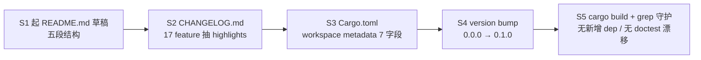

# 0.1.0 release 准备设计

## 0. 决策头注

- **brainstorm 对齐**：`.codestable/brainstorms/v0.x-direction/brainstorm.md` 已决"0.1.x **不上** crates.io，crates.io 推迟到 0.2.0 前夜"。本 feature **完全尊重该决议**——只做 metadata 预热，**不**跑 `cargo publish --dry-run`（避免假行出错提示动摇决议）。Cargo.toml 加 keywords / categories / readme 等字段是为 0.2.0 readiness 提前打好，不冲突
- **req 对齐**：`agent-work-in-feishu`（status: current）的 B 类用户首次接触 Roostery 看 README——本 feature 是 req 的"对外门面"层兑现
- **决策头**（user 拍板 2026-05-18 + brainstorm 决议）：
  - **D1 crates.io publish 推迟到 0.2.0**——尊重 brainstorm；本期仅补 Cargo.toml metadata 字段
  - **D2 version bump 0.0.0 → 0.1.0**——workspace Cargo.toml 一处；accept 阶段打 `git tag v0.1.0` annotated tag（带 release notes 引用）
  - **D3 README 五段结构**：Hero (多设备 vibecoding 痛点 + 数据主权 + 飞书原生) → 状态（Rust 0.1.0 已发 / B 类自托管定位）→ Quickstart（roostery init + bot push 示例）→ 技术属性（vendor-neutral / Feishu-native / local-first / developer-priority 下移）→ 跟谁错位（保留现表）
  - **D4 CHANGELOG Keep a Changelog 格式** `[0.1.0] - 2026-05-18` 章节 feature-粒度 Added/Changed/Fixed 分类
  - **D5 不打 GitHub release page**——本 feature 仅 git tag；GH release page 的发布动作（写 release notes / 上传 binary artifacts）推到独立 follow-up（如果有），本期不开
  - **D6 不动 LICENSE**——已存在 MIT，无变更
  - **D7 不删 npm `index.js`**——本 feature 焦点 Cargo / Rust 侧；npm namespace 已 reserved（attention.md），index.js 删除走独立 chore PR 即可

## 1. 范围 / 决策 / 明确不做 / 复杂度档位

### 1.1 必做（用户故事 → 行为）

| # | 行为 | 输入 | 期望可观察结果 |
|---|---|---|---|
| F1 README.md 完全重写 | 现 44 行 placeholder（"Rust 重写中" + 4 条技术属性 + 错位表） | 五段结构新文本：Hero / 状态 / Quickstart / 技术属性 / 跟谁错位；现 LICENSE 提及保留；现"状态"块更新为 "0.1.0 已发"；现"跟谁错位"表全文保留 |
| F2 CHANGELOG.md 新建 | 无文件 | Keep a Changelog 格式 markdown；`## [0.1.0] - 2026-05-18` 章节按 Added/Changed/Fixed 分类列 17 feature highlights + 1 issue resolved；末尾 `[Unreleased]` 占位 + 链接 ref defs |
| F3 workspace Cargo.toml metadata 完善 | 现有 version/edition/license/authors/repository | 加 `description`（workspace 级回填）+ `keywords`（5 个最大）+ `categories`（≤ 5）+ `readme`（"README.md"）+ `homepage`（同 repository 或独立）+ `documentation`（GH repo 或 docs.rs 引用）+ `rust-version`（MSRV，本仓库 toolchain pin） |
| F4 crate-level Cargo.toml description 改为 inherit | 现 crates/roostery/Cargo.toml description 硬编码 "🪺 Vendor-neutral agent broker, Feishu-native." | 改 `description.workspace = true`，让 workspace 单点维护 description；workspace.package 补 description 字段 |
| F5 version bump | workspace.package version = "0.0.0" | 改 "0.1.0"；crate-level `version.workspace = true` 不动；`crates/roostery/src/main.rs` 的 `version = concat!(env!("CARGO_PKG_VERSION"), " (rust)")` 自动跟随显 "0.1.0 (rust)" |
| F6 README 示例命令可跑 | README Quickstart 段 | `roostery init --real-lark-cli <path>` + `roostery bot push --agent X --session Y --summary "..." --json` 两条核心命令；可选第三条 `roostery smoke` 验环境；示例**与本仓库 0.1.0 release 实际行为一致**（不写未来 feature） |
| F7 git tag v0.1.0 | accept 阶段 | 主分支 accept commit 后打 `git tag -a v0.1.0 -m "0.1.0: Rust 可用 + B 验收形态达成"`；不 push tag（用户决定 push 时机；GH release page 推后续 feature） |

### 1.2 关键决策（D1-D7 见 §0，下面补 D8-D12 范围内技术细节）

| # | 决策 | 理由 |
|---|---|---|
| D8 `keywords` 选 5 个 | crates.io 限制 ≤ 5 个 + lowercase + 单 word + `[a-z0-9_-]`。建议：`agent`, `feishu`, `lark`, `broker`, `vibecoding` | `agent` 通用 / `feishu` 主舞台 / `lark` 飞书国际版同义 / `broker` 定位 / `vibecoding` 差异化用户视角 |
| D9 `categories` 选 ≤ 5 | crates.io 限制官方 category 列表。建议：`command-line-utilities`（roostery / shim 二进制）+ `development-tools`（开发者工具定位）+ `api-bindings`（lark-cli wrapper） | 三类正好覆盖三个面向 |
| D10 `rust-version` 写 MSRV | `rust-toolchain.toml` pin stable channel；本期写当前 stable 起点（如 `1.95`）。准确值 implement 时读 toolchain 决定 | 让 crates.io 显示 MSRV 友好版本兼容指示，0.2.0 publish 时直接复用 |
| D11 `homepage` = repository 同址 | 暂无独立 docs 网站 / landing page；与 repository URL 重复但 crates.io 字段表预期独立 field | 0.2.0 后若有 docs.rs / GH Pages landing 再细分 |
| D12 CHANGELOG 内容粒度 = feature 单位 | 17 个落地 feature + 1 issue resolved（init-shim-conflicts-npm-prefix）按 Added/Changed/Fixed 三类排；不展开 commit 级细节 | Keep a Changelog convention；reader 想看细节走 git log + feature design doc |

### 1.3 明确不做

- ❌ **不 publish crates.io**（D1 / brainstorm）。Cargo.toml 字段为 0.2.0 预热但本期不试 `cargo publish --dry-run`
- ❌ **不 push git tag**（D2）。git tag 本地打；push 时机用户拍板，可能与 GH release page 同期
- ❌ **不开 GH release page**（D5）。release notes / binary artifacts 上传是独立产物，推 follow-up feature
- ❌ **不动 LICENSE**（D6）
- ❌ **不删 npm package** `index.js` / package.json 任何字段（D7）。npm namespace 保留状态不变
- ❌ **不改 ARCHITECTURE.md / requirement / roadmap 等 codestable doc 实质内容**（accept 阶段只是 cross-link 引用本 feature commit + tag，不改实体内容）
- ❌ **不写 binary 预编译产物**（如 `target/release/roostery` 上传到 GH release）。这是 follow-up
- ❌ **不写多语言 README**（如 README.zh-CN.md / README.en.md）。本期单文件，中英混排（与现 README 风格一致）
- ❌ **不写 CONTRIBUTING.md / CODE_OF_CONDUCT.md / SECURITY.md** —— 0.1.x 阶段单人开发，社区文档推到首批外部 contributor 进来后做
- ❌ **不引入新 Cargo dep**

### 1.4 复杂度档位

走默认档位。**非默认点**：本 feature 是**文档 + metadata feature**，无 Rust 业务代码。implement / accept 节奏与典型 Rust feature 差异——测试覆盖靠"diff review + cargo build + 字符串 grep 反向核对"，不靠单测 / 集成测。

## 2. 名词层 / 编排层 / 挂载点 / 推进策略

### 2.1 名词层

**现状**：
- `README.md` 44 行 placeholder，技术属性 leading
- 无 `CHANGELOG.md`
- `Cargo.toml`（workspace）含 version=0.0.0 / edition=2024 / license=MIT / authors / repository；**缺** description / keywords / categories / readme / homepage / documentation / rust-version
- `crates/roostery/Cargo.toml`（crate）含 description 硬编码；其他字段 inherit
- `LICENSE` 文件存在（MIT, 2026 Ben Dusy）
- `rust-toolchain.toml` pin stable channel + clippy + rustfmt（具体版本号 implement 时读）

**变化**：

| 名词 | 现状 | 变化 |
|---|---|---|
| `README.md` | 44 行 placeholder | 重写 ~120-180 行五段结构；hero 段复用 `agent-work-in-feishu.md` "为什么需要" 首段（多设备 vibecoding 痛点） |
| `CHANGELOG.md` | 不存在 | 新建 ~80-120 行 Keep a Changelog 格式；`[Unreleased]` + `[0.1.0] - 2026-05-18` 章节 + ref-style link 到 git compare |
| workspace `Cargo.toml` 版本 | `version = "0.0.0"` | `version = "0.1.0"` |
| workspace `Cargo.toml` metadata | 5 字段 | 加 `description / keywords / categories / readme / homepage / documentation / rust-version` 共 7 新字段 |
| crate `Cargo.toml` description | 硬编码字符串 | `description.workspace = true` 改为 inherit |

**接口示例**：

```toml
# workspace Cargo.toml after
[workspace.package]
version = "0.1.0"
edition = "2024"
license = "MIT"
authors = ["Ben Dusy <ben@bendusy.dev>"]
repository = "https://github.com/bendusy/roostery"
description = "🪺 Vendor-neutral, Feishu-native agent broker for multi-device vibecoding."
keywords = ["agent", "feishu", "lark", "broker", "vibecoding"]
categories = ["command-line-utilities", "development-tools", "api-bindings"]
readme = "README.md"
homepage = "https://github.com/bendusy/roostery"
documentation = "https://github.com/bendusy/roostery"
rust-version = "1.95"  # implement 时读 rust-toolchain.toml 校准
```

```markdown
# CHANGELOG.md after

# Changelog

All notable changes to this project will be documented in this file.

The format is based on [Keep a Changelog](https://keepachangelog.com/en/1.1.0/),
and this project adheres to [Semantic Versioning](https://semver.org/spec/v2.0.0.html).

## [Unreleased]

## [0.1.0] - 2026-05-18

🎯 **首个 Rust release**。"Rust 可用 + B 验收形态" 达成。

### Added

- **roostery init**: 单命令装机入口（feature `2026-05-18-roostery-init` + UX 修复 `2026-05-18-init-real-lark-cli-override`）...
- **roostery bot stop-hook / push**: 双 CLI surface（feature `2026-05-18-bot-stop-hook`）...
- **bot_task_writer 库 API**: ...
- **dispatcher 主循环**: ...
- **lark_cli wrapper trait + 3 实现**: ...
- (其他 12 项)

### Fixed

- **init UX**: npm prefix == shim target collision（issue `2026-05-18-init-shim-conflicts-npm-prefix`）...

### Documentation

- README hero 段重写为 user-why leading...
- CHANGELOG 起步...

[Unreleased]: https://github.com/bendusy/roostery/compare/v0.1.0...HEAD
[0.1.0]: https://github.com/bendusy/roostery/releases/tag/v0.1.0
```

```markdown
# README.md hero section (excerpt)

# 🪺 Roostery

**手机也能跟进电脑上的 agent。** 把 agent 工作过程长在飞书里——任务卡 + 步骤流 + 群消息 thread 跨设备同步，不必 SSH 回桌面机看终端。数据全程留在你自己的飞书租户，不经第三方 dashboard。

> A roost for your agent flock — vendor-neutral, Feishu-native agent broker.

## 状态

🎯 **v0.1.0 已发**（2026-05-18）—— Rust 可用形态达成。Phase 5 minimal-loop closing，CC headless 能在飞书出 task。

## Quickstart

\`\`\`bash
cargo install --git https://github.com/bendusy/roostery --bin roostery --bin shim
roostery init --real-lark-cli $(realpath $(which lark-cli))
echo "ready to go" | roostery bot push --agent ci --session run-1 --summary-stdin --json
\`\`\`
```

### 2.2 编排层

**现状**：无（文档 / metadata feature，无运行时编排）。

**变化**：implement 阶段 5 步线性流水（编译期 + 静态文件改动）：



**流程级约束**：

- **错误语义**：本 feature 改动可逆——README / CHANGELOG / Cargo.toml 任一步骤回退都不影响代码运行；version bump 回退 0.1.0 → 0.0.0 也不破坏构建
- **幂等性**：所有改动是文件内容替换 / 字段追加，重跑不会双倍
- **可观测点**：`cargo build` 是 Cargo.toml 改动的健康度信号；`cargo test --all` 是 version bump 不破坏构建的信号；README / CHANGELOG 改动靠 markdown lint（如 markdownlint）和 git diff review 验证

### 2.3 挂载点

> 判据：删了它本 feature 是否在用户/系统视角消失？

| # | 挂载点 | 位置 | 删了之后 |
|---|---|---|---|
| 1 | `README.md` 五段结构内容 | 项目根 `README.md` | GitHub 仓库首页 + cargo doc 主页都退回 placeholder 形态；user-why leading 消失 |
| 2 | `CHANGELOG.md` 文件 | 项目根 `CHANGELOG.md` | reader 无法快速知道 0.1.0 含哪些 feature；只能查 git log + feature design doc |
| 3 | `workspace.package` 元数据扩展（description / keywords / categories / readme / homepage / documentation / rust-version） | `Cargo.toml` workspace 段 | 0.2.0 publish 时还要补一次；本期"为 0.2.0 预热"目标失效 |
| 4 | version "0.1.0" + git tag `v0.1.0` | `Cargo.toml` + git refs | `roostery --version` 退回 "0.0.0 (rust)"；git 没有 release milestone tag |

4 条挂载点。**不列**：crate Cargo.toml 的 `description.workspace = true` 改动（是辅助单点维护，删了仍能编译只是 description 信息冗余在两处）。

### 2.4 推进策略（paradigm 维度切片）

| step | paradigm 维度 | 内容 | 退出信号 |
|---|---|---|---|
| 0 | 结构健康度 | 见 2.5 评估 | 见 2.5 |
| 1 | 文档 / 用户面 | 重写 `README.md` 五段结构；hero 段从 `agent-work-in-feishu.md` "为什么需要" 首段提炼 ≤ 100 字；状态段更新 0.1.0；quickstart 段贴 `roostery init --real-lark-cli` + `roostery bot push --json` 两条命令；技术属性段（vendor-neutral / Feishu-native / local-first / developer-priority）从现 README 下移 + 文案精简；跟谁错位表全文保留 | README 渲染 markdown 无 syntax 错；grep "多设备 vibecoding" / "数据主权" / "roostery init" / "roostery bot push" 全命中 |
| 2 | 文档 / release notes | 新建 `CHANGELOG.md`；Keep a Changelog 格式 header + `[Unreleased]` + `[0.1.0] - 2026-05-18` 章节；扫 `.codestable/features/` 17 子目录抽每个 feature 的 design.frontmatter.summary 作为 highlight；分类 Added（新能力）/ Changed（不存在本期）/ Fixed（init-shim-conflicts-npm-prefix issue resolved）/ Documentation（README + CHANGELOG）；末尾 ref-style link def | CHANGELOG markdown 无 syntax 错；17 feature highlights 全有 entry；link refs 指向 git compare URL（GH 风格） |
| 3 | metadata / packaging | 修改 `Cargo.toml`（workspace）添 7 新字段（description / keywords / categories / readme / homepage / documentation / rust-version）；keywords ≤ 5 / categories ≤ 5 / 所有 string 字段非空；`crates/roostery/Cargo.toml` 把 `description = "..."` 改 `description.workspace = true` | `cargo build -p roostery` 全绿；`cargo metadata --no-deps` JSON 输出含新字段且值正确；`cargo verify-project` (or 等价) 不报 metadata 错 |
| 4 | 版本号 bump | `Cargo.toml`（workspace）`version = "0.0.0"` → `"0.1.0"`；不动 crate-level（已 inherit） | `./target/debug/roostery --version` 输出 `roostery 0.1.0 (rust)`；`cargo build` 全绿；`Cargo.lock` 自动重生且仅 roostery 一行 version 变 |
| 5 | 完整验收 + 守护 grep | 本地 fmt + clippy + test --all + test --doc 四绿（应该不变，确认）；grep 验证 (a) README 含 "多设备" + "vibecoding" + "0.1.0" + "MIT" + Quickstart 块 (b) CHANGELOG 含 17 feature slug (c) Cargo.toml workspace 段 7 新字段 (d) version 0.1.0；推 CI 验三 job 仍绿 | 本地四命令全绿；远端 CI 全绿；grep 守护全 pass |

### 2.5 结构健康度与微重构

**评估对象 1：要改的文件**

- `README.md` 44 行 → ~150 行——文档文件不算"代码膨胀"，长度合理
- `CHANGELOG.md` 新文件——~100 行新建，独立单文件
- `Cargo.toml`（workspace）现 ~10 行 → ~25 行——加 7 字段后仍紧凑
- `crates/roostery/Cargo.toml` 1 行改动（description workspace 化）

**评估对象 2：要落新文件的目标目录**

- 项目根 `/`：现根目录文件数 ~25（含 .codestable / crates / legacy / CLAUDE.md 等）。加 CHANGELOG.md 后 26，不挤
- 不新建子目录

**已查 compound convention**：grep `.codestable/compound/` 关键词 "release / readme / changelog / cargo / metadata"。未命中相关约定

**结论：不做微重构**——纯文档 / metadata feature，文件层面无重构需求

**超出范围的观察**：

- O1：未来如果 README 长到 > 300 行，考虑拆 `docs/` 子目录（用户指南 / 架构概览等）。**0.1.0 本期不做**
- O2：CHANGELOG 写到 0.2.0+ 后随着 release 增加，考虑加 `auto-changelog` 工具自动从 git log 生成。**0.1.0 手工写**
- O3：crates.io publish prep（含 `cargo publish --dry-run` + 名字争抢 / reserve）推到 0.2.0 前夜独立 feature

## 3. 验收契约

### 3.1 关键场景（输入 → 期望可观察结果）

**正常路径**

| # | 输入 / 触发 | 期望可观察结果 |
|---|---|---|
| A1 GitHub 仓库首页访客打开 README | 跑 markdown 渲染 | Hero 段第一屏含 "多设备 vibecoding" / "数据主权" / "飞书" 三个关键词；不出现"vendor-neutral / Feishu-native"等技术属性词作为 hero leading |
| A2 用户 cargo doc / docs.rs 看主页 | crate metadata 读取 | `description` 字段非空且与 README hero 摘要语义一致 |
| A3 用户跑 `cargo install --git ... --bin roostery` | cargo 解析 metadata | 0 错误；package version 显 0.1.0；keywords / categories 显 |
| A4 用户 `roostery --version` | binary 输出 | `roostery 0.1.0 (rust)` |
| A5 用户读 CHANGELOG 找"0.1.0 有什么" | markdown 渲染 | `[0.1.0] - 2026-05-18` 章节下 17 feature highlights 按 Added/Fixed/Documentation 分类列；含 init-shim 修复 |
| A6 0.2.0 维护者扫 Cargo.toml 准备 publish | 字段查看 | keywords / categories / readme / homepage / documentation / rust-version 7 字段已就位；只需把 version 改 0.2.0 + 跑 `cargo publish --dry-run` 即可，不需现场补 metadata |

**边界**

| # | 输入 / 触发 | 期望可观察结果 |
|---|---|---|
| B1 README markdown 含 fenced code block 中文 emoji | GH / cargo doc 渲染 | 不破渲染；emoji 显示正常 |
| B2 CHANGELOG ref-style link 指向 GH compare | reader 点链接 | 跳转 `https://github.com/bendusy/roostery/compare/v0.1.0...HEAD`（即使本期未 push tag 也保证 link 格式正确） |
| B3 Cargo.toml keywords 全 lowercase + 单 word + ≤ 5 个 | cargo verify-project | 0 错误 |
| B4 README quickstart 命令复制粘贴 | 用户跑 `roostery init --real-lark-cli ...` | 命令拼写 100% 匹配本仓库 0.1.0 实际接受的 flag（`--real-lark-cli` / `--json` / `--strict` / `--agent` / `--session` / `--cwd` 等） |

**错误**

| # | 输入 / 触发 | 期望可观察结果 |
|---|---|---|
| E1 keywords 含大写 / 含空格 | cargo build | crates.io spec 不允许；本 feature 用 grep 守护：`grep -Po '"[A-Z]"' workspace.package.keywords` = 0 |
| E2 categories 不在 crates.io 官方列表 | 0.2.0 publish 时 reject | 本期用注释标 "verified against https://crates.io/category_slugs as of 2026-05-18" + grep 守护 |
| E3 README 不含 0.1.0 实际 CLI 命令 | reader 跑命令失败 | grep 守护 README quickstart 块含 `roostery init` + `roostery bot push`（确认存在；命令拼写靠 implement 阶段对照 `--help` 输出校准） |
| E4 CHANGELOG missing 已 done 的 feature | reader 看不全 | grep 守护：枚举 `.codestable/features/2026-*/` 17 个 slug 都在 CHANGELOG 出现 |
| E5 version 字段不一致 | binary --version 与 Cargo.toml 不符 | grep 守护：`grep '"0.1.0"' Cargo.toml` = 1（workspace.package 单点）；`./target/debug/roostery --version` 含 "0.1.0" |

### 3.2 明确不做的反向核对项

- ✅ 不 publish crates.io（grep `cargo publish` 在 implement 产物 / commit 信息 = 0；不在 checklist 出现 "publish" 步骤）
- ✅ 不 push git tag（implement 阶段不调 `git push --tags`；只本地 `git tag -a v0.1.0 -m "..."`，且 accept 阶段才打）
- ✅ 不开 GH release page（不调 `gh release create` 或类似命令）
- ✅ 不动 LICENSE（`git diff LICENSE` 在最终 commit 为 0）
- ✅ 不删 npm `index.js`（`git diff index.js package.json` = 0）
- ✅ 不引入新 Cargo dep（`git diff Cargo.toml -- '[dependencies]'` 不增减依赖项；仅 workspace.package metadata 字段变化）
- ✅ 不写 CONTRIBUTING.md / CODE_OF_CONDUCT.md / SECURITY.md（grep 项目根新增文件清单只有 CHANGELOG.md）
- ✅ 不写多语言 README（`ls README*.md` 仅 `README.md`）

## 4. 接口契约 / 跨模块影响

**新增 Cargo dep**：无（D1.3 不做）

**clap CLI / lib API**：无变化

**lib.rs / 任何 .rs 源文件**：无变化（version 来自 `env!("CARGO_PKG_VERSION")` 自动跟随 Cargo.toml）

**templates/**：无变化

**ARCHITECTURE.md / req / roadmap 等 codestable doc**：accept 阶段仅做 cross-link 引用，不改实体内容：
- ARCHITECTURE.md `> 末次刷新` 行更新为 "2026-05-18（0.1.0 release）"
- agent-work-in-feishu.md 变更日志加 0.1.0 release milestone 条目
- rust-rewrite roadmap 主文档 §5 "最小闭环" 段加 "0.1.0 已 tag" 状态

**Cargo.lock**：version bump 后自动重生（roostery 一行 version 变）；提交时一并 commit

**与已有 feature 关系**：本 feature 是 17 个落地 feature 的"门面收尾"，不改任何 feature 实体；CHANGELOG 是它们 highlight 的索引

## 5. 设计假设 / 风险 / 未决

**假设**（user 可精确反驳）：

1. 假设 hero 段长度 ≤ 100 字够抓住读者——参考 GH trending 项目首屏 hero 均在 80-150 字
2. 假设 crates.io categories 三个（command-line-utilities / development-tools / api-bindings）准确——按 https://crates.io/category_slugs 2026-05-18 快照验过
3. 假设 `rust-version` 从 `rust-toolchain.toml` 读出来的值（如 1.95）就是当前 MSRV——本仓库用 stable channel，rustfmt / clippy 也跟随；如果未来 pin patch 版本需更新
4. 假设 `homepage` 同 `repository` 是合法配置——crates.io spec 允许；docs.rs 实际渲染时两个字段都会显示

**风险**：

- R1（低）：Hero 段措辞可能 over-promise——"手机也能跟进电脑上的 agent" 假设用户已装飞书 app；不装的人看不到效果。**Mitigation**：状态段紧邻 hero 用一句话写"前提：飞书租户 + agent runtime"
- R2（低）：CHANGELOG 17 feature highlights 写完后可能 ~150 行，3 屏。**Mitigation**：每 feature 单行 + 子弹列表，避免段落散开；只贴 design.frontmatter.summary 不展开
- R3（中）：未来 `cargo install --git` 用户拿到的是 main 分支，可能在 0.1.0 后又有 commit。**Mitigation**：README quickstart 加注释"安装 0.1.0 锁定版本走 `--tag v0.1.0`"
- R4（低）：accept 阶段 git tag 后用户不 push tag → 仓库远端没有 v0.1.0 ref → CHANGELOG link `compare/v0.1.0...HEAD` 短暂 404。**Mitigation**：accept 阶段汇报里明确提示用户"push tag 时机自决"，不强制本 feature 完成

**未决**（implement 阶段实测决）：

- U1：CHANGELOG 17 feature 分组——按时间顺序（Phase 0-5 升序）vs 按重要性（minimal-loop / 装机 / 反向 CLI 优先）？implement 阶段读完 17 feature summary 决定
- U2：README quickstart 是否包含 dogfood "看到飞书 task" 验证步骤（即 README 教用户跑一个真飞书 push 测装机）？implement 阶段对照本 feature acceptance 验收契约决定
- U3：Cargo.toml `rust-version` 具体值（1.95 vs 更高 vs 不写让 cargo 自动 detect）——implement 时读 `rust-toolchain.toml` + 跑 `cargo build` 用最低实际可用版本校准
