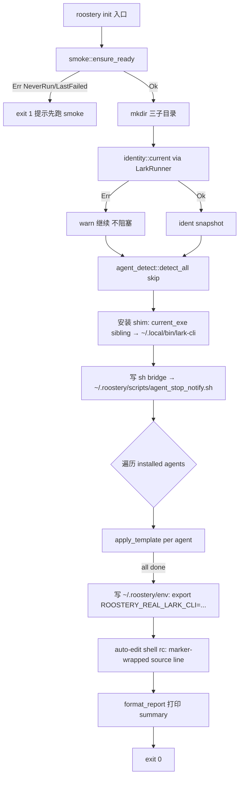

# roostery-init 设计

## 0. 决策头注

- **req 对齐**：兑现 `agent-work-in-feishu` 的"B 用户首次装机入口"——装完用户能在终端直接跑 `roostery init` 把所有装机步骤一次性走完，是 Phase 3 收尾 feature
- **roadmap 上下文**：`rust-rewrite-items.yaml` `roostery-init` `planned` + depends_on `[hooks-merge, lark-cli-shim]` 均 `done`
- **本 feature 不交付** E2E 出 task 能力（那是 Phase 5 `bot-stop-hook` + `bot-task-writer`）；本 feature 交付**装机链路**，跑完用户机器进入"可被 Phase 5 消费"的就绪态
- **决策头**：
  - shim 源 = `current_exe()` sibling
  - `ROOSTERY_REAL_LARK_CLI` 持久化 = auto-edit shell rc（`~/.zshrc` / `~/.bashrc`，按 `$SHELL` 检测）
  - 不做 welcome task（推 Phase 5）
  - agent 范围 = cc + codex + gemini（顺手补 Gemini 模板到 hooks_merge）

## 1. 范围 / 决策 / 明确不做 / 复杂度档位

### 1.1 必做（用户故事 → 行为）

| # | 行为 | 输入 | 期望可观察结果 |
|---|---|---|---|
| F1 | 启动 smoke gate | `roostery init` | 内部调 `smoke::ensure_ready()`；若 `NeverRun` / `LastFailed` → 提示用户先跑 `roostery smoke` 并 exit 1，**不动用户文件** |
| F2 | 创建 state 目录 | smoke OK 后 | `~/.roostery/{journal,state,scripts}/` 三子目录幂等创建（`paths::*_dir()` 已落地路径） |
| F3 | 解析 identity | smoke OK 后 | `identity::current(&runner)` 经 `LarkRunner` 调 `auth status` + `profile list`；解析失败不 fatal（打 warn）；ready 与否都继续装机（identity 主要用于人类可读 summary，不阻塞装机） |
| F4 | 检测 agent runtime | always | `agent_detect::detect_all(skip)` 用 `which::which()` 探 `claude` / `codex` / `gemini`；返回 `[DetectResult; 3]` |
| F5 | 装 shim | 检测到至少 1 个 agent | 拷 `current_exe()` sibling 的 `shim` 二进制到 `~/.local/bin/lark-cli`（target 已存在且 hash 一致则跳过；冲突且非 shim 则报错 exit 1） |
| F6 | 装 sh bridge | always | 写 `STOP_HOOK_AGENT_NOTIFY_SH` 到 `~/.roostery/scripts/agent_stop_notify.sh`、chmod 0755；幂等覆盖 |
| F7 | 合并 hook 模板 | 每个 installed agent | `hooks_merge::apply_template(agent_kind.template(), &target, sh_path)` 逐 agent 走；跳过 `--skip-agent <name>` 列出的 |
| F8 | auto-edit shell rc | always | 检测 `$SHELL`，对应 rc 文件（`~/.zshrc` / `~/.bashrc`）幂等 append `[ -f ~/.roostery/env ] && source ~/.roostery/env` 一行；同时写 `~/.roostery/env` 内含 `export ROOSTERY_REAL_LARK_CLI=<resolved-real-path>` |
| F9 | 总结报告 | 末尾 | 打印多行 summary：identity describe / 装了哪些 agent / shim 路径 / 哪个 rc 改了 / 下一步动作（"重开 shell 或 source ~/.roostery/env，然后跑一次 agent 看 hook 触发"） |

### 1.2 关键决策（D1–D12）

| # | 决策 | 理由 |
|---|---|---|
| D1 | `roostery init` 单子命令；不拆 `roostery init shim` / `roostery init hooks` 等 | 装机是一次性流程，子命令拆分增加错误状态空间，无 E2E 价值 |
| D2 | smoke gate 在 init 入口；smoke 没跑过 / 失败 → exit 1 不动文件 | 不让有问题的 lark-cli 漂移到装机后才暴露；与架构红线 §5 一致 |
| D3 | shim 源走 `current_exe()` sibling，找不到 `shim` 二进制 → 报错提示 `cargo install --path crates/roostery --bins` | 不在 init 里 spawn cargo（环境耦合）；明确"用户先 cargo install 再 init" 双步 |
| D4 | shim 目标固定 `~/.local/bin/lark-cli`（不可配） | attention.md 已记 PATH-prefix 约束；可配只增决策面 |
| D5 | shim 冲突检测：target 存在且不是 roostery shim → 报错 exit 1 + 提示用户 backup；存在且是 shim 走"hash 比对，相同跳过，不同覆盖" | 不静默覆盖用户的同名脚本 |
| D6 | agent 范围 cc + codex + gemini 一次到位 | 用户拍板，且 hooks-merge backlog rust-idiom-first §49 B4 已为 AgentKind 拓展留好钩子（仅需加 `Gemini` 变体 + 1 模板文件 + 1 string） |
| D7 | Gemini 模板补到 `templates/gemini_stop_hook.json` + `pub const GEMINI_STOP_HOOK_JSON` + `AgentKind::Gemini` + `template()` arm；模板用 Gemini SessionEnd 格式（Python `agent_detect.py:11-13` 已勘察） | 一处加 4 处改，是 hooks-merge 模板嵌入约定的扩展（§4.7 第 3 条"加新 runtime 走 hooks-merge 现有机制"） |
| D8 | identity 走 `LarkRunner` trait（async）；不直接 `std::process::Command` | 架构红线"飞书 API 必经 lark-cli wrapper"；testability（mock runner） |
| D9 | identity 解析失败不 fatal，转 warn 继续装机 | identity 这次只用作 summary；强依赖会让"刚配好 lark-cli 但还没 login"的用户被卡死 |
| D10 | auto-edit shell rc：用 marker 注释包裹 `# >>> roostery >>>` / `# <<< roostery <<<` 内容；幂等检测 marker 存在则跳过 | 工业级 pattern（conda / pyenv 同类）；卸载可定位 |
| D11 | `roostery init --dry-run` 列出将要做什么不实际写；`--skip-agent <name>`（可重复）跳过特定 runtime；不做 `--force` | dry-run 是装机工具的标配；skip-agent 给出豁口；force 引入"我知道在干什么"语义，本期不暴露 |
| D12 | onboarding 模块名沿用 Python 命名（避免后人 grep 找不到）但**职责完全不同**——本期 onboarding 是"装机编排器"，Phase 5 onboarding 才扩成"装机 + welcome task"；本期模块顶部 doc-comment 标注此演化路径 | 命名连续性 vs 职责清晰：用 doc-comment 显式注明，比改名更省 git blame 链 |

### 1.3 明确不做（acceptance 反向核对项）

| # | 不做 | grep 守护 |
|---|---|---|
| N1 | 不创建 welcome task / 不调 task_writer（task_writer 不存在） | `grep -E "task_writer\|create.*task\|welcome.*task" src/onboarding.rs src/main.rs` → 无 |
| N2 | 不实现 `roostery init --force`（清空 + 重装） | `grep '"--force"\|force:' src/main.rs` 在 init 子命令周围 → 无 |
| N3 | 不读取 `FEISHU_HUB_*` 旧 env（Python 期遗物） | `grep "FEISHU_HUB_" src/{identity,agent_detect,onboarding}.rs` → 无（hooks_merge 已有测试 fixture 不计） |
| N4 | 不实现 schema migration（v1 config 即可） | `grep -E "schema.*migrate\|v0.*v1" src/onboarding.rs` → 无 |
| N5 | 不在 init 里跑 `cargo install`；不下载二进制 | `grep -E "cargo install\|reqwest\|hyper\|curl::" src/onboarding.rs` → 无 |
| N6 | 不发明 identity；仅从 lark-cli 反映（`current_identity()` 行为对齐 Python identity.py 但走 LarkRunner） | identity.rs 顶部 doc-comment 写"lark-cli profile 是身份事实源" |
| N7 | 不主动写 / 修改 `~/.roostery/config.yaml`（config-yaml feature 已落 schema，init 只读不写；找不到则用编译期默认值） | `grep -E "config::save\|Config::default()\.save" src/onboarding.rs` → 无 |
| N8 | 不支持 fish / nushell（仅 zsh / bash） | `grep -i "fish\|nushell\|nu_" src/onboarding.rs` → 无 |
| N9 | 不实现 uninstall（拔机） | `grep -E '"uninstall"\|"reset"\|fn uninstall' src/main.rs` → 无 |

### 1.4 复杂度档位

走默认档位（CLI tool / 单用户 / 同步 / 单进程）。**偏离信号**：无对外 SDK / 无高并发 / 无一次性脚本特征。`async` 仅因 `LarkRunner` trait 是 async（identity 一处），主程序走 `#[tokio::main]` 或 `tokio::runtime::Builder::new_current_thread()` 单线程 runtime。

### 1.5 Rust idiom checklist（来自 `2026-05-18-decision-rust-idiom-first.md` §28）

design 阶段必须显式回应 6 条：

| # | idiom | 本 feature 应用 |
|---|---|---|
| 1 | 强类型 schema vs 无类型 `Value` | identity / agent_detect 全部强类型 struct（无 `Value`）；shell rc patch 走 `enum ShellKind { Zsh, Bash }` 而非字符串 |
| 2 | error 变体颗粒度 | `IdentityError` / `AgentDetectError` / `OnboardingError` 各自 `#[non_exhaustive]` enum；常见情境一变体一种（详 §2.1）；不混 `String reason` |
| 3 | newtype 隔离 | `AgentKind` 已是 enum（hooks_merge 已落）；本 feature 新增 `ShellKind`（rc 文件枚举）+ `BinaryHash`（shim 比对 newtype）；profile name / open_id 等业务标识不新立 newtype（identity 是 frozen snapshot 不在多模块流转，简化处理） |
| 4 | typestate | identity 不引入 typestate（snapshot 即用即弃）；`Identity::ready()` 走 method 返回 `Option<ReadyIdentity>`——caller 想用强契约就 unwrap，想宽松用 `&Identity`。**约束 caller 不冒险 unwrap 字段**：所有可选字段不暴露 `Option<String>`，只暴露 `Identity::user_open_id() -> Option<&str>` accessor |
| 5 | 零拷贝 + 借用优先 | `agent_detect::AGENTS: &[AgentSpec]` 用 `&'static [AgentSpec]`；`AgentSpec` 字段尽量 `&'static str`；shell rc patch 用 `&str` 流式写入；只在 `Identity` 持有 `Option<String>`（subprocess 返回得 own） |
| 6 | 编译期 vs 运行时 | `AGENTS` const slice 编译期；shell rc marker 字符串 `const`；`HOOKS_TARGETS: &[(AgentKind, &str)]` const 表 |

无"本 feature 不适用"豁免。

## 2. 名词层与编排层

### 2.1 名词层（现状 → 变化）

**现状**（相关已有代码）：

- `crates/roostery/src/main.rs`：clap `Cli` + `Command::Smoke` 单子命令；`main()` 返 `ExitCode`
- `crates/roostery/src/hooks_merge.rs`：`AgentKind { Cc, Codex }` `#[non_exhaustive]` + `CC_STOP_HOOK_JSON` / `CODEX_STOP_HOOK_JSON` const + `apply_template(template_str, target, sh_path) -> Result<PathBuf, HooksError>`
- `crates/roostery/src/paths.rs`：`roostery_home() / journal_dir() / state_dir() / smoke_state_path() / config_path()`，**缺** `scripts_dir()`
- `crates/roostery/src/smoke.rs`：`ensure_ready() -> Result<(), SmokeError>`
- `crates/roostery/src/lark_cli/{runner,subprocess,mock,journaled,error}`：trait 全套 + LarkCli 实体
- 无 identity / agent_detect / onboarding 模块

**变化**（本 feature 新增 / 修改的名词）：

#### 2.1.1 `crates/roostery/src/identity.rs`（新建）

```rust
//! lark-cli profile 是身份事实源。本模块只 reflect，不发明 identity。

#[derive(Debug, Clone)]
#[non_exhaustive]
pub struct Identity {
    profile_name: Option<String>,
    user_open_id: Option<String>,
    user_name: Option<String>,
    bot_app_id: Option<String>,
    brand: Option<String>,
    token_status: Option<String>,
    pub host: String,  // always present (hostname fallback to "unknown")
}

impl Identity {
    pub fn profile_name(&self) -> Option<&str> { /* ... */ }
    pub fn user_open_id(&self) -> Option<&str> { /* ... */ }
    pub fn user_name(&self) -> Option<&str> { /* ... */ }
    pub fn bot_app_id(&self) -> Option<&str> { /* ... */ }

    /// "username" / open_id 末 6 / "anon"
    pub fn short_user(&self) -> &str;
    /// "cli_xxxxxxxx" 截断 / "no-bot"
    pub fn short_bot(&self) -> &str;
    /// token valid && user/bot 双备
    pub fn is_ready(&self) -> bool;
    /// 单行 human-readable summary
    pub fn describe(&self) -> String;
}

#[derive(Debug, thiserror::Error)]
#[non_exhaustive]
pub enum IdentityError {
    #[error("lark-cli auth status failed: {0}")]
    AuthStatusFailed(#[source] LarkError),
    #[error("lark-cli profile list failed: {0}")]
    ProfileListFailed(#[source] LarkError),
}
// acceptance 阶段偏差 D1 回填：原列 3 变体含 `AuthShape { field }`；实装合并为 None-tolerant
// 行为（auth status JSON 缺字段 silent None）。理由：lark-cli auth status JSON 形态有版本
// 漂移空间，宁可降级 None 也比硬 enum 让 caller 走错路。

/// 主入口：经 LarkRunner 解析当前 identity。
pub async fn current(runner: &dyn LarkRunner) -> Result<Identity, IdentityError>;
```

**调用示例**：
```rust
let runner = LarkCli::new();
let ident = identity::current(&runner).await?;
println!("{}", ident.describe());
// → "✓ profile=default user=ben (ou_xxx) bot=cli_abcd1234 host=mac-mini token=valid"
```

#### 2.1.2 `crates/roostery/src/agent_detect.rs`（新建）

```rust
#[derive(Debug, Clone, Copy, PartialEq, Eq)]
pub struct AgentSpec {
    pub kind: AgentKind,
    pub cli: &'static str,           // "claude" / "codex" / "gemini"
    pub hooks_target: &'static str,  // "~/.claude/settings.json" 等（未展开）
}

pub const AGENTS: &[AgentSpec] = &[
    AgentSpec { kind: AgentKind::Cc,     cli: "claude", hooks_target: "~/.claude/settings.json" },
    AgentSpec { kind: AgentKind::Codex,  cli: "codex",  hooks_target: "~/.codex/hooks.json" },
    AgentSpec { kind: AgentKind::Gemini, cli: "gemini", hooks_target: "~/.gemini/settings.json" },
];

#[derive(Debug, Clone)]
pub struct DetectResult {
    pub spec: AgentSpec,
    pub cli_path: Option<PathBuf>,  // Some=installed
}

impl DetectResult {
    pub fn installed(&self) -> bool { self.cli_path.is_some() }
    pub fn expanded_hooks_target(&self) -> PathBuf;  // ~ expansion
}

pub fn detect_all(skip: &[AgentKind]) -> Vec<DetectResult>;
```

**无 error type**：`which::which()` 找不到不是错，返 `cli_path: None`。

#### 2.1.3 `crates/roostery/src/hooks_merge.rs`（修改：加 Gemini 支持）

新增：
```rust
pub const GEMINI_STOP_HOOK_JSON: &str = include_str!("templates/gemini_stop_hook.json");

// AgentKind 加变体
pub enum AgentKind {
    Cc,
    Codex,
    Gemini,  // ← 新增
}

// template() 加 arm
AgentKind::Gemini => GEMINI_STOP_HOOK_JSON,

// as_str() / from_str() / Display 同步加
// UnknownAgentKind 错误信息更新到 "expected one of: cc / codex / gemini"
```

新增模板文件 `crates/roostery/src/templates/gemini_stop_hook.json`，事件 `SessionEnd`（同 cc 形态，仅 env 不同）。

#### 2.1.4 `crates/roostery/src/onboarding.rs`（新建）

```rust
#[derive(Debug, thiserror::Error)]
#[non_exhaustive]
pub enum OnboardingError {
    #[error("smoke gate failed: {0}")]
    SmokeNotReady(#[from] SmokeError),
    #[error("failed to create state dir {path}: {source}")]
    StateDirFailed { path: PathBuf, #[source] source: io::Error },
    #[error("shim source not found at {path}; install with `cargo install --path crates/roostery --bins`")]
    ShimSourceMissing { path: PathBuf },
    #[error("shim target {path} exists and is not a roostery shim; backup and remove first")]
    ShimTargetConflict { path: PathBuf },
    #[error("failed to copy shim {from} → {to}: {source}")]
    ShimCopyFailed { from: PathBuf, to: PathBuf, #[source] source: io::Error },
    #[error("failed to write {path}: {source}")]
    WriteFailed { path: PathBuf, #[source] source: io::Error },
    #[error("hook merge failed for {agent}: {source}")]
    HookMergeFailed { agent: AgentKind, #[source] source: HooksError },
    #[error("could not detect $SHELL or shell is unsupported (only zsh/bash)")]
    UnsupportedShell { detected: Option<String> },
    // acceptance 阶段偏差 D2 回填：实装 +2 边角错误变体
    #[error("no real `lark-cli` found on PATH (excluding shim target)")]
    RealLarkCliMissing,
    #[error("failed to resolve current_exe: {source}")]
    CurrentExeFailed { #[source] source: io::Error },
}

#[derive(Debug, Clone, Copy, PartialEq, Eq)]
#[non_exhaustive]
pub enum ShellKind { Zsh, Bash }

impl ShellKind {
    pub fn rc_path(self) -> PathBuf;  // ~/.zshrc / ~/.bashrc
    pub fn detect_from_env() -> Option<Self>;  // $SHELL ends-with /zsh or /bash
}

#[derive(Debug, Clone, Default)]
pub struct InitOptions {
    pub dry_run: bool,
    pub skip_agents: Vec<AgentKind>,
}

#[derive(Debug)]
pub struct InitReport {
    pub identity: Option<Identity>,
    pub agents_installed: Vec<AgentKind>,  // 真装了 hook 的
    pub agents_skipped: Vec<(AgentKind, SkipReason)>,
    pub shim_path: PathBuf,
    pub shell_rc_patched: Option<PathBuf>,
    pub real_lark_cli: Option<PathBuf>,
}

#[derive(Debug, Clone)]
#[non_exhaustive]
pub enum SkipReason {
    NotInstalled,
    UserSkipped,
    // acceptance 阶段偏差 D3 回填：实装 +1 变体携带原因
    MergeFailed(String),
}

pub async fn run(runner: &dyn LarkRunner, opts: InitOptions) -> Result<InitReport, OnboardingError>;
```

**调用示例**：
```rust
// main.rs
let runner = LarkCli::new();
let report = onboarding::run(&runner, InitOptions::default()).await?;
println!("{}", format_report(&report));
```

#### 2.1.5 `crates/roostery/src/paths.rs`（修改：加 scripts_dir）

```rust
pub fn scripts_dir() -> PathBuf {
    roostery_home().join("scripts")
}

pub fn env_file() -> PathBuf {
    roostery_home().join("env")
}
```

#### 2.1.6 `crates/roostery/src/main.rs`（修改：加 Init 子命令）

```rust
#[derive(Subcommand)]
enum Command {
    Smoke,
    Init(InitArgs),
}

#[derive(Args)]
struct InitArgs {
    #[arg(long)]
    dry_run: bool,
    #[arg(long = "skip-agent", value_name = "AGENT")]
    skip_agents: Vec<String>,  // parse to AgentKind in handler
}
```

#### 2.1.7 `crates/roostery/Cargo.toml`（新依赖）

- `which = "7"` — agent_detect 用（轻量，无 transitive heavy deps）；acceptance D5 回填：实装用最新稳定版 7.x（design 原写 "6"，crates.io 已演进到 7）
- `sha2 = "0.10"` — shim hash 比对；acceptance D4 回填：原 §2.1.7 漏列，但 §2.4 S6 step + §1.5 idiom #3 newtype 已 flag
- `gethostname = "0.5"` — identity host 字段；acceptance 阶段微调到最新 0.5（原 design 写 0.4）

### 2.2 编排层（现状 → 变化）

**现状**：`main()` 只有两个分支（None default print / `Command::Smoke`）；模块间无编排关系。

**变化**：`onboarding::run()` 是新增主编排函数。主流程：



**关键编排函数**：

- `onboarding::run(runner, opts) -> Result<InitReport, OnboardingError>`：上图主路径
- 内部私有 fn 切分：
  - `install_shim(current_exe_dir, target) -> Result<ShimInstall, OnboardingError>`（含 hash 比对）
  - `write_sh_bridge(scripts_dir) -> Result<PathBuf, OnboardingError>`
  - `merge_hooks_for(detections, sh_path, skip) -> Vec<MergeOutcome>`
  - `write_env_file(env_path, real_lark_cli) -> Result<(), OnboardingError>`
  - `patch_shell_rc(rc_path, env_path) -> Result<PatchOutcome, OnboardingError>`（marker-wrapped 幂等）

**控制流拓扑**：线性，无并行 / 分支（除 identity warn 兜底外）。错误处理走"上游 fatal 即 exit 1，但部分步骤（identity）允许 warn 继续"显式列表。

**流程级不变量**：

1. **smoke 失败 → 文件系统零改动**（D2）
2. **shim 装机幂等**：hash 一致跳过；不同 shim hash 覆盖；非 shim 内容报错不覆盖（D5）
3. **shell rc patch 幂等**：marker 注释块存在则跳过（D10）
4. **每个 agent 独立失败不阻塞其他 agent**：单个 `apply_template` 报错记入 `InitReport` 但继续；末尾若有失败汇总后 exit 非零
5. **dry-run 模式**：所有 write 操作改为 println，行为副作用为零
6. **PATH 检查降级**：原 design 列"装 shim 前 verify `~/.local/bin` 在 PATH 前段，不在则 warn"。**acceptance 偏差回填**：实装阶段评估信噪比不高（macOS GUI process PATH ≠ terminal PATH），降级为 `format_report` 末段 next-step 文字提示"open a new shell or source ~/.roostery/env"
7. **sh bridge chmod 0755**：可执行位必须有

### 2.3 挂载点清单（"删了它 feature 是否消失" 判据）

新增公开挂载点：

| # | 挂载点 | 位置 | 删了会怎样 |
|---|---|---|---|
| 1 | `pub mod identity;` | `lib.rs` | identity 解析能力消失（其他模块不消费，本期独立） |
| 2 | `pub mod agent_detect;` | `lib.rs` | agent 检测能力消失 |
| 3 | `pub mod onboarding;` | `lib.rs` | 装机编排能力消失，`main.rs` Init 子命令编译失败 |
| 4 | `Command::Init` arm | `main.rs` | `roostery init` 子命令消失 |
| 5 | `AgentKind::Gemini` 变体 + `GEMINI_STOP_HOOK_JSON` const + `templates/gemini_stop_hook.json` | `hooks_merge.rs` + `templates/` | Gemini 装机能力消失（cc/codex 仍 OK） |

**不列**（内部细节归 implement）：`paths::scripts_dir()` / `paths::env_file()` 是 helper；`install_shim` / `write_sh_bridge` 等私有 fn；`ShellKind` 是 onboarding 内部 enum。

**反向核查**：删 1-5 全部 → `cargo build` 编译失败仅在 `main.rs Init` 处；hooks_merge 测试 / config 测试 / smoke 测试不受影响 → 边界清晰。

### 2.4 推进策略（按 paradigm 切片）

按 paradigm 维度（编排骨架 → 计算节点 → 持久化 → 测试）切片，**每步退出信号 = 该步对应单测全绿**：

| Step | Paradigm | 内容 | 退出信号 |
|---|---|---|---|
| S1 | hooks_merge 扩展 | 加 `AgentKind::Gemini` + `GEMINI_STOP_HOOK_JSON` const + `templates/gemini_stop_hook.json` + Display/FromStr/template() 同步 | hooks_merge 既有测试全绿 + 新增 `gemini_template_nonempty` / `agentkind_gemini_roundtrip` 2 单测 |
| S2 | 名词层基底 | 建 `identity.rs` + `agent_detect.rs` + `paths.rs` 加两 fn；空壳 + Error enum + struct 字段 | `cargo build` + 各模块至少 1 个 trivial unit test（Default 行为 / Error display） |
| S3 | identity 计算节点 | 实现 `identity::current(runner)`；用 MockLarkRunner 跑 happy / auth-not-logged-in / profile-list-empty 三场景 | identity 4+ 单测全绿 |
| S4 | agent_detect 计算节点 | 实现 `detect_all(skip)`；测试用 `which` crate fixture（mock PATH） | agent_detect 3+ 单测全绿 |
| S5 | onboarding 编排骨架 | `OnboardingError` enum + `InitOptions` / `InitReport` / `ShellKind` 完成；`onboarding::run` 主路径串起 5 个私有 fn 但每个先桩实现 | onboarding skeleton compile + dry-run 单测（无副作用） |
| S6 | onboarding 持久化 | 实装 install_shim / write_sh_bridge / write_env_file / patch_shell_rc；用 tempdir 单测 | 单测：shim install hash 比对 3 情况 + shell rc patch idempotent + env file 幂等 |
| S7 | hooks 编排 | merge_hooks_for 调 `apply_template`；mock target 路径 | 集成测试：3 agent 全装到 tempdir，再装一次幂等 |
| S8 | main.rs 接线 | `Init(InitArgs)` 子命令；`--dry-run` / `--skip-agent` clap 解析；`#[tokio::main]` runtime | `cargo run -- init --dry-run` 在 tempdir HOME 跑通 |
| S9 | 集成测试 + 文档 | `tests/onboarding_integration.rs` 端到端用 fake HOME + MockLarkRunner；ARCHITECTURE 回写；req 回写 | `cargo test --all` + `cargo test --doc` + `cargo fmt --check` + `cargo clippy -D warnings` 全绿 |

**不下沉到 file:line**——具体改哪个函数由 implement 自决。

### 2.5 结构健康度与微重构

**评估对象 1：要改的文件**

- `crates/roostery/src/hooks_merge.rs` 当前 ~550 LOC（含 32 内联单测，产品代码 ~280）。本 feature 加 Gemini 仅追加 1 const + 1 enum variant + 1 match arm + ~5 行测试，**净增 <20 行**，文件不增重。
- `crates/roostery/src/main.rs` 当前 ~40 行，加 Init 子命令 + InitArgs + handler 约 +50 行，规模仍小，**不拆**。
- `crates/roostery/src/paths.rs` 加 2 fn 共 +6 行，**不拆**。
- `crates/roostery/src/lib.rs` 加 3 `pub mod` 共 +3 行，**不拆**。

**评估对象 2：新文件落入的目录**

- `crates/roostery/src/` 顶层文件清单（不含 bin/、lark_cli/、templates/）：`config.rs / hooks_merge.rs / journal.rs / lib.rs / main.rs / paths.rs / redact.rs / remoterefs.rs / smoke.rs` = 9 顶层 .rs 文件
- 本 feature 加 3 顶层文件（identity.rs / agent_detect.rs / onboarding.rs）→ 12 顶层
- **查 compound convention**：`.codestable/compound/2026-05-16-decision-rust-module-organization.md` 已沉淀目录组织约定（5 档；档 5 是子目录化资源文件）

**先检查相关 convention**：

<details>
<summary>rust-module-organization 决策档位（摘）</summary>

档 1-4 决定单模块拆 mod 与拆目录的门槛；档 5 限定资源文件（templates/）走子目录。本 feature 新增 3 个产品模块文件，**不涉及单模块拆细 mod**，落顶层 .rs 即可。
</details>

**结论**：**不做微重构**。

理由：(1) 顶层 12 个 .rs 文件仍在 rust-module-organization 档 1-2 容忍范围（"业务模块化 .rs 文件 < 20 不强制目录化"），(2) identity / agent_detect / onboarding 三者之间无强内聚关系（不需要立 `onboarding/` 子目录把三者打包），(3) hooks_merge / main.rs / paths.rs 改动局部、行数小。

**超出范围的观察**（仅记录不阻塞）：

- 若 Phase 4 dispatcher 起来后 `agent_detect` 需要扩成"返回每个 runtime 当前活跃 session 数"等，可能职责膨胀，那时再 cs-refactor 拆 `agent_detect/{spec,detector,runtime_state}.rs`
- `onboarding.rs` 私有 fn 多（install_shim / patch_shell_rc / ...），若膨胀到 >400 LOC，**建议后续走 `cs-refactor` 拆 `onboarding/{shim,shell_rc,env_file,report}.rs`**

**建议沉淀的 convention**：本 feature 不引入新结构约定（沿用 rust-module-organization 现有档位），无需 cs-decide 归档。

## 3. 验收契约

每条 "输入/触发 → 期望可观察结果"，覆盖正常 + 边界 + 错误。

### 3.1 init 主流程

| # | 输入 | 期望 |
|---|---|---|
| C1.1 | smoke 已通过 + 3 个 agent 全装 + zsh + `~/.local/bin` 在 PATH | shim 拷成功；3 个 hook 文件合并成功；`~/.zshrc` 末尾出现 marker block；`~/.roostery/env` 含 `export ROOSTERY_REAL_LARK_CLI=...`；exit 0 |
| C1.2 | smoke 没跑过 | stderr 出现"先跑 roostery smoke"提示；exit 1；`~/.roostery/scripts/`、`~/.local/bin/lark-cli`、`~/.claude/settings.json` 全部**未被改动** |
| C1.3 | smoke 失败（LastFailed） | 同 C1.2 |
| C1.4 | 同 init 再跑一次 | 全程幂等：shim hash 一致跳拷；hook merge 二次幂等；shell rc marker 已存在跳过；env file 内容相同字节级一致；exit 0 |
| C1.5 | `--dry-run` | 打印将要做什么；`~/.zshrc` / `~/.roostery/` / `~/.claude/` 等**零字节改动**；exit 0 |

### 3.2 identity

| # | 输入 | 期望 |
|---|---|---|
| C2.1 | MockLarkRunner happy（auth status 返完整 JSON） | `Identity { user_open_id=Some, bot_app_id=Some, token_status=Some("valid"), ... }`；`is_ready()` true；`describe()` 单行 |
| C2.2 | MockLarkRunner auth 返 token expired | `is_ready()` false；其他字段仍解析；不报错 |
| C2.3 | MockLarkRunner `auth status` LarkError | `Err(IdentityError::AuthStatusFailed)`；init 主流程 catch 后 warn 继续 |
| C2.4 | profile list 返空数组 | `profile_name = None`；其他字段仍解析；不报错 |
| C2.5 | auth status JSON 缺 `userOpenId` key | 不报错，字段为 None（前向兼容 lark-cli 形态漂移） |

### 3.3 agent_detect

| # | 输入 | 期望 |
|---|---|---|
| C3.1 | PATH 含 claude + codex，无 gemini，skip=[] | 3 DetectResult；cc/codex `installed()=true`；gemini false |
| C3.2 | skip=[Codex] | codex `installed()=false` 强制；其他不变 |
| C3.3 | PATH 空 | 全部 `installed()=false`；不 panic |

### 3.4 shim install

| # | 输入 | 期望 |
|---|---|---|
| C4.1 | target 不存在 + sibling shim 存在 | 拷成功；目标文件 hash = 源 hash；chmod 0755 |
| C4.2 | target 已存在且是同 hash shim | 跳过拷；不写 |
| C4.3 | target 已存在但 hash 不同（旧版 roostery shim） | 覆盖；写日志 |
| C4.4 | target 已存在非 shim 内容（如用户脚本） | `Err(ShimTargetConflict)`；不覆盖 |
| C4.5 | sibling 找不到 shim 二进制 | `Err(ShimSourceMissing)`，错误信息含 cargo install 提示 |

### 3.5 shell rc patch

| # | 输入 | 期望 |
|---|---|---|
| C5.1 | $SHELL=/bin/zsh，~/.zshrc 不含 marker | 末尾 append marker block + source line；二次跑跳过 |
| C5.2 | $SHELL=/bin/bash + ~/.bashrc 已含 marker block | 跳过；文件字节级不变 |
| C5.3 | $SHELL=/usr/bin/fish | `Err(UnsupportedShell { detected: Some("...fish") })` |
| C5.4 | $SHELL 未设 | `Err(UnsupportedShell { detected: None })` |
| C5.5 | rc 文件不存在（首次用户） | 创建文件再 append；权限 0644 |

### 3.6 hook merge for 3 agents

| # | 输入 | 期望 |
|---|---|---|
| C6.1 | cc/codex/gemini 全装 | 3 个 target file 各被合并；`apply_template` 各调一次 |
| C6.2 | gemini 未装 | gemini 跳过；agents_skipped 记 `(Gemini, NotInstalled)` |
| C6.3 | `--skip-agent codex` | codex 跳过；agents_skipped 记 `(Codex, UserSkipped)` |
| C6.4 | hooks_merge 对某个 agent 报错（如 target 是无效 JSON） | InitReport.errors 记一条；其他 agent 继续；exit 1（汇总后） |

### 3.7 明确不做（N1-N9）反向核查

| # | grep | 期望 |
|---|---|---|
| C7.1 | `grep -rE "task_writer\|welcome.*task" crates/roostery/src/onboarding.rs` | 无命中 |
| C7.2 | `grep -E "FEISHU_HUB_" crates/roostery/src/{identity,agent_detect,onboarding}.rs` | 无命中 |
| C7.3 | `grep -E "cargo install\|reqwest" crates/roostery/src/onboarding.rs` | 无命中 |
| C7.4 | `grep -i "fish\|nushell" crates/roostery/src/onboarding.rs` | 无命中（除错误信息提示） |
| C7.5 | `grep -E '"--force"\|"uninstall"' crates/roostery/src/main.rs` | 无命中 |

### 3.8 模块级

| # | 输入 | 期望 |
|---|---|---|
| C8.1 | `cargo test --all` | 全绿（既有 174 lib + 4+2+4+4 集成 + 本 feature 新增 ≥30 lib + ≥3 集成） |
| C8.2 | `cargo test --doc` | 全绿（identity / onboarding 至少各 1 doc-test 展示调用方式） |
| C8.3 | `cargo clippy --all-targets --all-features -- -D warnings` | 全绿 |
| C8.4 | `cargo fmt --all --check` | 全绿 |
| C8.5 | `grep -rE "as_object_mut\(\)\.unwrap\(\)\|as_array_mut\(\)\.unwrap\(\)" crates/roostery/src/{identity,agent_detect,onboarding}.rs` | rust-idiom-first 守护：无（除非 design 明示放过） |

## 4. 架构 / requirement / roadmap 回写说明（acceptance 阶段执行）

- **`ARCHITECTURE.md §2 术语表`**：加 `Identity`（lark-cli reflect snapshot）/ `AgentSpec` / `AgentKind::Gemini` / `ShellKind` 词条
- **`ARCHITECTURE.md §3 Module D`**：加 identity / agent_detect / onboarding 三子节；§4.7 标 Gemini 模板已嵌入；§6 加 `ROOSTERY_REAL_LARK_CLI` 持久化路径 = `~/.roostery/env` + shell rc marker block 约定
- **`ARCHITECTURE.md §4.7 模板嵌入约定`**：加 `GEMINI_STOP_HOOK_JSON` 一条
- **`.codestable/requirements/agent-work-in-feishu.md`**：变更日志加 2026-05-18 `roostery-init` 落地条目；`implemented_by` 加本 feature；status 保持 `draft`（用户视角"飞书看到 agent 写什么"仍等 Phase 5）
- **`.codestable/roadmap/rust-rewrite/rust-rewrite-items.yaml`**：`roostery-init` `status: in-progress` → `done`
- **`.codestable/roadmap/rust-rewrite/rust-rewrite-roadmap.md` §5 第 10 项**：`planned` → `done` + feature 引用
- **`.codestable/attention.md`**：候选盘点（acceptance 阶段决定是否新增）
  - 候选 1：`~/.local/bin` 必须在 PATH 前段才能拦截 lark-cli（已在 attention.md "运行与本地起服务"）—— 已有，不重复
  - 候选 2：`ROOSTERY_REAL_LARK_CLI` 写在 `~/.roostery/env` + shell rc source 一行 —— 装机约定，看 acceptance 是否要补一条"诊断 shim 找不到 real lark-cli 时先 check `~/.roostery/env` + rc source 状态"
- **`.codestable/compound/`**：rust-idiom-first §54 backlog B7（smoke types Option<String>）本 feature 不触碰，状态不变

## 5. 待 review 提示

请整体过一遍，重点核 §1.2 12 条决策、§2.1 接口签名、§2.4 9 步推进策略、§3 八节验收契约是否覆盖完整。idiom checklist §1.5 是 rust-idiom-first decision 强制项，看 6 条应用是否合理。
