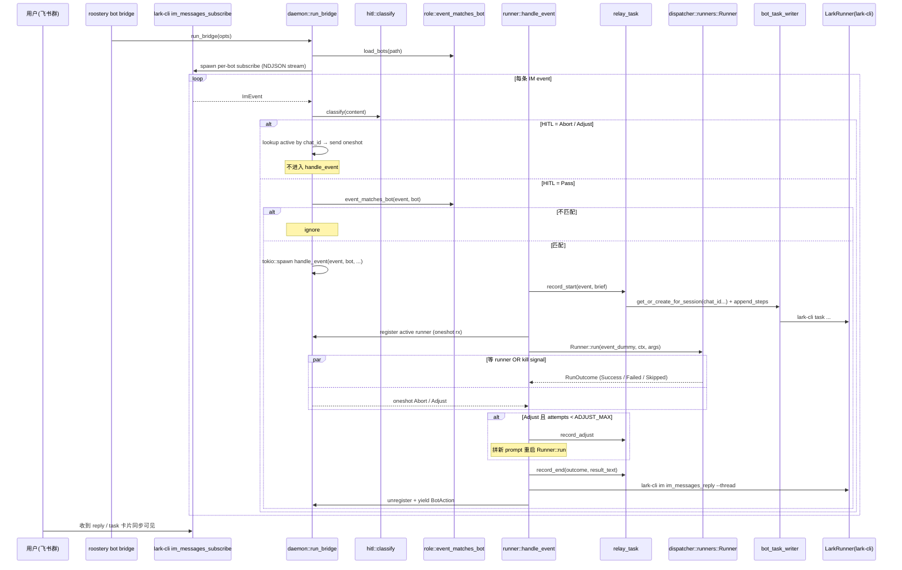

# bot-bridge-cluster 设计

## 0. 术语约定

| 术语 | 定义 | 防冲突 |
|---|---|---|
| **BotRole** | `~/.roostery/bots.yaml` 单条 bot 配置（app_id + role + mention_alias + runner + default_cwd + prompt_template 等）。一台机器一个 daemon = 一个 BotRole = 一个 lark-cli profile | 与 `config::Identity`（roostery 操作者身份）不同维度——BotRole 是"我管的这些 bot 各是谁"，Identity 是"我作为 roostery 用户是谁"。grep 项目无冲突 |
| **`roostery bot bridge`** | 子命令：长跑 daemon，订阅一个或多个 BotRole 的 IM event 流，路由到 runner，回复到原 thread | 与已存在的 `roostery bot stop-hook` / `roostery bot push` 同属 `bot` 顶层子命令；本 feature 在 `bot` 下新增 `bridge` 子命令，不重名 |
| **HitlDecision** | IM event → "应中止 / 应注入调整 / 应放行" 的判定结果（newtype enum，包含 `Abort { reason }` / `Adjust { body }` / `Pass`） | 替代 Python `AbortDecision`；语义扩为三态（Python 是二态 + adjust 走 sentinel side-channel） |
| **RunnerRegistry**（本 feature 新增） | 进程内 in-memory `BTreeMap<TaskGuid, RunnerHandle>`，记录"当前哪条 task 由哪个子进程跑"，是 hitl 信号 → runner 实例的连接器 | 与 `dispatcher::runners::RunnerRegistry`（trait 实现注册表，全局静态）**同名但不同概念**——后者是"哪些 runner kind 可用"，前者是"哪些活跃 task 在跑"。命名歧义需明确区分；**决策 D2**：本 feature 内类型命名为 `ActiveRunnerRegistry`，避免与 `dispatcher::runners::RunnerRegistry` 冲突 |
| **接力 task** | 同一 chat_id 上多次 @bot 触发的 step 流写到同一个飞书 task（不是每条 @ 都建新 task）。chat_id → TaskRef 用本地缓存映射；Python 期叫 `bot_relay_task` | 借用 `bot_task_writer::TaskRef` / `TaskGuid`；缓存目录与 Python 期 `~/.feishu_hub/state/m3c_chats/` 不兼容（Rust 期独立 schema） |
| **`/stop` / `/abort` / `/adjust`** | IM 群消息开头匹配这些前缀 → HITL 路由命中。Python 期硬编码列表，本期作为 const，**不**接受用户自定义 | grep 仓库无其他用途 |
| **mention prefix 匹配** | event.content 以 `@<alias>` 开头 + 一个空格分隔符（含全角空格）即视为 @ 命中；剥前缀拿正文 | Python `bot_role._starts_with_mention` 行为；Rust 版保留三种分隔符容忍（` ` U+0020 / 不间断 U+00A0 / 全角 U+3000） |

## 1. 决策与约束

### 1.1 需求摘要

**做什么**：让用户在已用的飞书群里 @某个 bot 触发 agent 工作，过程实时写飞书 task step 流，群里能用 `/stop` `/adjust` 这种短命令反向控制正在跑的 agent。

**为谁**：`agent-work-in-feishu` 用户故事第 4 条（团队成员围观 / 点评 / 接续）+ "数据主权"用户（IM 是用户已有的飞书租户，不引第三方 dashboard）。

**成功标准**：
1. `roostery bot bridge --bots <yaml>` 启动后能持续消费 IM event，匹配 @mention 的消息触发对应 runner 跑，结果按模板回复到原 thread
2. 同一 chat 上多次 @ bot，step 流连续写到同一个飞书 task（接力 task 行为）
3. 群里发 `/stop` → 正在跑的 runner 被 SIGTERM；发 `/adjust 改一下` → runner 被 stop 后用追加 prompt 重启一次（最多 1 次重启上限，与 Python 一致）
4. 任一单条 event 异常不阻塞 daemon 后续 event 消费
5. `cargo test --all` 全绿；新增模块不引入 reqwest / 不绕过 LarkRunner trait

**明确不做**（反向核对项）：
- ❌ **不做 base_intent / `/run <base_ref>` 路由**——Python `bot_bridge._try_base_intent` 是 M4.D 与 Base 模块的耦合，Roostery Rust 期 Base 在 Phase 7，本 feature 完全不引用 Base
- ❌ **不实现 `parallel=True` 模式的 threading 编排**——Rust 期走 tokio `tokio::spawn` per-event，比 Python `threading.Thread + queue.Queue` 简洁；不保留 `--parallel` flag（默认就是 async 并发，配 `--max-concurrency N` 限并发）
- ❌ **不做 `cleanup_orphans` 启动孤儿清理**——Python `runner_registry.cleanup_orphans` 处理 daemon 重启后残留的 pid 文件；Rust 期 `ActiveRunnerRegistry` 是进程内内存结构（不落盘），daemon 重启天然清零；落盘 sentinel 文件（abort / adjust）改为内存 oneshot channel
- ❌ **不做 user-customizable abort / adjust 关键词**——常量列表 `&["/stop", "/abort", "停", "中止"]` / `&["/adjust ", "/adjust\n", "调整 ", "调整\n"]` 写死，不读 config（Python 也是写死）
- ❌ **不重做 `bot_runner` 里 `_compose_reply` 的 emoji + template 渲染**精确字节复刻——文案以"可读 + 信息一致"为准（参 docs-authority 原则），不做 golden file
- ❌ **不实现 `relay_writer_app_id` 跨身份写 task 的 profile 转向**——M3.C 的 `relay_writer_app_id` 是 per-bot-app idempotency 补丁（让多 bot 共享同 task），Rust 期延后；**假设**：本 feature 暂用"每个 bot 独立 chat→task 缓存"，跨 bot 共享 task 推到未来 feature（记观察项 O3）

### 1.2 复杂度档位

走 **Rust 业务模块默认档位**（参 `.codestable/reference/code-dimensions.md`），偏离两项：

- **并发模型 = 多 worker / tokio spawn per event**（偏离默认"线性 async"）——daemon 必须不能被任一 event 阻塞，否则 `/stop` 收不到就违背 HITL 语义；理由：Python 版强制走 `parallel=True` 的根因不可绕过
- **生命周期 = 长跑 daemon**（偏离默认"短任务"）——`roostery bot bridge` 是 process-level daemon，需要考虑 graceful shutdown / signal handling；引 `tokio::signal::ctrl_c` 等已成熟模式

### 1.3 关键决策（D1-D12）

| # | 决策 | 理由 |
|---|---|---|
| **D1** | **5 Python 模块 → 合并成 1 Rust 子目录 `bot_bridge/`**（按 ARCHITECTURE.md §5 第 7 条 "Rust 模块组织五档" 走第 2 档：500+ 行升档 2 子目录 + `mod.rs`）。子模块 = `role.rs`（BotRole + bots.yaml 加载）/ `hitl.rs`（HitlDecision + IM event 关键词匹配）/ `relay_task.rs`（chat_id → TaskRef 缓存 + step 文案）/ `active_registry.rs`（ActiveRunnerRegistry + 进程内 oneshot channel）/ `runner.rs`（handle_event 编排）/ `daemon.rs`（run_bridge 长跑 + tokio spawn）/ `cli.rs`（clap 子命令 BridgeCliArgs） | Python 5 文件耦合紧但都围绕"1 bot daemon"主题；Rust 期没有 Python 模块层级污染的负担，按职责分子文件而非按 Python 模块名 1:1 翻译；行数估计 ~1200 行（含测试 ~700），单文件超 500 行档位 |
| **D2** | **ActiveRunnerRegistry 命名避让 `dispatcher::runners::RunnerRegistry`** | grep 防冲突；后者是 "runner kind 注册表"，前者是 "活跃 runner 实例表"，语义完全不同 |
| **D3** | **HITL 信号通道 = 进程内 `tokio::sync::oneshot::Sender<HitlSignal>`，不落盘 sentinel** | Python 落 `~/.feishu_hub/state/runner_registry/{task_guid}/abort.txt` 是"runner 跑在不同 process 里所以靠文件通信"的副产品；Rust 期 runner 与 bridge 在同进程 tokio runtime 下，oneshot channel 是 idiom——简化 ~80 行代码且消除 race window |
| **D4** | **runner 调用走 `dispatcher::runners::Runner` trait + Registry**——`bot_runner.handle_event` 不直接 spawn `claude` binary，而是通过已有 dispatcher runner registry 拿 Runner 实例调用 | 复用 Phase 4 已落地的 `CcHeadlessRunner` / `NoopRunner` + 未来 codex_exec / gemini_headless；BotRole.runner 字段值 = `Runner::kind()`；这是 runtime-neutral req 的兑现 |
| **D5** | **task 写入走 `bot_task_writer` 公开 API**（`create_task` / `append_steps` / `get_or_create_for_session`）——relay_task 子模块不直接调 LarkRunner，只调 task_writer | 红线 #1 兑现 + 复用 task_writer 已经处理好的 host suffix / safe_filename / append_steps `--yes` 破例 |
| **D6** | **IM 事件源 = lark-cli `im im_messages_subscribe` 子进程 streaming JSON**，由本 feature 新增的 `bot::bridge::event_source` 适配器从子进程 stdout NDJSON 一行一 event 反序列化成 `ImEvent` 结构 | 红线 #1 兑现——lark-cli 是唯一飞书入口；Python 期 `event_bridge.consume_im` 也走 lark-cli stream，本 feature Rust 版照搬接口形态但走 `tokio::process::Child` + `BufReader::lines()`。**假设**：lark-cli 已支持 `im im_messages_subscribe` 长连接订阅（Python 期已验证），smoke probe 是否覆盖此命令需 acceptance 阶段实测 |
| **D7** | **回复走 `LarkRunner` trait 调 `lark-cli im im_messages_reply --reply-in-thread`**——不引专用 wrapper | 与 task_writer 同口径——业务模块直接 take `&dyn LarkRunner` |
| **D8** | **bots.yaml schema_version=1 公开承诺**——schema 字段变更需 bump + cs-roadmap update + 旧版兼容反序列化（与 JournalEntry / Config / BudgetState 模型一致） | portable-by-default req 边界——bots.yaml 是用户编辑的配置，schema 稳定才能让用户安心维护 |
| **D9** | **`/adjust` 自动重启上限 = const `ADJUST_MAX = 1`**（与 Python `bot_runner.ADJUST_MAX = 1` 一致），不读 config | POC 阶段；user 频繁 /adjust 应该用一条新 @mention，不应当作正常路径——上限 1 是显式约束让模型行为可预测 |
| **D10** | **每个 BotRole 独立维护 chat→task 缓存目录** `~/.roostery/state/bot_chats/{bot_app_id}/{safe_chat_id}.json`（与 `bot_task_writer` 的 `session_tasks/` 平级兄弟目录） | 与 D5 一致，复用 task_writer 的 path conventions；不与 session_tasks 混在一起避语义混淆（session_tasks 是 stop-hook 的 session 级别，bot_chats 是 bridge 的 chat 级别） |
| **D11** | **每条 event 处理 spawn 独立 tokio task + `tokio::select! { kill_signal, runner_future }`**——`/stop` 走对应 task 的 oneshot sender 发信号；runner side 用 `select!` 优先响应 kill 信号 | Rust 期消除 Python `os.kill(pid, SIGTERM) + SIGKILL grace` 这套 POSIX-only 逻辑；本 feature 不引 `nix` crate |
| **D12** | **CLI 形态**：`roostery bot bridge --bots <path> [--profile <app_id>...] [--max-concurrency N] [--max-events N] [--timeout <dur>]`——`--profile` 可重复，过滤运行哪些 BotRole；不传 = 跑 bots.yaml 全部 | 与 Python `bot_bridge.run_bot` 单 bot 行为不同——Rust 版默认多 bot；让一个 daemon 进程能管多个 bot 是接力 task 跨 role 共享 chat 的前置（虽然本 feature 不实现 `relay_writer_app_id`，但 daemon 多 bot 是基础） |

### 1.4 前置依赖

无。`bot-stop-hook` 已 done（提供 `bot_task_writer::*` 复用基础），`dispatcher-runners` 已 done（提供 Runner trait + Registry）。

### 1.5 用户拍板缺口（design review 时一并决定）

> 假设/选项记在这里给用户醒来一次过完：

- **假设 A1**：lark-cli 已支持 `im im_messages_subscribe`（或等效 streaming subscribe 命令），本 feature 直接 spawn 子进程消费其 NDJSON stdout。acceptance 阶段第一步实测，缺则起独立 issue 反馈 lark-cli。
- **选项 B1**：daemon CLI 命名 = `roostery bot bridge` (倾向) vs `roostery bridge` vs `roostery bot daemon`。倾向 `bot bridge` 因为它是 `bot` 子命令家族下与 `bot push` / `bot stop-hook` 并列的第三个动作，语义对称（push / stop-hook = single-shot；bridge = long-running daemon）。
- **选项 B2**：bots.yaml 路径 = `~/.roostery/bots.yaml`（倾向，与 `~/.roostery/config.yaml` 同级）vs 嵌入 config.yaml 顶层加 `bots:` 节。倾向独立文件——bots 是面向用户长期维护的清单，独立编辑更顺手；config.yaml 当前已 6 顶层节，再加列表会变臃肿。
- **选项 C1**：`/adjust` 重启上限 = 1 (倾向，Python parity) vs 配置化。倾向硬编码 1——POC 阶段，待 0.1.0 后真用户撞到上限再考虑参数化（避免过早 generalization）。
- **观察 O1**：Python `_try_base_intent` 走 base_intent_router 是 M4.D 与 Base 模块的耦合；Rust 期 Base 在 Phase 7。本 feature 完全不引用 Base，但要在 design 里显式说明 "未来 base-indexer feature 落地后，bridge 是否要加 base intent 钩子" 需要再起独立 feature 评估，不在本 feature 范畴。
- **观察 O2**：`relay_writer_app_id` 跨 bot 共享 task 的能力推后；本 feature 落地后若真用户撞到"同 chat 多 bot 应共写一 task"需求，再起 feature。

## 2. 名词与编排

### 2.1 名词层

#### 现状

新模块 — `crates/roostery/src/bot_bridge/` 目录**不存在**。Python 参考行为在 `legacy/python/src/roostery/{bot_role, bot_runner, bot_bridge, bot_relay_task, hitl_router}.py`。

已落地可复用的相关名词：
- `bot_task_writer::{TaskRef, TaskGuid, CreateTaskOptions, AppendStepsOptions, TaskWriterError}` — `crates/roostery/src/bot_task_writer.rs`（feature `2026-05-18-bot-task-writer` 落地）
- `dispatcher::runners::{Runner, RunOutcome, RunnerStatus, RunnerError, RunnerRegistry, NoopRunner, CcHeadlessRunner}` — `crates/roostery/src/dispatcher/runners.rs`（feature `2026-05-18-dispatcher-runners` 落地）
- `lark_cli::{LarkRunner, LarkError, RunOptions}` — `crates/roostery/src/lark_cli/`
- `journal::{Journal, JournalEntry, JournalResult}` — `crates/roostery/src/journal.rs`
- `identity::{Identity, IdentityError, current}` — `crates/roostery/src/identity.rs`
- `paths::{roostery_home, state_dir, TEST_ENV_LOCK}` — `crates/roostery/src/paths.rs`

#### 变化

新增子目录 `bot_bridge/` 含以下公开类型（按子模块组织）：

**`bot_bridge::role`**（替代 Python `bot_role.py`）：

```rust
// 来源：legacy/python/src/roostery/bot_role.py BotRole + load_bots + event_matches_bot
#[derive(Debug, Clone, Deserialize)]
#[non_exhaustive]
pub struct BotRole {
    pub app_id: String,            // lark-cli profile name 双关
    pub role: String,              // 显示用："tech-lead" / "scout"
    pub mention_alias: String,     // @<alias> 匹配键
    pub runner: String,            // Runner::kind() 值，如 "cc_headless"
    pub default_cwd: PathBuf,
    pub prompt_template: String,   // {message} {sender} {chat_id} 占位
    pub reply_template: String,    // default = "{result}"
    pub chat_whitelist: Vec<String>,  // 空 = 不限制
    pub next_bot_mention: String,  // 接力链下一棒
}

#[derive(Debug, Clone, Deserialize)]
#[non_exhaustive]
pub struct BotsConfig {
    pub schema_version: u32,       // 当前 = 1，公开承诺
    pub bots: Vec<BotRole>,
}

pub const BOTS_SCHEMA_VERSION: u32 = 1;

#[derive(Debug, thiserror::Error)]
#[non_exhaustive]
pub enum BotRoleError {
    #[error("bots.yaml load failed: {0}")]
    LoadFailed(#[source] std::io::Error),
    #[error("bots.yaml parse failed: {0}")]
    ParseFailed(#[source] serde_yml::Error),
    #[error("schema_version mismatch: found={found}, expected={expected}")]
    SchemaVersionMismatch { found: u32, expected: u32 },
    #[error("bots[{index}] missing required field {field}")]
    MissingField { index: usize, field: &'static str },
}

pub fn load_bots(path: &Path) -> Result<BotsConfig, BotRoleError>;
pub fn event_matches_bot(event: &ImEvent, bot: &BotRole) -> bool;
pub fn extract_message_body<'a>(event: &'a ImEvent, bot: &BotRole) -> &'a str;
```

**`bot_bridge::event`**（替代 Python `event_bridge.consume_im`）：

```rust
#[derive(Debug, Clone, Deserialize)]
#[non_exhaustive]
pub struct ImEvent {
    pub message_id: String,        // newtype 候选，本期复用 String 简单起步（观察项）
    pub chat_id: String,
    pub chat_type: String,         // "group" / "p2p"
    pub message_type: String,      // "text" / ...
    pub sender_id: String,
    pub content: String,           // 已解析的文本（lark-cli 端解 mention markup）
}

pub fn consume_im(
    runner: &dyn LarkRunner,
    profile: &str,
    max_events: usize,            // 0 = unlimited
    timeout: Option<Duration>,
) -> impl Stream<Item = Result<ImEvent, EventError>>;
// 实现：spawn lark-cli im im_messages_subscribe --profile X，BufReader::lines NDJSON
```

**`bot_bridge::hitl`**（替代 Python `hitl_router.py`）：

```rust
#[derive(Debug, Clone, PartialEq, Eq)]
#[non_exhaustive]
pub enum HitlDecision {
    Abort { reason: String },     // "/stop" / "/abort" / "停" / "中止"
    Adjust { body: String },      // "/adjust <body>" 必须有 body，无 body → Pass
    Pass,
}

pub const ABORT_KEYWORDS: &[&str] = &["/stop", "/abort", "停", "中止"];
pub const ADJUST_PREFIXES: &[&str] = &["/adjust ", "/adjust\n", "调整 ", "调整\n"];

pub fn classify(content: &str) -> HitlDecision;
// 不再做 os.kill / SIGTERM——本函数只做判定，副作用在 daemon.rs 走 oneshot channel
```

**`bot_bridge::active_registry`**（替代 Python `runner_registry.py` 的进程内部分）：

```rust
#[derive(Debug)]
pub struct ActiveRunnerRegistry {
    inner: Mutex<BTreeMap<TaskGuid, RunnerHandle>>,
}

pub struct RunnerHandle {
    pub kill_tx: tokio::sync::oneshot::Sender<HitlSignal>,
    pub task_guid: TaskGuid,
    pub task_url: String,
    pub chat_id: String,
    pub started_at: chrono::DateTime<chrono::Utc>,
}

#[derive(Debug, Clone)]
pub enum HitlSignal {
    Abort { reason: String },
    Adjust { body: String },
}

impl ActiveRunnerRegistry {
    pub fn new() -> Self;
    pub fn register(&self, handle: RunnerHandle);
    pub fn unregister(&self, guid: &TaskGuid) -> Option<RunnerHandle>;
    pub fn lookup_by_chat_id(&self, chat_id: &str) -> Option<TaskGuid>;
    pub fn send_signal(&self, guid: &TaskGuid, sig: HitlSignal) -> Result<(), HitlSignalError>;
}
```

**`bot_bridge::relay_task`**（替代 Python `bot_relay_task.py`）：

```rust
pub const BOT_CHAT_CACHE_SCHEMA_VERSION: u32 = 1;

#[derive(Debug, thiserror::Error)]
#[non_exhaustive]
pub enum RelayTaskError {
    #[error("task writer failed: {0}")]
    TaskWriter(#[from] TaskWriterError),
    #[error("cache load/save failed: {0}")]
    Cache(#[source] std::io::Error),
}

pub async fn record_start(
    runner: &dyn LarkRunner,
    bot: &BotRole,
    event: &ImEvent,
    message_brief: &str,
) -> Result<Option<TaskRef>, RelayTaskError>;

pub async fn record_end(
    runner: &dyn LarkRunner,
    bot: &BotRole,
    chat_id: &str,
    source_message_id: &str,
    outcome: &EndOutcome,
    result_text: &str,
) -> Result<Option<TaskRef>, RelayTaskError>;

pub async fn record_adjust(
    runner: &dyn LarkRunner,
    bot: &BotRole,
    task_ref: &TaskRef,
    adjust_text: &str,
    attempt: u32,
) -> Result<(), RelayTaskError>;

#[derive(Debug, Clone)]
#[non_exhaustive]
pub enum EndOutcome {
    Success { adjust_attempts: u32 },
    Failed { exit_code: i32 },
    Aborted { reason: String },
    Timeout,
}
```

**`bot_bridge::runner`**（替代 Python `bot_runner.handle_event`）：

```rust
pub const ADJUST_MAX: u32 = 1;
pub const MESSAGE_BRIEF_MAX: usize = 80;

#[derive(Debug, Clone)]
#[non_exhaustive]
pub struct BotAction {
    pub bot_app_id: String,
    pub chat_id: String,
    pub source_message_id: String,
    pub reply_message_id: Option<String>,
    pub runner_outcome: EndOutcome,
}

pub async fn handle_event(
    event: &ImEvent,
    bot: &BotRole,
    lark: &dyn LarkRunner,
    runners: &RunnerRegistry,             // dispatcher::runners::RunnerRegistry（runner kind 注册表）
    active: &ActiveRunnerRegistry,
) -> Result<Option<BotAction>, HandleEventError>;
```

**`bot_bridge::daemon`**（替代 Python `bot_bridge.run_bot`）：

```rust
#[derive(Debug, Clone)]
#[non_exhaustive]
pub struct BridgeOptions {
    pub max_concurrency: usize,            // default 8
    pub max_events: usize,                 // 0 = unlimited
    pub timeout: Option<Duration>,
    pub profile_filter: Vec<String>,       // 空 = 全部 bot
}

pub async fn run_bridge(
    bots_path: &Path,
    lark: &dyn LarkRunner,
    runners: &RunnerRegistry,
    opts: BridgeOptions,
) -> Result<BridgeReport, BridgeError>;

#[derive(Debug, Clone)]
pub struct BridgeReport {
    pub events_processed: u64,
    pub actions_emitted: u64,
    pub aborts_handled: u64,
    pub adjusts_handled: u64,
    pub errors: u64,
}
```

**`bot_bridge::cli`**（参 compound `2026-05-18-decision-cli-subcommand-module-layout.md` convention）：

```rust
#[derive(clap::Args)]
pub struct BridgeCliArgs {
    #[arg(long, default_value = "~/.roostery/bots.yaml")]
    pub bots: PathBuf,
    #[arg(long)]
    pub profile: Vec<String>,
    #[arg(long, default_value_t = 8)]
    pub max_concurrency: usize,
    #[arg(long, default_value_t = 0)]
    pub max_events: usize,
    #[arg(long, value_parser = humantime::parse_duration)]
    pub timeout: Option<Duration>,
}

pub async fn run(args: BridgeCliArgs) -> std::process::ExitCode;
```

`bot::cli::BotSub` 现有 `StopHook` / `Push` 两变体，本 feature 加第 3 个 `Bridge(BridgeCliArgs)`。

### 2.2 编排层

#### 主流程图（mermaid）



#### 现状

无现状（全新子目录）。Python 参考的编排是 `bot_bridge.run_bot → _run_parallel → _feeder thread 拉 IM event → _worker thread per event → handle_event → bot_relay_task + runners.run + im_messages_reply`。

#### 变化

新 daemon 主循环编排（Rust 期）：
1. **加载** bots.yaml → 过滤 `--profile` → 得到 `Vec<BotRole>`
2. **per-bot spawn 订阅协程**：每个 bot 起 1 个 tokio task 跑 `consume_im`，输出送到中央 mpsc channel（unified event stream）
3. **central dispatcher loop**（main task）：从 mpsc 收 `(ImEvent, &BotRole)` → 串行做 HITL 判定（极便宜 + 必须先于 spawn handle_event 才能保证 `/stop` 不被并发 handle_event 抢先排队）→ 若 Pass：tokio::spawn handle_event；若 Abort/Adjust：lookup active_registry 并 send oneshot
4. **handle_event 协程**：record_start → register → `tokio::select! { runner_result, kill_signal }` → 若 Adjust 走重启循环 → record_end → reply → unregister
5. **graceful shutdown**：`tokio::signal::ctrl_c` 触发 → 关 mpsc sender → 等所有 active handle_event 协程退出（带 deadline）→ 关 lark-cli subscribe 子进程

#### 流程级约束

- **错误语义**：单 event 异常 catch + journal + log + continue；daemon 不退；lark-cli subscribe 子进程退出 → 重启（指数退避，cap 60s）
- **幂等性**：每次 `append_steps` 用 `idempotency_key = format!("relay:{}:{}:{}", action_kind, message_id, bot.app_id)`（参 Python `m3c-step-start:{msg}:{bot_app_id}` 模板，但前缀切到 `relay:`）
- **并发顺序约束**：HITL 判定必须串行（在 spawn handle_event 之前），否则 `/stop` 可能错过新启动的 runner——这是把"路由判定" vs "工作执行"两阶段分离的核心理由
- **扩展点**：未来加 base_intent / 其他 IM 协议路由 → 在 HITL classify 后、handle_event 前插入；本 feature 不实现
- **可观测**：每条 event 写 journal `source="bot_bridge"` + `action="event:received"` / `"event:dispatched"` / `"event:hitl_abort"` / `"event:hitl_adjust"` / `"event:handle_complete"`

### 2.3 挂载点清单

判据"删了它 feature 是否消失"：

1. **`roostery bot bridge` clap 子命令注册** — `crates/roostery/src/bot_stop_hook/cli.rs` `BotSub` enum 新增 `Bridge(BridgeCliArgs)` 变体 — 新增
2. **`bots.yaml` 配置文件 schema** — 文档化 `~/.roostery/bots.yaml` 顶层 schema_version + bots 数组 + BotRole 字段（含 BOTS_SCHEMA_VERSION=1 公开承诺）— 新增
3. **`paths::bot_chat_cache_dir(bot_app_id)` 路径解析** — `crates/roostery/src/paths.rs` 新增 helper，返 `state_dir() / "bot_chats" / safe(bot_app_id) /` — 新增
4. **journal action 命名空间 `bot_bridge:*`** — 新增 source 标识，与现有 `dispatcher` / `task_writer` / `bot_stop_hook` / `shim` 平级；用户 query journal 时按 source 过滤可拿到 daemon 流水 — 新增（约定，非代码常量）

（4 条；纯内部模块如 `bot_bridge::runner::handle_event` 不算挂载点——属 implement 自决的内部接口。）

### 2.4 推进策略

按 paradigm 维度切片：

```
1. 编排骨架：建子目录 + 7 子模块占位 + clap 子命令注册 + run_bridge 空实现
   退出信号：cargo build 全绿 + `roostery bot bridge --help` 列 flags + 空跑立即返回
2. 名词层 / 配置：BotsConfig + BotRole + load_bots + schema_version 校验 + event_matches_bot + extract_message_body
   退出信号：单测覆盖 yaml roundtrip + mention 匹配（含三种空格 + chat_whitelist + 缺字段错误）
3. 计算节点：hitl::classify + active_registry register/lookup/send_signal
   退出信号：单测覆盖 4 abort 关键词 + 4 adjust 前缀 + adjust 空 body 退化 + oneshot channel 信号传递
4. 编排节点：runner::handle_event（mock LarkRunner + mock dispatcher::runners 注入）
   退出信号：单测覆盖 4 outcome (Success/Failed/Aborted/Adjust→重启上限)；Adjust 重启路径覆盖
5. 持久化 + 接力：relay_task 三 fn + paths::bot_chat_cache_dir + cache schema_version=1
   退出信号：cache 文件 schema_version 缺失向后兼容；同 chat 多次 record_* 写同一 TaskGuid
6. IM 事件源：event::consume_im + lark-cli subscribe 子进程 NDJSON tail
   退出信号：integration test 用 MockLarkRunner 假数据流验证 stream 切分 + 异常重连
7. daemon 主循环：run_bridge 串 mpsc + spawn 协程 + graceful shutdown
   退出信号：integration test 跑端到端：3 条假 event（含 1 条 @bot + 1 条 /stop + 1 条 noise），daemon 顺序处理后退出，journal 序列符合预期
8. 测试覆盖收尾 + acceptance 反向核对项
   退出信号：所有 §3 验收场景有可观察证据；红线 grep（reqwest / Command::new("lark-cli") 直拼 / FEISHU_HUB_*）0 命中
```

### 2.5 结构健康度与微重构

#### 评估

- **文件级**：本 feature 不改任何已有源码文件（仅新增 `bot_bridge/` 子目录 + `bot_stop_hook/cli.rs` 加 1 个 enum 变体 + `paths.rs` 加 1 个 helper fn + `lib.rs` 加 1 个 `pub mod`）。这些改动密度都是 1-2 行级别，不触发健康度阈值。
- **目录级 — `crates/roostery/src/`**：当前 11 个文件 + 4 个子目录（lark_cli / dispatcher / bot_stop_hook / onboarding / bin / templates 实际 16 个 entry）。本 feature 加 1 个子目录 `bot_bridge/`，落地后估 12 个文件 + 5 个子目录。仍在可控范围，且 bot_bridge 作为完整功能簇放子目录（参 ARCHITECTURE.md §5 第 7 条"500+ 行升档 2 子目录"+ compound `2026-05-16-decision-rust-module-organization.md`）——天然遵守 convention，无需重构。
- **目录级 — 拟新建 `crates/roostery/src/bot_bridge/`**：7 个子文件（mod.rs / role.rs / hitl.rs / event.rs / active_registry.rs / relay_task.rs / runner.rs / daemon.rs / cli.rs，含 mod.rs 实际 9 个）。在档 2 子目录约定下符合规模。

#### 结论：不做（健康范围内）

无微重构提案。

#### 超出范围的观察（仅提示不阻塞）

- `crates/roostery/src/dispatcher/runners.rs` 与本 feature 新增的 `bot_bridge/active_registry.rs` 都用了 "RunnerRegistry" 这个名字（dispatcher 是 trait 注册表，bot_bridge 是活跃实例表）。短期可靠**类型名前缀**区分（`ActiveRunnerRegistry`），长期若两者职责清晰分离后值得做 `cs-refactor` 重命名（如 dispatcher 那个改 `RunnerKindRegistry`）。本 feature 不动。

## 3. 验收契约

### 关键场景清单

正常路径：
- **N1**：bots.yaml 含 1 个 bot；@该 bot 在群里发"做点 X" → 飞书出 task 卡 + 一条 step "🚀 已收到 ..." + runner 跑完追加 "✅ 完成 ..."；同群以 thread 回复包含 `{result}` + task URL 链接
- **N2**：同一 chat 上同一 bot 连续 @ 两次 → 飞书侧两次 step 流入**同一**个 task（接力，guid 一致）
- **N3**：`roostery bot bridge --bots /path/to/bots.yaml --max-events 5` 处理 5 条 event 后 daemon 正常退出 + 退出码 0 + BridgeReport JSON 输出到 stdout（如启用 `--json`）
- **N4**：bots.yaml 含 2 个 bot；分别 @ 触发 → 各自 task / 各自缓存目录 `~/.roostery/state/bot_chats/{app_id_a}/...` 与 `{app_id_b}/...`

边界：
- **B1**：mention 后用 U+00A0 / U+3000 / 普通空格三种分隔 → 都识别为有效 @
- **B2**：bots.yaml 缺 schema_version → 默认视为 1 + load 成功；schema_version=2 → `SchemaVersionMismatch` 错误
- **B3**：bots.yaml 中某 bot 缺 `prompt_template` 必填字段 → `MissingField { index: N, field: "prompt_template" }` 错误，daemon 不启动
- **B4**：chat_whitelist 非空且当前 chat_id 不在其中 → bot 不响应（事件被忽略）
- **B5**：`/adjust 改一下` 触发 → runner 被 oneshot kill → 重新跑 1 次（attempts=1）→ 若再次 `/adjust` 触发 → 命中 ADJUST_MAX 上限 → 当作 aborted 处理 + reply 含上限说明
- **B6**：`@bot` 后立即同 chat 发 `/stop` → 正在跑的 runner 被信号中止 → step "⚠️ 用户请求中止" + thread reply 提示

错误路径：
- **E1**：lark-cli `im_messages_subscribe` 子进程意外退出 → daemon 不退；指数退避重启子进程（cap 60s）；journal 记录 reconnect attempt
- **E2**：bot_task_writer create_task 失败 → handle_event journal `error:create_task_failed`；runner 仍跑（不阻塞主路径），reply 不含 task URL；不退出 daemon
- **E3**：BotRole.runner 在 dispatcher::runners::RunnerRegistry 找不到对应 kind → reply "⚠️ unknown runner kind: X"；不调 runner.run；journal 记录 skip
- **E4**：handle_event 协程 panic → tokio 隔离不影响其他 event；daemon main loop 继续

### 明确不做的反向核对项

- **G1**：仓库 `crates/roostery/src/bot_bridge/` 内 grep `reqwest|hyper|Command::new\("lark-cli"\)|Command::new\("claude"\)` → **0 命中**（飞书 IO 必经 LarkRunner trait；runner 调用必经 dispatcher::runners::Runner trait）
- **G2**：仓库 grep `FEISHU_HUB_` → 仅出现在 legacy/ + docs 引用，不出现在 `crates/roostery/src/bot_bridge/` 任何源码
- **G3**：仓库 `bot_bridge/` 内 grep `os::unix|signal::SIGTERM|signal::SIGKILL|nix::` → **0 命中**（不沿用 Python POSIX kill，走 tokio oneshot channel）
- **G4**：grep `base_config|base_indexer|base_intent_router` → bot_bridge 内 **0 命中**（不实现 base intent）
- **G5**：clap subcommand tree dump 不出现 `--parallel` flag（Python parallel mode 不沿用）
- **G6**：`grep -r 'relay_writer_app_id' crates/roostery/src/bot_bridge/` → **0 命中**（M3.C 跨身份 profile 转向推后）

## 4. 与项目级架构文档的关系

### 提炼回 ARCHITECTURE.md（acceptance 阶段做）

- **新名词上 §2 术语表**：`BotRole` / `BotsConfig` / `BOTS_SCHEMA_VERSION` / `ActiveRunnerRegistry` / `HitlDecision` / `HitlSignal` / `BOT_CHAT_CACHE_SCHEMA_VERSION` / `roostery bot bridge` 子命令
- **§3 Module F 第 3 子 feature 段** — `bot-bridge-cluster` 落地条目（含子目录布局 + 7 个子模块各自职责）
- **§5 关键架构决定**新增第 9 条：**多 bot daemon + IM HITL 反向控制走进程内 tokio oneshot channel**（不落盘 sentinel），作为"Rust 期重新设计而非 Python 1:1 翻译"的代表案例
- **§6 已知约束**新增条目：
  - **#20**：`BOTS_SCHEMA_VERSION = 1` 公开承诺
  - **#21**：`BOT_CHAT_CACHE_SCHEMA_VERSION = 1` 公开承诺
  - **#22**：`bot bridge` daemon 不感知 Base / base_intent（与 dispatcher / bot push 三条独立顶层入口语义并列）

### 与红线对齐

- **§1 红线 #1**（lark-cli 唯一飞书入口）：本 feature 内 IM 订阅 + IM 回复都走 `LarkRunner` trait；task 写入走 `bot_task_writer`（task_writer 内部走 LarkRunner）；**不**新增 reqwest / 直拼 Command::new("lark-cli")
- **§1 红线 #2**（本地是 cache 不是真相）：`~/.roostery/state/bot_chats/` 仅是 chat→TaskGuid 映射缓存，丢了重建即可（再次 @bot 时新建 task，旧 task 在飞书侧仍可访问）；不查"task X 现状"问本地，永远查飞书
- **§1 红线 #3**（llm_summary 是 LLM client 唯一允许位置）：本 feature 内 0 LLM client（runner 调用走 dispatcher::runners 已有 CcHeadlessRunner，CC binary 内部不算 LLM client import）

### 关联文档

- `.codestable/requirements/agent-work-in-feishu.md` — 用户故事第 4 / 6 条（IM 群里围观点评 / 数据主权）的兑现
- `.codestable/architecture/ARCHITECTURE.md` §3 Module F / §5 第 7 条（Rust 模块组织）/ §6 #18（`append_steps --yes` 破例继承）
- `.codestable/roadmap/rust-rewrite/rust-rewrite-roadmap.md` §3 Module F / §5 第 17 条 / §7 观察项第 1 条（本 feature 启动前文档薄弱问题——本 design 就是文档化的产物）
- `.codestable/compound/2026-05-16-decision-rust-module-organization.md` — 子目录 + mod.rs 档位 convention
- `.codestable/compound/2026-05-18-decision-cli-subcommand-module-layout.md` — `cli.rs` per-module convention
- `.codestable/compound/2026-05-16-decision-business-identifier-newtype.md` — `TaskGuid` 复用，未来 `MessageId` / `ChatId` 也考虑 newtype（本期复用 String 起步，记观察项）

纯 feature 内部不影响系统级可见的小改动（journal action 字符串值约定、idempotency key 模板）随 implement 期间整理，acceptance 时一并并入。
