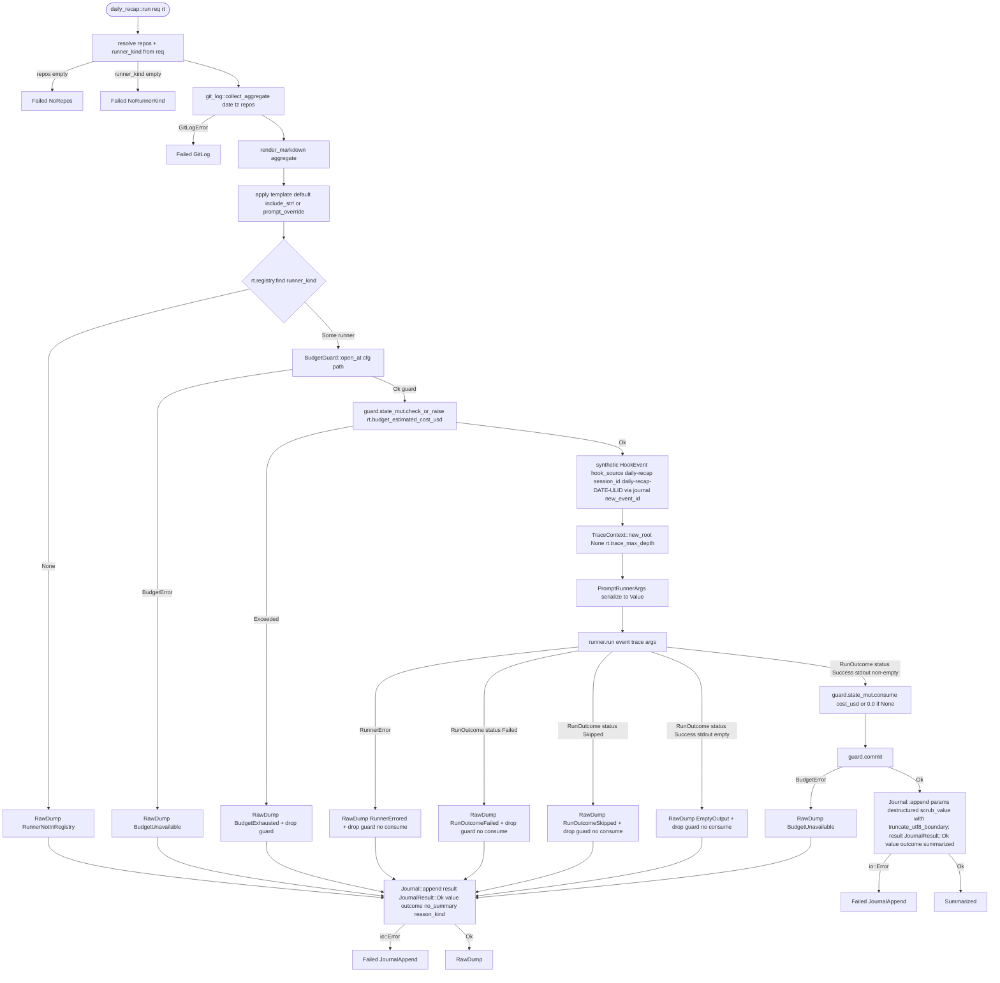

# report-recap-engine

## 0. 决策与约束

**已确认的关键决策**：

- **D1 模块组织 nested**：`git_log` 作为 `daily_recap/git_log.rs` 子模块
- **D2 双形态产物**：库 API + `roostery daily-recap` CLI 子命令
- **D3 三态降级 enum**：`RecapOutcome` 三 variant `Summarized` / `RawDump` / `Failed`，**variant payload 持原 typed 错误不退化成 String**
- **D4 rules.yaml 不自动注入**
- **D5 走 path (c) 直调 RunnerRegistry，不走 dispatcher::fire**（codex review 留痕）
- **D6 Rust idiom-first**（user 2026-05-19）：错误用 `thiserror::Error` + `#[from]` / `#[source]` 链；不用 `String` 当错误容器；Runner args 用 typed struct `Serialize` 到 `Value`；运行时上下文走 `RecapRuntime<'a>` 不暴露 4 裸参数；business identifier 走 newtype（对齐 [[2026-05-16-decision-business-identifier-newtype]]）；状态走 enum 不走 bool flag
- **D7 不引入 typestate / builder over-engineering**：BudgetGuard 短锁短开内嵌入主流程；`RecapRequest` 用 struct + `Default` + struct update 语法构造；CLI `--dry-run` 保持 flag 不拆 subcommand variant（UX 优先）

**硬约束输入**（实证 file:line，codex 二轮 verify 后修正）：

| 来源 | 约束 | file:line |
|---|---|---|
| §4.3 Runner trait | `Runner::run(event: &HookEvent, ctx: &TraceContext, args: &Value) -> Result<RunOutcome, RunnerError>`；`Runner: Send + Sync` | `dispatcher/runners.rs:131` + `:134` |
| §4.3 RunOutcome | `{ status: RunnerStatus, stdout: String, stderr: String, cost_usd: Option<f64> }` —— 这是 daily-recap 拿 summary 的途径 | `dispatcher/runners.rs:94` |
| §4.3 RunnerStatus | `Success / Failed { reason } / Skipped { reason }` —— cc_headless 非零退出实际走 `RunnerStatus::Failed { reason: "exit code N" }` 不抛 `RunnerError`（codex P1.4 修正） | `dispatcher/runners.rs:525` + `:558` |
| §4.3 RunnerError | enum **不含** `NonZeroExit`——只覆盖 spawn / 解码 / args 错误等不可恢复硬错 | `dispatcher/runners.rs:104` |
| §4.3 RunnerRegistry | `find(kind: &str) -> Option<&dyn Runner>` 只读 | `dispatcher/runners.rs:167` |
| §4.5 TraceContext | `new_root(parent: Option<String>, max_depth: u32)` | `dispatcher/trace.rs:80` |
| §4.5 TraceContext env | `to_env_pairs / from_env` 用 `ROOSTERY_TRACE_ID / DEPTH / PARENT_EVENT_ID` | `dispatcher/trace.rs:121` |
| Budget | `BudgetGuard::open_at(cfg: &BudgetCfg, path: &Path) -> Result<Self, BudgetError>` flock 跨进程串行化 | `dispatcher/budget.rs:247` + `:262` |
| Budget 内嵌 state | `guard.state_mut() -> &mut BudgetState`；`BudgetState::check_or_raise(cost)` / `consume(cost)` | `dispatcher/budget.rs:122` + `:135` + `:327` |
| Budget commit | `guard.commit() -> Result<PathBuf, BudgetError>` 释放锁 + 持久化 | `dispatcher/budget.rs:332` |
| §4.2 Journal | `Journal::append(entry: &JournalEntry) -> std::io::Result<PathBuf>`（接受引用、返写入路径；**不是** `Result<(), JournalError>`，本项目 journal 错误就用 `std::io::Error`） | `journal.rs:94` |
| BudgetCfg 路径 | `crate::config::BudgetCfg`（`dispatcher::budget` 只是 use re-import） | `dispatcher/budget.rs:16` + `config.rs` |
| Redact | `scrub_value(&Value) -> (Value, Vec<String>)`（**返 tuple**：脱敏后 value + 命中的 JSON pointer 路径列表，supplementary 审计）；`scrub_text(&str) -> String` 简单 | `redact.rs:36` + `:172` |
| Journal result schema | `JournalResult` 只有 `Ok { value: Value }` / `Err { kind: String, message: String }`——业务 outcome 编进 `Ok.value` 的 JSON `outcome` 字段 | `journal.rs:28` |
| `--json` 稳定契约参考 | `PushOutcome: Serialize + Deserialize` 模式 | `bot_stop_hook/types.rs:81` |
| 项目红线 §2 | 不引外部 LLM SDK / 不用 HTTP client 直连 LLM endpoint | roadmap §2 |
| Cargo feature flag | `daily-report` 默认开；`--no-default-features` daily_recap 模块整体不编译 + CLI 子命令不注册；`Config.recap` DTO 在 config.rs 不被 gate | 本 feature 引入 |
| 跨 mod env 测试 | `crate::paths::TEST_ENV_LOCK` 共享锁 | attention.md |

**复杂度档位**：默认档。

## 1. 范围

### 要做什么

为 `daily-dev-recap` req 提供 **引擎层**：git 活动数据 + prompt → 直接 `RunnerRegistry::find(kind).run` 委托用户已装 agent CLI → 结构化 `RecapOutcome` 给上层 `report-daily` 消费。

交付物：

1. `daily_recap` 模块（`mod.rs` / `cli.rs` / `git_log.rs` / `templates/default-recap-prompt.md`）
2. `roostery daily-recap` CLI 子命令
3. Cargo feature flag `daily-report` 边界
4. `Config.recap` schema 扩展
5. 默认 prompt 模板嵌入

### 明确不做

- 不写飞书 docx / Base 记录（归 `report-daily`）
- 不做 cron 调度器
- 不走 dispatcher::fire / 不动 rules.yaml
- 不引入新 Runner impl
- 不解析 RunOutcome.stdout schema-aware 字段
- 不做任意时间窗 / 不做多仓自动发现 / 不做 git 之外活动源
- 不引入新 trait（Summarizer / RecapEngine 等）
- 不引入 typestate / builder over-engineering（D7）

## 2. 方案设计

### 2.1 名词层

**现状**：`daily_recap` / `git_log` 全新。Phase 4 类型已就位（Runner / RunnerRegistry / RunOutcome / RunnerError / TraceContext / BudgetGuard / Journal / JournalEntry）。

**变化**——新增类型（按 Rust idiom-first 设计）：

#### git_log 模块

```rust
// daily_recap/git_log.rs

/// Newtype（对齐 [[2026-05-16-decision-business-identifier-newtype]]）。
/// 包 SHA-1 / SHA-256 git hash，构造时不强 fmt 校验（git 接受 short hash），
/// 只保 trim + 非空 invariant。
#[derive(Debug, Clone, PartialEq, Eq, Hash, Serialize, Deserialize)]
pub struct CommitHash(String);

impl CommitHash {
    pub fn new(raw: &str) -> Result<Self, GitLogError> { /* trim, reject empty */ }
    pub fn as_str(&self) -> &str { &self.0 }
}

/// 仓库 spec，构造时 canonicalize path（codex P2 + my P1.f）。
#[derive(Debug, Clone, Serialize, Deserialize)]
pub struct RepoSpec {
    path: PathBuf,      // canonical
    name: String,
}

impl RepoSpec {
    pub fn new(path: impl AsRef<Path>) -> Result<Self, RepoSpecError> { /* canonicalize + check is_dir + derive name */ }
    pub fn with_name(path: impl AsRef<Path>, name: impl Into<String>) -> Result<Self, RepoSpecError>;
    pub fn path(&self) -> &Path { &self.path }
    pub fn name(&self) -> &str { &self.name }
}

#[derive(Debug, thiserror::Error)]
#[non_exhaustive]
pub enum RepoSpecError {
    #[error("repo path not found: {0}")]
    PathNotFound(PathBuf),
    #[error("repo path not a directory: {0}")]
    NotADirectory(PathBuf),
    #[error("canonicalize failed for {path:?}: {source}")]
    Canonicalize { path: PathBuf, #[source] source: std::io::Error },
}

#[derive(Debug, Clone, Serialize)]
pub struct Commit {
    pub hash: CommitHash,
    pub timestamp: DateTime<FixedOffset>,  // git %cI 自带时区
    pub author: String,
    pub subject: String,
    pub body: Option<String>,
}

#[derive(Debug, Clone, Serialize)]
pub struct RepoCommits {
    pub repo: RepoSpec,
    pub commits: Vec<Commit>,
}

#[derive(Debug, Clone, Serialize)]
pub struct GitLogAggregate {
    pub date: NaiveDate,
    pub timezone: FixedOffset,  // 用户本地时区，落 journal 留痕
    pub repos: Vec<RepoCommits>,
}

impl GitLogAggregate {
    pub fn is_empty(&self) -> bool { self.repos.iter().all(|r| r.commits.is_empty()) }
    pub fn total_commits(&self) -> usize { self.repos.iter().map(|r| r.commits.len()).sum() }
}

#[derive(Debug, thiserror::Error)]
#[non_exhaustive]
pub enum GitLogError {
    #[error("repo not a git repository: {0}")]
    NotAGitRepo(PathBuf),
    #[error("git command spawn failed for {repo:?}: {source}")]
    Spawn { repo: PathBuf, #[source] source: std::io::Error },
    #[error("git exited {exit_code} for {repo:?}: {stderr_head}")]
    NonZeroExit { repo: PathBuf, exit_code: i32, stderr_head: String },
    #[error("git output parse failed for {repo:?}: {detail}")]
    ParseFailed { repo: PathBuf, detail: String },
    #[error("commit hash invalid: {0}")]
    InvalidHash(String),
}

pub fn collect_aggregate(
    date: NaiveDate,
    timezone: FixedOffset,
    repos: &[RepoSpec],
) -> Result<GitLogAggregate, GitLogError>;

pub fn render_markdown(aggregate: &GitLogAggregate) -> String;
```

#### daily_recap 主模块

```rust
// daily_recap/mod.rs

/// 运行上下文——把 4 裸参数收敛进一个 lifetime-tagged context（codex P1.1 + my P1.e）。
pub struct RecapRuntime<'a> {
    pub registry: &'a dispatcher::runners::RunnerRegistry,
    pub journal: &'a journal::Journal,
    pub budget_cfg: &'a crate::config::BudgetCfg,    // codex P1: BudgetCfg 定义在 config.rs，不在 dispatcher::budget
    pub budget_path: &'a Path,
    pub trace_max_depth: u32,
    /// 预估单次调用成本（USD）传给 `BudgetState::check_or_raise` 做事前 gate。
    /// 通常 = config.recap.budget_estimated_cost_usd（默认 0.05）；CLI 可未来加 flag 覆盖。
    /// codex P1 修正：闭环 budget_estimated_cost_usd 配置到 API 路径。
    pub budget_estimated_cost_usd: f64,
}

#[derive(Debug, Clone)]
pub struct RecapRequest {
    pub date: NaiveDate,
    pub timezone: FixedOffset,
    pub repos: Vec<RepoSpec>,
    pub runner_kind: String,
    pub timeout_ms: u64,
    pub prompt_override: Option<String>,
}

impl Default for RecapRequest {
    fn default() -> Self {
        Self {
            date: chrono::Local::now().date_naive(),
            timezone: *chrono::Local::now().offset(),
            repos: Vec::new(),
            runner_kind: String::new(),
            timeout_ms: 60_000,
            prompt_override: None,
        }
    }
}

/// Dry-run 路径专用——只跑到 prompt 构造，不开 Budget/Journal/Runner。
/// CLI 层用：`--dry-run` 调 `prepare` 自己打印 markdown + prompt 然后退出；
/// `daily_recap::run` 只关心 Live 业务返 RecapOutcome（codex P1.3：dry-run 不该混进 RecapOutcome）。
pub struct PreparedRecap {
    pub aggregate: GitLogAggregate,
    pub markdown: String,
    pub prompt: String,
}

pub fn prepare(req: &RecapRequest) -> Result<PreparedRecap, RecapError>;

/// daily-recap **runner convention** 的 typed args——不绑某个 Runner impl，
/// 是 daily-recap 调用任何 prompt-based runner 时的标准 args schema
/// （cc_headless 当前消费 `prompt` / `timeout_ms` 字段；未来 codex_exec / gemini_headless 接入也按本 schema）。
/// Serialize 到 Value 再喂 Runner::run（codex P2 修正：从 cc-specific 改为 daily-recap convention 通用名）。
#[derive(Debug, Serialize)]
pub struct PromptRunnerArgs<'a> {
    pub prompt: &'a str,
    pub timeout_ms: u64,
    #[serde(skip_serializing_if = "Option::is_none")]
    pub model: Option<&'a str>,
    #[serde(skip_serializing_if = "Option::is_none")]
    pub resume_id: Option<&'a str>,
}

pub enum RecapOutcome {
    Summarized {
        summary: String,
        aggregate: GitLogAggregate,
        runner_kind: String,
        cost_usd: Option<f64>,
        duration: std::time::Duration,
    },
    RawDump {
        markdown: String,
        aggregate: GitLogAggregate,
        reason: NoSummaryReason,
    },
    Failed(RecapError),
}

/// variant payload 持原 typed 错误（codex P1.3 + my P0.a）。
#[non_exhaustive]
pub enum NoSummaryReason {
    RunnerNotInRegistry { kind: String },
    BudgetUnavailable(dispatcher::budget::BudgetError),   // open_at / commit / state load 失败
    BudgetExhausted(dispatcher::budget::BudgetError),     // check_or_raise 返 Exceeded
    RunnerErrored(dispatcher::runners::RunnerError),      // Runner::run 返 Err
    RunOutcomeFailed { reason: String, stderr_head: String },  // RunOutcome { status: Failed { reason }, stderr }
    RunOutcomeSkipped { reason: String },                 // RunOutcome { status: Skipped { reason } }
    EmptyOutput,                                          // status: Success but stdout.trim().is_empty()
}

/// 用 thiserror #[from] 链；顶层 Display 含 source 细节避免 caller 必须走 .source() 链（codex P2.7）。
#[derive(Debug, thiserror::Error)]
#[non_exhaustive]
pub enum RecapError {
    #[error("git log collection failed: {0}")]
    GitLog(#[from] GitLogError),
    #[error("repo spec invalid: {0}")]
    RepoSpec(#[from] RepoSpecError),
    #[error("config missing recap.repos and CLI provided no --repo")]
    NoRepos,
    #[error("config missing recap.runner_kind and CLI provided no --runner")]
    NoRunnerKind,
    #[error("journal append failed: {0}")]
    JournalAppend(#[from] std::io::Error),    // codex P1.1：Journal::append 返 std::io::Result 不是 JournalError
}

/// `--json` 输出的稳定 DTO（codex P1.7 + my A4）。v1 schema 公开承诺。
#[derive(Debug, Serialize)]
#[serde(tag = "outcome", rename_all = "snake_case")]
pub enum RecapJsonOutcome {
    Summarized {
        schema_version: u32,  // const 1
        summary: String,
        runner_kind: String,
        cost_usd: Option<f64>,
        duration_ms: u64,
        commit_count: usize,
        repo_count: usize,
    },
    RawDump {
        schema_version: u32,
        markdown: String,
        reason: RecapJsonReason,
        commit_count: usize,
        repo_count: usize,
    },
    Failed {
        schema_version: u32,
        error_kind: String,    // RecapError variant discriminant
        message: String,
    },
}

#[derive(Debug, Serialize)]
#[serde(tag = "kind", rename_all = "snake_case")]
pub enum RecapJsonReason {
    RunnerNotInRegistry { kind: String },
    BudgetUnavailable { detail: String },
    BudgetExhausted { detail: String },
    RunnerErrored { variant: String, detail: String },
    RunOutcomeFailed { reason: String, stderr_head: String },
    RunOutcomeSkipped { reason: String },
    EmptyOutput,
}

impl From<&RecapOutcome> for RecapJsonOutcome { /* mapping with schema_version=1 */ }

/// 库 API：单个 entry point + RecapRuntime context。
pub async fn run(req: RecapRequest, rt: RecapRuntime<'_>) -> RecapOutcome;
```

#### Config DTO（in `config.rs`，不被 feature flag gate）

```rust
// config.rs（已存在文件，扩展）

#[derive(Debug, Clone, Serialize, Deserialize, Default)]
#[serde(default)]
pub struct RecapConfig {
    pub repos: Vec<RecapRepoConfig>,
    pub runner_kind: String,                // "" = 缺省，CLI 必须 --runner 覆盖
    pub timeout_ms: u64,                    // 0 = 用 default 60_000
    pub prompt_override_path: Option<PathBuf>,
    pub budget_estimated_cost_usd: f64,    // 0.0 = 用 default 0.05
}

#[derive(Debug, Clone, Serialize, Deserialize)]
pub struct RecapRepoConfig {
    pub path: PathBuf,
    #[serde(default)]
    pub name: Option<String>,
}

// Config struct 加字段：
pub struct Config {
    // ... 现有字段 ...
    #[serde(default)]
    pub recap: RecapConfig,   // codex P1.6 用 #[serde(default)] 不 Option
}
```

**关键 idiom 决定**：
- `Config.recap: RecapConfig`（非 Option）+ `#[serde(default)]`——空 yaml 段自然 deserialize 成 `RecapConfig::default()`；统一一种空值表示
- DTO 在 `config.rs` 没 feature gate；`--no-default-features` 时配置兼容
- 字段 `runner_kind: String` 而非 `Option<String>`——空串视为缺省，简化判空（在 `daily_recap::run` 入口 `if cfg.runner_kind.is_empty() && cli.runner.is_none() → Failed(NoRunnerKind)`）

### 2.2 编排层

**现状**：`RunnerRegistry::find` / `Runner::run` / `BudgetGuard::open_at` / `guard.state_mut()` / `Journal::append` 全部已落地。

**变化**：新增 `daily_recap::run` 主流程：



**注**：`--dry-run` 走 CLI 层独立路径——CLI 调 `daily_recap::prepare(req)` 拿 `PreparedRecap { aggregate, markdown, prompt }` 自己打印 stdout，不进入本 `run` 主流程；本 mermaid 只描述 Live 路径（codex P1.3）。

**关键流程级约束**（codex P1.5 + P1.3 修正）：

- **Budget consume 只在 `RunnerStatus::Success && stdout.trim().non_empty()` 触发**——mirror dispatcher 现状（不 burn budget on failed run）。`RunOutcome.cost_usd == None` 时仍 `state_mut.consume(0.0)`——保证 `max_calls` 计数推进（与 `dispatcher/mod.rs:298` 现状一致：dispatcher 哪怕 None cost 也 consume 一次 call 避免绕账）
- **`BudgetGuard::open_at` 失败 / `commit` 失败 → `NoSummaryReason::BudgetUnavailable`**，不是 `BudgetExhausted`——后者仅指 `check_or_raise` 返 `Exceeded`
- **Guard drop 时机**：所有 Raw* 分支 guard 自动 drop 释放 flock（Rust RAII），不需要显式 abort 调用
- **错误语义**：git 层硬失败 → `Failed`；runner / budget 软失败 → `RawDump`；journal append 失败 → `Failed::JournalAppend`
- **幂等性**：不再声称完全幂等——`consume + commit` 改 budget state；多次跑同 date 扣多次（每次走 LLM 应计费用）
- **并发**：`open_at` 跨进程 flock 保护
- **trace**：fresh root depth=0；agent CLI 子进程 env 带 `ROOSTERY_TRACE_ID/DEPTH/PARENT_EVENT_ID`

**审计点**：每次 daily-recap 调用写一条 `JournalEntry`。`scrub_value` 实际返 `(Value, Vec<String>)`，destructure 后 redacted_paths 进 entry 的 supplementary 字段（如果 schema 有）或丢弃（implement 阶段拍）。业务 outcome 编进 `JournalResult::Ok.value.outcome` 字符串字段（journal 现有 schema 只支持 Ok/Err 二态）：

```rust
let raw_params = json!({
    "date": req.date,
    "timezone_offset_seconds": req.timezone.local_minus_utc(),
    "repo_count": aggregate.repos.len(),
    "commit_count": aggregate.total_commits(),
    "runner_kind": &runner_kind,
    "timeout_ms": req.timeout_ms,
    "prompt_head": scrub_text(truncate_utf8_boundary(&prompt, 200)),  // codex P1.4: UTF-8 安全截断
});
let (params, _redacted_paths) = scrub_value(&raw_params);  // codex P1: scrub_value 返 tuple

let result = match &outcome {
    RecapOutcome::Summarized { summary, cost_usd, runner_kind, .. } => JournalResult::Ok {
        value: json!({
            "outcome": "summarized",
            "cost_usd": cost_usd,
            "runner_kind": runner_kind,
            "summary_head": scrub_text(truncate_utf8_boundary(summary, 200)),
        }),
    },
    RecapOutcome::RawDump { reason, .. } => JournalResult::Ok {
        value: json!({
            "outcome": "no_summary",
            "reason_kind": reason_variant_name(reason),  // 取 NoSummaryReason variant 的 discriminant 名
        }),
    },
    RecapOutcome::Failed(err) => JournalResult::Err {
        kind: error_variant_name(err).to_string(),       // 取 RecapError variant 名
        message: err.to_string(),
    },
};

JournalEntry {
    source: "daily_recap",
    action: format!("runner:{}", runner_kind),
    params,
    result,
    // ... 其他 §4.2 字段（schema_version / event_id / trace_id / ts / duration_ms 等）...
}

/// UTF-8 边界安全截断助手——`&s[..max]` 切到多字节字符中间会 panic。
/// implement 阶段按 attention.md "Rust 期重新设计" 决定是引项目内已有 helper 还是自定义 char_indices iterator 实现。
fn truncate_utf8_boundary(s: &str, max_bytes: usize) -> &str;
```

**A1 显式假设**（修正版，codex assumptions）：
- prompt 发给 runner **不脱敏**——user 想让 LLM 看到真实 git log；脱敏只发生在写 journal `params.prompt_head` 时。Mermaid `BuildPrompt → BuildArgs` 链路不经 scrub；scrub 只在 JournalEntry 构造时调用

### 2.3 挂载点清单

1. **`roostery daily-recap` CLI 子命令**（main.rs `Command::DailyRecap(DailyRecapArgs)` `#[cfg(feature = "daily-report")]` + `daily_recap::cli::run`）
2. **`daily_recap` 模块**（`crates/roostery/src/daily_recap/`，整目录 `#[cfg(feature = "daily-report")]`）
3. **Cargo feature flag `daily-report`**（`Cargo.toml [features]`，默认开）
4. **embedded prompt template**（`crates/roostery/src/daily_recap/templates/default-recap-prompt.md` via `include_str!`）
5. **`Config.recap` 段**（DTO 在 `config.rs` 不被 gate；本 feature 拥有它的语义解释）

**Cargo feature flag 边界**：
- `RecapConfig` / `RecapRepoConfig` DTO 在 `config.rs`，无 feature gate——`--no-default-features` 兼容
- `daily_recap` module / CLI variant / dispatch 全部 `#[cfg(feature = "daily-report")]`
- 验收：`cargo build --no-default-features` 编译；`roostery --help` 不列 daily-recap；用户 yaml `recap` 段照常 deserialize

### 2.4 推进策略

| 步 | 维度 | 内容 | 退出信号 |
|---|---|---|---|
| 1 | 微重构 | §2.5 结论"不做"，跳过 | N/A |
| 2 | Cargo features 边界 | `[features] daily-report = []` + `default = ["daily-report"]`；`lib.rs` `#[cfg(feature = "daily-report")] pub mod daily_recap;` 占位空 mod | 双 build 通过 |
| 3 | Config schema 扩展 | `RecapConfig` / `RecapRepoConfig` 加 config.rs + `Config.recap: RecapConfig` `#[serde(default)]`；round-trip 测试 + 兼容性测试（无 recap 段的旧 yaml 读得通）| 单元测试通过 |
| 4 | git_log 计算节点 | `git_log.rs` 内 `collect_aggregate` + `render_markdown`；spawn `git log --since/--until --pretty=format:%H%x1f%cI%x1f%an%x1f%s%x1f%b%x1e`（**`%x1f` 字段分隔 + `%x1e` 记录分隔，codex P1.9**）；`RepoSpec::new` canonicalize + smart constructor；`CommitHash` newtype；至少 6 unit test（空仓 / 单 commit / 多 commit 含 newline 在 body / subject 含 `\x1f` 字面字符（应 reject 或 escape）/ 非 UTF-8 输出 / 相对路径 canonicalize） | unit test 全过 |
| 5 | Prompt 模板嵌入 | `templates/default-recap-prompt.md` + `include_str!`；render fn 插入 `{{ git_log }}`；prompt_override 读 disk | 模板渲染 unit test |
| 6 | Typed args + 编排骨架 happy path | `PromptRunnerArgs` struct + Serialize；`RecapRuntime` 定义；`daily_recap::run` Live path Success → Summarized；mock Runner 注入 registry | 集成测试：mock 返预设 stdout → `Summarized` + journal `JournalResult::Ok { value.outcome = "summarized" }` entry |
| 7 | 降级 7 分支 | `NoSummaryReason` 7 variant 全实装：`RunnerNotInRegistry / BudgetUnavailable / BudgetExhausted / RunnerErrored / RunOutcomeFailed / RunOutcomeSkipped / EmptyOutput`；每个 1 个 mock-driven 测试；验证 budget consume 只在 Success non-empty | 7 测试全过；journal `Ok { value.outcome = "no_summary", reason_kind }` entry 含正确 reason variant |
| 8 | CLI 子命令 + dry-run 分离 | `cli.rs` 内 `DailyRecapArgs { date, repos: Vec<PathBuf>, runner, prompt_override, json, dry_run }` + `run(args) -> ExitCode`；**`--dry-run` 调 `daily_recap::prepare(req)`** 拿 `PreparedRecap` 自己打印 markdown + prompt；**live 调 `daily_recap::run(req, rt)`** 拿 `RecapOutcome` 走 stdout 或 `--json` 输出。`prepare` / `run` 是两个 entry point 不混（codex P1.3） | CLI smoke：`--dry-run --repo .` 打印 prompt 且 mock registry 验证 `find` / `run` 都没被调用 |
| 9 | `--json` 稳定 DTO | `RecapJsonOutcome` + `RecapJsonReason` Serialize；`From<&RecapOutcome>` 映射；`--json` 走 `serde_json::to_string_pretty` 写 stdout | `--json` 输出符合 v1 schema |
| 10 | Redact 集成 | journal `params.prompt_head` 经 `scrub_text`；`params` 整体经 `scrub_value`；test 验证脱敏点 | redact unit test |
| 11 | 集成测试 + 文档 | `tests/daily_recap_integration.rs` 端到端（tmp git repo + mock Runner via `RunnerRegistry::with_runner` + tmp Journal + tmp BudgetGuard），覆盖 N1 + D 全分支 + F 全分支；feature 目录 README-ish 引导（不算 product output） | `cargo test --all` 绿；`cargo test --all --no-default-features` 编译通过（gated tests 不跑） |

### 2.5 结构健康度评估

**已查 compound convention**：`2026-05-16-decision-rust-module-organization` / `2026-05-18-decision-cli-subcommand-module-layout` / `2026-05-16-decision-business-identifier-newtype` / `2026-05-18-decision-rust-idiom-first`。本设计与 4 条 decision 全对齐。

**评估对象 1：要改的现有文件**

| 文件 | 当前体量 | 本次新增 | 健康度 |
|---|---|---|---|
| `crates/roostery/src/main.rs` | ~352 行 | +3 行（cfg-gated Command variant + dispatch + import）| 健康 |
| `crates/roostery/src/config.rs` | Phase 3 稳定 | +`RecapConfig` / `RecapRepoConfig` struct + `Config.recap` 字段 + 反序列化 / round-trip 测试 | 健康 |
| `crates/roostery/src/lib.rs` | 极薄 | +`#[cfg(feature = "daily-report")] pub mod daily_recap;` | 健康 |
| `crates/roostery/Cargo.toml` | 无 `[features]` 段 | +`[features]` + `daily-report = []` + `default = ["daily-report"]` | 健康 |

**评估对象 2：要落新文件的目录**

| 目录 | 当前 | 新增 | 摊平度 |
|---|---|---|---|
| `crates/roostery/src/` | 偏挤但稳态 | +1 子目录 | 健康——沿用模式 |
| `crates/roostery/src/daily_recap/` | 不存在 | mod.rs / cli.rs / git_log.rs / templates/ | N/A |

**结论：不做微重构**。

**超出范围观察**：顶层 `src/` 整理性重构留给 `cs-refactor`。

## 3. 验收契约

### 3.1 正常路径

| # | 场景 | 触发 | 期望 |
|---|---|---|---|
| N1 | 库 API Summarized | mock Runner 返 `RunOutcome { status: Success, stdout: "今日重点 X", cost_usd: Some(0.012), ... }`；config 配 1 仓 + cc_headless | `daily_recap::run(req, rt)` 返 `Summarized { summary: "今日重点 X", cost_usd: Some(0.012), duration: >0ns, ... }`；journal 多一条 `source="daily_recap"` `result=JournalResult::Ok { value.outcome = "summarized" }`；budget consume 0.012 |
| N2 | CLI dry-run | 本仓有 commit，`roostery daily-recap --dry-run --repo .` | stdout 含 git markdown + prompt；CLI 调 `daily_recap::prepare(req)`（不调 `run`）；`registry.find` / `runner.run` 都不调；budget 不开；journal 不写 |
| N3 | 库 API 真跑 mock | **library test 直接调 `daily_recap::run(req, rt)` 注入 mock Runner via `RunnerRegistry::with_runner(Box<dyn Runner>)`**（codex P1.8 修正：不假装是 binary smoke） | `Summarized`，行为同 N1 |
| N4 | 多仓聚合 | config 3 仓 2 有 commit 1 无 | `aggregate.repos.len() == 3`，markdown 3 段 |
| N5 | `--date` 覆盖 | `--date 2026-05-18 --repo .` | git log `--since 2026-05-18T00:00:00+TZ --until 2026-05-19T00:00:00+TZ`；`aggregate.date == 2026-05-18`，`aggregate.timezone == 本机 FixedOffset` |
| N6 | `--runner` 覆盖 config | config `cc_headless`，CLI `--runner mock_x` | 用 mock_x |
| N7 | `--json` 输出 v1 schema | N1 场景 + `--json` | stdout 符合 `RecapJsonOutcome::Summarized { schema_version: 1, summary, runner_kind, cost_usd, duration_ms, commit_count, repo_count }` |

### 3.2 降级路径（→ RawDump）

| # | 场景 | 期望 reason | budget 变动 |
|---|---|---|---|
| D1 | runner_kind 不在 registry | `RunnerNotInRegistry { kind }` | 无（不开 guard）|
| D2 | `BudgetGuard::open_at` 返 `BudgetError::LoadFailed` / `SchemaVersionMismatch` 等 | `BudgetUnavailable(BudgetError)` | 无 |
| D3 | `state_mut().check_or_raise(estimated)` 返 `BudgetError::Exceeded` | `BudgetExhausted(BudgetError)` | guard 自动 drop |
| D4 | `runner.run` 返 `RunnerError::SpawnFailed` / `BinaryNotFound` / `Timeout` / `OutputParseFailed` / `BadArgs` 任一（codex P1.5 修正——实际 variant 名） | `RunnerErrored(RunnerError)` | guard drop 不 consume |
| D5 | `runner.run` 返 `Ok(RunOutcome { status: Failed { reason: "exit code N" }, stderr, ... })`（**cc_headless 非零退出走这条不是 RunnerError，codex P1.4**） | `RunOutcomeFailed { reason, stderr_head }` | guard drop 不 consume |
| D6 | `runner.run` 返 `Ok(RunOutcome { status: Skipped { reason } })` | `RunOutcomeSkipped { reason }` | guard drop 不 consume |
| D7 | `Success` 但 `stdout.trim().is_empty()` | `EmptyOutput` | guard drop 不 consume |
| D8 | Success 全程 OK 但 `guard.commit()` 返 BudgetError | `BudgetUnavailable(BudgetError)` | consume 已发生但 commit 失败 —— state 没持久化（acceptable，下次 open 重新加载磁盘旧状态） |

**所有 D 共同验收**：`RawDump.markdown` 非空；`aggregate` 与 N1 一致结构；journal 多一条 `JournalResult::Ok { value: { outcome: "no_summary", reason_kind: "..." } }` entry 含正确 reason variant discriminant。

### 3.3 硬错路径（→ Failed）

| # | 场景 | 期望 |
|---|---|---|
| F1 | repos 空 | `Failed(RecapError::NoRepos)` |
| F2 | runner_kind 空 | `Failed(RecapError::NoRunnerKind)` |
| F3 | repo path 不是 git 仓 | `Failed(RecapError::GitLog(GitLogError::NotAGitRepo(...)))` |
| F4 | git 二进制 spawn 失败 | `Failed(RecapError::GitLog(GitLogError::Spawn { ... }))` |
| F5 | git 退非零 | `Failed(RecapError::GitLog(GitLogError::NonZeroExit { ... }))` |
| F6 | git log 输出 `%x1e %x1f` 序列异常 | `Failed(RecapError::GitLog(GitLogError::ParseFailed { ... }))` |
| F7 | commit hash 空 | `Failed(RecapError::GitLog(GitLogError::InvalidHash(_)))` |
| F8 | repo 相对路径 `--repo .` user 没 cd | `Failed(RecapError::RepoSpec(RepoSpecError::NotADirectory(...) / PathNotFound(...)))`（取决于 canonicalize 失败模式）|
| F9 | `Journal::append` 返 `Err(std::io::Error)`（mock 模拟 fs 错） | `Failed(RecapError::JournalAppend(io::Error))` —— 不论 Success 还是 NoSummary 路径，journal 写失败都升级硬错（codex P2.8 mermaid 补的 IO error 分支） |
| F10 | 空仓（git init 0 commit） | **不是 Failed**——返 Summarized / RawDump（取决于 runner 对空 git log markdown 的处理）；`aggregate.total_commits() == 0`，markdown 仍非空 |

### 3.4 Cargo feature flag 边界

| # | 场景 | 期望 |
|---|---|---|
| C1 | `cargo build` 默认 | binary 含 daily-recap；`roostery --help` 列出 |
| C2 | `cargo build --no-default-features` | 编译通过；binary 不含 daily-recap；`Config.recap` 仍 deserialize |
| C3 | `cargo test --all` | daily_recap 测试运行 |
| C4 | `cargo test --all --no-default-features` | 编译通过；daily_recap 测试不跑 |

### 3.5 明确不做反向核对

- ❌ `cargo tree | grep -E 'reqwest\|openai\|anthropic\|gemini\|tonic\|prost\|hyper\|ureq'` 返 0
- ❌ `rg "pub trait (Summarizer\|RecapEngine\|LlmClient)"` 返 0
- ❌ `rg "dispatcher::fire" crates/roostery/src/daily_recap` 返 0
- ❌ `rg "json!" crates/roostery/src/daily_recap/mod.rs` 在 args 构造路径返 0（json! 仅可在 JournalEntry params 构造处，因为 JournalEntry params 是 Value 类型）
- ❌ Roostery 不替用户写 rules.yaml

### 3.6 测试约束

- mock `Runner`：`impl Runner for MockRunner { stdout, status, cost, error }` 通过 `RunnerRegistry::with_runner(Box::new(MockRunner::new(...)))` 注入
- mock `BudgetGuard`：用真 BudgetGuard + tempfile + 小 `max_calls` 触发 Exceeded；不 trait 化（避免 over-engineering）
- mock `Journal`：tempfile 起真 Journal，读 jsonl 验证
- git_log：`tempfile::TempDir` + shell `git init/commit` 构造 fixture；fixture script 用 `std::fs::write`（attention.md ETXTBSY corollary）
- 触碰 env 加 `crate::paths::TEST_ENV_LOCK`
- E2E 真 agent CLI `#[ignore]`

## 4. 接口与产物

### 4.1 库 API

```rust
// crates/roostery/src/daily_recap/mod.rs
pub mod cli;
pub mod git_log;

pub use git_log::{Commit, CommitHash, GitLogAggregate, GitLogError, RepoCommits, RepoSpec, RepoSpecError};

pub struct RecapRuntime<'a> { /* §2.1 */ }
pub struct RecapRequest { /* §2.1 */ }
pub struct PreparedRecap { /* §2.1：dry-run 输出 */ }
pub struct PromptRunnerArgs<'a> { /* §2.1 */ }
pub enum RecapOutcome { /* §2.1 */ }
pub enum NoSummaryReason { /* §2.1 */ }
pub enum RecapError { /* §2.1 */ }
pub enum RecapJsonOutcome { /* §2.1 */ }
pub enum RecapJsonReason { /* §2.1 */ }

/// Dry-run 路径：CLI `--dry-run` 调，自己打印 PreparedRecap 不进 run。
pub fn prepare(req: &RecapRequest) -> Result<PreparedRecap, RecapError>;

/// Live 路径：完整 BudgetGuard + Runner + Journal 链路。
pub async fn run(req: RecapRequest, rt: RecapRuntime<'_>) -> RecapOutcome;
```

**为什么 `RecapRuntime` 而不是 4 裸参数**：codex P1.1 + my P1.e。Borrow-lifetime 收敛到一个 `'a`；future expansion 不改 signature。

**为什么 `prepare` / `run` 双 entry point 而不是 `RunMode` enum**：codex P1.3——`RecapOutcome` 三 variant 都是业务结果，dry-run 是 CLI 调试模式，类型契约上不该混。两个 entry point 让"业务路径"和"调试路径"各自有清晰 return type（`RecapOutcome` vs `PreparedRecap`）。

### 4.2 CLI 子命令

```
USAGE: roostery daily-recap [OPTIONS]

OPTIONS:
    --date <YYYY-MM-DD>       覆盖统计日（默认 today，本地时区）
    --repo <PATH>             覆盖 config repos（可重复）
    --runner <KIND>           覆盖 config.recap.runner_kind
    --prompt-override <PATH>  prompt 模板文件
    --dry-run                 调 daily_recap::prepare(req) 自打印 markdown + prompt，不进 run
    --json                    输出 RecapJsonOutcome v1 JSON
```

CLI args struct 在 `daily_recap/cli.rs`，main.rs 仅一行 dispatch（遵循 `cli-subcommand-module-layout` decision）。

### 4.3 嵌入资源

`crates/roostery/src/daily_recap/templates/default-recap-prompt.md`——中文 prompt + `{{ git_log }}` 占位符。

### 4.4 Config schema 扩展

```yaml
schema_version: 1
recap:
  repos:
    - path: /Users/ben/Projects/roostery
      name: roostery
    - path: /Users/ben/Projects/side-project
  runner_kind: cc_headless
  timeout_ms: 60000
  prompt_override_path: null
  budget_estimated_cost_usd: 0.05
```

字段缺失走 `RecapConfig::default()`（`#[serde(default)]`）。

### 4.5 不属于本 feature

- LLM 成本归用户跟自己 agent 厂商关系
- `report-daily` 消费 `RecapOutcome` 写飞书 docx + Base

## 5. 显式假设（A1-A4 修正版）

- **A1 redact 边界**：prompt 发给 Runner **不脱敏**（user 想 LLM 看原文）；脱敏仅发生在 `JournalEntry.params.prompt_head` 构造时（`scrub_text`）+ `params` 整体 `scrub_value`。Mermaid `BuildPrompt → BuildArgs` 链路无 scrub
- **A2 session_id 来源**：用 `journal::new_event_id()`（项目既有 ULID 生成器）拼成 `daily-recap-{date}-{event_id}`——避免引入新 ULID 库 / 让 ID 来源可追溯
- **A3 库 API 形态**：`run(req, rt: RecapRuntime<'_>)` 单 context struct 注入；不引入 `Dispatcher` struct（codex 确认无此抽象）；不引入 typestate（D7）
- **A4 `--json` v1 稳定契约**：`RecapJsonOutcome` 含 `schema_version: u32` const 1 字段；与 `bot push --json` 既有 `PushOutcome: Serialize` 模式对齐；非兼容改动须 bump schema_version 并保留旧版反序列化兼容性
